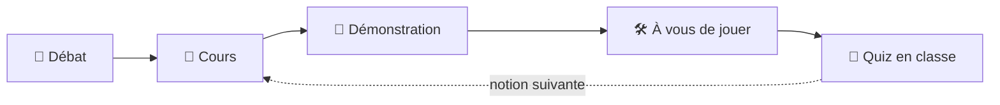

# 🎓 Cours Data & Cloud

> Les supports de cours sur le DevOps, l'architecture data, Snowflake, le cloud AWS et le MLOps.
>
> Tous les cours suivent le même fil rouge : **DataCafé**, une jeune entreprise qui vend du café en ligne et qui veut « piloter son activité par la donnée ». De cours en cours, vous en devenez les développeurs, puis les architectes data, puis les ingénieurs cloud et MLOps.

## 👨‍🏫 Votre professeur

- Architecte solutions Data et Cloud.
- 15 ans d'expérience en big data et cloud computing.
- Professeur en Big Data et cloud computing (ECE, ESME, MBA ESG, ESCP).
- Fondateur de Logbrain (cabinet de conseil en big data et cloud computing).


---

## 🗺️ Les cours

| Cours | Ce que vous apprenez | Durée | Statut |
|---|---|---|---|
| [**☕ Agilité, Git & DevOps**](cours-devops-git/README.md) | Le DevOps et l'Agilité, VS Code, Git, GitHub, puis une vraie application de données avec Streamlit, DuckDB et dbt | 14h | ✅ Disponible |
| [**❄️ Architecture data & Snowflake**](cours-architecture-data-snowflake/README.md) | Données et BI, modélisation d'entrepôt, Snowflake, chargement massif, pipelines automatisés, architecture médaillon, IA avec Cortex, DataOps | 14h | ✅ Disponible |
| **☁️ Cloud AWS** | *Programme en préparation* | — | 🚧 À venir |
| **🤖 MLOps** | *Programme en préparation* | — | 🚧 À venir |

> [!TIP]
> Les cours se suivent dans l'ordre : chacun réutilise les outils du précédent (Git, GitHub, VS Code, SQL...). Chaque cours peut quand même être suivi seul : son README indique les prérequis et renvoie vers les chapitres utiles des cours précédents.

---

## ☕ Saison 1 · Agilité, Git & DevOps

Aucune connaissance en informatique n'est nécessaire pour commencer.

| Chapitre | Au programme | Durée |
|---|---|---|
| [1 · Introduction au DevOps](cours-devops-git/1.DEVOPS.md) | Les défis, les enjeux et les origines du DevOps et de l'Agilité | 2h |
| [2 · EDI et Visual Studio Code](cours-devops-git/2.EDI.md) | L'environnement de développement, VS Code, le terminal, Markdown | 2h |
| [3 · Introduction à Git](cours-devops-git/3.GIT.md) | Premier commit, historique d'un dépôt, tags | 3h |
| [4 · Introduction à GitHub](cours-devops-git/4.GITHUB.md) | Dépôt distant, branches, Pull Requests, travail en équipe | 3h30 |
| [5 · Streamlit](cours-devops-git/5.STREAMLIT.md) | Créer une application web de données en Python | 4h |
| [6 · DuckDB](cours-devops-git/6.DUCKDB.md) | Interroger des données avec SQL | 3h30 |
| [7 · dbt](cours-devops-git/7.DBT.md) | Industrialiser les transformations de données | 4h |

📋 [Antisèche Git](cours-devops-git/MEMO-GIT.md) · 📖 [Glossaire](cours-devops-git/GLOSSAIRE.md) · 🏆 Projets d'évaluation : [application Streamlit + DuckDB](cours-devops-git/exercice_evaluation.md) et [Airbnb Analytics Platform](cours-devops-git/data-project.md)

---

## ❄️ Saison 2 · Architecture data & Snowflake

La suite du cours DevOps : DataCafé a grandi, et ses données partent dans le cloud.

| Chapitre | Au programme | Durée |
|---|---|---|
| [1 · Des données à la décision](cours-architecture-data-snowflake/1.DONNEES-BI.md) | Données et information, Big Data, OLTP et OLAP, architecture BI | 3h |
| [2 · Modéliser un entrepôt de données](cours-architecture-data-snowflake/2.MODELISATION.md) | Data warehouse, data mart, modèles en étoile et en flocon, ETL et ELT | 4h |
| [3 · Premiers pas dans Snowflake](cours-architecture-data-snowflake/3.SNOWFLAKE.md) | Architecture de Snowflake, entrepôts virtuels, crédits, données JSON | 4h |
| [4 · Charger et analyser des données massives](cours-architecture-data-snowflake/4.CITIBIKE.md) | Stages S3, `COPY INTO`, cache, clonage, Time Travel sur les données Citi Bike | 4h |
| [5 · Automatiser les pipelines](cours-architecture-data-snowflake/5.PIPELINES.md) | Tasks, Streams, tables dynamiques, Snowpipe | 3h30 |
| [6 · L'architecture médaillon](cours-architecture-data-snowflake/6.MEDAILLON.md) | Bronze, silver, gold sur les données Airbnb, contrôles qualité | 4h |
| [7 · L'IA au service des données](cours-architecture-data-snowflake/7.CORTEX-IA.md) | Snowflake Cortex : traduction, sentiment, résumé, questions-réponses | 3h |
| [8 · La boucle DevOps de la donnée](cours-architecture-data-snowflake/8.DATAOPS.md) | Environnements DEV et PROD, Snowflake branché sur GitHub, rôles et droits | 3h30 |

📋 [Antisèche Snowflake](cours-architecture-data-snowflake/MEMO-SNOWFLAKE.md) · 📖 [Glossaire](cours-architecture-data-snowflake/GLOSSAIRE.md) · 🔐 [Se connecter à Snowflake](cours-architecture-data-snowflake/CONNEXION-SNOWFLAKE.md) · 🏆 [Projet LinkedIn](cours-architecture-data-snowflake/PROJET-LINKEDIN.md)

## ☁️ Saison 3 · Cloud AWS 🚧

*Cours en préparation.* Il sera publié dans le dossier `cours-cloud-aws/`.

## 🤖 Saison 4 · MLOps 🚧

*Cours en préparation.* Il sera publié dans le dossier `cours-mlops/`.

---

## 📂 Organisation du dépôt

```text
.
├── README.md                              ← vous êtes ici
├── cours-devops-git/                      ← saison 1 : Agilité, Git & DevOps
│   ├── README.md                          ← programme et mode d'emploi du cours
│   ├── 1.DEVOPS.md ... 7.DBT.md           ← un fichier par chapitre
│   ├── MEMO-GIT.md, GLOSSAIRE.md
│   └── images/
├── cours-architecture-data-snowflake/     ← saison 2 : Architecture data & Snowflake
│   ├── README.md
│   ├── 1.DONNEES-BI.md ... 8.DATAOPS.md
│   ├── MEMO-SNOWFLAKE.md, GLOSSAIRE.md, CONNEXION-SNOWFLAKE.md
│   └── images/
├── cours-cloud-aws/                       ← saison 3 (à venir)
└── cours-mlops/                           ← saison 4 (à venir)
```

---

## 🎬 Comment se déroulent les cours ?

Les cours sont **dispensés en classe**. Chaque chapitre est un épisode de l'histoire de DataCafé, et chaque séance alterne explications courtes, démonstrations en direct et beaucoup de pratique :



Les fichiers de ce dépôt sont la **trace écrite** des séances : points clés, schémas, commandes et consignes des exercices. Les corrections se font en classe.

Chaque exercice existe en trois niveaux, pour que tout le monde avance à son rythme dans la même salle :

- 🟢 **Pour tout le monde** ;
- 🟡 **Si vous avez terminé** : pour aller un peu plus loin ;
- 🔴 **Défi** : pour celles et ceux qui sont déjà à l'aise.

> [!IMPORTANT]
> **Avant chaque séance**, lisez la rubrique **🏠 Avant la prochaine séance** à la fin du chapitre précédent : certaines installations ou créations de compte doivent être faites avant d'arriver en cours.

---

## 📬 Contact

Une question sur un cours, une erreur dans un support ? Ouvrez une [issue](../../issues) sur ce dépôt ou posez-la en séance.
