# Chapitre 1 · Introduction au DevOps 🧱➡️🤝

> **🎬 DataCafé, épisode 1** : lundi, 9h, premier jour chez **DataCafé**, une jeune entreprise qui vend du café en ligne et analyse les goûts de ses clients.
> Léa, la responsable technique, vous accueille avec une mauvaise nouvelle : *« Hier soir, la mise en ligne du nouveau site a planté. Les développeurs accusent l'équipe serveurs, l'équipe serveurs accuse les développeurs... et les clients ne peuvent plus commander. »*
> Votre mission : **comprendre pourquoi cela arrive, et comment le DevOps évite ce genre de catastrophe.**

| | |
|---|---|
| ⏱️ **Durée** | 1h30 (1 séance) |
| 🎯 **Prérequis** | Aucun. Ce chapitre ne demande aucune connaissance technique. |
| 💻 **À préparer avant la séance** | Rien |
| 🏅 **Titre à décrocher** | **Briseur de murs** 🧱💥 |

## 🎯 Objectifs de la séance

À la fin de cette séance, vous saurez :

- expliquer avec vos mots ce qu'est le DevOps (et ce qu'il n'est **pas**) ;
- décrire le « mur de la confusion » entre développeurs et opérationnels ;
- citer les 5 piliers **CALMS** ;
- reconnaître les grandes étapes de la boucle DevOps et un outil pour chacune ;
- raconter d'où vient le DevOps et son lien avec l'**Agilité**.

---

### 💬 Tour de table

Répondez spontanément, il n'y a pas de mauvaise réponse. Nous y reviendrons en fin de séance.

1. Selon vous, que veut dire « DevOps » ?
2. Avez-vous déjà vécu une mise à jour d'application qui a tout cassé (banque, jeu vidéo, appli de transport) ? Que s'est-il passé en coulisses, à votre avis ?
3. Qui est responsable quand un site web tombe en panne : celui qui l'a programmé, ou celui qui gère les serveurs ?

---

## 1.1 Les défis du DevOps 🧱

### 🎤 · Deux équipes, deux objectifs

Pour faire vivre une application (un site de vente, une appli bancaire, Netflix...), il faut deux grands métiers :

| | 👩‍💻 **Les DEV** (développeurs) | 🧑‍🔧 **Les OPS** (opérationnels) |
|---|---|---|
| **Leur travail** | Écrire le code, créer de nouvelles fonctionnalités | Installer, surveiller et réparer les serveurs où tourne l'application |
| **Leur objectif** | Livrer **vite** des nouveautés | Garder l'application **stable** |
| **Leur indicateur de réussite** | Nombre de fonctionnalités livrées | Disponibilité du site (*uptime*) |
| **Ce qu'ils pensent de l'autre équipe** | « Les Ops bloquent tout, ils disent toujours non. » | « Les Dev livrent du code buggé, et c'est nous qu'on réveille à 3h du matin. » |

> 💡 **Analogie : le restaurant.**
> Les **DEV** sont les chefs qui inventent de nouvelles recettes. Les **OPS** sont l'équipe de salle qui doit servir les clients sans les faire attendre ni renverser une assiette.
> Si le chef change la carte tous les jours sans prévenir la salle, les serveurs ne savent plus quoi répondre. Si la salle refuse toute nouvelle recette « pour ne pas prendre de risque », le restaurant ne se renouvelle plus.
> **Les deux ont raison... et c'est justement le problème.**

### 🎤 · Pourquoi deux équipes séparées ?

- Années 1980-1990 : un serveur coûte une fortune (un IBM AS/400 vaut plusieurs années de salaire d'un ingénieur). On le protège des changements hasardeux et on le confie à une équipe dédiée : les **OPS**. Le code va à une autre équipe : les **DEV**.
- Les projets suivent le **cycle en V** : des mois de spécifications, un an de développement, six mois de tests, puis une mise en production d'un coup, souvent un week-end, toute l'équipe mobilisée « au cas où ». C'est le **déploiement « big bang »**.

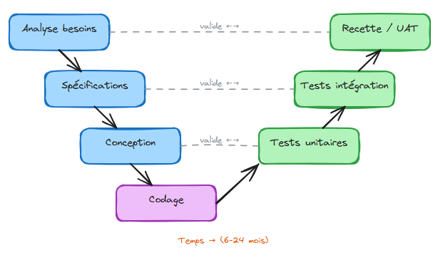

### 🎤 · Le mur de la confusion et le cercle vicieux

Objectifs **opposés** (vitesse contre stabilité) = un mur invisible entre les deux équipes : le **mur de la confusion**. Les DEV « jettent » leur code par-dessus le mur et passent au projet suivant ; les OPS le récupèrent sans savoir comment il fonctionne.

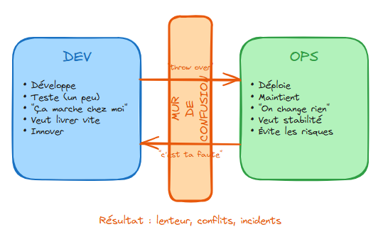

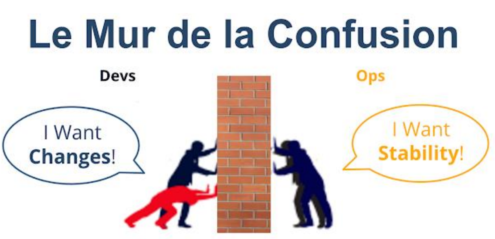

Ce conflit crée un cercle vicieux très prévisible :

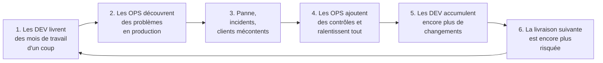

> **Moralité :** plus on livre rarement, plus chaque livraison est grosse, et plus elle est risquée. Le DevOps fait **exactement l'inverse** : livrer **souvent**, par **petits morceaux**, en **automatisant** les vérifications.

Les deux équipes ne vivent pas le même cycle : les DEV tournent dans leur boucle (concevoir, développer, tester, livrer), les OPS dans la leur (déployer, surveiller, détecter les incidents, analyser). Les deux boucles ne se parlent qu'au passage par-dessus le mur.

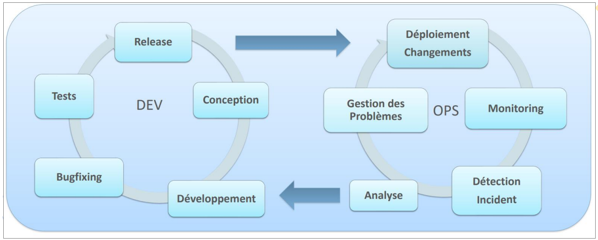

### 👥 En équipe · Jeu de rôle « Panne du vendredi soir » (20 min)

Formez vos équipes de 4 (ce seront vos équipes pour le projet). Dans chaque équipe : **2 DEV** et **2 OPS**.

**Situation :** vendredi 18h, les DEV de DataCafé veulent mettre en ligne la nouvelle page « Promo du week-end ». Les OPS doivent garantir que le site reste disponible tout le week-end, et personne ne veut travailler samedi.

1. **(5 min)** Chaque camp prépare **3 arguments** pour défendre sa position.
2. **(5 min)** Débat : DEV contre OPS.
3. **(5 min)** Ensemble, trouvez **une ou plusieurs solutions qui satisfont les deux camps**. Notez-les.
4. **(5 min)** Restitution : chaque équipe présente sa meilleure solution à la classe en une phrase.

✅ Vous avez réussi si votre équipe propose au moins une solution acceptée à la fois par les DEV et par les OPS.

### 🎤 · Le piège : créer « l'équipe DevOps »

L'idée qui semble bonne : *« Créons une équipe DevOps qui s'occupera de l'automatisation entre les DEV et les OPS ! »*

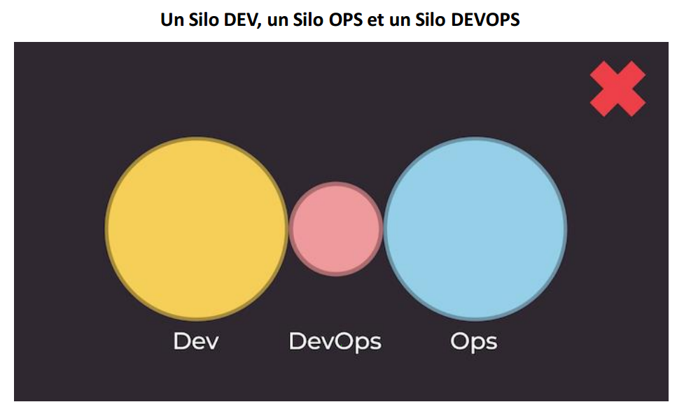

Résultat : un **troisième silo**. Les DEV comptent sur cette équipe sans comprendre ce qu'elle fait, les OPS la voient comme une menace, et le mur devient... deux murs. C'est un **anti-pattern** : une bonne idée de départ qui produit l'inverse de l'effet recherché.

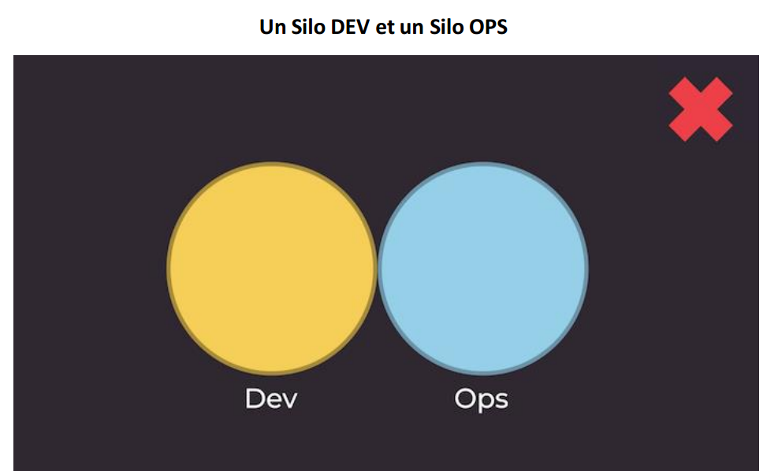

La bonne approche, c'est la **collaboration** : DEV et OPS partagent les mêmes objectifs et travaillent ensemble sur tout le cycle de vie de l'application. Une équipe DevOps peut exister, mais **temporairement**, pour former les autres et les rendre autonomes.

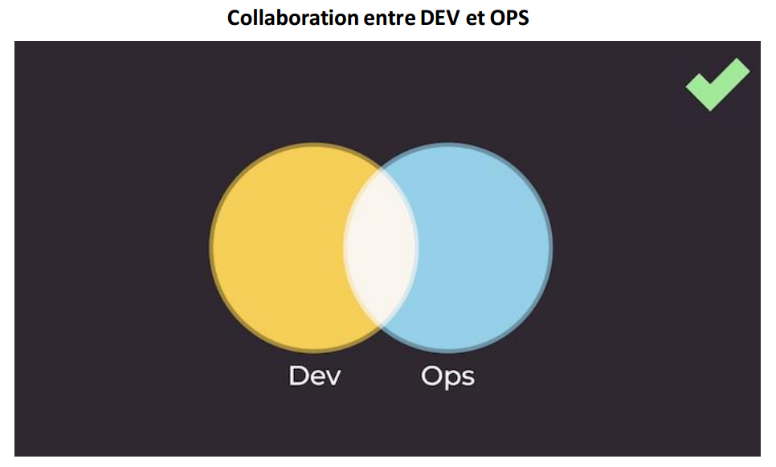

| ❌ Mauvaises pratiques | ✅ Bonnes pratiques |
|---|---|
| Silo DEV + silo OPS, aucune collaboration | DEV et OPS collaborent avec des objectifs communs |
| Une équipe DevOps permanente qui devient un 3ᵉ silo | Une équipe DevOps **temporaire** qui forme et rend autonomes les autres équipes |

### 🧠 Quiz en classe · Les défis

**Q1.** Quel est l'objectif principal de l'équipe OPS ?

- A. Livrer le plus de fonctionnalités possible
- B. Garantir la stabilité et la disponibilité de l'application
- C. Écrire la documentation du code
- D. Vendre l'application aux clients

**Q2.** Qu'est-ce que le « mur de la confusion » ?

- A. Un pare-feu qui bloque les attaques informatiques
- B. La séparation entre DEV et OPS, due à des objectifs opposés
- C. Un bug qui empêche le site de s'afficher
- D. Un outil de gestion de projet

**Q3.** Vrai ou faux : « Pour réduire les risques, il vaut mieux livrer rarement, en regroupant beaucoup de changements. »

**Q4.** Pourquoi créer une équipe DevOps permanente est-il souvent un anti-pattern ?

---

## 1.2 Les enjeux du DevOps 🎯

### 🎤 · Alors, c'est quoi le DevOps ?

> **DevOps** = **Dev**eloppement + **Op**ération**s**.
> C'est un ensemble de **pratiques** et un **état d'esprit** qui rapprochent les développeurs et les opérationnels, pour **livrer plus vite** des applications **plus fiables**, grâce à la **collaboration** et à l'**automatisation**.

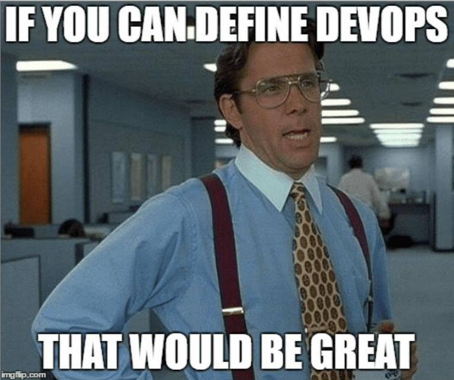

> [!WARNING]
> **Ce que le DevOps n'est PAS :**
> - ❌ un logiciel qu'on achète ;
> - ❌ un intitulé de poste magique (« il suffit d'embaucher un DevOps ») ;
> - ❌ une équipe à part.
>
> Le terme est très (trop) utilisé. Retenez que **le DevOps résout d'abord des problèmes humains, pas des problèmes d'outils.**

**Ce que le DevOps apporte :**

- 🤝 plus de **collaboration** et de **confiance** entre les équipes ;
- 🚀 des livraisons **plus rapides** (le *Time-to-Market*) ;
- 🛡️ moins de pannes, et des pannes **réparées plus vite** ;
- 🔁 moins de tâches manuelles répétitives grâce à l'**automatisation** ;
- 😌 des équipes moins stressées : plus de nuits blanches le vendredi !

### 🎤 · Les 5 piliers : CALMS

Moyen mémotechnique : *calm* veut dire « calme » en anglais. Le DevOps, c'est la fin de la panique 😌.

| Lettre | Pilier | En une phrase | 💡 Chez DataCafé... |
|---|---|---|---|
| **C** | **Culture** | Collaborer avec un objectif commun plutôt que se renvoyer la faute. | DEV et OPS partagent le même objectif : « les clients peuvent commander 24h/24 ». |
| **A** | **Automatisation** | Confier aux machines les tâches répétitives et sources d'erreurs. | Les tests du site se lancent tout seuls à chaque modification. |
| **L** | **Lean** | Éliminer le gaspillage, livrer par petits lots. | On livre la page « Promo » seule, pas avec 50 autres changements. |
| **M** | **Mesure** | Mesurer pour décider, plutôt que deviner. | On mesure combien de temps il faut pour qu'une idée arrive en ligne. |
| **S** | **Sharing** (Partage) | Partager les connaissances, les outils et les responsabilités. | Les DEV participent aussi à la surveillance du site en production. |

Points clés par pilier :

- **Culture** : le DevOps est d'abord un **virage culturel** ; on collabore autour d'un **objectif commun** et d'un plan pour l'atteindre **ensemble**.
- **Automatisation** : un humain qui répète 100 fois la même manipulation finit par se tromper, une machine non. On automatise les tests, les installations, les mises en ligne.
- **Lean** (« maigre », « sans gras ») : vient de l'usine **Toyota**. Produire sans gaspillage, en petites quantités, et s'améliorer en continu.
- **Mesure** : combien de temps pour passer une fonctionnalité du développement à la production ? Combien de fois un même bug réapparaît-il ? Combien d'utilisateurs en ce moment, en a-t-on gagné ou perdu cette semaine ? Ces indicateurs ont encore plus d'impact **partagés** avec les équipes métier, pour prioriser les demandes.
- **Partage** : le mur de la confusion vient d'un **manque de savoir commun**. Un développeur participe aussi à la livraison et au fonctionnement de son application. DEV et OPS travaillent de concert sur **tout** le cycle de vie.

🔬 Pour les curieux : les 4 indicateurs DORA

Les chercheurs du programme **DORA** (*DevOps Research and Assessment*, aujourd'hui chez Google) ont étudié des milliers d'entreprises. Ils ont identifié **4 indicateurs** qui distinguent les équipes les plus performantes :

| Indicateur | Question posée |
|---|---|
| **Fréquence de déploiement** | À quelle fréquence met-on en production ? (une fois par an ? plusieurs fois par jour ?) |
| **Délai de mise en production** (*lead time*) | Combien de temps entre l'écriture du code et sa mise en ligne ? |
| **Taux d'échec des changements** | Quel pourcentage des mises en production provoque un incident ? |
| **Temps de restauration** (*MTTR*) | Quand ça casse, combien de temps pour réparer ? |

Leur conclusion surprenante : les meilleures équipes sont à la fois **plus rapides ET plus stables**. Vitesse et stabilité ne s'opposent pas, contrairement à ce que pensaient les DEV et les OPS de part et d'autre du mur !

### 🎤 · La boucle DevOps ♾️

Le DevOps se représente par un **symbole infini** : on ne « termine » jamais une application, on l'améliore en boucle.

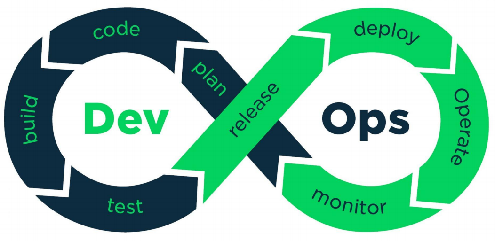

La vie d'une nouvelle fonctionnalité de DataCafé, **le bouton « Ajouter au panier »**, en 8 étapes :

| Étape | Ce qui se passe | Outils typiques |
|---|---|---|
| 📋 **Plan** (Planifier) | L'équipe découpe le travail en petites tâches et les priorise. | Jira, Trello, Confluence, Slack |
| ⌨️ **Code** | Les développeurs écrivent le code et en gardent toutes les versions. | **VS Code** (chapitre 2), **Git** et **GitHub** (chapitres 3 et 4) |
| 🧱 **Build** (Construire) | On assemble le code de tous les développeurs en un produit qui fonctionne. | Jenkins, GitHub Actions, Maven, Docker |
| 🧪 **Test** | On vérifie automatiquement que tout marche, et que rien d'ancien n'est cassé. | Selenium, JUnit, pytest |
| 📦 **Release** (Publier) | La version stable est numérotée et rangée, prête à être livrée. | Nexus, Artifactory, tags Git (chapitre 3) |
| 🚀 **Deploy** (Déployer) | On installe la nouvelle version sur les serveurs, idéalement en un clic. | XL Deploy, Ansible, Kubernetes |
| ⚙️ **Operate** (Exploiter) | On fait tourner l'application au quotidien. | Docker, Kubernetes, le cloud (AWS, Azure...) |
| 📈 **Monitor** (Surveiller) | On mesure en continu : erreurs, lenteurs, nombre d'utilisateurs... et on repart au début ! | Dynatrace, Datadog, Grafana |

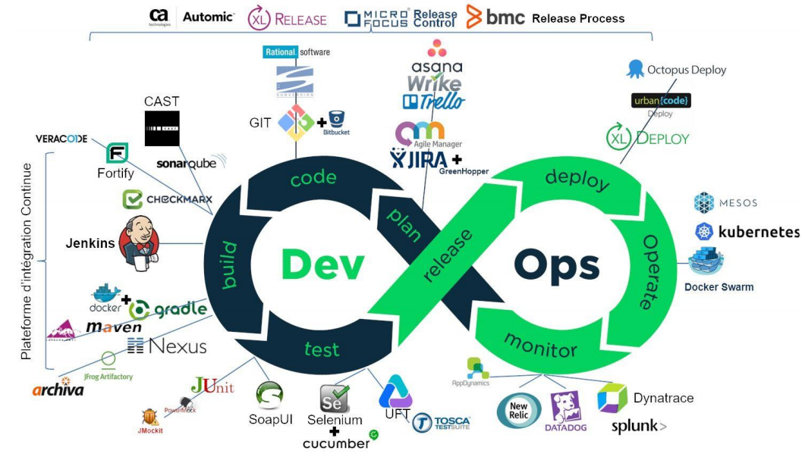

> [!NOTE]
> Pas de panique devant cette jungle de logos : **vous n'avez pas besoin de tous les connaître.** Dans ce cours, vous manipulerez pour de vrai les outils de l'étape **Code** : **VS Code**, **Git** et **GitHub**. Ce sont les fondations de toute la chaîne.

🔬 Pour les curieux : quelques mots du jargon

- **Intégration continue (CI)** : chaque fois qu'un développeur envoie du code, il est automatiquement assemblé et testé avec celui des autres.
- **Déploiement continu (CD)** : si tous les tests passent, la nouvelle version est automatiquement mise en production.
- **Tests de non-régression** : on vérifie que les nouveautés n'ont pas cassé ce qui marchait avant.
- **Infrastructure as Code (IaC)** : décrire ses serveurs dans des fichiers de code (Terraform, Ansible) au lieu de les configurer à la main.
- **Conteneur** (Docker) : une « boîte » qui embarque l'application et tout ce dont elle a besoin pour fonctionner. Elle tourne de la même façon sur le PC du développeur et sur le serveur de production. Fini le fameux *« ça marche sur ma machine ! »*
- **Chaîne d'outils tout-en-un ou ouverte** : soit une seule plateforme fait tout (GitLab, Azure DevOps), soit on assemble des outils spécialisés de différents éditeurs.

Tous ces mots sont aussi dans le [glossaire](GLOSSAIRE.md).

### 🛠️ À vous de jouer · Remettre la boucle dans l'ordre, associer les outils (10 min)

1. 🟢 **(3 min)** Sans regarder le tableau, remettez les étapes de la boucle DevOps dans l'ordre :

   `Deploy` · `Test` · `Plan` · `Monitor` · `Code` · `Release` · `Operate` · `Build`

2. 🟢 **(5 min)** À l'aide du tableau et de l'image ci-dessus, associez chaque outil à son étape :

   | Outil | Étape ? |
   |---|---|
   | Git | |
   | Jira | |
   | Selenium | |
   | Docker | |
   | Datadog | |
   | Jenkins | |

3. 🟡 **Si vous avez terminé :** un outil peut-il appartenir à plusieurs étapes ? Trouvez-en un dans le tableau.
4. 🔴 **Défi :** choisissez un outil que vous ne connaissez pas, renseignez-vous, et présentez-le en **une phrase** à la classe.

✅ Vous avez réussi si les 8 étapes sont dans le bon ordre et si chaque outil est rattaché à une étape cohérente.

### 🧠 Quiz en classe · Les enjeux

**Q1.** Que signifie le « A » de CALMS ?

- A. Agilité
- B. Architecture
- C. Automatisation
- D. Application

**Q2.** Le DevOps est...

- A. un logiciel édité par Microsoft
- B. un ensemble de pratiques et une culture de collaboration
- C. un langage de programmation
- D. un poste de travail

**Q3.** Le principe **Lean** vient à l'origine...

- A. de Google
- B. de l'industrie automobile (Toyota)
- C. de la NASA
- D. de Linux

**Q4.** À quelle étape de la boucle DevOps utilise-t-on Git ?

- A. Monitor
- B. Deploy
- C. Code
- D. Plan

**Q5.** Pourquoi la boucle DevOps est-elle représentée par le symbole infini ♾️ ?

---

## 1.3 Les origines de la méthodologie DevOps 📜

### 🎤 · La frise chronologique

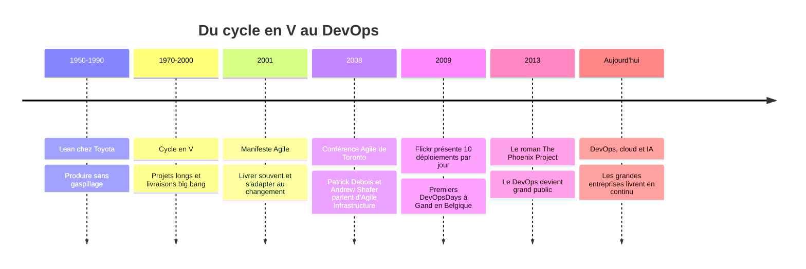

### 🎤 · Avant le DevOps, il y a eu l'Agilité

Le titre de ce cours commence par **Agilité**, et ce n'est pas un hasard : le DevOps est **l'enfant de l'Agilité**.

En **2001**, 17 développeurs réunis dans une station de ski américaine (Snowbird, Utah) en ont assez des projets en cycle en V qui durent des années et livrent un produit dont plus personne ne veut. Ils rédigent le **Manifeste Agile**, en 4 valeurs :

| On valorise davantage... | ...que |
|---|---|
| Les **individus et leurs interactions** | les processus et les outils |
| Un **logiciel qui fonctionne** | une documentation exhaustive |
| La **collaboration avec le client** | la négociation contractuelle |
| L'**adaptation au changement** | le suivi d'un plan |

> 💡 **Analogie : le GPS.** Le cycle en V, c'est imprimer un itinéraire avant de partir et le suivre coûte que coûte, même s'il y a un bouchon. L'Agilité, c'est le GPS qui recalcule la route en permanence selon ce qui se passe.

Une équipe agile travaille par **sprints** : de courtes périodes (souvent 2 semaines) à la fin desquelles elle livre quelque chose qui fonctionne, le montre au client et ajuste la suite. La méthode agile la plus répandue s'appelle **Scrum**.

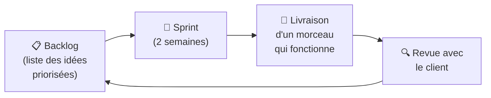

🔬 Pour les curieux : Scrum en 30 secondes

- **3 rôles** : le *Product Owner* (porte la vision du produit et priorise), le *Scrum Master* (facilite et lève les obstacles), l'*équipe de développement*.
- **Les cérémonies** : planification du sprint, *daily meeting* (15 min chaque matin), revue de sprint (démonstration), rétrospective (comment s'améliorer).
- **Les artefacts** : le *Product Backlog* (toutes les idées), le *Sprint Backlog* (ce qu'on fait pendant ce sprint), l'*incrément* (ce qu'on livre).
- **Le tableau Kanban** : 3 colonnes « À faire / En cours / Terminé ». Vous en utiliserez un sur GitHub au chapitre 4 !

### 🎤 · ...mais l'Agilité s'arrêtait au mur

- L'Agilité permet aux DEV de produire du code toutes les 2 semaines... mais les OPS ne mettent toujours en production que deux fois par an. Le code s'empile derrière le mur de la confusion.
- **2008**, conférence Agile de Toronto : **Patrick Debois** et **Andrew Shafer** veulent appliquer l'Agilité **aussi** à l'infrastructure et aux opérations (« *Agile Infrastructure* »).
- **2009** : deux ingénieurs de **Flickr** (site de partage de photos), John Allspaw (OPS) et Paul Hammond (DEV), présentent **« 10+ déploiements par jour : la coopération Dev et Ops chez Flickr »**. À l'époque, la plupart des entreprises livrent quelques fois par an !
- La même année, Patrick Debois organise en Belgique les premiers **DevOpsDays**. Le mot **DevOps** est né, et le hashtag #DevOps sur Twitter fait le reste.

> [!IMPORTANT]
> **Agilité** = les DEV et le client travaillent ensemble et livrent souvent. **DevOps** = on étend cette logique jusqu'aux OPS et à la mise en production.

### 🧠 Quiz en classe · Les origines

**Q1.** En quelle année le Manifeste Agile a-t-il été rédigé ?

- A. 1995
- B. 2001
- C. 2008
- D. 2013

**Q2.** Qui est considéré comme le « père » du mot DevOps ?

- A. Linus Torvalds
- B. Bill Gates
- C. Patrick Debois
- D. Mark Zuckerberg

**Q3.** Que montrait la célèbre conférence de Flickr en 2009 ?

- A. Qu'on pouvait déployer plus de 10 fois par jour grâce à la coopération DEV et OPS
- B. Qu'il fallait supprimer l'équipe OPS
- C. Comment créer un réseau social
- D. Qu'il valait mieux livrer une fois par an

**Q4.** Complétez : « Le DevOps étend les principes de l'........ jusqu'aux opérations. »

---

## 🏁 Mission finale

### 🛠️ À vous de jouer · Le pitch DevOps (15 min, par équipe)

Léa vous demande de convaincre le directeur de DataCafé, qui n'est pas du tout technique, d'adopter le DevOps. Travaillez en binôme au sein de votre équipe.

1. 🟢 **(8 min)** Préparez un **pitch de 1 minute**, sans jargon, qui contient :
   - le **problème** actuel (pensez au mur de la confusion et au cercle vicieux) ;
   - **2 piliers CALMS** qui répondraient à ce problème, avec un exemple concret chez DataCafé ;
   - **1 bénéfice** mesurable pour l'entreprise.
2. 🟡 **Si vous avez terminé :** répétez votre pitch à voix haute et chronométrez-le : il doit tenir en 1 minute.
3. 🔴 **Défi :** intégrez une analogie de votre invention (sport, cuisine, musique...) pour expliquer le DevOps.
4. **(7 min)** Quelques équipes/binômes présentent leur pitch à la classe, qui joue le rôle du directeur.

✅ Vous avez réussi si votre pitch tient en 1 minute, ne contient aucun mot technique non expliqué, et comporte les trois éléments demandés.

### 💬 Tour de table · Retour au début

Reprenez votre réponse à la première question du tour de table : qu'est-ce qui a changé dans votre définition du DevOps ?

---

## 📌 À retenir

- Les **DEV** veulent livrer vite, les **OPS** veulent de la stabilité : ces objectifs opposés ont créé le **mur de la confusion**.
- Livrer rarement de gros paquets est **plus** risqué : le DevOps livre **souvent**, par **petits morceaux**, en **automatisant**.
- Le **DevOps** est une **culture** et un ensemble de **pratiques** qui rapprochent ces deux mondes, pour livrer **plus vite** ET **plus sûrement**. Ce n'est ni un logiciel, ni une équipe à part.
- Les 5 piliers : **CALMS** (Culture, Automatisation, Lean, Mesure, Sharing).
- La boucle infinie : **Plan → Code → Build → Test → Release → Deploy → Operate → Monitor**.
- Le DevOps est né en **2008-2009** (Patrick Debois, DevOpsDays) dans le prolongement de l'**Agilité** (Manifeste de 2001).

## 🏅 Titre décroché : Briseur de murs 🧱💥

## 🏠 Avant la prochaine séance

- Apportez un **ordinateur** (Windows, macOS ou Linux) sur lequel vous pouvez **installer des logiciels** (droits administrateur). Si c'est un ordinateur d'entreprise verrouillé, prévenez le professeur.
- Si vous le pouvez, installez déjà **Visual Studio Code** depuis [code.visualstudio.com](https://code.visualstudio.com/) : nous le configurerons ensemble.

---

> **🎬 Prochain épisode :** Léa vous installe votre premier vrai poste de développeur : un **environnement de développement**. Direction l'étape **Code** de la boucle !
> ➡️ [Chapitre 2 · Introduction aux EDI et à Visual Studio Code](2.EDI.md)
