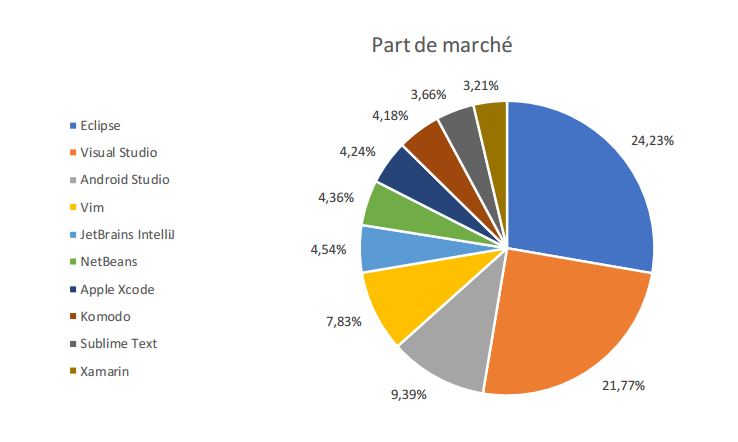
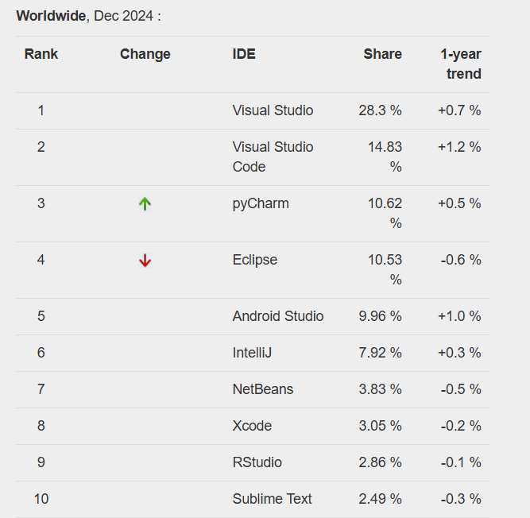
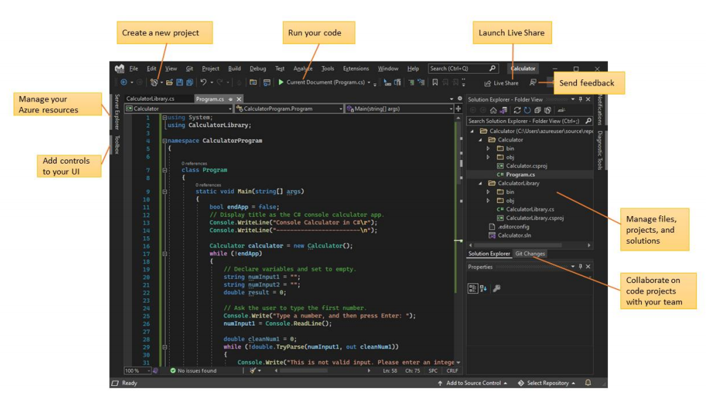
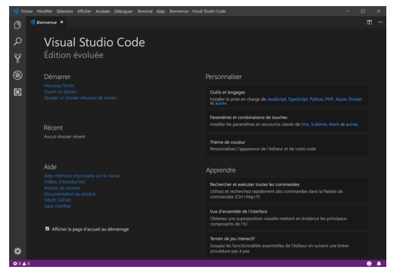
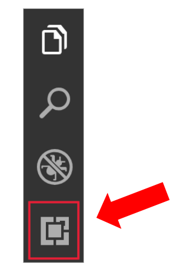
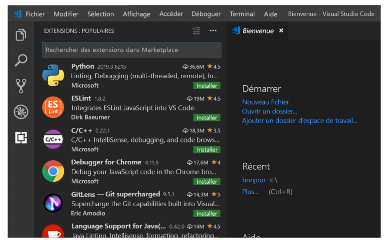

# Chapitre 2 · Introduction aux EDI et à Visual Studio Code 🛠️

> **🎬 DataCafé, épisode 2 : votre poste de travail**
>
> Léa pose un ordinateur portable tout neuf sur votre bureau. *« Chez DataCafé, tout le monde code dans le même outil : Visual Studio Code. Configurez-le et apprenez à parler au terminal. Ce soir, vous devez savoir créer et écrire vos premiers fichiers sans toucher à la souris... enfin, presque ! »*

| | |
|---|---|
| ⏱️ **Durée** | 1h30 (1 séance) |
| 🎯 **Prérequis** | Chapitre 1. Un ordinateur portable Windows, macOS ou Linux sur lequel vous pouvez installer des logiciels. |
| 💻 **À préparer avant la séance** | **Installer VS Code** (instructions ci-dessous, partie [2.4](#24-installation-de-visual-studio-code-)). Une dizaine de minutes suffisent. |
| 🏅 **Titre à décrocher** | **Artisan de l'éditeur** |

## 🎯 Objectifs de la séance

À la fin de cette séance, vous saurez :

- expliquer ce qu'est un EDI et à quoi servent ses composants ;
- citer les EDI les plus utilisés aujourd'hui ;
- configurer **Visual Studio Code** avec des extensions utiles ;
- utiliser le **terminal** pour vous déplacer dans vos dossiers et en créer ;
- écrire un petit document en **Markdown** (le format de ce cours !).

> [!NOTE]
> **Où en est-on dans la boucle DevOps ?** On entre dans l'étape **⌨️ Code**. L'EDI est l'atelier où le développeur travaille tous les jours. Au chapitre 3, on y branchera Git.

---

### 💬 Tour de table

1. Pour écrire une lettre, vous utilisez Word ou Google Docs ; pour un tableau de calcul, Excel. **Quel logiciel utilisent les développeurs pour écrire du code ?**
2. Pourquoi pas simplement le Bloc-notes ?
3. Qui a réussi à installer VS Code avant la séance ? Qui a rencontré un problème ?

---

## 2.1 Définition et composants 🧩

### 🎤 · Qu'est-ce qu'un EDI ?

Un **EDI** (*Environnement de Développement Intégré*, en anglais **IDE** pour *Integrated Development Environment*) est un logiciel qui **regroupe dans une seule fenêtre** tous les outils dont un développeur a besoin pour écrire, tester et corriger du code.

> 💡 **Analogie : la cuisine équipée.**
> On peut cuisiner avec un couteau, une casserole et un réchaud de camping posés par terre. Mais c'est bien plus efficace dans une **cuisine équipée** : plan de travail, four, plaques, évier, ustensiles, tout est à portée de main.
> Le **Bloc-notes**, c'est le réchaud de camping. L'**EDI**, c'est la cuisine équipée du développeur.

**Le minimum vital :**

| Composant | À quoi ça sert ? | 💡 Dans la cuisine... |
|---|---|---|
| ✏️ **Éditeur de texte spécialisé** | Écrire le code, avec des **couleurs** selon le rôle de chaque mot (coloration syntaxique) et une mise en forme automatique (indentation). | Le plan de travail |
| ⚙️ **Compilateur / interpréteur** | Traduire le code en instructions que l'ordinateur comprend, et l'exécuter. | Le four, qui transforme la pâte en gâteau |
| 🐞 **Débogueur** | Exécuter le code pas à pas pour trouver et corriger les erreurs (*bugs*). | Goûter la sauce à chaque étape |
| 🤖 **Outils d'automatisation** | Lancer en un clic les tâches répétitives (compiler, empaqueter, gérer le projet). | Le robot de cuisine |

**Les « options » très appréciées :**

- 🌳 l'intégration d'un **système de gestion de versions** comme **Git** (chapitre 3) ;
- 🧪 des outils de **tests** pour vérifier le code automatiquement ;
- 🧹 des outils de **refactoring** (réorganiser le code sans changer ce qu'il fait) ;
- 💬 l'**autocomplétion** : l'éditeur propose la suite de ce que vous tapez, comme sur votre téléphone ;
- 🎨 des outils de conception d'interfaces graphiques ;
- 📚 un générateur de documentation ;
- 🤖 et, de plus en plus, un **assistant IA** qui propose ou explique du code.

<details>
<summary>🔬 Pour les curieux : éditeur de code ou EDI ?</summary>

Les puristes font une différence :

- un **éditeur de code** (VS Code, Sublime Text, Notepad++) est léger et fait d'abord de l'édition ;
- un **EDI complet** (Visual Studio, IntelliJ IDEA, Eclipse, PyCharm) embarque tout dès l'installation, souvent pour un langage précis.

**VS Code** est entre les deux : c'est un éditeur léger qui devient un véritable EDI grâce à ses **extensions**. C'est l'une des raisons de son succès.
</details>

## 2.2 Les EDI d'aujourd'hui 🏆

### 🎤 · Le classement de popularité

Chaque mois, l'indice **PYPL** (*PopularitY of Programming Language*) mesure la popularité des langages de programmation et des EDI, à partir des recherches de tutoriels sur Google.



En décembre 2024, le podium était le suivant :

1. 🥇 **Visual Studio** et **Visual Studio Code** (Microsoft) : à eux deux, environ **43 %** des recherches ;
2. 🥈 **Eclipse** (open source) : environ **10 %** ;
3. 🥉 **Android Studio** (Google) : environ **9 %**.



> [!TIP]
> Ne confondez pas **Visual Studio** (un gros EDI pour Windows, orienté C# et .NET) et **Visual Studio Code** (un éditeur léger, gratuit, multi-plateforme et multi-langage). Ils ont presque le même nom, mais ce sont deux logiciels différents. Dans ce cours, on utilise **Visual Studio Code**.

**Quel EDI pour quel usage ?**

| EDI | Pour qui ? |
|---|---|
| **Visual Studio Code** | Tout le monde : web, Python, data, scripts... Le couteau suisse. |
| **Visual Studio** | Applications Windows, C#, .NET |
| **IntelliJ IDEA** / **Eclipse** | Développement Java en entreprise |
| **PyCharm** | Python, data science |
| **Android Studio** / **Xcode** | Applications mobiles Android / iPhone |
| **Jupyter Notebook** | Analyse de données et exploration interactive |

### 🛠️ À vous de jouer · L'enquête PYPL (5 min)

1. 🟢 Allez sur [pypl.github.io/IDE.html](https://pypl.github.io/IDE.html).
2. 🟢 Notez le **top 3 actuel** des EDI. A-t-il changé depuis décembre 2024 ?
3. 🟡 Quel EDI a le plus progressé sur un an ? Selon vous, pourquoi ?

✅ **Vous avez réussi si** vous pouvez annoncer à la classe le top 3 actuel.

### 🧠 Quiz en classe · Les EDI

**Q1.** Que signifie EDI ?

- A. Éditeur De l'Informatique
- B. Environnement de Développement Intégré
- C. Espace de Données Informatiques
- D. Échange de Données Informatisé

**Q2.** À quoi sert un débogueur ?

- A. À colorer le code
- B. À trouver et corriger les erreurs en exécutant le code pas à pas
- C. À envoyer le code sur Internet
- D. À traduire le code en anglais

**Q3.** Comment appelle-t-on la fonction qui affiche les mots du code dans des couleurs différentes ?

---

## 2.3 La plateforme Visual Studio Code (VS Code) 💙

### 🎤 · Pourquoi VS Code ?

| Caractéristique | Ce que ça veut dire pour vous |
|---|---|
| 🪶 **Léger** | Il démarre vite, même sur un ordinateur modeste. |
| 💻 **Multi-plateforme** | Windows, macOS et Linux : tout le monde a le même outil. |
| 🆓 **Gratuit** | Pas besoin de licence. |
| 🌈 **Coloration syntaxique** | Le code est lisible et les erreurs se voient. |
| 💬 **IntelliSense** | Autocomplétion intelligente du code. |
| 🐞 **Débogueur intégré** | On trouve les bugs sans changer d'outil. |
| ⌨️ **Terminal intégré** | On tape des commandes sans quitter l'éditeur. |
| 🌳 **Git intégré** | On sauvegarde ses versions en quelques clics (chapitre 3). |
| 🧩 **Extensible** | Des dizaines de milliers d'extensions pour tous les langages et usages. |

<details>
<summary>🔬 Pour les curieux : VS Code est-il open source ?</summary>

Presque ! Le code source de VS Code (projet **Code - OSS**) est publié en open source sous licence MIT sur GitHub. Le logiciel téléchargé sur le site de Microsoft, lui, ajoute quelques éléments propriétaires (logo, télémétrie, accès à la place de marché). Il existe une version 100 % libre appelée **VSCodium**.
</details>

### 👀 Démonstration · Visite guidée de l'interface



L'écran de VS Code se découpe en 5 zones à connaître :

| Zone | Où ? | À quoi ça sert ? |
|---|---|---|
| **① Barre d'activités** | Tout à gauche, les petites icônes verticales | Changer de vue : fichiers, recherche, Git, extensions... |
| **② Barre latérale** | À droite de la barre d'activités | Affiche le contenu de la vue choisie (par exemple l'arborescence de vos fichiers) |
| **③ Zone d'édition** | Au centre | Là où l'on écrit le code. Plusieurs fichiers s'ouvrent dans des onglets. |
| **④ Panneau** | En bas | Le **terminal**, les erreurs, les messages |
| **⑤ Barre d'état** | Tout en bas, la fine barre colorée | Infos utiles : branche Git, langage du fichier, erreurs... |

Observez pendant la démonstration :

- comment on passe d'une vue à l'autre avec la barre d'activités ;
- comment on ouvre la vue **Extensions** (`Ctrl + Maj + X`, ou `Cmd + Maj + X` sur Mac) et comment on installe une extension ;
- comment la **palette de commandes** permet de tout faire sans chercher dans les menus.

> [!TIP]
> **Le raccourci magique à retenir :** `Ctrl + Maj + P` (Windows/Linux) ou `Cmd + Maj + P` (macOS) ouvre la **palette de commandes**. Tapez ce que vous voulez faire (« thème », « terminal », « formater »...) et VS Code propose l'action.

---

## 2.4 Installation de Visual Studio Code 💾

> [!IMPORTANT]
> L'étape 1 est **à faire avant la séance**. Si VS Code est déjà installé sur votre ordinateur, passez directement à l'[étape 2 : installer les extensions](#étape-2--installer-les-extensions).

### Étape 1 : télécharger et installer

1. Allez sur [code.visualstudio.com](https://code.visualstudio.com/).
2. Cliquez sur le gros bouton **Download** : le site détecte automatiquement votre système.
3. Lancez l'installation :

<details>
<summary>🪟 Sur Windows</summary>

1. Ouvrez le fichier `VSCodeUserSetup-....exe` téléchargé.
2. Acceptez la licence, puis cliquez sur **Suivant** en laissant les options par défaut.
3. Sur l'écran **« Tâches supplémentaires »**, cochez :
   - ✅ **Ajouter l'action « Ouvrir avec Code » au menu contextuel** des fichiers et des dossiers (très pratique : clic droit sur un dossier → Ouvrir avec Code) ;
   - ✅ **Ajouter à PATH** (normalement déjà coché ; cela permet de lancer VS Code depuis le terminal avec la commande `code`).
4. Cliquez sur **Installer**, puis **Terminer**.
</details>

<details>
<summary>🍎 Sur macOS</summary>

1. Ouvrez le fichier `.zip` téléchargé : il contient l'application **Visual Studio Code**.
2. **Glissez-la dans le dossier Applications** (sinon elle disparaîtra avec vos téléchargements !).
3. Lancez-la depuis le Launchpad ou Spotlight (`Cmd + Espace`, tapez « Visual Studio Code »).
4. Pour pouvoir lancer VS Code depuis le terminal : ouvrez la palette de commandes (`Cmd + Maj + P`), tapez **« shell command »** et choisissez **Shell Command: Install 'code' command in PATH**.
</details>

<details>
<summary>🐧 Sur Linux</summary>

Téléchargez le paquet `.deb` (Ubuntu, Debian) ou `.rpm` (Fedora) et ouvrez-le avec votre gestionnaire de logiciels, ou installez VS Code depuis la logithèque de votre distribution.
</details>

Au premier lancement, vous devez voir une page d'accueil comme celle-ci. Si elle n'apparaît pas, ouvrez-la via le menu **Aide > Accueil** (*Help > Welcome*).



### Étape 2 : installer les extensions

Les extensions ajoutent des super-pouvoirs à VS Code. Cliquez sur l'icône **Extensions** dans la barre d'activités (les 4 petits carrés), ou utilisez `Ctrl + Maj + X` (`Cmd + Maj + X` sur Mac).

> Si vous ne voyez pas la barre d'activités : menu **Affichage > Apparence > Barre d'activités**.



La première fois, VS Code affiche les extensions les plus populaires de la **place de marché** (*Marketplace*). Pour en installer une, tapez son nom dans la barre de recherche et cliquez sur **Installer** (*Install*).



**Les extensions à installer pour ce cours :**

| Extension | À quoi elle sert | Utile au chapitre... |
|---|---|---|
| **French Language Pack for Visual Studio Code** | Passer VS Code en français (redémarrage demandé) | Tout de suite ! |
| **Live Server** | Afficher une page web et la rafraîchir à chaque sauvegarde | 3 (page web DataCafé) |
| **Prettier - Code formatter** | Mettre en forme le code automatiquement | 3 |
| **Markdown All in One** | Écrire du Markdown confortablement | 2 et 4 (fichiers README) |
| **Git Graph** | Voir l'historique Git sous forme de dessin | 3 et 4 |
| **Python** (éditée par Microsoft) | Programmer en Python | 5 (Streamlit) |
| **Rainbow CSV** | Lire facilement des fichiers de données CSV | 5 et 6 (données) |
| **Material Icon Theme** *(facultatif)* | De jolies icônes pour reconnaître vos fichiers | Pour le plaisir 😎 |

> [!NOTE]
> Vous verrez peut-être passer l'extension *Bracket Pair Colorizer* dans d'anciens tutoriels : elle n'est plus nécessaire, la colorisation des parenthèses est désormais **intégrée** à VS Code.

### 🛠️ À vous de jouer · Personnalisez votre atelier (15 min)

1. 🟢 Installez les extensions du tableau ci-dessus (au minimum : French Language Pack, Live Server, Markdown All in One).
2. 🟢 Changez le **thème de couleurs** : palette de commandes → tapez « thème » → **Préférences : Thème de couleur**. Essayez-en plusieurs, gardez votre préféré.
3. 🟢 Activez la **sauvegarde automatique** : menu **Fichier > Enregistrement automatique** (*File > Auto Save*).
4. 🟡 Trouvez dans les paramètres (`Ctrl + ,`, ou `Cmd + ,` sur Mac) comment **agrandir la police** de l'éditeur.
5. 🔴 Faites une capture de votre VS Code personnalisé et montrez-la à votre équipe : qui a l'atelier le plus stylé ?

✅ **Vous avez réussi si** votre VS Code est en français, avec votre thème, l'enregistrement automatique coché, et les extensions visibles dans la liste **Installé** de la vue Extensions.

---

## 2.5 Premiers pas dans le terminal ⌨️

### 🎤 · Le terminal, c'est quoi ?

Le **terminal** (ou *ligne de commande*, ou *console*) est une fenêtre où l'on donne des ordres à l'ordinateur **en tapant du texte** au lieu de cliquer.

> 💡 **Analogie : le restaurant, encore.**
> Utiliser la souris, c'est montrer du doigt les plats sur la carte. Utiliser le terminal, c'est **parler directement au cuisinier** : c'est plus rapide et plus précis... à condition de connaître les bons mots !

Pourquoi l'apprendre ? Parce que **Git** (chapitre 3) s'utilise d'abord dans le terminal, et parce que c'est l'outil quotidien des DEV comme des OPS.

**Ouvrir le terminal dans VS Code :** menu **Terminal > Nouveau terminal**.

Le terminal apparaît dans le **panneau** en bas de l'écran. Il affiche une **invite de commande** (*prompt*) qui se termine souvent par `$` ou `>` : l'ordinateur attend vos instructions.

> [!IMPORTANT]
> **Sur Windows**, le terminal par défaut de VS Code est PowerShell. Les commandes de cette partie y fonctionnent. Au chapitre 3, après avoir installé Git, vous pourrez aussi choisir **Git Bash** comme terminal : flèche ˅ à côté du **+** du terminal → **Git Bash**.

**Les 6 commandes de survie**

| Commande | Signification | Ce qu'elle fait | Exemple |
|---|---|---|---|
| `pwd` | *print working directory* | Affiche **où vous êtes** (le dossier courant) | `pwd` |
| `ls` | *list* | **Liste** le contenu du dossier courant | `ls` |
| `cd` | *change directory* | **Se déplacer** dans un dossier | `cd Documents` |
| `cd ..` | | **Remonter** d'un dossier | `cd ..` |
| `mkdir` | *make directory* | **Créer** un dossier | `mkdir datacafe` |
| `code` | | **Ouvrir** un fichier ou un dossier dans VS Code | `code .` (le `.` veut dire « ici ») |

> 💡 **Analogie : l'immeuble.** Votre disque dur est un **immeuble**. Les dossiers sont des **étages et des appartements**. `pwd` vous dit à quel étage vous êtes, `ls` vous montre les portes autour de vous, `cd` vous fait entrer dans une pièce, `cd ..` vous fait ressortir.

> [!TIP]
> **Deux astuces qui changent la vie :**
> - la touche **Tab** ⇥ **complète automatiquement** les noms de fichiers et de dossiers : tapez `cd Doc` puis **Tab** ;
> - les **flèches ↑ et ↓** rappellent les commandes précédentes. Plus besoin de tout retaper !

### 👀 Démonstration · Se promener dans ses dossiers

```bash
pwd             # où suis-je ?
ls              # qu'y a-t-il autour de moi ?
cd Documents    # entrer dans un dossier (essayez la touche Tab après "Doc")
pwd             # le chemin a changé
cd ..           # remonter d'un cran
cd ~            # revenir "à la maison", d'où que l'on soit
```

Observez que :

- `pwd` et `ls` ne modifient rien : ils servent à **se repérer** ;
- après chaque `cd`, le chemin affiché par l'invite (ou par `pwd`) change ;
- la touche **Tab** complète le nom, et la flèche **↑** rappelle la commande précédente.

### 🛠️ À vous de jouer · Votre premier dossier de travail (10 min)

Vous allez créer le dossier qui contiendra **tous vos travaux du cours**. Tapez les commandes une par une, en observant le résultat de chacune :

```bash
cd ~                 # aller dans votre dossier personnel (le "~" veut dire "chez moi")
pwd                  # vérifier où vous êtes
mkdir cours-devops   # créer le dossier du cours
cd cours-devops      # entrer dedans
pwd                  # vérifier que vous êtes bien dedans
code .               # ouvrir ce dossier dans VS Code
```

> Tout ce qui suit un `#` est un **commentaire** : c'est une explication pour vous, l'ordinateur l'ignore. Inutile de le recopier.

1. 🟢 Tapez les 6 commandes ci-dessus.
2. 🟡 Dans `cours-devops`, créez un sous-dossier `essais`, entrez dedans, vérifiez avec `pwd`, puis revenez dans `cours-devops` avec `cd ..`.
3. 🔴 Depuis n'importe quel autre dossier, revenez dans `cours-devops` **en une seule commande**.

✅ **Vous avez réussi si** VS Code s'ouvre avec, dans la barre latérale, un dossier nommé `COURS-DEVOPS`.

<details>
<summary>🆘 Ça ne marche pas ?</summary>

- **`code` : commande introuvable** → sur Windows, fermez puis rouvrez VS Code (le PATH n'est pris en compte qu'au redémarrage). Sur Mac, refaites l'étape « Shell Command » de l'installation. En dernier recours, ouvrez le dossier via **Fichier > Ouvrir le dossier**.
- **`mkdir` : le fichier existe déjà** → pas de souci, le dossier a déjà été créé. Continuez avec `cd cours-devops`.
- **Vous êtes perdu dans les dossiers ?** → tapez `cd ~` pour revenir « à la maison » et recommencez.
</details>

### 🧠 Quiz en classe · Le terminal

**Q1.** Quelle commande affiche le dossier dans lequel vous vous trouvez ?

- A. `ls`
- B. `cd`
- C. `pwd`
- D. `mkdir`

**Q2.** Vous êtes dans `cours-devops` et vous voulez revenir au dossier parent. Que tapez-vous ?

**Q3.** Que fait la commande `code .` ?

**Q4.** Quelle touche complète automatiquement un nom de dossier ?

---

## 2.6 Mission : votre fiche de présentation en Markdown 📝

### 🎤 Cours · Le Markdown, c'est quoi ?

**Markdown** est un format de texte très simple qui permet de mettre en forme un document avec quelques symboles. **Ce cours entier est écrit en Markdown !** Et sur GitHub (chapitre 4), chaque projet est présenté par un fichier `README.md` écrit en Markdown.

| Vous tapez... | Vous obtenez... |
|---|---|
| `# Titre` | un grand titre |
| `## Sous-titre` | un titre plus petit |
| `**gras**` | **gras** |
| `*italique*` | *italique* |
| `- élément` | une liste à puces |
| `[texte](https://...)` | un lien |
| `` `code` `` | `code` |

### 🛠️ À vous de jouer · Ma fiche DataCafé (15 min)

1. 🟢 Dans VS Code, dans le dossier `cours-devops`, créez un nouveau fichier : clic sur l'icône 📄+ dans la barre latérale, nommez-le `presentation.md`.
2. 🟢 Recopiez et complétez ce modèle :

   ```markdown
   # Bonjour, je suis [Votre prénom] 👋

   Nouvelle recrue chez **DataCafé** ☕

   ## Mon parcours
   - Formation actuelle : MBA ...
   - Ce que je faisais avant : ...

   ## Ce que j'attends de ce cours
   - ...
   - ...

   ## Mon café préféré
   *...*
   ```

3. 🟢 Ouvrez l'**aperçu** pour voir le résultat mis en forme : `Ctrl + Maj + V` (`Cmd + Maj + V` sur Mac), ou l'icône 🔍 en haut à droite de l'éditeur.
4. 🟢 Sauvegardez (`Ctrl + S`, ou `Cmd + S` sur Mac).
5. 🟡 Ajoutez un **lien** vers votre profil LinkedIn et un **tableau** de vos 3 compétences principales.
6. 🔴 Ajoutez une **case à cocher** (`- [ ] ...`) et une **image** (``).

✅ **Vous avez réussi si** l'aperçu affiche un grand titre avec votre prénom, du texte en gras, deux sous-titres et des listes à puces.

> [!IMPORTANT]
> Gardez bien ce fichier `presentation.md` : au chapitre 4, il deviendra la page d'accueil de votre profil GitHub ! 🌟

### 🧠 Quiz en classe · Bilan du chapitre

**Q1.** Vrai ou faux : Visual Studio et Visual Studio Code sont le même logiciel.

**Q2.** Quel raccourci ouvre la palette de commandes de VS Code ?

**Q3.** Quelle extension permet de voir une page web se mettre à jour à chaque sauvegarde ?

**Q4.** Comment écrit-on un **mot en gras** en Markdown ?

---

## 📌 À retenir

- Un **EDI** regroupe dans un seul logiciel l'éditeur, le compilateur, le débogueur et des outils d'automatisation.
- **VS Code** est l'éditeur le plus populaire : gratuit, léger, multi-plateforme et extensible grâce à ses **extensions**.
- `Ctrl + Maj + P` (`Cmd + Maj + P` sur Mac) ouvre la **palette de commandes** : le raccourci à connaître.
- Le **terminal** permet de donner des ordres à l'ordinateur en texte : `pwd`, `ls`, `cd`, `cd ..`, `mkdir`, `code .`.
- **Tab** complète les noms, **↑** rappelle la commande précédente, `cd ~` ramène « à la maison ».
- Le **Markdown** est un format simple pour écrire des documents mis en forme, très utilisé sur GitHub.

## 🏅 Titre décroché : Artisan de l'éditeur 🛠️

## 🏠 Avant la prochaine séance

- Vérifiez que le dossier `~/cours-devops` existe et contient votre fichier `presentation.md`.
- Terminez l'installation des extensions si ce n'est pas fait.
- **Installez Git** en suivant la partie « Installation de Git » du [chapitre 3](3.GIT.md) (10 minutes). Sur Windows, cela installe aussi **Git Bash**.
- Pour explorer davantage VS Code (facultatif) : [la documentation officielle](https://code.visualstudio.com/docs).

> **🎬 Prochain épisode :** catastrophe ! Un collègue a écrasé la version de la veille de la page d'accueil DataCafé. Léa soupire : *« Il est temps de découvrir la machine à remonter le temps des développeurs : **Git**. »*
> ➡️ [Chapitre 3 · Introduction à Git](3.GIT.md)
