# Chapitre 3 · Introduction à Git ⏳

> **🎬 DataCafé, épisode 3 : La machine à remonter le temps**
>
> Hier, Karim a modifié la page d'accueil du site DataCafé. Ce matin, le client veut revenir à la version de la veille... mais le fichier a été écrasé. Sur le serveur partagé : `accueil.html`, `accueil_v2.html`, `accueil_final.html`, `accueil_final_VRAIMENT_final.html`. Personne ne sait lequel est le bon. 😱
> Léa vous confie une mission : *« Gérez la page web de l'équipe avec **Git**. Ce soir, je veux pouvoir revenir à n'importe quelle version en une commande. »*

| | |
|---|---|
| ⏱️ **Durée** | 3h, 2 séances |
| 🎯 **Prérequis** | Chapitre 2 : VS Code installé, savoir utiliser `cd`, `ls`, `mkdir` et `code .` dans le terminal, dossier `~/cours-devops` créé. |
| 💻 **À préparer avant la séance** | **Installer Git** sur votre ordinateur (voir [Préparation : installer Git](#-préparation--installer-git-avant-la-séance-1)). |
| 🏅 **Titre à décrocher** | **Maître du temps** |

## 🎯 Objectifs de la séance

À la fin de ce chapitre, vous saurez :

- expliquer ce qu'est Git et son vocabulaire de base (dépôt, commit, index...) ;
- installer et configurer Git ;
- enregistrer des versions de votre travail avec le trio `git status` / `git add` / `git commit` ;
- parcourir l'historique, revenir à une ancienne version et marquer des versions avec des **tags**.

> [!NOTE]
> **Où en est-on dans la boucle DevOps ?** Toujours à l'étape **⌨️ Code**, avec l'outil le plus important du développeur : la **gestion de versions**. Les **tags** posés en fin de chapitre servent aussi à l'étape **📦 Release**.

---

## 💻 Préparation : installer Git avant la séance 1

Faites ces étapes **chez vous, avant la séance**. Elles prennent 5 à 10 minutes. En classe, nous vérifierons ensemble que tout fonctionne.

### Étape 1 : vérifier si Git est déjà installé

Ouvrez un terminal dans VS Code et tapez :

```bash
git --version
```

- Vous voyez quelque chose comme `git version 2.47.0` → Git est déjà installé ✅. Passez directement à la séance (si votre version est très ancienne, mettez-la à jour avec l'étape 2).
- Vous voyez une erreur du type « commande introuvable » → passez à l'étape 2.

### Étape 2 : installer Git

<details>
<summary>🪟 Sur Windows</summary>

1. Allez sur [git-scm.com/download/win](https://git-scm.com/download/win) : le téléchargement de **Git for Windows** démarre.
2. Lancez l'installateur. **Laissez toutes les options par défaut** et cliquez sur **Next** à chaque écran, puis **Install**. Les options par défaut conviennent très bien.

   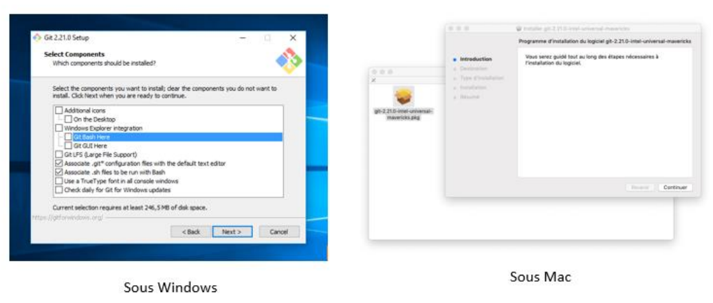

3. À la fin, cochez **Launch Git Bash** et cliquez sur **Finish**.

   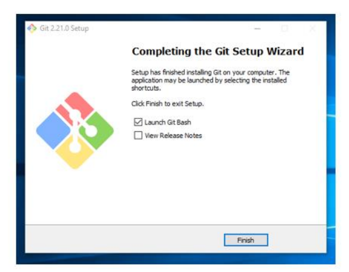

4. Une fenêtre **Git Bash** s'ouvre : c'est un terminal qui comprend les commandes Git (et les commandes `ls`, `cd`, `pwd` du chapitre 2).

   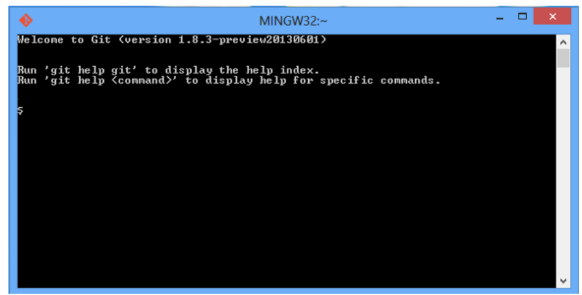

5. **Fermez et rouvrez VS Code**, puis, dans le terminal, choisissez **Git Bash** : flèche ˅ à côté du **+** du panneau terminal → **Git Bash**.
</details>

<details>
<summary>🍎 Sur macOS</summary>

1. Ouvrez l'application **Terminal** (ou le terminal de VS Code) et tapez `git --version`.
2. Si Git n'est pas installé, macOS propose automatiquement d'installer les **outils de développement en ligne de commande** (*Command Line Tools*). Cliquez sur **Installer** et patientez quelques minutes.
3. Autre option : [git-scm.com/download/mac](https://git-scm.com/download/mac).
</details>

<details>
<summary>🐧 Sur Linux</summary>

```bash
sudo apt install git        # Ubuntu, Debian
sudo dnf install git        # Fedora
```
</details>

Vérifiez que tout fonctionne :

```bash
git --version
```

---

## Séance 1 · Mes premiers commits

### 💬 Tour de table

Vous avez sûrement déjà eu sur votre ordinateur des fichiers comme `Mémoire_v3_final_corrigé_OK.docx`. 😅

1. Combien de versions d'un même document avez-vous déjà eues en même temps ?
2. Comment saviez-vous laquelle était la bonne ? Et ce qui avait changé entre deux versions ?
3. Comment faisiez-vous quand vous étiez **plusieurs** à modifier le même document ?

### 🎤 · Git, c'est quoi ?

**Git** est un **système de gestion de versions** (en anglais *VCS*, *Version Control System*). Il **enregistre l'historique de toutes les modifications** de vos fichiers, pour pouvoir :

- 🔙 **revenir** à n'importe quelle version précédente ;
- 🔍 **voir** ce qui a changé, quand, et par qui ;
- 🌿 **tester** des idées sans risquer de casser ce qui fonctionne ;
- 🤝 **travailler à plusieurs** sur les mêmes fichiers sans s'écraser (chapitre 4).

> 💡 **Analogie : les points de sauvegarde d'un jeu vidéo.** 🎮
> Avant d'affronter le boss, on **sauvegarde**. Si on perd, on recharge la sauvegarde au lieu de tout recommencer.
> Avec Git, chaque fois que votre travail est dans un état satisfaisant, vous créez un **point de sauvegarde** (un **commit**), et vous pouvez y revenir à tout moment.
> La différence avec un jeu : Git garde **toutes** les sauvegardes, chacune avec un message qui l'explique.

**Un peu d'histoire.** Git a été créé en **2005** par **Linus Torvalds**, le créateur de **Linux**. L'outil de gestion de versions utilisé par les milliers de développeurs de Linux est devenu payant du jour au lendemain : Linus a écrit le sien... en une dizaine de jours. Aujourd'hui, Git est utilisé par **la quasi-totalité des développeurs**. Il est **gratuit** et **open source**.

> 🤔 **Le saviez-vous ?** En argot britannique, *git* signifie « sale gosse » ou « crétin ». Linus Torvalds a plaisanté : *« Je suis un égocentrique, je nomme tous mes projets d'après moi-même. D'abord Linux, maintenant Git. »* 😄

<details>
<summary>🔬 Pour les curieux : centralisé ou distribué ?</summary>

Il existe deux générations d'outils de gestion de versions :

- **Centralisés** (SVN, CVS) : l'historique est stocké sur **un seul serveur**. Si le serveur tombe, plus personne ne peut travailler.
- **Distribués** (Git, Mercurial) : **chaque développeur a une copie complète** de l'historique sur son ordinateur. On peut travailler hors ligne, et si un serveur tombe, chaque copie peut le reconstituer.

Git est **distribué**. C'est aussi pour cela qu'il gère très bien les **branches** et les **fusions** (chapitre 4).
</details>

**Le vocabulaire de base.** Inutile de tout retenir maintenant : chaque mot sera pratiqué dans ce chapitre et le suivant. Ce tableau est aussi dans le [glossaire](GLOSSAIRE.md).

| Terme | En français | Définition simple | 🎮 Dans le jeu vidéo... |
|---|---|---|---|
| **Repository** (*repo*) | Dépôt | Le dossier du projet, suivi par Git. Il contient un sous-dossier caché `.git` où Git range tout l'historique. | La partie sauvegardée |
| **Commit** | Validation / version | Une **photo** des fichiers à un instant donné, avec un message qui la décrit. | Un point de sauvegarde |
| **Staging area** / **Index** | Zone d'index | La « salle d'attente » où l'on choisit ce qui ira dans le prochain commit. | Choisir ce qu'on met dans son sac avant de sauvegarder |
| **Log** | Historique | La liste de tous les commits. | La liste des sauvegardes |
| **Tag** | Étiquette | Un nom donné à un commit important, par exemple `v1.0`. | Une sauvegarde renommée « Avant le boss final » |
| **Branch** | Branche | Une ligne de travail parallèle pour tester une idée sans toucher à la version principale. *(Chapitre 4)* | Une partie alternative |
| **Merge** | Fusion | Réunir le travail de deux branches. *(Chapitre 4)* | Fusionner deux parties |
| **Remote** | Dépôt distant | Une copie du dépôt sur Internet, par exemple sur GitHub. *(Chapitre 4)* | La sauvegarde dans le cloud |
| **Clone** | Cloner | Télécharger une copie complète d'un dépôt distant. *(Chapitre 4)* | Récupérer sa partie sur une autre console |
| **Push** / **Pull** | Pousser / Tirer | Envoyer ses commits vers le dépôt distant / récupérer ceux des autres. *(Chapitre 4)* | Envoyer / télécharger depuis le cloud |
| **Fork** | Fourche | Copier le dépôt de quelqu'un d'autre dans son propre compte GitHub. *(Chapitre 4)* | Copier la partie d'un ami pour jouer avec |

### 🎤 · Les 3 zones de Git (le concept le plus important !)

Une modification passe par **3 zones** :

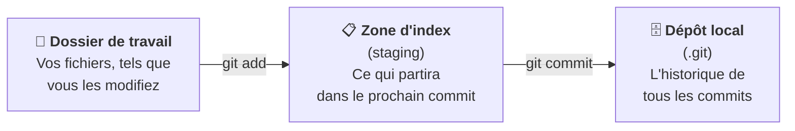

> 💡 **Analogie : la photo de classe.** 📸
> 1. **Le dossier de travail**, c'est la cour de récréation : tout le monde bouge dans tous les sens (on modifie ses fichiers librement).
> 2. **La zone d'index**, c'est l'estrade : le photographe y fait monter **seulement** les élèves qui doivent être sur la photo (`git add`).
> 3. **Le commit**, c'est le **clic** de l'appareil photo : la photo est prise et rangée dans l'album pour toujours (`git commit`).
>
> Ceux qui sont restés dans la cour (non ajoutés) ne sont pas sur la photo, mais ils pourront être sur la suivante.

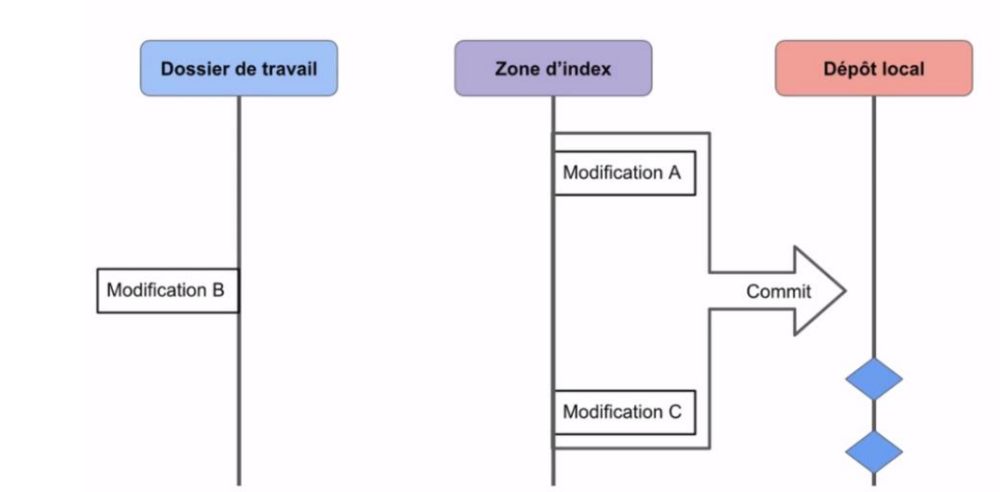

Sur ce schéma, les modifications **A** et **C** ont été mises dans la zone d'index : elles partent dans le commit. La modification **B** est restée dans le dossier de travail : elle attendra le prochain commit.

**Le cycle de vie d'un fichier.** Chaque fichier du projet est dans l'un de ces **4 états** :

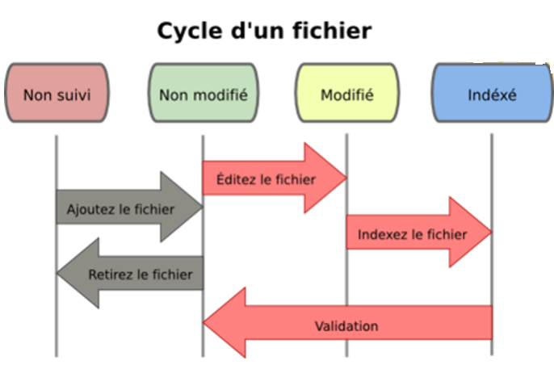

| État | Signification | 📸 Analogie |
|---|---|---|
| **Non suivi** (*untracked*) | Git ne connaît pas encore ce fichier. | Un nouvel élève que le photographe n'a jamais vu |
| **Non modifié** (*unmodified*) | Le fichier est identique à la dernière version enregistrée. | Un élève déjà photographié, qui n'a pas changé |
| **Modifié** (*modified*) | Le fichier a changé depuis le dernier commit, mais n'est pas encore dans l'index. | Un élève qui a changé de coiffure, mais est resté dans la cour |
| **Indexé** (*staged*) | Le fichier modifié est prêt à partir dans le prochain commit. | L'élève est sur l'estrade, prêt pour la photo |

### 🧠 Quiz en classe · Le vocabulaire

**Q1.** Qui a créé Git ?

- A. Bill Gates
- B. Linus Torvalds
- C. Patrick Debois
- D. Mark Zuckerberg

**Q2.** Qu'est-ce qu'un commit ?

- A. Un fichier supprimé
- B. Une photo de l'état des fichiers à un instant donné, accompagnée d'un message
- C. Un dossier sur GitHub
- D. Un bug dans le code

**Q3.** Remettez les 3 zones dans l'ordre du parcours d'une modification : `Dépôt local` · `Dossier de travail` · `Zone d'index`.

**Q4.** Dans l'analogie de la photo de classe, à quoi correspond la commande `git add` ?

### 👀 Démonstration · Configurer Git et créer le dépôt

**1. Vérifier l'installation**

```bash
git --version
```

**2. Se présenter à Git.** Chaque commit porte le **nom** et l'**e-mail** de son auteur. On se présente **une seule fois** par ordinateur (en gardant les guillemets) :

```bash
git config --global user.name "Prénom Nom"
git config --global user.email "prenom.nom@example.com"
```

> [!IMPORTANT]
> Utilisez **la même adresse e-mail** que celle de votre futur compte GitHub (chapitre 4). C'est grâce à elle que GitHub reconnaîtra vos commits.

Trois réglages qui simplifient la vie :

```bash
git config --global init.defaultBranch main     # la branche principale s'appellera "main" (comme sur GitHub)
git config --global core.editor "code --wait"   # Git ouvrira VS Code quand il aura besoin d'un texte
git config --global color.ui auto               # des couleurs pour lire plus facilement
```

> [!NOTE]
> Le réglage `core.editor` ne fonctionne que si la commande `code` marche dans votre terminal (chapitre 2, exercice 2.3). Si ce n'est pas le cas, sautez cette ligne : ce n'est pas bloquant.

Vérifier la configuration :

```bash
git config --list --global
```

**3. Créer le dépôt de la page web de l'équipe DataCafé**, dans le dossier `cours-devops` du chapitre 2 :

```bash
cd ~/cours-devops        # aller dans le dossier du cours
mkdir site-datacafe      # créer le dossier du projet
cd site-datacafe         # entrer dedans
git init                 # transformer ce dossier en dépôt Git
```

Observez que Git répond : `Initialized empty Git repository in .../site-datacafe/.git/`

Le dossier paraît vide, mais un **dossier caché `.git`** vient d'être créé : c'est là que Git range la configuration, l'historique et les branches. Pour le voir :

```bash
ls -a      # -a = "all" : affiche aussi les fichiers cachés
```

> [!WARNING]
> Ne touchez **jamais** à l'intérieur du dossier `.git` à la main, et ne le supprimez pas : tout l'historique serait perdu !

Ouvrir ce dossier dans VS Code :

```bash
code .
```

<details>
<summary>🆘 Au secours, je suis coincé dans un écran bizarre !</summary>

Sans le réglage `core.editor`, Git ouvre parfois l'éditeur **Vim**, dont il est célèbre de... ne pas savoir sortir. 😅
Pour en sortir sans rien casser : appuyez sur **Échap**, tapez `:q!` puis **Entrée**.

Et si `git log` affiche une liste qui ne se termine pas et que vous ne pouvez plus rien taper : appuyez simplement sur **q** (comme *quitter*).
</details>

### 🛠️ À vous de jouer · Exercice 3.1 : préparer votre dépôt (10 min)

🟢 **Pour tous**

1. Vérifiez que Git est installé avec `git --version` (sinon, suivez la [préparation](#-préparation--installer-git-avant-la-séance-1)).
2. Configurez votre nom et votre e-mail, puis les trois réglages `init.defaultBranch`, `core.editor` et `color.ui`.
3. Affichez votre configuration avec `git config --list --global` et relisez-la.
4. Créez le dossier `~/cours-devops/site-datacafe`, transformez-le en dépôt avec `git init` et ouvrez-le dans VS Code.

🟡 **Si vous avez terminé** : aidez votre voisin, puis affichez le dossier caché avec `ls -a`. Selon vous, que se passerait-il si on supprimait `.git` ?

✅ **Vous avez réussi si** `git config --list --global` affiche votre nom et votre e-mail, et si `ls -a` dans `site-datacafe` montre un dossier `.git`.

### 👀 Démonstration · Mon premier commit

**1. La commande la plus utile de Git**

```bash
git status
```

`git status` dit **où vous en êtes** : quels fichiers sont modifiés, lesquels sont prêts à être commités... **À lancer tout le temps, sans modération !** C'est votre GPS.

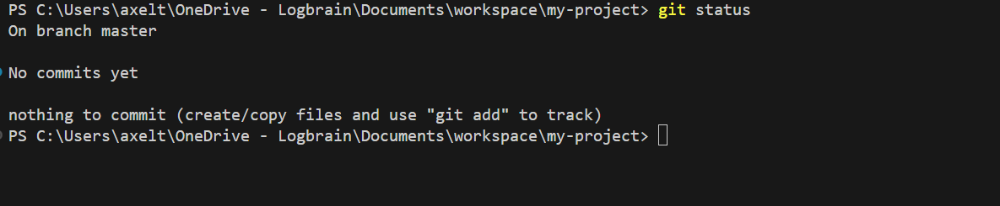

Observez que Git indique qu'il n'y a rien à commiter.

> Dans les captures d'écran, le nom du dossier peut être différent du vôtre (par exemple `my-project`) : ce n'est pas grave, seul le contenu compte.

**2. Ajouter les fichiers de la page web.** Téléchargez les deux fichiers et placez-les dans le dossier `site-datacafe` :

- [hello.html](https://github.com/atifrani/mgt_opl_env_dev/blob/main/webapp/hello.html) : le contenu de la page ;
- [style.css](https://github.com/atifrani/mgt_opl_env_dev/blob/main/webapp/style.css) : sa mise en forme (couleurs, tailles...).

> Sur la page GitHub de chaque fichier, cliquez sur l'icône **Download raw file** (la flèche vers le bas ⬇️ en haut à droite du fichier).

Ouvrez `hello.html` avec **un browser** (clic droit sur le fichier dans VS Code → **Open with integrated browser**) pour voir la page dans le navigateur. Puis :

```bash
git status
```

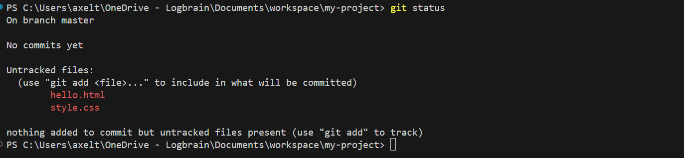

Observez que Git a repéré les deux fichiers, mais qu'ils sont **non suivis** (*untracked*, en rouge) : il ne les surveille pas encore.

**3. Indexer avec `git add`** : on fait monter les fichiers sur l'estrade.

```bash
git add hello.html
git add style.css
git status
```

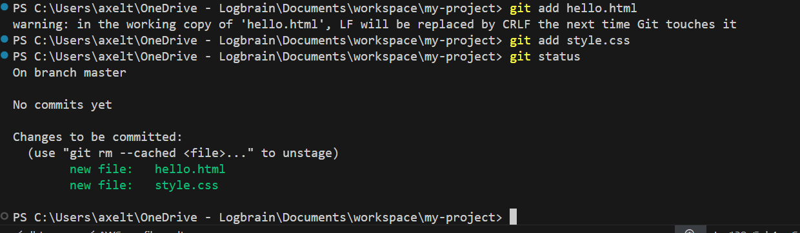

Observez que les fichiers sont maintenant **en vert** : ils sont **indexés** et partiront dans le prochain commit.

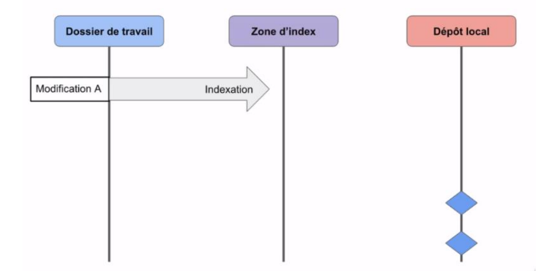

> [!TIP]
> Pour ajouter **tous** les fichiers modifiés d'un coup : `git add .` (le point veut dire « tout ce qui est ici »). Pratique, mais vérifiez toujours avec `git status` avant de commiter, pour ne pas embarquer un fichier par erreur.

**4. Commiter avec `git commit`** : clic, on prend la photo !

```bash
git commit -m "Ajout de la page d'accueil et de sa feuille de style"
git status
```

L'option `-m` (pour *message*) permet d'écrire le **message du commit**, qui explique ce qu'apporte cette version.

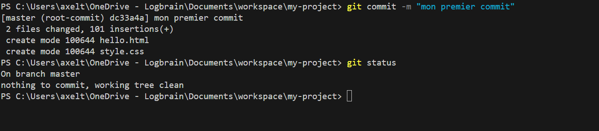

Observez que `git status` indique maintenant *nothing to commit, working tree clean* : tout est sauvegardé. 🎉

> [!TIP]
> **Un bon message de commit** explique **ce que** fait le commit, en une phrase courte, comme si l'on complétait : *« Ce commit va... »*
> ✅ `Ajout de la bannière en haut de la page`
> ✅ `Correction de la couleur du titre`
> ❌ `modif`, `test`, `azerty`, `ça marche enfin !!!`
> Dans 6 mois, vous remercierez votre « moi » du passé. 😉

### 🛠️ À vous de jouer · Exercice 3.2 : votre premier commit (7 min)

🟢 **Pour tous**

1. Dans `site-datacafe`, lancez `git status`.
2. Téléchargez `hello.html` et `style.css` dans ce dossier, puis ouvrez la page avec Live Server.
3. Relancez `git status` : les deux fichiers doivent être en rouge (*untracked*).
4. Indexez les deux fichiers, vérifiez qu'ils passent en vert, puis faites votre premier commit avec le message `Ajout de la page d'accueil et de sa feuille de style`.

🟡 **Si vous avez terminé** : à côté de chaque commande que vous venez de taper, dites quelle zone étape du cycle de vie est concernée.

✅ **Vous avez réussi si** `git status` affiche *nothing to commit, working tree clean*.

### 👀 Démonstration · Le cycle quotidien du développeur

Le cycle que tous les développeurs du monde répètent des dizaines de fois par jour :

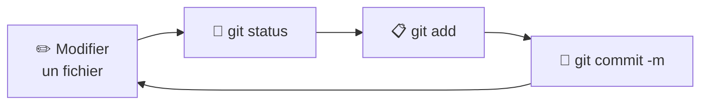

**1. Modifier le fichier.** Dans `hello.html`, juste aprés `</header>`ajoutez la section suivante :

```html
<!-- BANNIÈRE DE COMMANDE -->
<section id="order-banner" aria-labelledby="order-title">
	<h2 id="order-title">Quel café souhaitez-vous commander ?</h2>

	<form id="order-form">
		<label for="coffee-choice">Votre café :</label>
		<select id="coffee-choice" name="coffee" required>
			<option value="">— Choisissez —</option>
			<option>Espresso</option>
			<option>Café allongé</option>
			<option>Cappuccino</option>
			<option>Latte</option>
			<option>Mocha</option>
			<option>Décaféiné</option>
		</select>

		<button type="submit">Commander</button>
	</form>

	<p id="order-message" role="status"></p>
</section>
```

Cela permet d'ajouter une banniére de commande, une option pour choisir votre café. Sauvegardez et observez la page dans le navigateur : une bannière sombre apparaît. ✨

**2. Voir ce qui a changé** avec `git diff` :

```bash
git diff hello.html
```

Observez que les lignes en **rouge** précédées d'un `-` ont été supprimées, celles en **vert** précédées d'un `+` ont été ajoutées.

> [!TIP]
> Si l'affichage de `git diff` ne rend pas la main, appuyez sur **q**.

**3. Indexer la modification :**

```bash
git add hello.html
git status
```

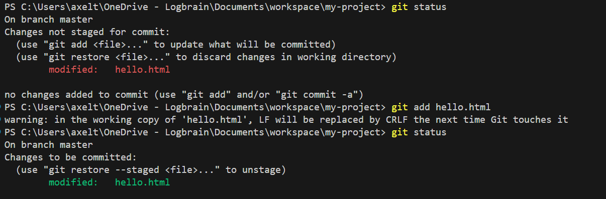

**4. Changement d'avis ?** Pour retirer un fichier de la zone d'index (sans perdre la modification) :

```bash
git restore --staged hello.html
git status
```

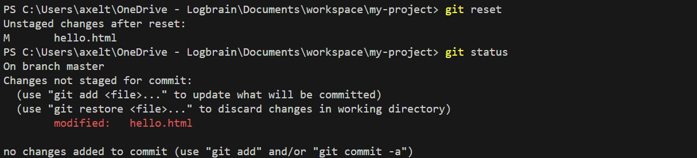

Observez que le fichier est redescendu de l'estrade : il est toujours **modifié**, mais plus **indexé**.

> Dans certains tutoriels (et dans la capture ci-dessus), vous verrez `git reset` à la place : les deux commandes font la même chose ici. `git restore --staged` est la version moderne, et c'est celle que Git suggère lui-même dans `git status`.

**5. Indexer à nouveau et commiter :**

```bash
git add hello.html
git commit -m "Ajout de la bannière commande"
git status
```

**Le bouton panique 🚨**

| J'ai fait... | Je veux... | La commande |
|---|---|---|
| Une modification ratée dans un fichier (pas encore indexée) | Revenir à la version du dernier commit | `git restore hello.html` ⚠️ *la modification est perdue définitivement* |
| Un `git add` de trop | Retirer le fichier de l'index | `git restore --staged hello.html` |
| Un commit avec une faute dans le message | Corriger le message du **dernier** commit | `git commit --amend -m "Nouveau message"` |

### 🛠️ À vous de jouer · Exercice 3.3 : 

🟢 **Pour tous**

1. Reproduisez la démonstration : ajoutez la bannière commande, regardez la différence avec `git diff`, puis indexez, désindexez avec `git restore --staged`, réindexez et commitez avec le message `Ajout de la bannière commande`.

2. Modifiez de nouveau le fichier hello.html et ajoutez un script juste avant `</body>`:

```html
<script>
	const form = document.getElementById("order-form");
	const message = document.getElementById("order-message");

	form.addEventListener("submit", (event) => {
		event.preventDefault();
		const coffee = document.getElementById("coffee-choice").value;
		message.textContent = `Merci ! Votre ${coffee.toLowerCase()} est en préparation ☕`;
	});
</script>
```

3. Testez le resultat et enregistrez cette nouvelle version **seul**, avec le cycle `status` → `add` → `commit` et un message clair.

🟡 **Si vous avez terminé** : faites une modification volontairement ratée dans `hello.html` (sans l'indexer), puis annulez-la avec la bonne ligne du bouton panique.

✅ **Vous avez réussi si** votre page affiche la bannière commande et le message de confirmation, et si `git status` affiche *working tree clean* (3 commits au total).

4. Modifiez le fichier `style.css` et ajoutez à la fin:
```
/* ==========================================================================
   Bannière de commande
   ========================================================================== */

#order-banner {
  margin-bottom: 40px;
  padding: 24px;
  border: 1px solid var(--color-border);
  background-color: var(--color-overlay);
  color: var(--color-text-light);
  font-family: var(--font-main);
  text-align: center;
}

#order-banner h2 {
  margin: 0 0 16px;
  font-size: 1.5rem;
}

#order-form {
  display: flex;
  flex-wrap: wrap;
  align-items: center;
  justify-content: center;
  gap: 12px;
}

#order-form select,
#order-form button {
  padding: 8px 16px;
  border: 1px solid var(--color-border);
  font-family: inherit;
  font-size: 1rem;
}

#order-form button {
  background-color: var(--color-button);
  color: var(--color-text-light);
  cursor: pointer;
  transition: background-color 0.3s ease, color 0.15s ease;
}

#order-form button:hover,
#order-form button:focus-visible {
  background-color: var(--color-text-light);
  color: var(--color-text-dark);
}

#order-message {
  min-height: 1.5em;
  margin: 16px 0 0;
}
```

5. Testez le resultat et enregistrez cette nouvelle version **seul**, avec le cycle `status` → `add` → `commit` et un message clair.

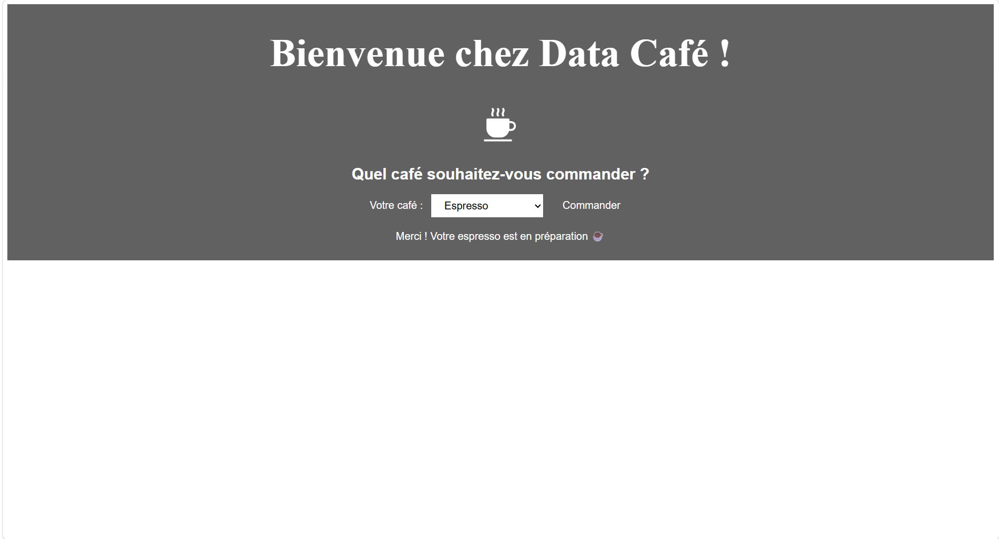
### 🧠 Quiz en classe · Le premier commit

**Q1.** Quelle commande permet de savoir où on en est (fichiers modifiés, indexés...) ?

- A. `git log`
- B. `git status`
- C. `git init`
- D. `git where`

**Q2.** Remettez ces commandes dans l'ordre pour enregistrer une modification : `git commit -m "..."` · `git add fichier` · `git status`

**Q3.** Un fichier apparaît en **rouge** dans `git status` sous *Untracked files*. Qu'est-ce que cela veut dire ?

- A. Il contient une erreur
- B. Git ne le suit pas encore
- C. Il a été supprimé
- D. Il est déjà commité

**Q4.** Lequel de ces messages de commit est le meilleur ?

- A. `modif`
- B. `aaaaa`
- C. `Ajout du formulaire de contact`
- D. `j'ai fait plein de trucs`

**Q5.** Que fait `git diff` ?

## 📌 À retenir de la séance 1

- Un **commit** est une photo de vos fichiers, avec un message.
- Une modification passe par 3 zones : **dossier de travail** → `git add` → **index** → `git commit` → **dépôt**.
- `git status` est votre GPS : lancez-le avant et après chaque commande.
- Le cycle quotidien : modifier → `git status` → `git add` → `git commit -m "..."`.

## 🏠 Avant la séance 2

Vérifiez que votre dépôt `~/cours-devops/site-datacafe` contient bien **3 commits** (bannière et présentation comprises). S'il en manque, terminez l'exercice 3.3.

---

## Séance 2 · Voyager dans le temps

### 💬 Tour de table

1. Quelle commande lancer en premier quand on ne sait plus où on en est ?
2. Expliquez à votre voisin la différence entre `git add` et `git commit`, avec l'analogie de la photo de classe.
3. Dans quel dossier se trouve votre dépôt, et comment y retourner depuis le terminal ?

### 🎤 · L'historique, HEAD et main

**Une chaîne de commits.** L'historique d'un dépôt est une **chaîne de commits**, chacun pointant vers le précédent (son « parent »). Chaque commit contient :

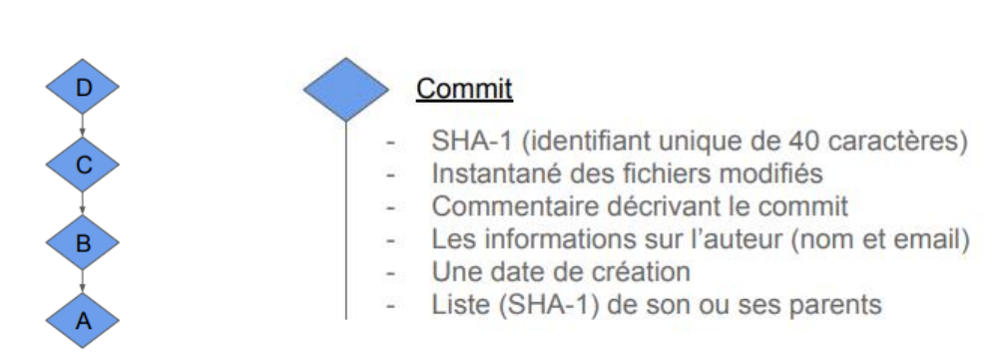

- un **identifiant unique** de 40 caractères, appelé **SHA-1** ou *hash* (par exemple `dc33a4a08d9417689216552dbff5a5836afc955a`), comme une plaque d'immatriculation ;
- la **photo** (l'instantané) des fichiers ;
- le **message** qui décrit le commit ;
- l'**auteur** (nom et e-mail) et la **date** ;
- l'identifiant de son ou ses **parents**.

**HEAD et main.** Git utilise deux « marque-pages » :

- **main** (ou **master** dans les anciens projets) pointe vers le **dernier commit** de la branche principale ;
- **HEAD** pointe vers le commit **sur lequel vous vous trouvez en ce moment**.

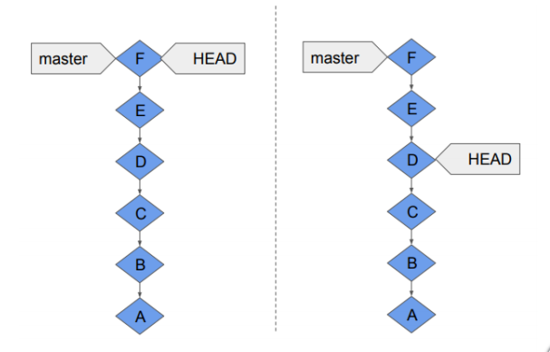

- **À gauche** : situation normale, HEAD et main sont au même endroit (le dernier commit, F).
- **À droite** : après un `git checkout D`, HEAD est revenu en arrière sur le commit D, mais main est toujours sur F. Les commits E et F ne sont pas perdus : `git switch main` ramène HEAD sur F.

> 💡 **Analogie : le livre et le marque-page.** 📖 L'historique est un livre. **main** est la dernière page écrite. **HEAD** est le marque-page qui indique la page que vous lisez. On peut relire une page ancienne sans arracher les suivantes.

> **main ou master ?** Historiquement, la branche principale s'appelait `master`. Depuis 2020, GitHub et la plupart des projets utilisent `main`. Grâce au réglage `init.defaultBranch main`, vos dépôts utilisent `main`. Si vous voyez `master` dans une capture ou un vieux projet, c'est la même chose.

### 👀 Démonstration · Explorer l'historique

**Afficher l'historique : `git log`**

```bash
git log
```

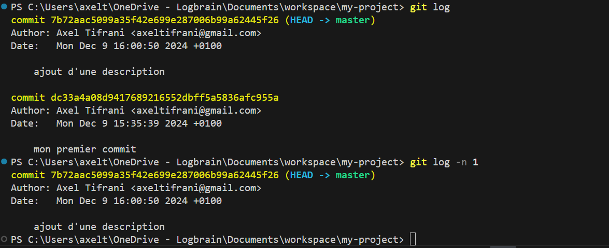

Observez que les commits sont affichés **du plus récent au plus ancien**. Appuyez sur **q** pour quitter si la liste est longue.

Quelques variantes bien pratiques :

```bash
git log -n 1              # seulement le dernier commit
git log --oneline         # une ligne par commit : plus lisible !
git log --oneline --graph --all   # avec un petit dessin de l'historique
```

Avec `--oneline`, on obtient quelque chose comme :

```text
c3f9a1e (HEAD -> main) Ajout d'une description
8b27d40 Ajout de la bannière en haut de la page
1a4e6f2 Ajout de la page d'accueil et de sa feuille de style
```

> Les 7 caractères au début de chaque ligne sont le **début du SHA-1**. Git accepte cette version courte partout où il faut un identifiant de commit. **Vos identifiants seront différents de ceux de cet exemple** : utilisez toujours les vôtres !

> [!TIP]
> Vous préférez les images ? Dans VS Code, ouvrez la palette de commandes (`Ctrl + Maj + P`) et tapez **Git Graph: View Git Graph** (extension installée au chapitre 2).

**Voir le contenu d'un commit : `git show`**

```bash
git show 8b27d40     # remplacez par un identifiant de VOTRE historique
```

Observez que Git affiche les informations du commit et les modifications qu'il a apportées.

### 👀 Démonstration · Voyager dans le temps

C'est le moment d'utiliser la machine à remonter le temps ! On choisit l'identifiant du **premier** commit dans `git log --oneline`, et on s'y déplace :

```bash
git checkout 1a4e6f2     # remplacez par l'identifiant de VOTRE premier commit
```

Observez `hello.html` dans VS Code et dans le navigateur : **la bannière et la description ont disparu !** On est revenu à l'état exact du premier commit. 🕰️

> [!NOTE]
> Git affiche un long message qui parle de ***detached HEAD*** (« HEAD détachée »). Pas de panique ! Cela veut juste dire : *« Vous êtes en train de visiter le passé. »* On peut regarder, mais mieux vaut ne rien modifier ici.

Pour **revenir au présent** :

```bash
git switch main
```

Observez que la bannière et la description sont de retour. Ouf ! 😮‍💨

### 🛠️ À vous de jouer · Exercice 3.4 : explorer et voyager (10 min)

🟢 **Pour tous**

1. Placez-vous dans `~/cours-devops/site-datacafe` et lancez `git status`.

2. Affichez votre historique avec `git log`, puis avec `git log --oneline`. Notez les identifiants de vos 3 commits.
3. Affichez le contenu de votre commit « bannière » avec `git show`.
4. Voyagez jusqu'à votre **premier** commit et observez la page dans le navigateur.
5. Revenez au présent avec `git switch main` et vérifiez que tout est revenu.

🟡 **Si vous avez terminé** : essayez `git log --oneline --graph --all` et ouvrez **Git Graph** dans VS Code. Retrouvez où sont HEAD et main.

✅ **Vous avez réussi si** vous avez vu la page sans bannière, puis que `git status` affiche de nouveau `On branch main`.

### 👀 Démonstration · Marquer les versions importantes avec des tags 🏷️

Retrouver un commit par son identifiant `8b27d40`, ce n'est pas très parlant. Git permet de poser une **étiquette** (*tag*) sur un commit important, typiquement pour marquer une **version publiée** (`v1.0`, `v2.0`...). C'est exactement ce qu'on fait à l'étape **📦 Release** de la boucle DevOps !

Une étiquette sur chacun des trois commits, à partir de leurs identifiants dans `git log --oneline` :

```bash
git tag -a v1.0 1a4e6f2 -m "Version 1 : page d'accueil"         # votre 1er commit
git tag -a v2.0 8b27d40 -m "Version 2 : ajout de la bannière"   # votre 2e commit
git tag -a v3.0 -m "Version 3 : ajout de la description"        # sans identifiant = le commit actuel
```

- `-a` crée une étiquette « annotée » (avec un auteur, une date et un message) ;
- `-m` donne le message de l'étiquette.

Lister les étiquettes :

```bash
git tag
git log --oneline      # les tags apparaissent maintenant à côté des commits
```

Et voyager dans le temps **avec les noms** au lieu des identifiants :

```bash
git checkout v1.0      # retour à la version 1
git checkout v2.0      # puis à la version 2
git switch main        # et retour au présent
```

Observez que c'est quand même plus simple ! 😎

### 🛠️ À vous de jouer · Exercice 3.5 : étiqueter vos versions (8 min)

🟢 **Pour tous**

1. Posez les étiquettes `v1.0`, `v2.0` et `v3.0` sur vos trois commits, avec **vos** identifiants.
2. Vérifiez avec `git tag` puis `git log --oneline`.
3. Voyagez vers `v1.0`, puis `v2.0`, puis revenez au présent.

🟡 **Si vous avez terminé** : affichez le détail d'une étiquette avec `git show v2.0`. Qu'apporte une étiquette « annotée » par rapport à un simple identifiant ?

✅ **Vous avez réussi si** `git log --oneline` montre `tag: v1.0`, `tag: v2.0` et `tag: v3.0` à côté des bons commits.

### 🧠 Quiz en classe · L'historique

**Q1.** Quelle commande affiche l'historique des commits sur une ligne chacun ?

- A. `git status --short`
- B. `git log --oneline`
- C. `git history`
- D. `git show`

**Q2.** Que représente **HEAD** ?

- A. Le premier commit du projet
- B. Le commit sur lequel on se trouve actuellement
- C. Le chef de projet
- D. Le dépôt GitHub

**Q3.** Vous avez fait `git checkout` sur un vieux commit. Comment revenir à la dernière version ?

**Q4.** À quoi sert un tag ?

- A. À supprimer un commit
- B. À donner un nom lisible à un commit important, comme une version publiée
- C. À créer un nouveau fichier
- D. À envoyer le code sur Internet

**Q5.** Vrai ou faux : quand on revient sur un ancien commit avec `git checkout`, les commits plus récents sont effacés.

### 🛠️ À vous de jouer · Mission finale : la version 4 (15 min)

🟢 **Pour tous : vos passions (15 min)**

1. Vérifiez que vous êtes bien sur la dernière version (`git status` doit indiquer `On branch main`). Sinon : `git switch main`.
2. Dans `hello.html`, complétez votre section description comme ceci (avec **vos** passions) :

   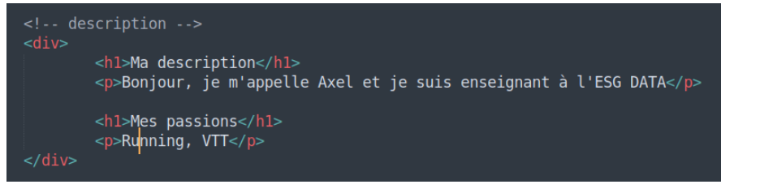

3. Vérifiez le résultat dans votre navigateur.
4. Enregistrez cette modification dans un nouveau commit, avec un message clair.
5. Posez l'étiquette `v4.0` sur ce commit.
6. Affichez l'historique sur une ligne et vérifiez que vos 4 étiquettes apparaissent.

✅ **Vous avez réussi si** `git log --oneline` affiche 4 commits, avec `(HEAD -> main, tag: v4.0)` sur le plus récent.

🟡 **Si vous avez terminé : le voyage dans le temps (10 min)**

1. Retournez à la version `v2.0` et ouvrez la page dans votre navigateur. Que voyez-vous ?
2. Revenez au présent.
3. Avec `git diff v1.0 v4.0`, affichez toutes les différences entre la première et la dernière version.

🔴 **Défi : l'enquêteur (10 min)**

Sans regarder le support, et uniquement avec des commandes Git, répondez à ces questions sur votre dépôt :

1. Combien de commits contient votre historique ? (indice : `git log --oneline` et comptez, ou `git rev-list --count main`)
2. À quelle date et à quelle heure avez-vous fait votre commit « bannière » ?
3. Quelle ligne exacte a été ajoutée dans le commit `v3.0` ? (indice : `git show v3.0`)
4. 🏆 Trouvez à quoi sert la commande `git blame hello.html` et essayez-la.

✅ **Vous avez réussi si** vous répondez aux 4 questions en montrant la commande utilisée pour chacune.

---

## 📌 À retenir

- **Git** enregistre l'historique de vos fichiers sous forme de **commits** (des photos avec un message).
- Une modification passe par 3 zones : **dossier de travail** → `git add` → **index** → `git commit` → **dépôt**.
- Les commandes du quotidien : `git status` (où j'en suis), `git add` (je prépare), `git commit -m` (je sauvegarde), `git diff` (qu'est-ce qui a changé), `git log --oneline` (l'historique).
- Pour voyager dans le temps : `git checkout <commit ou tag>`, et `git switch main` pour revenir au présent.
- **HEAD** = là où vous êtes ; **main** = la dernière version de la branche principale.
- Les **tags** (`git tag -a v1.0 -m "..."`) donnent un nom aux versions importantes.

> 📋 Toutes ces commandes sont rassemblées dans l'[antisèche Git](MEMO-GIT.md). Gardez-la sous la main !

## 🏅 Titre décroché : **Maître du temps** ⏳

## 🏠 Avant la prochaine séance

- Gardez votre dépôt `~/cours-devops/site-datacafe` avec ses **4 versions taguées** : il servira dès le début du chapitre 4.
- Créez votre compte GitHub en suivant la préparation du [chapitre 4](4.GITHUB.md), avec **la même adresse e-mail** que dans votre configuration Git.

---

> **🎬 Prochain épisode :** Léa est ravie : *« Votre historique est impeccable. Mais il n'existe que sur votre ordinateur : si le disque dur lâche, tout est perdu, et l'équipe ne peut pas travailler avec vous. »* Direction le cloud et le travail en équipe avec **GitHub**.
>
> ➡️ [Chapitre 4 · Introduction à GitHub](4.GITHUB.md)
