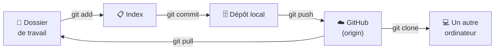
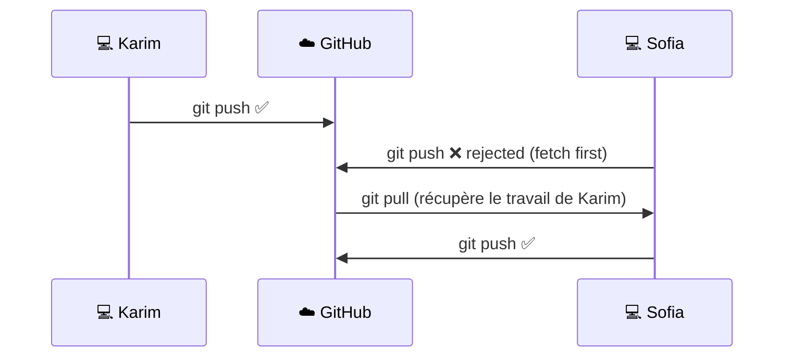
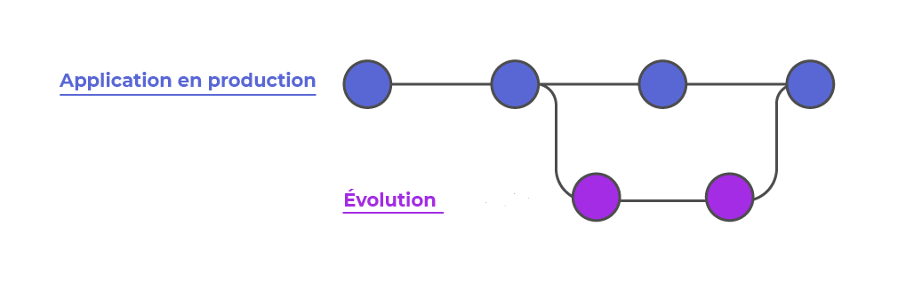
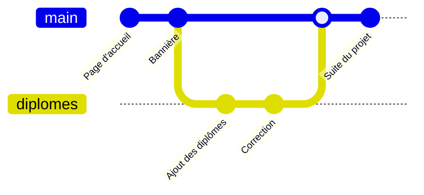
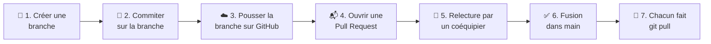

# Chapitre 4 · Introduction à GitHub 🐙🤝

> **🎬 DataCafé, épisode 4 : Le travail d'équipe.** Mercredi. Léa réunit l'équipe : vous, Karim, Sofia et Tom. *« À partir d'aujourd'hui, on travaille tous sur le même projet. Fini les fichiers envoyés par e-mail ou par clé USB : on passe sur **GitHub**. Chacun travaille sur sa branche, on se relit les uns les autres, et rien n'arrive en production sans avoir été vérifié. »*

| | |
|---|---|
| ⏱️ **Durée** | 3h (2 séances de 1h30) |
| 🎯 **Prérequis** | Chapitre 3 : votre dépôt `site-datacafe` avec ses 4 versions taguées (`v1.0` à `v4.0`), Git configuré avec votre nom et votre e-mail. |
| 💻 **À préparer avant la séance** | **Créer votre compte GitHub** (voir ci-dessous) et noter votre pseudo. Apporter votre ordinateur avec votre dépôt `site-datacafe`. |
| 🏅 **Titre à décrocher** | **Joueur d'équipe** 🤝 |

## 🎯 Objectifs de la séance

À la fin de ce chapitre, vous saurez :

- expliquer la différence entre **Git** et **GitHub** ;
- envoyer un dépôt sur GitHub et le synchroniser (`push`, `pull`, `clone`) ;
- travailler à plusieurs sur un même dépôt et résoudre un **conflit** ;
- utiliser les **branches** et les **Pull Requests** pour proposer des modifications ;
- organiser le travail avec des **issues** et un tableau **Kanban** ;
- faire tout cela aussi avec des **interfaces graphiques**.

> [!NOTE]
> **Où en est-on dans la boucle DevOps ?** On termine l'étape **⌨️ Code** en mode collaboratif, et on touche du doigt **📋 Plan** (tickets et tableau Kanban) et **📦 Release** (versions publiées). C'est aussi le pilier **S de CALMS** : le **partage** !

## 💻 Avant la séance : créer votre compte GitHub

1. Allez sur [github.com](https://github.com/) et cliquez sur **Sign up** (*S'inscrire*).
2. Utilisez **la même adresse e-mail** que celle configurée dans Git au chapitre 3. Pour la retrouver, tapez dans un terminal : `git config --global user.email`.
3. Choisissez un **nom d'utilisateur** professionnel : il apparaîtra sur votre CV et votre profil LinkedIn (par exemple `prenom-nom` plutôt que `darkgamer93` 😉).
4. Validez votre adresse e-mail (cliquez sur le lien reçu), puis connectez-vous une fois pour vérifier que tout fonctionne.
5. Si GitHub vous propose d'activer la **double authentification** (2FA), installez une application d'authentification sur votre téléphone (Google Authenticator, Microsoft Authenticator...) et suivez les étapes.

> [!TIP]
> Votre compte GitHub est votre **vitrine professionnelle**. Les recruteurs le regardent ! Soignez-le dès maintenant.

---

## Séance 1 · Le dépôt distant et le travail en équipe

### 💬 Tour de table

1. Quand vous travaillez à plusieurs sur un même document (exposé, mémoire), comment faites-vous pour ne pas écraser le travail des autres ?
2. Que se passe-t-il, selon vous, si deux personnes modifient **la même phrase** en même temps ?
3. Votre dépôt `site-datacafe` n'existe que sur votre ordinateur. Que se passe-t-il si ce dernier tombe en panne ?

## 4.1 Utilisation d'un dépôt distant ☁️

### 🎤 · Git ou GitHub ?

On les confond souvent, mais ce sont deux choses différentes :

| | **Git** | **GitHub** |
|---|---|---|
| **C'est...** | un **logiciel** installé sur votre ordinateur | un **site web** (un service en ligne) |
| **Il sert à...** | gérer les versions de vos fichiers | **héberger** vos dépôts Git sur Internet et **collaborer** |
| **Fonctionne sans Internet ?** | ✅ Oui | ❌ Non |
| **Créé par...** | Linus Torvalds (2005) | une start-up (2008), rachetée par Microsoft en 2018 |

> 💡 **Analogie : l'appareil photo et l'album en ligne.** 📸☁️
> **Git**, c'est votre **appareil photo** : il prend les photos (les commits) et les range dans votre album, sur votre ordinateur.
> **GitHub**, c'est un **album photo partagé en ligne** : vous y envoyez vos photos pour les mettre à l'abri, les montrer et laisser vos amis y ajouter les leurs.


- GitHub est la plus grande plateforme de code au monde (plus de 100 millions de développeurs).
- Des services similaires existent : **GitLab**, **Bitbucket**, **Azure DevOps**. Ils fonctionnent tous avec Git : ce que vous apprenez ici sert partout.
- Un dépôt sur GitHub s'appelle un **dépôt distant** (*remote*). Son surnom habituel est **`origin`**.

**Le cycle complet, en local et en ligne :**



| Commande | Ce qu'elle fait |
|---|---|
| `git remote add origin <url>` | Relie le dépôt local à un dépôt GitHub |
| `git push` | **Envoie** vos commits sur GitHub |
| `git pull` | **Récupère** les commits des autres depuis GitHub |
| `git clone <url>` | **Télécharge** un dépôt GitHub complet sur votre ordinateur |

### 👀 Démonstration · Mettre un dépôt en ligne

Le professeur envoie son propre dépôt sur GitHub. Observez les 4 étapes, vous les referez juste après.

**1. Créer un dépôt vide sur GitHub :** bouton **+** en haut à droite → **New repository**.

- **Repository name** : `site-datacafe` ; **Description** (facultative) : « Page web de l'équipe DataCafé ».
- **Visibilité** : **Public** (tout le monde peut voir le dépôt, seules les personnes autorisées peuvent le modifier) ou **Private** (seuls vous et vos invités le voient). On choisit **Public**.
- ⚠️ **Ne rien cocher d'autre** : ni *Add a README file*, ni *.gitignore*, ni *license*. Le dépôt existe déjà sur l'ordinateur, on veut un dépôt GitHub **vide**.
- **Create repository**. GitHub affiche l'adresse du dépôt : `https://github.com/ton-pseudo/site-datacafe.git`

**2. Relier le dépôt local à GitHub** (dans le terminal de VS Code) :

```bash
cd ~/cours-devops/site-datacafe
git status          # vérifie que tout est commité ("working tree clean")
git remote add origin https://github.com/ton-pseudo/site-datacafe.git
git remote -v       # vérifie que l'adresse est bien enregistrée
```

- `remote add` ajoute un **dépôt distant** ;
- `origin` est le **surnom** qu'on lui donne (c'est la convention).

**3. Envoyer le travail :**

```bash
git push -u origin main
```

Traduction : *« Pousse (`push`) ma branche `main` vers `origin`. »* L'option `-u` mémorise ce lien : ensuite, un simple `git push` suffit.

**4. Envoyer les tags**, qui ne partent pas automatiquement :

```bash
git push --tags      # les tags ne sont pas envoyés automatiquement : on les pousse à part
```

Observez que :

- la première fois, GitHub demande de **s'identifier** (fenêtre « Se connecter avec GitHub » dans VS Code, ou fenêtre de connexion par le navigateur sous Windows) ;
- après un rafraîchissement, les fichiers `hello.html` et `style.css` sont en ligne, l'onglet **commits** montre tout l'historique, et l'onglet **Tags** montre `v1.0` à `v4.0`.

> [!WARNING]
> Si le terminal demande un **mot de passe**, GitHub n'accepte plus votre mot de passe habituel ! Il faut un **jeton d'accès** (voir l'encadré 🆘 ci-dessous).

### 🛠️ À vous de jouer · Mettre votre site en ligne

⏱️ 20 minutes

1. 🟢 Créez sur GitHub un dépôt **public** et **vide** nommé `site-datacafe`.
2. 🟢 Reliez votre dépôt local avec `git remote add origin ...` (avec **votre** adresse), vérifiez avec `git remote -v`.
3. 🟢 Envoyez votre travail avec `git push -u origin main`, puis vos tags avec `git push --tags`.
4. 🟢 Créez un fichier `README.md` dans `site-datacafe`, la vitrine de votre dépôt (GitHub l'affiche sur la page d'accueil du dépôt) :

   ```markdown
   # ☕ Site de l'équipe DataCafé

   Page web de présentation de l'équipe, réalisée pendant le cours
   *Environnement de développement : Agilité, Git & DevOps*.

   ## Comment voir la page ?
   Ouvrir `hello.html` dans un navigateur.

   ## Auteur
   [Votre prénom](https://github.com/votre-pseudo)
   ```

5. 🟢 Enregistrez-le dans Git **et** envoyez-le sur GitHub :

   ```bash
   git add README.md
   git commit -m "Ajout du README"
   git push
   ```

6. 🟡 Si vous avez terminé : aidez votre voisin, puis passez à l'exercice suivant (profil GitHub).

✅ **Vous avez réussi si** la page GitHub de votre dépôt affiche vos fichiers, votre README sous la liste des fichiers, et vos 4 tags dans l'onglet **Tags**.

<details>
<summary>🆘 Ça ne marche pas ? Le terminal me demande un nom d'utilisateur et un mot de passe</summary>

Depuis 2021, GitHub n'accepte plus le mot de passe du compte dans le terminal. Il faut créer un **jeton d'accès personnel** (*Personal Access Token*), qui joue le rôle de mot de passe :

1. Sur GitHub : votre photo en haut à droite → **Settings** → tout en bas à gauche **Developer settings** → **Personal access tokens** → **Tokens (classic)** → **Generate new token (classic)**.
2. **Note** : « cours-devops ». **Expiration** : 90 jours. Cochez la case **repo**.
3. Cliquez sur **Generate token** et **copiez** le jeton (il commence par `ghp_`). ⚠️ Il ne sera plus jamais affiché !
4. Dans le terminal : *Username* = votre pseudo GitHub, *Password* = **collez le jeton** (rien ne s'affiche quand vous collez, c'est normal), puis Entrée.

🔐 Un jeton est un **secret**, comme un mot de passe : ne le partagez jamais et ne l'écrivez jamais dans un fichier de votre projet.
</details>

<details>
<summary>🆘 Ça ne marche pas ? Autres messages fréquents</summary>

| Message | Cause | Solution |
|---|---|---|
| `error: remote origin already exists.` | Vous avez déjà fait `git remote add` | Corrigez l'adresse : `git remote set-url origin https://github.com/ton-pseudo/site-datacafe.git` |
| `fatal: not a git repository` | Vous n'êtes pas dans le bon dossier | `cd ~/cours-devops/site-datacafe` |
| `rejected ... (fetch first)` au premier push | Le dépôt GitHub n'est pas vide (README coché à la création) | Appelez le professeur |
| `Repository not found` | Faute de frappe dans l'adresse, ou dépôt créé sur un autre compte | Vérifiez avec `git remote -v` et comparez avec l'adresse affichée par GitHub |
</details>

### 🛠️ À vous de jouer · Votre profil GitHub

⏱️ 10 minutes (à terminer chez vous si besoin)

Votre fiche `presentation.md` du chapitre 2 va devenir la **page d'accueil de votre profil GitHub**. L'astuce : un dépôt qui porte **exactement le même nom que votre pseudo** affiche son `README.md` en haut de votre profil.

1. 🟢 Sur GitHub, créez un nouveau dépôt **public** nommé **exactement** comme votre pseudo (par exemple `prenom-nom`). Cette fois, **cochez** *Add a README file*.
2. 🟢 GitHub affiche : *« ✨ You found a secret! ✨ »*. 🤫
3. 🟢 Sur la page du dépôt, cliquez sur le crayon ✏️ du fichier `README.md` pour le modifier **directement sur GitHub**, collez le contenu de votre fiche `presentation.md`, puis cliquez sur **Commit changes**.
4. 🟢 Allez sur `https://github.com/ton-pseudo` : admirez votre profil ! 🌟
5. 🔴 Défi : ajoutez à votre profil un badge ou des statistiques (cherchez « GitHub profile README generator »).

✅ **Vous avez réussi si** votre présentation s'affiche en haut de la page `https://github.com/votre-pseudo`.

### 🧠 Quiz en classe · Le dépôt distant

**Q1.** Quelle est la différence entre Git et GitHub ?

- A. Aucune, c'est la même chose
- B. Git est un logiciel de gestion de versions ; GitHub est un service en ligne qui héberge des dépôts Git
- C. GitHub est la version payante de Git
- D. Git sert pour Windows, GitHub pour Mac

**Q2.** Que signifie `origin` dans `git push origin main` ?

- A. La première version du projet
- B. Le surnom du dépôt distant
- C. Le nom de la branche
- D. Le créateur du dépôt

**Q3.** Quel fichier s'affiche automatiquement sur la page d'accueil d'un dépôt GitHub ?

**Q4.** Vrai ou faux : `git push` envoie aussi les tags automatiquement.

**Q5.** Pourquoi faut-il créer le dépôt GitHub **vide** (sans README) quand on veut y envoyer un dépôt qui existe déjà sur l'ordinateur ?

---

## 4.2 Travailler en équipe 👥

### 🎤 · Le dépôt partagé et la règle d'or

- Toute l'équipe partage **un seul dépôt GitHub**. Chacun en a une **copie complète** sur son ordinateur, obtenue avec `git clone`.
- Le propriétaire du dépôt donne le droit d'écrire à ses coéquipiers en les invitant comme **collaborateurs**.
- On **envoie** son travail avec `git push`, on **récupère** celui des autres avec `git pull`.
- Si quelqu'un a poussé avant vous, GitHub **refuse** votre push : il faut d'abord récupérer son travail.



> 📌 **La règle d'or du travail en équipe :**
> **Toujours `git pull` avant de commencer à travailler, et avant de `git push`.**

### 👥 En équipe · Le dépôt commun `equipe-datacafe`

⏱️ 15 minutes · Équipes de 4 (les mêmes que pour le projet d'évaluation). Désignez un **chef d'équipe** 👑.

**Étape 1 · Le chef d'équipe crée le dépôt commun 👑**

1. Il crée sur GitHub un nouveau dépôt **public** nommé `equipe-datacafe`, en **cochant** cette fois *Add a README file* (on part d'un dépôt neuf, il n'y a pas d'historique local à envoyer).
2. Il invite ses coéquipiers : sur la page du dépôt, **Settings** → **Collaborators** → **Add people** → saisir le pseudo GitHub de chacun.
3. Chaque coéquipier **accepte l'invitation** reçue par e-mail (ou sur [github.com/notifications](https://github.com/notifications)).

**Étape 2 · Chacun récupère le dépôt avec `git clone`**

**Tout le monde** (chef compris) clique sur le bouton vert **<> Code** de la page du dépôt, copie l'adresse HTTPS, puis :

```bash
cd ~/cours-devops
git clone https://github.com/pseudo-du-chef/equipe-datacafe.git
cd equipe-datacafe
code .
```

`git clone` télécharge **tout** (fichiers et historique) et configure automatiquement `origin` : pas besoin de `git init` ni de `git remote add`.

Réglez aussi la façon dont Git récupère le travail des autres (une seule fois par ordinateur, l'explication vient à l'étape 4) :

```bash
git config --global pull.rebase false
```

**Étape 3 · Chacun ajoute sa carte de membre**

1. Dans VS Code, créez le dossier `membres`, puis dedans un fichier `ton-prenom.md` :

   ```markdown
   # Prénom

   - 🎓 Rôle dans l'équipe : ...
   - ☕ Café préféré : ...
   - 🦸 Super-pouvoir : ...
   ```

2. Enregistrez et envoyez :

   ```bash
   git add membres/ton-prenom.md
   git commit -m "Ajout de la carte de membre de Prénom"
   git push
   ```

Le premier à faire `git push` réussit. Les suivants obtiennent probablement :

```text
! [rejected]        main -> main (fetch first)
error: failed to push some refs to 'https://github.com/...'
hint: Updates were rejected because the remote contains work that you do not have locally.
```

C'est **normal** ! 😊 Git vous dit : *« Quelqu'un a envoyé du travail sur GitHub depuis votre dernière synchronisation. Récupérez-le d'abord. »*

**Étape 4 · Récupérer le travail des autres avec `git pull`**

```bash
git pull           # récupère le travail des autres et le fusionne avec le vôtre
git push           # maintenant, votre push passe !
```

> [!NOTE]
> `git pull` peut ouvrir VS Code avec un message du type `Merge branch 'main' of https://github.com/...`. C'est le message d'un **commit de fusion** proposé par Git : fermez simplement l'onglet pour l'accepter. (C'est pour ce cas que nous avons réglé `pull.rebase false` : sans ce réglage, les versions récentes de Git refusent de choisir à votre place comment réunir les deux historiques.)

✅ **Vous avez réussi si**, après un dernier `git pull`, chaque membre a **les 4 cartes de membres** dans son dossier `membres`.

### 👥 En équipe · Le conflit volontaire 💥

⏱️ 15 minutes · Au **signal du professeur**, toutes les équipes en même temps.

Jusqu'ici, chacun modifiait **son propre fichier** : Git fusionnait tout seul. Que se passe-t-il si **deux personnes modifient la même ligne du même fichier** ?

1. Tout le monde fait `git pull`.
2. Chacun ouvre le `README.md` et remplace **la première ligne** (le titre) par le nom d'équipe qu'**il** propose, par exemple `# Les Barista du Code ☕`.
3. Chacun fait `git add README.md` puis `git commit -m "Proposition de nom d'équipe"`.
4. **Au signal du professeur**, tout le monde fait `git push`.

Le premier passe. Les autres font `git pull` et voient :

```text
CONFLICT (content): Merge conflict in README.md
Automatic merge failed; fix conflicts and then commit the result.
```

Git ne sait pas choisir entre deux propositions pour la même ligne : **c'est à un humain de décider**. Dans `README.md`, VS Code affiche :

```text
<<<<<<< HEAD
# Les Barista du Code ☕
=======
# Team Espresso 🚀
>>>>>>> 5e1d2a9...
```

| Marqueur | Signification |
|---|---|
| `<<<<<<< HEAD` | Début de **votre** version |
| `=======` | Séparation |
| `>>>>>>> 5e1d2a9...` | Fin de la version **venue de GitHub** (celle d'un coéquipier) |

**Pour résoudre le conflit :**

1. Discutez en équipe pour choisir le nom (ou combinez-les !).
2. Dans VS Code, cliquez sur l'un des boutons au-dessus du conflit : **Accepter la modification actuelle** (la vôtre), **Accepter la modification entrante** (celle de GitHub) ou **Accepter les deux**. Vous pouvez aussi réécrire la ligne à la main.
3. Vérifiez qu'**il ne reste aucun marqueur** `<<<<<<<`, `=======`, `>>>>>>>` dans le fichier.
4. Enregistrez, puis terminez la fusion :

   ```bash
   git add README.md
   git commit -m "Résolution du conflit sur le nom d'équipe"
   git push
   ```

✅ **Vous avez réussi si** le README de l'équipe sur GitHub affiche **un seul** nom d'équipe, sans aucun marqueur, et si `git pull` sur chaque ordinateur répond `Already up to date.`

> 💡 **Le conflit n'est pas une erreur, c'est une question.** Git vous demande : *« Deux personnes ont écrit des choses différentes au même endroit, laquelle garder ? »* Un conflit se règle en **discutant**... c'est le pilier **Culture** de CALMS ! 😉

### 🧠 Quiz en classe · Le travail en équipe

**Q1.** Quelle commande télécharge un dépôt GitHub complet sur votre ordinateur ?

- A. `git pull`
- B. `git download`
- C. `git clone`
- D. `git init`

**Q2.** Votre `git push` est refusé avec le message *rejected (fetch first)*. Que faites-vous ?

- A. Je supprime le dépôt et je recommence
- B. Je fais `git pull`, puis `git push`
- C. J'envoie mes fichiers par e-mail
- D. J'attends que l'erreur disparaisse

**Q3.** Quand un conflit se produit-il ?

**Q4.** Comment le chef d'équipe donne-t-il le droit de modifier le dépôt à ses coéquipiers ?

## 📌 À retenir (séance 1)

- **Git** est le logiciel, **GitHub** est le service en ligne qui héberge les dépôts et permet de collaborer.
- Relier un dépôt local à GitHub : `git remote add origin <url>`, puis `git push -u origin main` (et `git push --tags`).
- Récupérer un dépôt : `git clone <url>`. Se synchroniser : `git pull` (récupérer) et `git push` (envoyer).
- **La règle d'or :** toujours `git pull` avant de travailler et avant de pousser.
- Un **conflit** survient quand deux personnes modifient la même ligne : on discute, on garde la bonne version, puis `git add` et `git commit`.

## 🏠 Avant la séance 2

- Terminez votre profil GitHub si ce n'est pas fait.
- Vérifiez que vous avez bien accepté l'invitation au dépôt `equipe-datacafe` et que vous l'avez cloné.
- Si votre `git push` n'a pas fonctionné en classe, créez votre jeton d'accès (encadré 🆘 de la séance 1) et réessayez chez vous.

---

## Séance 2 · Branches, Pull Requests et organisation de l'équipe

### 💬 Tour de table

1. Quelle commande taper **avant** de commencer à travailler sur le dépôt d'équipe ?
2. Qui a eu un conflit la dernière fois ? Comment l'avez-vous résolu ?
3. Un rédacteur de journal publie-t-il son article sans relecture ? Pourquoi ?

## 4.3 Le système de branches 🌿

### 🎤 · Pourquoi des branches ?

- Travailler à 4 directement sur `main`, c'est comme 4 cuisiniers qui modifient **en même temps** la recette servie aux clients : si l'un se trompe, toute la carte est gâchée.
- La branche principale **`main`** doit toujours contenir une version **qui fonctionne** (c'est souvent elle qui est en production).
- Pour développer une nouveauté, on crée une **branche** : une ligne de travail parallèle où l'on teste sans risque. Quand la nouveauté est prête et vérifiée, on la **fusionne** (*merge*) dans `main`.



> 💡 **Analogie : le brouillon.** 📝 La branche `main`, c'est votre copie au propre. Une branche, c'est un **brouillon** sur lequel vous essayez une idée. Si l'idée est bonne, vous la recopiez au propre (fusion). Sinon, vous jetez le brouillon, et votre copie au propre n'a jamais été abîmée.

> 💡 **Exemple concret :** vous avez réalisé un site pour M. Robert, il est en ligne et fonctionne parfaitement. M. Robert a une idée de nouvelle fonctionnalité. Pas de panique : vous créez une branche pour cette fonctionnalité, **sans toucher au site en production**. Une fois tout testé, vous la fusionnez dans `main`.



| Commande | Ce qu'elle fait |
|---|---|
| `git branch` | Liste les branches (l'étoile `*` indique celle où vous êtes) |
| `git switch -c <nom>` | Crée une branche **et** s'y place (`-c` = *create*) |
| `git switch <nom>` | Change de branche |
| `git merge <nom>` | Fusionne la branche `<nom>` **dans la branche où vous êtes** |
| `git branch -d <nom>` | Supprime une branche déjà fusionnée |

> Dans d'anciens tutoriels, vous verrez `git branch diplomes` puis `git checkout diplomes` (ou `git checkout -b diplomes`) : c'est équivalent.

> [!TIP]
> **Le réflexe pro :** une branche = **une** fonctionnalité ou **une** correction, avec un nom clair : `ajout-formulaire-contact`, `correction-couleur-titre`... Pas d'espaces ni d'accents dans les noms de branches.

### 👀 Démonstration · Une branche, de la création à la fusion

Le professeur ajoute une section « diplômes » à sa page, dans une branche. Les commandes ci-dessous sont celles de l'exercice suivant.

```bash
cd ~/cours-devops/site-datacafe
git pull                    # par habitude : toujours partir d'une version à jour
git branch                  # * main
git switch -c diplomes      # -c = "create" : crée la branche ET s'y place
git branch                  # l'étoile est maintenant sur diplomes
```

Ajout de la section à la fin de la description, dans `hello.html` :

```html
<h1>Mes diplômes</h1>
<p>Master ..., École ...</p>
```

```bash
git add hello.html
git commit -m "Ajout de la section diplômes"
git switch main             # la section diplômes a disparu de hello.html !
git switch diplomes         # ... et elle revient
```

Fusion, rangement et publication :

```bash
git switch main           # on se place sur la branche qui REÇOIT les modifications
git merge diplomes        # on fusionne diplomes dans main
git log --oneline --graph --all
git branch -d diplomes
git tag -a v5.0 -m "Version 5 : ajout des diplômes"
git push
git push --tags
```

Observez que :

- sur `main`, la section diplômes **disparaît** du fichier : elle n'existe que sur la branche, la version principale est intacte ;
- le nom de la branche courante s'affiche aussi **en bas à gauche** de VS Code ;
- pour fusionner, on se place sur la branche qui **reçoit** (`main`), pas sur celle qu'on fusionne.

### 🛠️ À vous de jouer · Vos diplômes dans une branche

⏱️ 10 minutes, dans votre dépôt personnel `site-datacafe`

1. 🟢 Mettez-vous à jour (`git pull`), puis créez la branche `diplomes` et placez-vous dessus.
2. 🟢 Ajoutez **vos** diplômes dans `hello.html` (section « Mes diplômes ») et commitez sur la branche.
3. 🟢 Revenez sur `main` : constatez que la section a disparu. Revenez sur `diplomes` : elle est là.
4. 🟢 Fusionnez `diplomes` dans `main`, affichez le graphe avec `git log --oneline --graph --all`, puis supprimez la branche.
5. 🟢 Créez le tag `v5.0` et envoyez le tout sur GitHub (commits **et** tags).
6. 🟡 Si vous avez terminé : créez une deuxième branche `ajout-contact`, ajoutez une ligne de contact, et fusionnez-la de la même façon.

✅ **Vous avez réussi si** `git branch` n'affiche plus que `* main`, et si l'onglet **Tags** de votre dépôt GitHub montre `v5.0`.

### 🎤 · Les Pull Requests et le GitHub Flow

En équipe, on ne fusionne pas sa branche dans `main` tout seul dans son coin : on demande d'abord aux autres de **relire**. Sur GitHub, cela s'appelle une **Pull Request** (**PR**), ou « demande de fusion ».

> 💡 **Analogie : la relecture d'un article.** 📰 Un journaliste n'envoie pas son article directement à l'imprimerie. Il le soumet au rédacteur en chef, qui le relit, propose des corrections, puis valide la publication. La Pull Request, c'est cette étape de relecture.



- Ce fonctionnement s'appelle le **GitHub Flow**. C'est la méthode de travail de millions d'équipes, et c'est exactement ce que vous ferez dans le projet d'évaluation.
- **Le Fork :** pour contribuer au projet de **quelqu'un qui ne vous a pas invité** (un projet open source par exemple), vous cliquez sur **Fork** en haut à droite de son dépôt. Cela crée **votre propre copie** du dépôt dans votre compte GitHub. Vous y travaillez librement, puis vous proposez vos modifications au dépôt d'origine avec... une Pull Request !

### 👥 En équipe · Les recettes de l'équipe, par Pull Requests

⏱️ 20 minutes · Dans le dépôt `equipe-datacafe`. **Chaque membre** réalise le parcours complet. Course entre équipes : la première équipe avec **4 PR fusionnées** gagne ! 🏁

**1. Partir d'une version à jour et créer sa branche :**

```bash
cd ~/cours-devops/equipe-datacafe
git switch main
git pull
git switch -c ajout-recette-prenom      # remplacez prenom par votre prénom
```

**2. Ajouter sa contribution :** créez un fichier `recettes/ton-prenom.md` avec votre recette de café (ou de boisson) préférée :

```markdown
# ☕ Le café de Prénom

## Ingrédients
- ...

## Préparation
1. ...
```

**3. Commiter et pousser la branche sur GitHub :**

```bash
git add recettes/ton-prenom.md
git commit -m "Ajout de la recette de Prénom"
git push -u origin ajout-recette-prenom
```

**4. Ouvrir la Pull Request :** sur la page GitHub du dépôt, un bandeau jaune propose **Compare & pull request**. Cliquez dessus, donnez un titre et une description à votre PR, puis **Create pull request**.

**5. Relire la PR d'un coéquipier :** chacun relit la PR de son voisin (onglet **Pull requests** → la PR → onglet **Files changed**). Laissez au moins **un commentaire** sympathique ou une suggestion, puis **Review changes** → **Approve** → **Submit review**.

**6. Fusionner :** une fois sa PR approuvée, l'auteur clique sur **Merge pull request** → **Confirm merge**, puis sur **Delete branch**.

**7. Se synchroniser :** quand toutes les PR sont fusionnées, chacun récupère le résultat :

```bash
git switch main
git pull
git log --oneline --graph --all
```

✅ **Vous avez réussi si** chaque membre a, dans son dossier `recettes`, les 4 recettes de l'équipe, et si l'onglet **Pull requests → Closed** montre 4 PR violettes (*Merged*).

### 🎤 · Issues et tableau Kanban

Vous vous souvenez du chapitre 1 ? L'étape **📋 Plan** de la boucle DevOps et les **tableaux Kanban** de l'Agilité ? GitHub les intègre :

- Les **Issues** (onglet *Issues*) sont des **tickets** : un bug à corriger, une idée, une tâche. On peut les **assigner** à quelqu'un et en discuter.
- Les **Projects** (onglet *Projects*) permettent de créer un **tableau Kanban** avec les colonnes *Todo / In Progress / Done*, alimenté par les issues.
- Si le message d'un commit ou la description d'une PR contient `Closes #3`, l'issue n° 3 se **ferme automatiquement** à la fusion. 🪄

### 👥 En équipe · Le sprint de l'équipe

⏱️ 15 minutes · Rôles : le chef d'équipe joue le **Product Owner** 👑 (il crée les tickets), chaque membre est **développeur**.

1. Le chef d'équipe crée **4 issues**, une par membre, par exemple : « Ajouter une page `horaires.md` », « Ajouter une page `contact.md` », « Compléter le README avec la liste des membres », « Ajouter une page `menu.md` ».
2. Il crée un **Project** (onglet *Projects* → *Link a project* → *New project* → modèle **Board**) et y ajoute les 4 issues.
3. Chaque membre s'**assigne** une issue, la déplace dans **In Progress**, la réalise dans **sa propre branche**, et ouvre une **PR** dont la description contient `Closes #numéro-de-l-issue`.
4. Après relecture et fusion, vérifiez que les issues se sont fermées toutes seules et ont rejoint la colonne **Done**. 🎉

✅ **Vous avez réussi si** les 4 issues sont fermées et le tableau affiche 4 cartes dans **Done**. Vous venez de vivre un mini-**sprint** agile, outillé de bout en bout. 🏃‍♀️🏃

## 4.4 Les interfaces graphiques 🖱️

### 🎤 · Les mêmes actions, avec des boutons

Le terminal est puissant, mais vous n'êtes pas obligé de tout faire en ligne de commande. Les outils graphiques **utilisent Git en coulisses** : tout ce que vous avez appris reste valable.

> [!TIP]
> Comprendre les commandes d'abord, c'est comme apprendre à conduire avec une boîte manuelle : ensuite, vous savez ce qui se passe sous le capot, même avec une boîte automatique.

**VS Code : le panneau « Contrôle de code source »** (icône en forme de branche dans la barre d'activités, ou `Ctrl + Maj + G`)

| Ce que vous voyez / faites dans VS Code | L'équivalent en commande |
|---|---|
| La liste **Modifications** | `git status` |
| Cliquer sur un fichier modifié (affichage côte à côte) | `git diff` |
| Le bouton **+** à côté d'un fichier | `git add fichier` |
| Le champ **Message** + bouton **✓ Valider** | `git commit -m "..."` |
| Le bouton **Synchroniser les modifications** 🔄 | `git pull` puis `git push` |
| Le nom de la branche en bas à gauche, dans la barre d'état | `git branch` / `git switch` |
| L'extension **Git Graph** | `git log --oneline --graph --all` |

**Les autres outils**

| Outil | Pour qui ? | Points forts |
|---|---|---|
| **github.com** (le site) | Tout le monde | Modifier un fichier avec le crayon ✏️, gérer les PR, les issues, les projets |
| **github.dev** | Tout le monde | Appuyez sur la touche **`.`** (point) sur la page d'un dépôt GitHub : un VS Code s'ouvre **dans votre navigateur** ! 🤯 |
| **GitHub Desktop** | Débutants | Application gratuite et très simple, pensée pour GitHub |
| **GitKraken**, **Sourcetree** | Utilisateurs avancés | Des historiques très visuels, gestion avancée des branches |

### 🛠️ À vous de jouer · Zéro commande !

⏱️ 10 minutes · Réalisez un cycle complet **sans taper une seule commande**.

1. 🟢 Dans VS Code, ouvrez le dépôt `equipe-datacafe`.
2. 🟢 En cliquant sur le nom de la branche en bas à gauche, créez une nouvelle branche `ajout-citation-prenom`.
3. 🟢 Ajoutez à votre carte de membre une citation qui vous motive.
4. 🟢 Dans le panneau **Contrôle de code source**, indexez le fichier (**+**), écrivez un message, et cliquez sur **Valider**.
5. 🟢 Cliquez sur **Publier la branche**.
6. 🟢 Sur GitHub, ouvrez une Pull Request, faites-la approuver par un coéquipier et fusionnez-la.
7. 🟢 Dans VS Code, revenez sur `main` et cliquez sur **Synchroniser**.
8. 🔴 Défi : sur la page GitHub du dépôt, appuyez sur la touche `.` pour ouvrir **github.dev** et faites une modification directement depuis le navigateur.

✅ **Vous avez réussi si** votre citation apparaît dans votre carte de membre sur `main`, sur GitHub **et** sur votre ordinateur.

## 🏁 Mission finale : la release de l'équipe 🚀

### 👥 En équipe · Publier la v1.0 de l'équipe

⏱️ 10 minutes · Votre dépôt d'équipe est riche : membres, recettes, pages... Il est temps de publier officiellement une version !

1. Assurez-vous que toutes les PR sont fusionnées et que tout le monde est à jour (`git switch main` puis `git pull`).
2. Le chef d'équipe crée une **Release** sur GitHub : dans la colonne de droite du dépôt, **Releases** → **Create a new release** → **Choose a tag** → tapez `v1.0` → **Create new tag**. Titre : « Version 1.0 de l'équipe ». Description : la liste de ce que contient la version. Puis **Publish release**.
3. Chacun récupère le tag : `git pull --tags`, puis `git tag`.
4. 🔴 Défi : rédigez un `README.md` d'équipe digne d'un vrai projet : présentation, liste des membres avec un lien vers leur profil GitHub, structure du dépôt, règles de contribution (« toujours passer par une PR », « un commit = une modification »...).

✅ **Vous avez réussi si** la release `v1.0` apparaît sur la page du dépôt et si `git tag` affiche `v1.0` sur l'ordinateur de chaque membre.

> 🧩 **Le saviez-vous ?** En créant cette release, vous venez de réaliser l'étape **📦 Release** de la boucle DevOps. Dans une vraie entreprise, ce tag déclencherait automatiquement les étapes suivantes (**🧪 Test**, **🚀 Deploy**) grâce à des outils comme **GitHub Actions**.

### 🧠 Quiz en classe · Branches et Pull Requests

**Q1.** Quelle commande crée une branche `contact` et s'y place directement ?

- A. `git branch contact`
- B. `git switch -c contact`
- C. `git merge contact`
- D. `git new contact`

**Q2.** Vous voulez fusionner la branche `contact` dans `main`. Sur quelle branche devez-vous vous placer avant de lancer `git merge contact` ?

**Q3.** À quoi sert une Pull Request ?

- A. À télécharger un dépôt
- B. À demander la relecture et la fusion d'une branche dans une autre
- C. À supprimer une branche
- D. À créer un compte GitHub

**Q4.** Pourquoi ne développe-t-on pas directement sur `main` ?

**Q5.** Quelle est la différence entre un **clone** et un **fork** ?

---

## 📌 À retenir

- **Git** est le logiciel, **GitHub** est le service en ligne qui héberge les dépôts et permet de collaborer.
- Relier un dépôt local à GitHub : `git remote add origin <url>`, puis `git push -u origin main`.
- Récupérer un dépôt : `git clone <url>`. Se synchroniser : `git pull` (récupérer) et `git push` (envoyer).
- **La règle d'or :** toujours `git pull` avant de travailler et avant de pousser.
- Un **conflit** survient quand deux personnes modifient la même ligne : on choisit la bonne version, puis `git add` et `git commit`.
- Les **branches** permettent de développer sans risque : `git switch -c <branche>`, puis `git merge` depuis `main`.
- Les **Pull Requests** permettent de faire relire son travail avant de le fusionner : c'est le **GitHub Flow**. Les **issues** et les **Projects** organisent le travail de l'équipe.
- Les **interfaces graphiques** (VS Code, GitHub Desktop, github.dev) font la même chose que les commandes, avec des boutons.

> 📋 Toutes les commandes sont dans l'[antisèche Git](MEMO-GIT.md). Les mots nouveaux sont dans le [glossaire](GLOSSAIRE.md).

## 🏅 Titre décroché : Joueur d'équipe 🤝

## 🏠 Avant la prochaine séance

- **Installer Python** sur votre ordinateur en suivant la partie [« À préparer avant la séance : installer Python »](5.STREAMLIT.md#-à-préparer-avant-la-séance--installer-python) du chapitre 5, et vérifier que l'extension **Python** de VS Code est installée (chapitre 2).
- Vérifier qu'un `git push` fonctionne sans erreur depuis votre ordinateur : vous en ferez à chaque nouvelle fonctionnalité.

---

> **🎬 Prochain épisode :** Léa a une nouvelle mission : *« Nos clients nous envoient des tonnes de données de ventes. J'aimerais une petite application web pour les visualiser. Vous savez travailler ensemble avec Git et GitHub... à vous de jouer, en Python ! »*
> ➡️ [Chapitre 5 · Créer une application web avec Streamlit](5.STREAMLIT.md)
