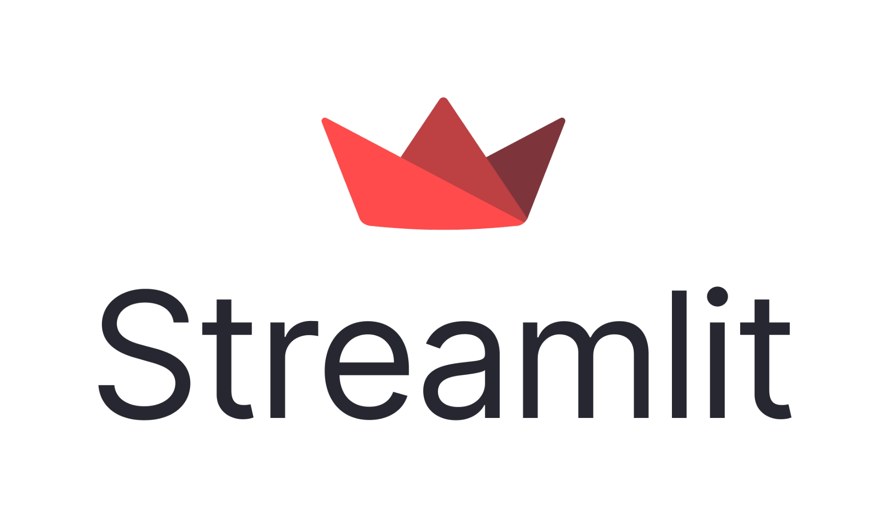
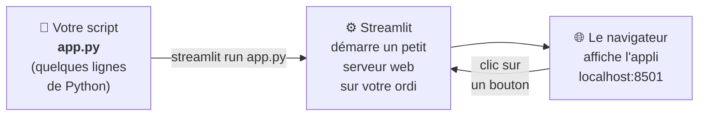
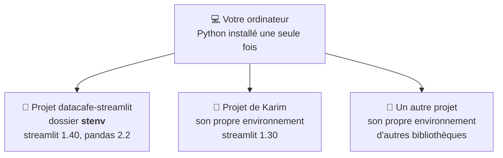
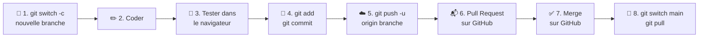
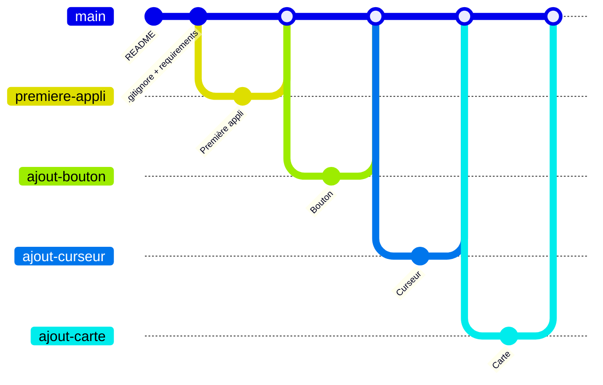

# Chapitre 5 · Créer une application web avec Streamlit 🐍📊

> **🎬 DataCafé, épisode 5 : Le Café du jour.** Chaque lundi, Sofia passe deux heures à copier les ventes dans Excel, à faire des graphiques et à les envoyer par e-mail. Et Tom réclame toujours un graphique qu'elle n'a pas fait ! Léa propose de construire une **application web** où chacun consulte les ventes et choisit ses filtres tout seul, en **Python** avec **Streamlit**. Chaque nouveauté passera par une branche et une Pull Request.

| | |
|---|---|
| ⏱️ **Durée** | 2h (1 séances de 2h) |
| 🎯 **Prérequis** | Chapitre 4 : un compte GitHub, savoir faire `git clone`, créer une branche et fusionner une Pull Request. VS Code avec les extensions **Python** et **Rainbow CSV** (chapitre 2). |
| 💻 **À préparer avant la séance** | **Installer Python 3.10 ou plus** (voir [la section ci-dessous](#-à-préparer-avant-la-séance--installer-python)) et vérifier que `python -m pip --version` répond. |
| 🏅 **Titre à décrocher** | **Barista de la data** |

## 🎯 Objectifs de la séance

À la fin de ce chapitre, vous saurez :

- expliquer ce que sont **Python** et **Streamlit**, et à quoi ils servent ;
- créer un **environnement virtuel** pour un projet ;
- décrire les dépendances d'un projet dans un fichier **`requirements.txt`** ;
- protéger un dépôt avec un fichier **`.gitignore`** ;
- créer une application web avec des **widgets** (bouton, curseur, menu déroulant...) ;
- afficher des **données** à partir d'un fichier CSV : tableaux, indicateurs et graphiques ;
- développer **chaque fonctionnalité dans sa propre branche**, avec une Pull Request, comme une vraie équipe.

> [!NOTE]
> **Où en est-on dans la boucle DevOps ?** On reste à l'étape **⌨️ Code**, mais pour construire un vrai produit. Le fichier `requirements.txt` prépare l'étape **🧱 Build** (n'importe qui pourra reconstruire l'application à l'identique), on **🧪 teste** chaque fonctionnalité dans le navigateur avant de la fusionner, et le bonus de fin de chapitre montre l'étape **🚀 Deploy** : mettre l'appli en ligne.

---

## 💻 À préparer avant la séance : installer Python

### Étape 1 : Python est-il déjà installé ?

Ouvrez un terminal dans VS Code (`` Ctrl + ` ``) et tapez :

```bash
python --version
```

Sur **macOS** et **Linux**, essayez plutôt :

```bash
python3 --version
```

- Vous voyez `Python 3.12.7` (ou tout numéro qui commence par **3.10 ou plus**) → Python est installé ✅, passez à l'étape 3.
- Vous voyez une erreur, `Python 2.7...`, ou (sur Windows) le **Microsoft Store** s'ouvre → passez à l'étape 2.

> [!TIP]
> **`python` ou `python3` ?** Sur Windows, la commande s'appelle en général `python` (ou `py`). Sur macOS et Linux, c'est `python3`. **Dans ce chapitre, on écrit `python`** : sur Mac ou Linux, remplacez-le par `python3` **tant que l'environnement virtuel n'est pas activé** (une fois activé, `python` marche partout).

### Étape 2 : installer Python

<details>
<summary>🪟 Sur Windows</summary>

1. Allez sur [python.org/downloads](https://www.python.org/downloads/) et cliquez sur le gros bouton jaune **Download Python 3.x**.
2. Lancez l'installateur.
3. ⚠️ **Sur le premier écran, cochez la case « Add python.exe to PATH »** tout en bas. C'est LA case à ne pas oublier : sans elle, le terminal ne trouvera pas Python.
4. Cliquez sur **Install Now**, patientez, puis **Close**.
5. **Fermez et rouvrez VS Code** (le terminal ne voit les nouveaux programmes qu'après redémarrage), puis tapez `python --version`.
</details>

<details>
<summary>🍎 Sur macOS</summary>

1. Allez sur [python.org/downloads](https://www.python.org/downloads/) et téléchargez l'installateur **macOS** (fichier `.pkg`).
2. Ouvrez-le et suivez les instructions (Continuer, Accepter, Installer).
3. Fermez et rouvrez VS Code, puis tapez `python3 --version`.

Si vous utilisez déjà **Homebrew**, vous pouvez aussi taper `brew install python`.
</details>

<details>
<summary>🐧 Sur Linux</summary>

Python 3 est presque toujours déjà installé. Il manque parfois le module des environnements virtuels et `pip` :

```bash
sudo apt install python3 python3-venv python3-pip     # Ubuntu, Debian
sudo dnf install python3 python3-pip                  # Fedora
```
</details>

### Étape 3 : vérifier `pip`, l'installateur de bibliothèques

**pip** télécharge et installe les bibliothèques Python (c'est l'« App Store » de Python). Il est livré avec Python :

```bash
python -m pip --version
```

Vous devez voir quelque chose comme `pip 24.2 from ... (python 3.12)`.

> [!TIP]
> Pourquoi `python -m pip` plutôt que `pip` tout court ? Si plusieurs Python sont installés sur l'ordinateur, `python -m pip` est **sûr** d'utiliser le pip du Python en cours. C'est la méthode recommandée par la documentation officielle.

<details>
<summary>🆘 Ça ne marche pas ?</summary>

- **Windows : taper `python` ouvre le Microsoft Store** → Python n'est pas installé, ou la case « Add python.exe to PATH » n'a pas été cochée. Relancez l'installateur, choisissez **Modify** ou réinstallez en cochant la case. Vous pouvez aussi désactiver le raccourci du Store : menu Démarrer → **Gérer les alias d'exécution d'application** → désactivez les deux lignes **python.exe** et **python3.exe**.
- **Windows : `python` est introuvable mais `py --version` fonctionne** → utilisez `py` à la place de `python` partout dans ce chapitre.
- **`No module named pip`** → sur Linux, installez `python3-pip` (voir l'étape 2). Ailleurs, tapez `python -m ensurepip --upgrade`.
- **Avez-vous fermé et rouvert VS Code ?** C'est la solution à la moitié des problèmes d'installation.
</details>

---

## Séance 1 · De zéro à la première application interactive

### 💬 Tour de table

1. Citez une application ou un site où vous consultez des **chiffres** et des **graphiques** (banque, appli de sport, résultats sportifs...). Qu'est-ce qui le rend agréable ou pénible ?
2. Vous êtes le directeur de DataCafé : quels **3 chiffres** voulez-vous voir chaque matin ?
3. Combien de lignes de code faut-il, selon vous, pour créer un site web avec un bouton ? 10 ? 100 ? 1 000 ?

### 🎤 · Python et Streamlit

**Python** est un **langage de programmation**, le plus populaire au monde et le **n° 1 de la data** et de l'IA. Il se lit presque comme de l'anglais :

```python
if tasses > 5:
    print("Trop de café !")
```

> 💡 **Analogie : la cuisine.** **Python** est la **langue** des recettes. Les **bibliothèques** (*libraries*, *paquets*) sont des **livres de recettes** écrits par d'autres, gratuits. **Streamlit** est le livre qui transforme votre recette en **restaurant ouvert au public** : une application web.

**Streamlit** transforme un **script Python** (un fichier `.py`) en **application web interactive**, sans HTML, CSS ni JavaScript. Très utilisé par les analystes et data scientists, il appartient aujourd'hui à **Snowflake**.





> [!IMPORTANT]
> **Le secret de Streamlit :** à chaque clic sur un bouton ou mouvement de curseur, Streamlit **relit tout le script, de la première à la dernière ligne**, et redessine la page.
>
> 💡 Comme un barista qui, à chaque nouvelle commande, refait la recette **depuis le début** en suivant sa fiche.

**Le Python de survie en 5 notions :**

| Notion | Exemple | Ce que ça veut dire |
|---|---|---|
| **Variable** | `tasses = 3` | On range la valeur `3` dans une boîte nommée `tasses`. |
| **Texte** (*chaîne*) | `"Espresso"` | Du texte, toujours **entre guillemets**. |
| **Liste** | `["Espresso", "Latte"]` | Plusieurs valeurs, **entre crochets**, séparées par des virgules. |
| **Condition** | `if tasses > 5:` puis `else:` | « **Si**... alors... **sinon**... » |
| **Indentation** | 4 espaces au début de la ligne | Les lignes décalées **appartiennent** au `if` ou au `else` juste au-dessus. |

> [!WARNING]
> **En Python, l'indentation fait partie du code !** Les lignes qui dépendent d'un `if` sont décalées de **4 espaces** (touche **Tab** dans VS Code). Une `IndentationError` veut presque toujours dire : « un décalage manque ou est en trop ».

Tout ce qui suit un `#` est un **commentaire** : une note pour les humains, que Python ignore.

### 🧠 Quiz en classe · Python et Streamlit

**Q1.** Qu'est-ce que Streamlit ?

- A. Un langage de programmation concurrent de Python
- B. Une bibliothèque Python qui transforme un script en application web
- C. Un site d'hébergement de code, comme GitHub
- D. Un tableur, comme Excel

**Q2.** Que fait Streamlit quand l'utilisateur clique sur un bouton de l'application ?

- A. Il ne relit que la ligne du bouton
- B. Il relit tout le script de haut en bas et redessine la page
- C. Il redémarre l'ordinateur
- D. Il envoie un e-mail au développeur

**Q3.** Que va afficher ce code ?

```python
tasses = 2
if tasses > 5:
    print("Trop de café !")
else:
    print("Tout va bien.")
```

**Q4.** Laquelle de ces lignes est une **liste** Python ?

- A. `"Espresso, Latte, Mocha"`
- B. `Espresso + Latte`
- C. `["Espresso", "Latte", "Mocha"]`
- D. `# Espresso Latte Mocha`

### 🎤 Cours · Les fondations d'un projet Python

Trois fichiers ou dossiers à connaître avant d'écrire la moindre ligne d'application :

| Élément | Rôle | Analogie |
|---|---|---|
| **Environnement virtuel** (dossier `stenv`) | Un dossier **propre au projet** avec sa copie de Python et **ses** bibliothèques, dans **ses** versions | 🧳 La **valise** du voyage : on n'y met que ce dont **ce** projet a besoin |
| **`.gitignore`** | La liste des fichiers et dossiers que Git doit **ignorer** | 🕴️ La liste du **videur** : il ne laisse jamais entrer ceux qui y figurent |
| **`requirements.txt`** | La liste des bibliothèques du projet, à installer en une commande | 📝 La **liste des courses** |



Pourquoi ne **jamais** envoyer `stenv` sur GitHub ?

- il contient **des milliers de fichiers** et pèse **plusieurs centaines de Mo** ;
- il est **propre à votre ordinateur** : créé sur Windows, il ne marche pas sur le Mac de Sofia ;
- il se **recrée en une commande** grâce à `requirements.txt`.

> [!IMPORTANT]
> **Deux règles d'or :**
> 1. Le `.gitignore` s'écrit **AVANT le premier `git add`**. Le videur ne met pas dehors ceux qui sont déjà entrés : un fichier **déjà commité** reste dans l'historique.
> 2. **Pas de `(stenv)`, pas de Streamlit !** L'activation ne dure que le temps du terminal : à chaque nouveau terminal, on réactive.

### 🛠️ À vous de jouer · Préparer le projet `datacafe-streamlit`

⏱️ 30 min, pas à pas avec le professeur. 🟢 pour tous.

**1. Créer le dépôt sur GitHub et le cloner**

Sur GitHub : **+** → **New repository** :

- **Repository name** : `datacafe-streamlit` ;
- **Description** : « Application web des ventes de DataCafé » ;
- **Public** ;
- **cochez *Add a README file*** ;
- laissez **.gitignore** sur **None** (on écrit le nôtre) ;
- **Create repository**, puis bouton vert **<> Code** → copiez l'adresse HTTPS.

Dans le terminal de VS Code :

```bash
cd ~/cours-devops                                                # le dossier du cours (chapitre 2)
git clone https://github.com/votre-pseudo/datacafe-streamlit.git # remplacez par VOTRE adresse
cd datacafe-streamlit                                            # entrer dans le dépôt
code .                                                           # l'ouvrir dans VS Code
```

> [!IMPORTANT]
> `code .` ouvre une **nouvelle fenêtre** VS Code. Rouvrez-y un terminal (`` Ctrl + ` ``) : il est déjà dans `datacafe-streamlit`. **Toutes les commandes du chapitre se tapent dans ce dossier.** En cas de doute : `pwd`.

**2. Créer l'environnement virtuel**

```bash
python -m venv stenv
```

*(Sur macOS et Linux : `python3 -m venv stenv`.)*

- `-m venv` : utilise le module `venv` (*virtual environment*), livré avec Python ;
- `stenv` : le **nom** du dossier créé (« **s**treamlit **env**ironment »). **Retenez bien ce nom.**

> [!TIP]
> Si VS Code propose *« We noticed a new environment has been created. Do you want to select it for the workspace folder? »*, cliquez sur **Yes**.

**3. Écrire le `.gitignore` AVANT tout `git add`**

```bash
git status
```

```text
Untracked files:
        stenv/
```

Git a repéré `stenv` et serait ravi de l'embarquer. Créez à la racine du dépôt un fichier nommé exactement **`.gitignore`** (avec le point, sans extension) :

```gitignore
# Environnement virtuel : le nom doit être EXACTEMENT celui du dossier créé avec "python -m venv"
stenv/
# (les autres noms courants, au cas où)
.venv/
venv/

# Cache Python, recréé automatiquement
__pycache__/
*.pyc

# Fichiers secrets (mots de passe, clés) : ne JAMAIS les envoyer sur GitHub
.env
.streamlit/secrets.toml
```

Sauvegardez, puis `git status` : observez que `stenv/` a **disparu**, seul `.gitignore` reste.

```text
Untracked files:
        .gitignore
```

> [!WARNING]
> **Le piège classique :** créer l'environnement `stenv` mais écrire seulement `venv/` dans le `.gitignore`. Git ne fait **pas** le rapprochement. **Le nom doit être exactement celui du dossier.** Vérifiez toujours avec `git status`.

<details>
<summary>🆘 Trop tard, j'ai déjà commité le dossier <code>stenv</code> !</summary>

Ajoutez `stenv/` au `.gitignore`, puis demandez à Git d'arrêter de suivre le dossier **sans le supprimer du disque** :

```bash
git rm -r --cached stenv        # --cached : retire de Git, mais garde les fichiers sur le disque
git add .gitignore
git commit -m "Retrait de l'environnement virtuel du dépôt"
git push
```

Le dossier reste dans les anciens commits, mais n'est plus suivi.
</details>

**4. Activer l'environnement virtuel**

<details>
<summary>🪟 Sur Windows, avec PowerShell (le terminal par défaut de VS Code)</summary>

```powershell
stenv\Scripts\activate
```

Erreur rouge sur l'**exécution de scripts désactivée** (*running scripts is disabled on this system*) ? Ouvrez le 🆘 ci-dessous.
</details>

<details>
<summary>🪟 Sur Windows, avec Git Bash</summary>

```bash
source stenv/Scripts/activate
```

Sur Windows, le dossier s'appelle `Scripts` (avec une majuscule), pas `bin`.
</details>

<details>
<summary>🍎 Sur macOS · 🐧 Sur Linux</summary>

```bash
source stenv/bin/activate
```
</details>

Ça a marché si la ligne de commande commence par **`(stenv)`** :

```text
(stenv) PS C:\Users\lea\cours-devops\datacafe-streamlit>
```

Pour refermer la valise plus tard (pas maintenant 🚫) : `deactivate`.

<details>
<summary>🆘 Ça ne marche pas ?</summary>

- **PowerShell : « l'exécution de scripts est désactivée sur ce système »** → Windows bloque par sécurité le script d'activation. Autorisez-les pour votre compte (une seule fois) :

  ```powershell
  Set-ExecutionPolicy -ExecutionPolicy RemoteSigned -Scope CurrentUser
  ```

  Répondez **O** (Oui) si une question s'affiche, puis relancez `stenv\Scripts\activate`. Autre solution : passez sur le terminal **Git Bash** et utilisez `source stenv/Scripts/activate`.
- **PowerShell : `stenv\Scripts\activate` n'est pas reconnu** → essayez la version complète : `.\stenv\Scripts\Activate.ps1`.
- **`No such file or directory`** → vous n'êtes pas dans le bon dossier (`pwd` et `ls` : vous devez voir `stenv`), ou vous avez utilisé `bin` au lieu de `Scripts` (ou l'inverse).
- **Linux : `ensurepip is not available`** à la création de l'environnement → installez `python3-venv`, supprimez le dossier `stenv` et recommencez.
</details>

**5. Écrire la liste des courses et installer Streamlit**

Créez à la racine un fichier `requirements.txt` contenant une seule ligne :

```text
streamlit
```

Puis, **environnement activé** (`(stenv)` visible !) :

```bash
python -m pip install -r requirements.txt
```

(`-r requirements.txt` : « installe tout ce qui est écrit dans ce fichier ».) pip télécharge Streamlit **et ses propres dépendances** (pandas, numpy...). Vérifiez :

```bash
streamlit version
```

<details>
<summary>🔬 Pour les curieux : épingler les versions</summary>

En entreprise, on précise souvent les versions, pour que tout le monde ait **exactement** les mêmes :

```text
streamlit==1.40.0      # exactement cette version
pandas>=2.0            # au moins la version 2.0
```

`python -m pip freeze` affiche toutes les bibliothèques installées avec leur version exacte (certaines équipes font `python -m pip freeze > requirements.txt`). C'est le **build reproductible** : *« ça marche sur ma machine »* devient *« ça marche sur toutes les machines »*.
</details>

**6. Enregistrer les fondations dans Git** (directement sur `main` ; ensuite, chaque nouveauté passera par une branche)

```bash
git status                            # stenv/ ne doit PAS apparaître !
git add .gitignore requirements.txt
git commit -m "Ajout du .gitignore et des dépendances du projet"
git push
```

**7. Lancer la démo officielle**

```bash
streamlit hello
```

> [!NOTE]
> La première fois, Streamlit demande une **adresse e-mail** (*Email:*) : facultatif, appuyez sur **Entrée**.

Le navigateur s'ouvre sur **`http://localhost:8501`**. Pour **arrêter** : cliquez dans le terminal et appuyez sur **`Ctrl + C`** (même sur Mac).

> 💡 **`localhost`** est le nom que l'ordinateur se donne à lui-même : l'appli tourne **chez vous**, personne d'autre ne la voit. `8501` est le numéro de la « porte » (le *port*) de Streamlit.

✅ **Vous avez réussi si**, vérifié par votre voisin :

- `python --version` (ou `python3 --version`) affiche 3.10 ou plus ;
- la ligne de commande commence par `(stenv)` ;
- `streamlit version` répond ;
- `streamlit hello` ouvre la démo, et `Ctrl + C` l'arrête ;
- sur GitHub, le dépôt contient `README.md`, `.gitignore` et `requirements.txt`, et **pas** de dossier `stenv`.

🔴 **Défi :** fermez le terminal, ouvrez-en un nouveau et tapez `streamlit version`. Que se passe-t-il ? Pourquoi ? Comment réparer ?

### 🧠 Quiz en classe · Les fondations du projet

**Q1.** À quoi sert un environnement virtuel ?

- A. À faire tourner Windows sur un Mac
- B. À isoler les bibliothèques (et leurs versions) de chaque projet
- C. À sauvegarder le code sur Internet
- D. À accélérer l'ordinateur

**Q2.** Vous avez créé l'environnement avec `python -m venv monenv`. Quelle ligne écrire dans le `.gitignore` ?

- A. `venv/`
- B. `stenv/`
- C. `monenv/`
- D. Rien, Git ignore automatiquement les environnements virtuels

**Q3.** Pourquoi faut-il créer le `.gitignore` **avant** le premier `git add` ?

**Q4.** Que contient le fichier `requirements.txt` ?

- A. Le mot de passe GitHub
- B. La liste des bibliothèques dont le projet a besoin
- C. Le code de l'application
- D. La liste des membres de l'équipe

**Q5.** Dans un nouveau terminal, `streamlit run app.py` répond `streamlit: command not found`. Quelle est la cause la plus probable ?

**Q6.** Quelle commande installe toutes les bibliothèques listées dans `requirements.txt` ?

### 🎤 · La recette du GitHub Flow

À partir de maintenant, **chaque nouvelle fonctionnalité** suit le GitHub Flow du chapitre 4 :



| Étape | Commande ou action | Pourquoi ? |
|---|---|---|
| 0 | `git switch main` puis `git pull` | Toujours partir de la dernière version (règle d'or du chapitre 4) |
| 1 | `git switch -c nom-de-la-branche` | Un brouillon pour la nouveauté, sans toucher à `main` |
| 2-3 | Coder, sauvegarder, regarder le résultat dans le navigateur | **Tester avant de proposer** |
| 4 | `git add fichier` puis `git commit -m "..."` | Prendre la photo |
| 5 | `git push -u origin nom-de-la-branche` | Envoyer la branche sur GitHub |
| 6 | Sur GitHub : **Compare & pull request** → **Create pull request** | Proposer la nouveauté |
| 7 | Onglet **Files changed** pour se relire, puis **Merge pull request** → **Confirm merge** → **Delete branch** | Valider et fusionner dans `main` |
| 8 | `git switch main`, `git pull`, puis `git branch -d nom-de-la-branche` | Récupérer `main` à jour et ranger le brouillon |

> [!TIP]
> Dans votre dépôt personnel, vous pouvez fusionner votre propre PR après relecture. 🟡 Pour faire comme en entreprise, invitez votre voisin comme collaborateur (**Settings** → **Collaborators**) et faites-lui approuver vos PR.

### 👀 Démonstration · Première application « Hello DataCafé »

Le professeur code en direct. Regardez d'abord, vous reproduirez ensuite.

**Branche :**

```bash
git switch main
git pull
git switch -c premiere-appli
```

**Fichier `app.py`** (à la racine du dépôt) :

```python
import streamlit as st

st.title("☕ DataCafé")
st.write("Bonjour ! Bienvenue dans la première application de l'équipe DataCafé.")
```

- `import streamlit as st` : on emprunte Streamlit, surnommé `st` : toutes les commandes commencent par `st.` ;
- `st.title(...)` : un **grand titre** ;
- `st.write(...)` : le couteau suisse, qui affiche du texte, un nombre, un tableau...

**Lancer** (environnement activé) :

```bash
streamlit run app.py
```

**Modifier en direct :** ajoutez à la fin de `app.py`, puis sauvegardez :

```python
st.header("Le café du jour")
st.write("Aujourd'hui, le barista vous recommande un **cappuccino** à la cannelle. 🤎")
```

Observez que :

- le navigateur affiche **« File change »** en haut à droite : cliquez sur **Always rerun**, la page se mettra à jour à chaque sauvegarde ;
- `**cappuccino**` s'affiche en gras : `st.write` comprend le **Markdown** du chapitre 2 ;
- le terminal où tourne `streamlit run` est **occupé** : pour Git, ouvrez un **deuxième terminal** (bouton **+**), ou arrêtez l'appli avec `Ctrl + C`.

**Les fonctions pour écrire du texte :**

| Fonction | Ce qu'elle affiche |
|---|---|
| `st.title("...")` | Le grand titre de la page (un seul par page, en général) |
| `st.header("...")` | Un titre de section |
| `st.subheader("...")` | Un sous-titre |
| `st.write("...")` | Du texte (Markdown accepté), des nombres, des tableaux... |
| `st.markdown("...")` | Du texte en Markdown |
| `st.caption("...")` | Un petit texte gris, pour une note ou une source |

**Commit, push, Pull Request** (dans le deuxième terminal) :

```bash
git status
git add app.py
git commit -m "Première application Streamlit : titre et café du jour"
git push -u origin premiere-appli
```

Sur GitHub : bandeau jaune **Compare & pull request** → titre « Première application Streamlit », description « Ajoute le titre et le café du jour » → **Create pull request** → onglet **Files changed** (relire) → **Merge pull request** → **Confirm merge** → **Delete branch**. Puis :

```bash
git switch main
git pull
git branch -d premiere-appli
```

### 🛠️ À vous de jouer · Votre première appli, signée de votre nom

⏱️ 15 min. 🟢 pour tous.

1. 🟢 Reproduisez la démonstration : branche `premiere-appli`, fichier `app.py` (titre, accueil, café du jour), `streamlit run app.py`, **Always rerun**, puis tout le GitHub Flow jusqu'au `git branch -d`.
2. 🟢 Créez une branche `personnalisation-accueil`. Dans `app.py`, ajoutez un `st.subheader` avec votre prénom (« Une appli signée Prénom ») et un `st.caption` avec la date du jour.
3. 🟢 Vérifiez dans le navigateur, puis suivez la recette du GitHub Flow jusqu'à la fusion et au `git pull`.
4. 🟡 Ajoutez une liste à puces en Markdown dans un `st.markdown` (les 3 cafés préférés de l'équipe).

✅ **Vous avez réussi si** votre prénom apparaît dans l'appli, ET si la page GitHub de `app.py` (sur `main`) contient vos modifications.

<details>
<summary>🆘 Ça ne marche pas ?</summary>

- **`streamlit: command not found`** ou **`'streamlit' n'est pas reconnu...`** → l'environnement n'est pas activé dans ce terminal (pas de `(stenv)`). Activez-le. Sinon, `python -m streamlit run app.py` fait exactement la même chose.
- **`ModuleNotFoundError: No module named 'streamlit'`** → même cause : ce n'est pas le Python de `stenv`. Activez l'environnement. Dans VS Code, vérifiez en bas à droite que l'interpréteur est bien `stenv` (sinon `Ctrl + Maj + P` → **Python: Select Interpreter**).
- **`Error: Invalid value: File does not exist: app.py`** → vous n'êtes pas dans le dossier du dépôt (`pwd`), ou le fichier porte un autre nom (`App.py`, `app.py.txt`...).
- **Le navigateur ne s'ouvre pas** → ouvrez-le vous-même sur l'adresse affichée dans le terminal (*Local URL: http://localhost:8501*).
- **L'adresse est `localhost:8502` au lieu de `8501`** → une autre appli Streamlit tourne déjà dans un autre terminal. Pas grave, mais arrêtez-la avec `Ctrl + C`.
- **`IndentationError`** ou **`SyntaxError`** dans la page → un guillemet, une parenthèse ou un décalage. Streamlit indique le numéro de la ligne fautive.
- **`git push` est refusé** → avez-vous fait `git pull` sur `main` avant de créer la branche ? (règle d'or du chapitre 4)
</details>

### 🎤 Cours · Les widgets

Un **widget** est un élément sur lequel l'utilisateur agit : bouton, curseur, menu déroulant, case à cocher... Chaque widget s'écrit en **une ligne** et **renvoie la valeur choisie**, qu'on range dans une variable :

```python
variable = st.widget("texte affiché", ...)
```

> 💡 **Analogie : la borne de commande du fast-food.** 🍔 L'écran propose des boutons, des curseurs, des menus. Ce que vous choisissez est noté sur le ticket : ce sont les **variables**. La cuisine prépare ensuite en fonction du ticket : c'est la suite du **script**.

| Widget | À quoi il sert | Exemple DataCafé |
|---|---|---|
| `st.button` | Un bouton (vaut `True` juste après un clic) | `if st.button("Commander"):` |
| `st.slider` | Un curseur (un nombre ou un intervalle) | `tasses = st.slider("Tasses", 0, 10, 2)` |
| `st.selectbox` | Un menu déroulant, **un seul** choix | `cafe = st.selectbox("Café", ["Espresso", "Latte"])` |
| `st.multiselect` | Un menu, **plusieurs** choix | `sup = st.multiselect("Suppléments", [...])` |
| `st.text_input` | Saisir un texte | `prenom = st.text_input("Votre prénom")` |
| `st.number_input` | Saisir un nombre | `quantite = st.number_input("Nombre de paquets", 1, 20)` |
| `st.checkbox` | Une case à cocher (vrai/faux) | `if st.checkbox("Livraison express ?"):` |
| `st.radio` | Un choix unique, options toutes visibles | `taille = st.radio("Taille", ["S", "M", "L"])` |
| `st.date_input` | Une date dans un calendrier | `jour = st.date_input("Date de livraison")` |

Et pour les messages : `st.success` (vert), `st.info` (bleu), `st.warning` (jaune), `st.error` (rouge).

### 👀 Démonstration · Le bouton et la magie des branches

**Branche :** `ajout-bouton`

```bash
git switch main
git pull
git switch -c ajout-bouton
```

À la fin de `app.py` :

```python
st.header("🔔 La sonnette du comptoir")

if st.button("Commander un café"):
    st.write("☕ Et un café, un ! Bonne dégustation.")
    st.balloons()
else:
    st.write("😴 Le barista attend votre commande...")
```

Observez que :

- `st.button(...)` vaut **`True`** juste après un clic, **`False`** le reste du temps ; `st.balloons()` lance une pluie de ballons 🎈 ;
- après un clic, si l'on rafraîchit la page, le message d'attente revient : c'est le **secret de Streamlit** (tout est relu, et le bouton ne vaut `True` que pendant la relecture qui suit le clic).

**La magie des branches**, appli toujours lancée :

```bash
git add app.py
git commit -m "Ajout du bouton de commande"
git switch main
```

Observez que **le bouton disparaît** du navigateur : il n'existe que sur `ajout-bouton`. Puis :

```bash
git switch ajout-bouton
```

Le bouton revient. 🪄 Fin de la recette :

```bash
git push -u origin ajout-bouton
```

**Pull Request** → **Merge** sur GitHub, puis :

```bash
git switch main
git pull
git branch -d ajout-bouton
```

### 🛠️ À vous de jouer · Le bouton et le curseur, sans filet

⏱️ 15 min. **Cette fois, c'est vous qui écrivez les commandes Git.**

1. 🟢 Reproduisez le bouton de la démonstration dans une branche `ajout-bouton`, testez la magie des branches, puis fusionnez.
2. 🟢 Dans une branche `ajout-curseur`, ajoutez à la fin de `app.py` :

   ```python
   st.header("📏 Votre consommation de café")

   tasses = st.slider("Combien de tasses de café buvez-vous par jour ?", 0, 10, 2)
   st.write("Vous buvez", tasses, "tasse(s) par jour, soit", tasses * 7, "par semaine !")

   if tasses >= 5:
       st.warning("Attention, ça fait beaucoup de caféine ! 😵‍💫")
   ```

   `st.slider(texte, minimum, maximum, valeur_de_départ)` ; `st.write` affiche plusieurs choses séparées par des virgules ; `*` multiplie.
3. 🟢 Ajoutez un curseur d'**intervalle** (deux valeurs de départ entre parenthèses) :

   ```python
   budget = st.slider("Votre budget café par mois (en €)", 0, 100, (20, 50))
   st.write("Votre budget est compris entre", budget[0], "et", budget[1], "€.")
   ```

   `budget[0]` est le minimum choisi, `budget[1]` le maximum.
4. 🟢 Testez, puis suivez toute la recette du GitHub Flow jusqu'à la suppression de la branche.

✅ **Vous avez réussi si** le curseur est visible dans l'appli, si la Pull Request apparaît **Merged** (violette) dans **Pull requests → Closed**, et si `git branch` n'affiche plus que `* main`.

<details>
<summary>🔬 Pour les curieux : des curseurs d'heures et de dates</summary>

Il faut emprunter les outils de dates de Python, à importer **en haut** du fichier :

```python
from datetime import datetime, time

horaires = st.slider(
    "Horaires d'ouverture du café",
    value=(time(8, 0), time(18, 30)),
)
st.write("Le café est ouvert de", horaires[0], "à", horaires[1])

livraison = st.slider(
    "Date et heure de livraison",
    value=datetime(2026, 3, 2, 9, 30),
    format="DD/MM/YYYY - HH:mm",
)
st.write("Livraison prévue le :", livraison)
```

L'option `format` choisit l'affichage de la date sur le curseur (ici à la française).
</details>

### 🛠️ À vous de jouer · La carte des cafés et les suppléments

⏱️ 15 min.

1. 🟢 Dans une branche `ajout-carte`, ajoutez à la fin de `app.py` :

   ```python
   st.header("📋 La carte")

   cafe = st.selectbox(
       "Quel café voulez-vous ?",
       ["Espresso", "Cappuccino", "Latte", "Mocha", "Cold brew"],
   )
   st.write("Excellent choix : un", cafe, "! 😋")
   ```

   `st.selectbox` prend le **texte** du menu et la **liste** des choix ; il renvoie le choix, rangé dans `cafe`. On peut écrire sur plusieurs lignes tant qu'on est **à l'intérieur des parenthèses**.
2. 🟡 **Le ticket de caisse.** Un **dictionnaire** associe une valeur à un nom (ici un prix à chaque café). Ajoutez :

   ```python
   prix = {"Espresso": 2.0, "Cappuccino": 3.5, "Latte": 3.8, "Mocha": 4.2, "Cold brew": 4.0}

   total = prix[cafe] * tasses
   st.metric("Votre budget café de la semaine", f"{total * 7:.2f} €")
   ```

   `prix[cafe]` cherche le prix du café choisi ; `tasses` vient du curseur (les widgets travaillent **ensemble**) ; `st.metric` affiche un **indicateur** en gros chiffres ; `f"{total * 7:.2f} €"` est un texte « à trous » (*f-string*), arrondi à 2 chiffres après la virgule.
3. 🟢 Terminez le GitHub Flow pour `ajout-carte`.
4. 🟡 **Les suppléments.** Dans une branche `ajout-supplements` :
   - ajoutez une section « 🍯 Les suppléments » ;
   - avec `st.multiselect`, proposez : Sucre, Lait d'avoine, Caramel, Chantilly, Cannelle, avec le **Sucre** présélectionné (indice : le paramètre `default` dans la [documentation de st.multiselect](https://docs.streamlit.io/develop/api-reference/widgets/st.multiselect)) ;
   - affichez la liste des suppléments choisis et leur **nombre** (indice : `len(...)` donne le nombre d'éléments d'une liste) ;
   - terminez le GitHub Flow.
5. 🔴 **Défi :** si l'utilisateur choisit **plus de 3** suppléments, affichez `st.error("Ce n'est plus un café, c'est un dessert ! 🍰")`.
6. 🔴 **Défi « Surprends-moi ! » :** un bouton qui tire un café **au hasard** dans la carte. Indice : `import random` en haut du fichier, puis `random.choice(une_liste)`.

✅ **Vous avez réussi si** le menu de la carte fonctionne et que sa PR est fusionnée ; pour le 🟡, si l'on peut choisir plusieurs suppléments et que leur nombre s'affiche correctement.

Pour finir, regardez votre historique : chaque fonctionnalité a sa branche, sa PR et sa fusion.

```bash
git log --oneline --graph
```



## 📌 À retenir (séance 1)

- **Streamlit** transforme un script Python en application web et **relit tout le script** à chaque interaction.
- Environnement virtuel : `python -m venv stenv`, puis activation. **Pas de `(stenv)`, pas de Streamlit !**
- Le **`.gitignore`** s'écrit **avant le premier `git add`**, avec le **nom exact** du dossier (`stenv/`).
- `requirements.txt` + `python -m pip install -r requirements.txt` : la liste des courses du projet.
- `streamlit run app.py` pour lancer, `Ctrl + C` pour arrêter.
- Un widget **renvoie une valeur** : `variable = st.widget("texte", ...)`.
- **Une fonctionnalité = une branche + une Pull Request.**

## 🏠 Avant la séance 2

- Terminez les branches en cours (carte, suppléments) jusqu'à la fusion, puis `git switch main` et `git pull`.
- Vérifiez que vous savez **réactiver** `stenv` dans un terminal tout neuf et relancer `streamlit run app.py`.

---

## Séance 2 · Le tableau de bord des ventes (Optionnelle)

### 🧠 Quiz en classe · Rappel sur les widgets

Pendant le quiz, ouvrez VS Code, **réactivez `stenv`** et lancez `streamlit run app.py`.

**Q1.** Quel widget permet de choisir **plusieurs** options dans une liste ?

- A. `st.selectbox`
- B. `st.button`
- C. `st.multiselect`
- D. `st.slider`

**Q2.** Que vaut la variable `tasses` si l'utilisateur ne touche pas au curseur ?

```python
tasses = st.slider("Tasses par jour", 0, 10, 2)
```

- A. 0
- B. 2
- C. 10
- D. Rien du tout

**Q3.** Pourquoi le message affiché après un clic sur `st.button` disparaît-il quand on bouge ensuite un curseur ?

**Q4.** Quelle fonction affiche un encadré jaune d'avertissement ?

- A. `st.error`
- B. `st.success`
- C. `st.warning`
- D. `st.balloons`

**Q5.** Trouvez l'erreur dans ce code :

```python
if st.button("Commander"):
st.write("Et un café, un !")
```

**Q6.** Vous développez le curseur sur la branche `ajout-curseur`. Vous faites `git switch main` pendant que l'appli tourne. Que voyez-vous dans le navigateur ?

### 🎤 Cours · CSV, pandas et DataFrame

- Un fichier **CSV** (*Comma-Separated Values*) est un tableau en texte brut : une ligne par enregistrement, des virgules entre les colonnes. Excel et Python savent le lire.
- **pandas** est LA bibliothèque Python des tableaux de données : **Excel piloté par du code**. Un tableau pandas s'appelle un **DataFrame**.
- Règle de bonne pratique : `requirements.txt` liste **toutes les bibliothèques que le code importe**, même celles déjà installées avec Streamlit.

| pandas | Équivalent Excel |
|---|---|
| `pd.read_csv("ventes.csv")` | Ouvrir le fichier |
| `ventes["ca"] = ventes["quantite"] * ventes["prix_unitaire"]` | Une formule étirée sur toute la colonne |
| `ventes["quantite"].sum()` | `=SOMME(...)` |
| `ventes[ventes["region"].isin(regions)]` | Un filtre |
| `ventes.groupby("produit")["ca"].sum()` | Un **tableau croisé dynamique** |

> [!WARNING]
> Les données de ce chapitre sont **inventées** : on peut les mettre sur un dépôt public. Avec de **vraies** données clients (noms, e-mails, adresses), **jamais** de dépôt public : ce serait une fuite de données personnelles, interdite par le **RGPD**. On les ajouterait alors au `.gitignore`.

### 🛠️ À vous de jouer · Le tableau de bord des ventes

⏱️ 35 min, en suivant le professeur étape par étape. 🟢 pour tous.

**1. La branche**

```bash
git switch main
git pull
git switch -c ajout-ventes
```

**2. Le fichier de données.** Créez à la racine un fichier **`ventes.csv`** :

```csv
date,produit,region,quantite,prix_unitaire
2026-03-02,Espresso,Paris,42,2.0
2026-03-02,Cappuccino,Lyon,18,3.5
2026-03-02,Latte,Marseille,12,3.8
2026-03-03,Espresso,Lyon,25,2.0
2026-03-03,Cappuccino,Paris,30,3.5
2026-03-03,Latte,Paris,22,3.8
2026-03-04,Espresso,Marseille,19,2.0
2026-03-04,Cappuccino,Marseille,14,3.5
2026-03-04,Latte,Lyon,16,3.8
2026-03-05,Espresso,Paris,51,2.0
2026-03-05,Cappuccino,Lyon,21,3.5
2026-03-05,Latte,Paris,28,3.8
2026-03-06,Espresso,Lyon,33,2.0
2026-03-06,Cappuccino,Paris,37,3.5
2026-03-06,Latte,Marseille,15,3.8
```

Observez les couleurs de **Rainbow CSV** : une couleur par colonne. 🌈

**3. La liste des courses.** Complétez `requirements.txt` :

```text
streamlit
pandas
```

```bash
python -m pip install -r requirements.txt
```

**4. Le tableau et les indicateurs.** Créez **`ventes_app.py`** :

```python
import pandas as pd
import streamlit as st

st.title("📊 Les ventes de DataCafé")

# 1. Charger les données
ventes = pd.read_csv("ventes.csv")
ventes["chiffre_affaires"] = ventes["quantite"] * ventes["prix_unitaire"]

# 2. Le tableau
st.subheader("Le détail des ventes")
st.dataframe(ventes)

# 3. Les indicateurs clés
st.subheader("Les chiffres clés")
col1, col2, col3 = st.columns(3)
col1.metric("☕ Cafés vendus", int(ventes["quantite"].sum()))
col2.metric("💶 Chiffre d'affaires", f"{ventes['chiffre_affaires'].sum():.2f} €")
col3.metric("🧾 Nombre de ventes", len(ventes))
```

- `import pandas as pd` : pandas, surnommé `pd` (convention mondiale) ;
- `st.dataframe(ventes)` : un tableau **triable** (cliquez sur les en-têtes) ;
- `st.columns(3)` : 3 colonnes côte à côte ; `col1.metric(titre, valeur)` : un **indicateur** (*KPI*, *Key Performance Indicator*) ;
- `.sum()` : la somme d'une colonne ; `int(...)` : un nombre entier ; `len(...)` : le nombre de lignes.

Arrêtez l'appli précédente (`Ctrl + C`), puis :

```bash
streamlit run ventes_app.py
```

**5. Les graphiques.** Ajoutez à la fin de `ventes_app.py` :

```python
# 4. Les graphiques
st.subheader("Chiffre d'affaires par produit")
ca_par_produit = ventes.groupby("produit")["chiffre_affaires"].sum()
st.bar_chart(ca_par_produit)

st.subheader("Évolution des ventes jour après jour")
quantite_par_jour = ventes.groupby("date")["quantite"].sum()
st.line_chart(quantite_par_jour)
```

`groupby("produit")[...].sum()` se lit : « **regroupe** par produit, et **additionne** le chiffre d'affaires de chaque groupe ». `st.bar_chart` dessine des barres, `st.line_chart` une courbe. Passez la souris sur les graphiques : ils sont **interactifs**.

> 🧩 **Le saviez-vous ?** Au chapitre 6, vous ferez ce même regroupement en **SQL** avec **DuckDB** : `SELECT produit, SUM(...) FROM ventes GROUP BY produit`.

**6. Le filtre dans la barre latérale.** Ajoutez ce bloc **juste après** la ligne qui calcule `chiffre_affaires` (avant le tableau), pour que tout ce qui suit utilise les données filtrées :

```python
# Filtre dans la barre latérale
st.sidebar.header("🔎 Filtres")
regions = st.sidebar.multiselect(
    "Régions",
    ["Paris", "Lyon", "Marseille"],
    default=["Paris", "Lyon", "Marseille"],
)
ventes = ventes[ventes["region"].isin(regions)]
```

- `st.sidebar.` place le widget dans la **barre latérale** ;
- `ventes["region"].isin(regions)` teste si la région de chaque ligne fait partie (*is in*) des régions choisies ;
- `ventes = ventes[...]` ne garde **que** les lignes qui passent le test.

Retirez « Paris » : indicateurs et graphiques se recalculent instantanément (merci le secret de Streamlit).

<details>
<summary>📄 Le fichier <code>ventes_app.py</code> complet (pour vérifier l'ordre des blocs)</summary>

```python
import pandas as pd
import streamlit as st

st.title("📊 Les ventes de DataCafé")

# 1. Charger les données
ventes = pd.read_csv("ventes.csv")
ventes["chiffre_affaires"] = ventes["quantite"] * ventes["prix_unitaire"]

# Filtre dans la barre latérale
st.sidebar.header("🔎 Filtres")
regions = st.sidebar.multiselect(
    "Régions",
    ["Paris", "Lyon", "Marseille"],
    default=["Paris", "Lyon", "Marseille"],
)
ventes = ventes[ventes["region"].isin(regions)]

# 2. Le tableau
st.subheader("Le détail des ventes")
st.dataframe(ventes)

# 3. Les indicateurs clés
st.subheader("Les chiffres clés")
col1, col2, col3 = st.columns(3)
col1.metric("☕ Cafés vendus", int(ventes["quantite"].sum()))
col2.metric("💶 Chiffre d'affaires", f"{ventes['chiffre_affaires'].sum():.2f} €")
col3.metric("🧾 Nombre de ventes", len(ventes))

# 4. Les graphiques
st.subheader("Chiffre d'affaires par produit")
ca_par_produit = ventes.groupby("produit")["chiffre_affaires"].sum()
st.bar_chart(ca_par_produit)

st.subheader("Évolution des ventes jour après jour")
quantite_par_jour = ventes.groupby("date")["quantite"].sum()
st.line_chart(quantite_par_jour)
```
</details>

**7. Enregistrer et proposer** (3 fichiers cette fois) :

```bash
git status
git add ventes.csv ventes_app.py requirements.txt
git commit -m "Ajout du tableau de bord des ventes"
git push -u origin ajout-ventes
```

Puis Pull Request, Merge, `git switch main`, `git pull` et `git branch -d ajout-ventes`.

✅ **Vous avez réussi si** l'appli affiche le tableau, les 3 indicateurs et les 2 graphiques, si le filtre les fait varier, et si la PR `ajout-ventes` est fusionnée.

<details>
<summary>🆘 Ça ne marche pas ?</summary>

- **`FileNotFoundError: ... 'ventes.csv'`** → `pd.read_csv` cherche le fichier **dans le dossier où vous avez lancé** `streamlit run`. Lancez depuis la racine du dépôt (`pwd`), et vérifiez le nom exact `ventes.csv`.
- **`KeyError: 'quantite'`** → un nom de colonne ne correspond pas : vérifiez la première ligne du CSV (pas d'espace, pas d'accent, pas de majuscule).
- **`ModuleNotFoundError: No module named 'pandas'`** → environnement pas activé, ou installation pas relancée : `python -m pip install -r requirements.txt`.
- **Les graphiques sont vides** → vous avez peut-être retiré toutes les régions du filtre.
</details>

### 🛠️ À vous de jouer · Le dépôt de fichier

⏱️ 15 min. 🟡 si vous avez terminé le tableau de bord.

Sofia veut **déposer n'importe quel fichier** de ventes dans l'appli. Dans une branche `ajout-import-csv`, créez `import_app.py` :

```python
import pandas as pd
import streamlit as st

st.title("📂 Analyse d'un fichier de ventes")

fichier = st.file_uploader("Déposez votre fichier CSV de ventes", type="csv")

if fichier is not None:
    df = pd.read_csv(fichier)
    st.success(f"✅ {len(df)} lignes chargées !")
    st.dataframe(df)
    st.subheader("Statistiques descriptives")
    st.write(df.describe())
else:
    st.info("☝️ Déposez un fichier CSV pour commencer.")
```

- `st.file_uploader(...)` : une zone de **glisser-déposer** ; `type="csv"` n'accepte que les CSV ;
- tant que rien n'est déposé, `fichier` vaut `None` (« rien ») : `if fichier is not None:` se lit « **si** un fichier a été déposé » ;
- `df.describe()` calcule des statistiques sur les colonnes de nombres : moyenne (*mean*), minimum, maximum...

**Consignes :**

1. 🟡 Lancez `streamlit run import_app.py` et déposez votre `ventes.csv`.
2. 🟡 Complétez le code (à l'intérieur du `if`) pour afficher un `st.metric` du **chiffre d'affaires total** et un `st.bar_chart` des **quantités vendues par région**.
3. 🟡 Terminez le GitHub Flow.
4. 🔴 Défi : ajoutez un `st.selectbox` qui laisse choisir la colonne de regroupement (`produit`, `region` ou `date`) du graphique.

✅ **Vous avez réussi si** l'appli affiche l'indicateur et le graphique après le dépôt de `ventes.csv`, et seulement un message d'information avant.

<details>
<summary>🔬 Pour les curieux : une carte des boutiques DataCafé</summary>

`st.map` place des points sur une carte, à partir de colonnes `lat` (latitude) et `lon` (longitude) :

```python
boutiques = pd.DataFrame(
    {
        "ville": ["Paris", "Lyon", "Marseille", "Bordeaux", "Lille"],
        "lat": [48.8566, 45.7640, 43.2965, 44.8378, 50.6292],
        "lon": [2.3522, 4.8357, 5.3698, -0.5792, 3.0573],
    }
)
st.map(boutiques)
```
</details>

### 🧠 Quiz en classe · Les données

**Q1.** Que fait `pd.read_csv("ventes.csv")` ?

- A. Il crée un fichier CSV vide
- B. Il lit le fichier CSV et le transforme en tableau (DataFrame)
- C. Il envoie le fichier sur GitHub
- D. Il supprime le fichier

**Q2.** Quelle fonction Streamlit affiche un indicateur en gros chiffres ?

- A. `st.metric`
- B. `st.number`
- C. `st.kpi`
- D. `st.big`

**Q3.** Comment placer un widget dans la barre latérale de gauche ?

**Q4.** Vous avez ajouté `import pandas as pd` dans votre code. Quel autre fichier devez-vous mettre à jour pour que vos coéquipiers puissent faire tourner l'appli ?

**Q5.** À quel outil d'Excel ressemble `ventes.groupby("produit")["chiffre_affaires"].sum()` ?

### 👀 Démonstration · Mettre l'appli en ligne (bonus)

Pour l'instant, l'appli ne tourne que sur `localhost`. **Streamlit Community Cloud** la publie gratuitement sur Internet, depuis le dépôt GitHub :

1. [share.streamlit.io](https://share.streamlit.io/) → connexion **avec le compte GitHub** (*Continue with GitHub*), puis autoriser l'accès.
2. **Create app** (ou **New app**) → déployer une application depuis GitHub.
3. **Repository** = `votre-pseudo/datacafe-streamlit`, **Branch** = `main`, **Main file path** = `ventes_app.py`.
4. **Deploy**, puis quelques minutes d'attente : Streamlit installe tout ce qui est écrit dans `requirements.txt`.
5. L'appli est en ligne, à une adresse en `....streamlit.app`.

Observez que :

- sans `pandas` dans `requirements.txt`, le déploiement échouerait : voilà pourquoi la liste des courses doit être complète ;
- à chaque fusion d'une PR dans `main`, l'appli en ligne **se met à jour toute seule** : c'est le **déploiement continu** (le « CD » du chapitre 1), la boucle DevOps complète de **⌨️ Code** à **🚀 Deploy**. ♾️

🟡 Si vous avez le temps, faites-le avec votre propre dépôt et envoyez l'adresse à votre voisin.

### 👥 En équipe · Le dashboard DataCafé à 4 mains

⏱️ 40 min, équipes de 4 (les équipes du projet).

> **🎬** Léa réunit l'équipe : *« Le directeur veut **un seul** tableau de bord avec **4 indicateurs**, et il le veut ce soir. Vous êtes 4 : un indicateur chacun, une branche chacun, une Pull Request chacun. Et rien ne casse `main` ! »*

C'est la **répétition générale** du [projet d'évaluation](exercice_evaluation.md) : mêmes équipes, même organisation, sans base de données (DuckDB arrive au chapitre 6).

**Rôles :** 👑 un **chef d'équipe** (prépare le dépôt et code le filtre) et 3 **développeurs** (un indicateur chacun ; le chef code aussi le 4ᵉ indicateur). Chacun **relit** la PR d'un autre.

**1. Le chef d'équipe 👑 prépare le terrain (10 min)**

- Il crée sur GitHub le dépôt `dashboard-datacafe` (public, **avec** README) et invite ses 3 coéquipiers comme collaborateurs (chapitre 4).
- Il le clone, crée l'environnement `stenv`, le `.gitignore`, le `requirements.txt` (`streamlit` et `pandas`) et copie `ventes.csv`.
- Il crée le squelette `app.py` ci-dessous, puis commite et pousse le tout sur `main`.

```python
import pandas as pd
import streamlit as st

st.set_page_config(page_title="Dashboard DataCafé", page_icon="☕", layout="wide")
st.title("☕ Tableau de bord DataCafé")

ventes = pd.read_csv("ventes.csv")
ventes["chiffre_affaires"] = ventes["quantite"] * ventes["prix_unitaire"]

# ===== FILTRE (chef d'équipe) =====


# ===== KPI 1 : ... (prénom) =====


# ===== KPI 2 : ... (prénom) =====


# ===== KPI 3 : ... (prénom) =====


# ===== KPI 4 : ... (prénom) =====
```

> `st.set_page_config` règle le titre de l'onglet, son icône, et `layout="wide"` utilise toute la largeur de l'écran. Ce doit être **la première commande Streamlit** du fichier.

**2. Chacun clone, installe et choisit son indicateur (5 min)**

Chaque membre clone le dépôt, crée **son propre** environnement virtuel, l'active et installe les dépendances (`python -m pip install -r requirements.txt`). Répartition possible :

| Indicateur | Idée de visualisation |
|---|---|
| Le chiffre d'affaires total et le nombre de cafés vendus | `st.metric` |
| Le chiffre d'affaires par produit | `st.bar_chart` |
| L'évolution des ventes jour après jour | `st.line_chart` |
| Les ventes par région | `st.bar_chart` ou `st.dataframe` |

🔴 Inventez vos propres indicateurs : le produit star, le prix moyen d'une vente, la meilleure journée...

**3. Chacun développe dans sa branche (20 min)**

- `git switch -c kpi-votre-prenom` ;
- écrivez **uniquement sous votre commentaire** `# ===== KPI ... =====` (le chef d'équipe sous `FILTRE`, avec un `st.sidebar.multiselect` sur les régions ou les produits, placé **avant** les KPI pour qu'ils en tiennent compte) ;
- testez avec `streamlit run app.py`, commitez, poussez, ouvrez une **Pull Request** ;
- un coéquipier **relit** et approuve (**Review changes** → **Approve**) avant la fusion.

> [!TIP]
> Vous modifiez tous **le même fichier** : des **conflits** sont possibles. Comme chacun écrit dans sa zone, Git fusionne souvent tout seul. Sinon, vous savez faire (chapitre 4) : garder les deux blocs, retirer les marqueurs `<<<<<<<`, `=======`, `>>>>>>>`. Fusionnez les PR **une par une**, avec un `git pull` entre chaque.

**4. Documentez (5 min)**

Complétez le `README.md` : présentation du projet, **commandes pour installer et lancer l'appli** (création de l'environnement, activation sur Windows **et** macOS, installation, `streamlit run app.py`), **répartition des tâches**.

✅ **Vous avez réussi si :**

- `app.py` sur `main` affiche **4 indicateurs** et un **filtre** qui fonctionne ;
- l'onglet **Pull requests → Closed** montre **au moins 4 PR fusionnées**, chacune relue par un autre membre ;
- le dossier `stenv` n'est **pas** sur GitHub ;
- un membre qui n'a rien installé peut lancer l'appli **uniquement** en suivant le README.

> 🎓 **Et le projet d'évaluation ?** Même chose, en équipe, sur un **vrai** jeu de données (Spotify, Netflix, Airbnb, Walmart...), avec en plus le **téléversement du fichier** (`st.file_uploader`), des **filtres** par date, région ou produit, et des requêtes **SQL** avec **DuckDB**... au prochain chapitre !

### 💬 Tour de table · Retour au point de départ

1. Les 3 chiffres que vous vouliez voir chaque matin : sauriez-vous maintenant les afficher dans une appli ?
2. Combien de lignes de code a-t-il fallu pour votre première application web ?
3. Qu'est-ce qui a été le plus difficile : Python, l'environnement virtuel ou le GitHub Flow ?

---

## 📌 À retenir

- **Python** est le langage n° 1 de la data ; **Streamlit** transforme un script Python en **application web** et **relit tout le script** à chaque interaction.
- Un **environnement virtuel** isole les bibliothèques de chaque projet : `python -m venv stenv`, puis activation. **Pas de `(stenv)`, pas de Streamlit !**
- **`requirements.txt`** est la liste des courses du projet : `python -m pip install -r requirements.txt`.
- Le **`.gitignore`** s'écrit **avant le premier `git add`**, avec le **nom exact** du dossier de l'environnement (`stenv/`).
- Les **widgets** renvoient une valeur : `st.button`, `st.slider`, `st.selectbox`, `st.multiselect`, `st.file_uploader`...
- Les **données** : `pd.read_csv`, `st.dataframe`, `st.metric`, `st.columns`, `st.bar_chart`, `st.line_chart`, `st.sidebar`.
- **Chaque fonctionnalité = une branche + une Pull Request**, puis `git switch main` et `git pull` : c'est le **GitHub Flow**.

| Je veux... | Commande |
|---|---|
| Créer l'environnement virtuel | `python -m venv stenv` (`python3` sur macOS/Linux) |
| L'activer (Windows PowerShell) | `stenv\Scripts\activate` |
| L'activer (Windows Git Bash) | `source stenv/Scripts/activate` |
| L'activer (macOS, Linux) | `source stenv/bin/activate` |
| Le désactiver | `deactivate` |
| Installer les dépendances | `python -m pip install -r requirements.txt` |
| Lancer l'appli | `streamlit run app.py` |
| Arrêter l'appli | `Ctrl + C` dans le terminal |

Pour explorer tous les widgets et graphiques : [la documentation officielle de Streamlit](https://docs.streamlit.io/) et sa [galerie d'applications](https://streamlit.io/gallery).

## 🏅 Titre décroché : **Barista de la data** ☕📊

## 🏠 Avant la prochaine séance

- Vérifiez que `main` contient bien `app.py`, `ventes_app.py`, `ventes.csv` et `requirements.txt` sur GitHub, et faites `git pull` dans `datacafe-streamlit` : le chapitre 6 repart de ce dépôt et de l'environnement `stenv`.
- Si ce n'est pas fait, terminez l'exercice du dépôt de fichier (`import_app.py`).
- Rien à installer : DuckDB s'installera en classe.

> **🎬 Prochain épisode :** Sofia arrive, l'air paniqué : l'historique complet des ventes fait des centaines de milliers de lignes et son Excel a planté. Léa sourit : il est temps de parler **SQL**, avec un petit canard très rapide, **DuckDB**. 🦆
> ➡️ [Chapitre 6 · DuckDB : analyser les ventes de DataCafé avec SQL](6.DUCKDB.md)
