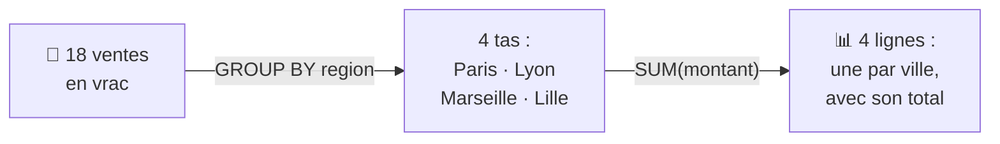
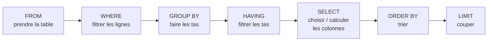

# Chapitre 6 · Interroger les données avec SQL et DuckDB 🦆🔎

> **🎬 DataCafé, épisode 6** : vendredi matin, Sofia arrive paniquée : *« Le service commercial nous a envoyé tout l'historique des ventes, des centaines de milliers de lignes. Mon Excel a planté ! »*
> Léa sourit : *« Il est temps de parler aux données dans leur langue, le **SQL**, avec un petit canard très rapide : **DuckDB**. »* 🦆
> Le directeur attend trois réponses avant ce soir : **quelle ville vend le plus ? quel café est notre champion ? les ventes progressent-elles ?**
> Votre mission : **mener l'enquête en SQL, puis brancher vos requêtes sur l'application Streamlit du chapitre 5.**

| | |
|---|---|
| ⏱️ **Durée** | 1h30 (1 séances de 1h30) |
| 🎯 **Prérequis** | Chapitre 4 (branches et Pull Requests) et chapitre 5 : votre dépôt `datacafe-streamlit`, son environnement virtuel `stenv` et le fichier `ventes.csv`. **Aucune connaissance en SQL n'est nécessaire.** |
| 💻 **À préparer avant la séance** | Installer DuckDB en ligne de commande (voir [la rubrique ci-dessous](#-à-préparer-avant-la-séance--installer-duckdb)) et vérifier que `duckdb --version` répond. |
| 🏅 **Titre à décrocher** | **Détective des données** 🕵️🦆 |

## 🎯 Objectifs de la séance

À la fin de ces deux séances, vous saurez :

- expliquer ce qu'est une **base de données**, une **table** et le langage **SQL** ;
- dire en quoi **DuckDB** est différent d'Excel et d'une base de données « classique » ;
- utiliser DuckDB dans le **terminal** ;
- écrire vos propres requêtes avec `SELECT`, `WHERE`, `ORDER BY`, `LIMIT`, `GROUP BY` et les fonctions `COUNT`, `SUM`, `AVG`, `MIN`, `MAX` ;
- ranger vos requêtes dans des fichiers `.sql` **versionnés avec Git** ;
- interroger DuckDB depuis **Python** et afficher le résultat dans votre application **Streamlit**.

> [!NOTE]
> **Où en est-on dans la boucle DevOps ?** On reste à l'étape **⌨️ Code** (on écrit du SQL, on le versionne, on passe par des Pull Requests), et on outille l'étape **📈 Monitor** : mesurer ce qui se passe pour mieux décider. C'est le pilier **M de CALMS** : la **Mesure** ! Quand on applique les pratiques DevOps aux données, on parle parfois de **DataOps**.

---

## 💻 À préparer avant la séance : installer DuckDB

DuckDB s'utilise d'abord dans le **terminal**, comme Git. On installe ce qu'on appelle le **CLI** (*Command Line Interface*, l'interface en ligne de commande). Comptez 5 à 10 minutes.

### Étape 1 : installer l'outil en ligne de commande

<details>
<summary>🪟 Sur Windows</summary>

**Méthode recommandée : `winget`** (le « magasin d'applications » en ligne de commande de Windows, déjà présent sur Windows 10 et 11).

1. Dans le terminal de VS Code (PowerShell), tapez :

   ```powershell
   winget install DuckDB.cli
   ```

   Acceptez les conditions si on vous le demande (tapez `Y` puis Entrée).
2. **Fermez complètement VS Code et rouvrez-le** : le nouveau programme n'est reconnu qu'après redémarrage du terminal.

**Si `winget` n'existe pas sur votre ordinateur :**

1. Allez sur [duckdb.org/install](https://duckdb.org/install), choisissez **Command line** et **Windows**, et téléchargez le fichier `.zip`.
2. Décompressez-le : il contient un seul fichier, `duckdb.exe`.
3. Copiez `duckdb.exe` dans votre dossier de projet `datacafe-streamlit`. Dans PowerShell, vous le lancerez avec `.\duckdb.exe` au lieu de `duckdb`.
4. ⚠️ Ajoutez la ligne `duckdb.exe` dans votre fichier `.gitignore` : on ne versionne pas un programme dans Git !
</details>

<details>
<summary>🍎 Sur macOS</summary>

**Si vous avez Homebrew** (le gestionnaire de logiciels des développeurs sur Mac) :

```bash
brew install duckdb
```

**Sinon**, utilisez le script d'installation officiel :

```bash
curl https://install.duckdb.org | sh
```

Le script installe DuckDB dans votre dossier personnel et affiche à la fin **une ligne à copier-coller** pour que la commande `duckdb` soit reconnue partout. Faites-le, puis fermez et rouvrez le terminal. (En attendant, vous pouvez toujours lancer DuckDB avec son chemin complet : `~/.duckdb/cli/latest/duckdb`.)
</details>

<details>
<summary>🐧 Sur Linux</summary>

```bash
curl https://install.duckdb.org | sh
```

Comme sur Mac, suivez l'indication affichée à la fin pour ajouter DuckDB à votre `PATH`, puis rouvrez le terminal.
</details>

### Étape 2 : vérifier l'installation

```bash
duckdb --version
```

Vous devez voir s'afficher un numéro de version, par exemple `v1.4.1`. 🎉

<details>
<summary>🆘 Ça ne marche pas ?</summary>

- **`duckdb` : commande introuvable / n'est pas reconnu** → fermez **complètement** VS Code (toutes les fenêtres) et rouvrez-le. Sur Mac/Linux, vérifiez que vous avez bien copié la ligne affichée par le script d'installation.
- **Windows : « l'exécution de scripts est désactivée »** ou `winget` introuvable → utilisez la méthode du fichier `.zip` ci-dessus.
- **Rien ne marche ?** → arrivez quand même en cours : le professeur vous aidera au début de la séance, et le **plan B** ci-dessous vous permet de suivre sans rien installer. Les requêtes SQL sont exactement les mêmes.
</details>

> [!TIP]
> **Plan B, zéro installation :** DuckDB fonctionne aussi **dans le navigateur** ! Allez sur [shell.duckdb.org](https://shell.duckdb.org) : un terminal DuckDB s'ouvre dans la page. Une fois votre fichier `ventes.csv` envoyé sur GitHub (section 6.3), vous pourrez le lire depuis son adresse « Raw » :
> `SELECT * FROM 'https://raw.githubusercontent.com/votre-pseudo/datacafe-streamlit/main/ventes.csv';`

---

## Séance 1 · Parler aux données en SQL (2h)

### 💬 Tour de table

1. Dans Excel ou Google Sheets, comment feriez-vous pour connaître le **total des ventes par ville** ? Combien de clics ?
2. Combien de lignes un onglet Excel peut-il contenir, au maximum ? (Devinez !)
3. Si vous deviez refaire exactement le même calcul **chaque lundi**, sur un fichier mis à jour, comment vous y prendriez-vous ?

---

## 6.1 Bases de données et SQL, en douceur 🗄️

### 🎤 · Une base de données, c'est quoi ?

Une **base de données** est un endroit où l'on range des informations de façon **organisée**, pour pouvoir les retrouver et les analyser facilement. Les données y sont rangées dans des **tables**, qui ressemblent beaucoup à un onglet de tableur :

| Vocabulaire base de données | Dans Excel... | Exemple chez DataCafé |
|---|---|---|
| **Table** | un onglet | la table `ventes` |
| **Colonne** | une colonne, avec son titre | `produit`, `region`, `quantite`... |
| **Ligne** (ou *enregistrement*) | une ligne | « le 5 janvier, 3 paquets d'Espresso vendus à Paris » |
| **Type** d'une colonne | le format de cellule (nombre, date, texte) | `quantite` est un nombre entier, `date` est une date |

> [!IMPORTANT]
> Différence importante avec Excel : dans une table, **chaque colonne a un seul type**. On ne peut pas mettre un texte dans une colonne de nombres, ni fusionner des cellules, ni colorier une ligne en jaune. C'est plus strict... et c'est justement ce qui rend les calculs fiables et ultra rapides. Autre limite d'Excel : un onglet s'arrête à **1 048 576 lignes**, et devient très lent bien avant.

### 🎤 Cours · Et le SQL ?

Le **SQL** (*Structured Query Language*, « langage de requêtes structuré », prononcé « èss-ku-èl » ou « sikouel ») est le langage qui permet de **poser des questions** à une base de données. Une question s'appelle une **requête**.

> 💡 **Analogie : le tableur géant qui parle.** 🗣️
> Imaginez un tableur gigantesque auquel, au lieu de cliquer partout, vous pourriez **écrire votre question** en (presque) anglais :
> *« MONTRE-MOI la ville et le total des ventes, À PARTIR DU fichier des ventes, REGROUPÉ PAR ville. »*
> C'est exactement ça, le SQL :
> ```sql
> SELECT region, SUM(quantite * prix_unitaire)
> FROM ventes
> GROUP BY region;
> ```
> Et la réponse arrive en une fraction de seconde, même sur des millions de lignes.

- Inventé dans les années 1970 chez IBM.
- Utilisé **partout** : banques, e-commerce, applications mobiles, outils de BI (Power BI, Tableau, Looker).
- Probablement le langage informatique le plus utile pour un manager qui travaille avec des données, et l'un des plus faciles à lire.

### 🎤 · DuckDB, le canard de l'analyse 🦆

**DuckDB** est un **moteur de base de données** gratuit et open source, conçu spécialement pour **analyser** des données. Il est né en 2019 aux Pays-Bas, au centre de recherche CWI d'Amsterdam (là où est aussi né le langage Python !).

> 💡 **Analogie : la machine à café.** ☕
> Une base de données « classique » comme **PostgreSQL** ou **Oracle**, c'est la **cuisine d'un grand restaurant** : une installation à part (un **serveur**), du personnel pour la faire tourner (des administrateurs), et on y passe commande à distance.
> **DuckDB**, c'est la **machine à café posée sur votre bureau** : pas d'installation compliquée, pas de serveur, pas de mot de passe. On l'allume, ça marche. Et pourtant, elle fait un excellent café... très vite !

| Caractéristique | Ce que ça veut dire pour vous |
|---|---|
| 🪶 **Embarqué** (sans serveur) | Un seul petit programme, rien à configurer. La base tient dans **un seul fichier** (par exemple `datacafe.duckdb`), ou même seulement en mémoire. |
| ⚡ **Optimisé pour l'analyse** | Totaux, moyennes, regroupements sur des millions de lignes en une fraction de seconde. |
| 📂 **Lit directement les fichiers** | CSV, Excel, Parquet, JSON... et même des fichiers **sur Internet** : pas besoin de les importer d'abord. |
| 🐍 **S'intègre à Python** | Une ligne d'installation, et on l'utilise dans ses scripts et dans **Streamlit**. |
| 🆓 **Gratuit et open source** | Licence MIT, comme VS Code. |

> 🤔 **Le saviez-vous ?** Pourquoi un canard ? Le fondateur, Hannes Mühleisen, avait un canard de compagnie nommé Wilbur. Et surtout, le canard sait **tout faire** : il marche, il nage et il vole. Comme DuckDB, qui tourne partout : sur un portable, sur un serveur, dans un navigateur web... 🦆

<details>
<summary>🔬 Pour les curieux : transactionnel ou analytique ? Lignes ou colonnes ? 🟡</summary>

Il existe deux grandes familles de bases de données :

| | **Transactionnelle** (OLTP) | **Analytique** (OLAP) |
|---|---|---|
| **Sert à...** | enregistrer l'activité au quotidien | analyser l'activité passée |
| **Exemple chez DataCafé** | la caisse du site : « Alice commande 2 paquets » | le bilan : « combien a-t-on vendu par ville ce trimestre ? » |
| **Type de requête** | beaucoup de petites écritures | peu de grosses lectures sur des millions de lignes |
| **Exemples d'outils** | PostgreSQL, MySQL, SQLite | **DuckDB**, Snowflake, BigQuery |

Le secret de vitesse des bases analytiques : elles rangent les données **par colonnes** plutôt que par lignes. Pour calculer la somme des quantités, DuckDB ne lit **que** la colonne `quantite`, au lieu de parcourir toutes les lignes en entier.

💡 C'est comme chercher le total des notes de maths d'une classe : il est bien plus rapide de lire **la colonne « maths » du bulletin collectif** que d'ouvrir le bulletin complet de chaque élève un par un.

On résume souvent DuckDB par une formule : **« le SQLite de l'analyse »** (SQLite étant la petite base embarquée dans tous les téléphones du monde).
</details>

### 🧠 Quiz en classe · Les bases

**Q1.** Dans une base de données, une **table** ressemble le plus à...

- A. un fichier PDF
- B. un onglet de tableur, avec des lignes et des colonnes
- C. un dossier de l'ordinateur
- D. une diapositive PowerPoint

**Q2.** À quoi sert le langage SQL ?

- A. À créer des pages web
- B. À poser des questions (des requêtes) à une base de données
- C. À envoyer du code sur GitHub
- D. À dessiner des graphiques

**Q3.** Quelle phrase décrit le mieux DuckDB ?

- A. Une base de données qui nécessite un gros serveur et un administrateur
- B. Un tableur en ligne, concurrent d'Excel
- C. Un moteur de base de données embarqué, sans serveur, optimisé pour l'analyse
- D. Une extension de VS Code

**Q4.** Vrai ou faux : dans une table, une même colonne peut contenir des nombres sur certaines lignes et du texte sur d'autres.

---

## 6.2 Vérifier l'installation 💾

Avant de commencer, chacun vérifie que DuckDB répond (installation : voir [💻 À préparer avant la séance](#-à-préparer-avant-la-séance--installer-duckdb)) :

```bash
duckdb --version
```

> [!TIP]
> Pas de numéro de version ? Signalez-le tout de suite au professeur, et suivez en attendant avec le **plan B** dans le navigateur : [shell.duckdb.org](https://shell.duckdb.org).

---

## 6.3 Premiers pas avec DuckDB 🐣

### 👀 Démonstration · Ouvrir DuckDB et lancer une première requête

Le professeur montre les étapes suivantes en direct. Vous les referez juste après dans l'exercice « Premier contact ».

**1. Préparer le dépôt et la branche.** On continue dans le dépôt du chapitre 5. Et comme au chapitre 4 : **une nouvelle fonctionnalité = une nouvelle branche**.

```bash
cd ~/cours-devops/datacafe-streamlit
git switch main          # on part de la branche principale...
git pull                 # ...à jour
git switch -c analyse-sql
```

**2. L'historique complet des ventes.** Sofia envoie l'historique du premier trimestre. Le fichier `ventes.csv` du dépôt (celui du chapitre 5) est **entièrement remplacé** par celui-ci :

```csv
date,produit,region,quantite,prix_unitaire
2026-01-05,Espresso,Paris,3,10.00
2026-01-08,Cappuccino,Marseille,2,12.50
2026-01-12,Moka,Lyon,1,15.00
2026-01-15,Espresso,Lille,5,10.00
2026-01-20,Latte,Paris,2,11.00
2026-01-27,Cappuccino,Paris,4,12.50
2026-02-02,Moka,Marseille,2,15.00
2026-02-06,Espresso,Lyon,7,10.00
2026-02-10,Latte,Lille,3,11.00
2026-02-14,Moka,Paris,4,15.00
2026-02-18,Cappuccino,Lille,2,12.50
2026-02-25,Espresso,Marseille,2,10.00
2026-03-03,Latte,Lyon,5,11.00
2026-03-09,Cappuccino,Lyon,3,12.50
2026-03-14,Espresso,Paris,4,10.00
2026-03-19,Moka,Lille,2,15.00
2026-03-24,Latte,Marseille,1,11.00
2026-03-30,Cappuccino,Marseille,6,12.50
```

Rappel : un fichier **CSV** (*Comma-Separated Values*) est un tableau écrit en texte brut. La première ligne contient les **titres des colonnes**, et chaque ligne suivante est une **vente**. Avec l'extension **Rainbow CSV** (chapitre 2), chaque colonne s'affiche dans une couleur différente. 🌈

| Colonne | Signification |
|---|---|
| `date` | le jour de la vente (au format international année-mois-jour) |
| `produit` | le café vendu |
| `region` | la ville de livraison |
| `quantite` | le nombre de paquets vendus |
| `prix_unitaire` | le prix d'un paquet, en euros |

> [!NOTE]
> Le vrai fichier de Sofia contient des centaines de milliers de lignes. On travaille sur un **extrait** de 18 lignes pour pouvoir vérifier les résultats à l'œil nu. Mais les requêtes fonctionneraient **à l'identique** sur 100 millions de lignes. 💪

```bash
git add ventes.csv
git commit -m "Historique des ventes du 1er trimestre 2026"
```

**3. Ouvrir DuckDB**, **depuis le dossier `datacafe-streamlit`** :

```bash
duckdb datacafe.duckdb
```

Traduction : *« Lance DuckDB et ouvre (ou crée) la base de données rangée dans le fichier `datacafe.duckdb`. »* Observez que l'**invite de commande** change : elle affiche maintenant un `D` (comme *DuckDB*). On ne parle plus au terminal, mais au canard ! 🦆

```text
D
```

> [!TIP]
> Avec seulement `duckdb` (sans nom de fichier), la base est créée **en mémoire** : rapide, mais tout disparaît quand on quitte. Avec un nom de fichier, ce qu'on crée est **sauvegardé** dans ce fichier.

**4. La toute première requête**, **sans oublier le point-virgule** :

```sql
SELECT * FROM 'ventes.csv';
```

```text
┌────────────┬────────────┬───────────┬──────────┬───────────────┐
│    date    │  produit   │  region   │ quantite │ prix_unitaire │
│    date    │  varchar   │  varchar  │  int64   │    double     │
├────────────┼────────────┼───────────┼──────────┼───────────────┤
│ 2026-01-05 │ Espresso   │ Paris     │        3 │          10.0 │
│ 2026-01-08 │ Cappuccino │ Marseille │        2 │          12.5 │
│     ·      │     ·      │     ·     │        · │            ·  │
```

| Morceau | Signification |
|---|---|
| `SELECT` | « Montre-moi... » |
| `*` | « ...toutes les colonnes » (l'étoile veut dire « tout ») |
| `FROM 'ventes.csv'` | « ...à partir du fichier `ventes.csv` » |
| `;` | « J'ai fini ma question. » |

Observez la **deuxième ligne d'en-tête** : DuckDB a **deviné tout seul** le type de chaque colonne. `date` est une date, `produit` et `region` du texte (`varchar`), `quantite` un nombre entier (`int64`), `prix_unitaire` un nombre à virgule (`double`).

> [!WARNING]
> **Le piège n° 1 des débutants : l'oubli du `;`.** Sans point-virgule, DuckDB pense que la question n'est pas finie et affiche un petit symbole `‣` en attendant la suite. Pas de panique : tapez simplement `;` puis Entrée.

**5. Créer une vraie table.** On **copie** le contenu du fichier dans une **table** de la base `datacafe.duckdb` :

```sql
CREATE TABLE ventes AS SELECT * FROM read_csv('ventes.csv');
```

Traduction : *« Crée une table nommée `ventes`, remplie avec tout le contenu du fichier `ventes.csv`. »* La fonction `read_csv` devine tout : séparateur, titres, types. Désormais, plus besoin d'apostrophes ni d'extension :

```sql
SELECT * FROM ventes;
DESCRIBE ventes;     -- la carte d'identité : nom et type de chaque colonne
SUMMARIZE ventes;    -- un résumé statistique : minimum, maximum, moyenne... de chaque colonne
```

> Tout ce qui suit `--` est un **commentaire** en SQL (comme `#` dans le terminal) : DuckDB l'ignore.

**6. Ne pas versionner la base de données.** On quitte DuckDB avec `.quit`, puis `git status` : Git voit un nouveau fichier `datacafe.duckdb`. **On ne le versionne pas** : c'est un fichier **généré** (on peut le recréer à tout moment à partir de `ventes.csv`), souvent lourd, et illisible pour un humain. Comme le dossier `stenv/` du chapitre 5 : à ignorer ! On ajoute à la fin du `.gitignore` :

```text
# Bases de données DuckDB (générées, on ne les versionne pas)
*.duckdb
*.duckdb.wal
```

`*.duckdb` veut dire « tous les fichiers qui se terminent par `.duckdb` ». Le fichier `.wal` est un petit journal de travail que DuckDB crée parfois à côté de la base.

```bash
git status                    # datacafe.duckdb a disparu de la liste !
git add .gitignore
git commit -m "Ignore les bases DuckDB"
```

> 📌 **La règle :** on versionne les **ingrédients** (le CSV, les requêtes SQL, le code) et la **recette**, pas le **plat cuisiné** (la base de données), qu'on peut toujours refaire.

### 🎤 · Les commandes « point » du terminal DuckDB

En plus du SQL, le terminal DuckDB comprend quelques commandes spéciales qui commencent par un **point** (et qui, elles, ne prennent **pas** de `;`) :

| Commande | Ce qu'elle fait |
|---|---|
| `.tables` | Liste les tables de la base |
| `.schema ventes` | Montre comment la table a été créée |
| `.timer on` | Affiche le temps d'exécution de chaque requête ⏱️ |
| `.read fichier.sql` | Exécute les requêtes écrites dans un fichier (on s'en servira en séance 2) |
| `.help` | L'aide |
| `.quit` | Quitter DuckDB et revenir au terminal normal |

### 🛠️ À vous de jouer · Premier contact (15 min)

🟢 **Pour tous :**

1. Refaites les étapes 1 à 6 de la démonstration : branche `analyse-sql`, nouveau `ventes.csv` commité, table `ventes` créée, `.gitignore` complété et commité.
2. Rouvrez votre base : `duckdb datacafe.duckdb`, et vérifiez que la table `ventes` est toujours là avec `.tables`.
3. Activez le chronomètre avec `.timer on`, puis lancez `SUMMARIZE ventes;`.
4. À l'aide du résultat de `SUMMARIZE`, répondez :
   - a) Quelle est la **première** et la **dernière** date de vente ?
   - b) Quelle est la plus **grosse quantité** vendue en une seule fois ?
   - c) Combien de **produits différents** y a-t-il ? (regardez la colonne `approx_unique`)

🟡 **Si vous avez terminé :** essayez `SELECT * FROM ventes LIMIT 3;`. Que fait `LIMIT 3`, à votre avis ?

🔴 **Défi :** créez « à la main » la table `regions` de l'encadré ci-dessous. Elle servira au niveau 6.

✅ Vous avez réussi si `git status` n'affiche pas `datacafe.duckdb`, si `.tables` affiche `ventes`, et si vous avez vos trois réponses.

<details>
<summary>🔬 Pour les curieux : créer une table « à la main » 🟡</summary>

On peut aussi créer une table vide en décrivant ses colonnes, puis y **insérer** des lignes. Voici les responsables régionaux de DataCafé et leur objectif de chiffre d'affaires (en euros) pour le trimestre :

```sql
CREATE TABLE regions (
    region      VARCHAR,     -- du texte
    responsable VARCHAR,
    objectif_ca INTEGER      -- un nombre entier
);

INSERT INTO regions VALUES
    ('Paris',     'Karim', 200),
    ('Lyon',      'Tom',   150),
    ('Marseille', 'Sofia', 180),
    ('Lille',     'Léa',   150);

SELECT * FROM regions;
```

Gardez cette table : elle servira au niveau 6 sur les jointures !
</details>

<details>
<summary>🔬 Pour les curieux : une interface graphique pour DuckDB 🟡</summary>

Vous préférez cliquer ? Depuis la version 1.2, DuckDB embarque une **interface web** façon « carnet de notes » :

```bash
duckdb -ui datacafe.duckdb
```

Le navigateur s'ouvre (à l'adresse `http://localhost:4213`) avec la liste des tables à gauche et des cellules où écrire les requêtes. La première fois, une connexion Internet est nécessaire pour télécharger l'interface. Pour l'arrêter, revenez au terminal et tapez `.quit`.

Tout ce que vous apprenez dans ce chapitre fonctionne à l'identique dans cette interface.
</details>

### 🧠 Quiz en classe · Le terminal DuckDB

**Q1.** Que fait la commande `duckdb datacafe.duckdb` ?

- A. Elle supprime la base `datacafe.duckdb`
- B. Elle lance DuckDB en ouvrant (ou en créant) la base enregistrée dans ce fichier
- C. Elle envoie la base sur GitHub
- D. Elle convertit la base en fichier Excel

**Q2.** Vous avez tapé une requête, appuyé sur Entrée, et rien ne se passe : le terminal affiche juste `‣`. Que s'est-il passé ?

**Q3.** Quelle commande liste les tables de la base ?

- A. `SHOW ME;`
- B. `.tables`
- C. `git status`
- D. `ls`

**Q4.** Pourquoi ajoute-t-on `*.duckdb` dans le `.gitignore` ?

---

## 6.4 Le SQL de survie 🛟

En **6 niveaux**, vous allez apprendre les mots du SQL qui suffisent pour répondre à 90 % des questions d'un manager. Chaque niveau suit le même rythme : **🎤 la notion → 👀 une requête en direct → 🛠️ vos requêtes**. 🎮

> [!TIP]
> **Méthode de travail :** gardez DuckDB ouvert (`duckdb datacafe.duckdb`) et **tapez** les requêtes vous-même plutôt que de les copier-coller : c'est en tapant qu'on retient. Et si vous vous trompez ? Rien de grave : une requête `SELECT` ne fait que **lire**, elle ne peut rien casser. 😌

### 🎤 · Niveau 1 : `SELECT`, choisir ses colonnes

- `SELECT` dit **quelles colonnes** on veut voir. Au lieu de l'étoile `*`, on liste les colonnes, séparées par des virgules.
- On peut aussi **calculer** une nouvelle colonne, et lui donner un nom avec `AS` (« en tant que »).

> 💡 `SELECT` est comme le **menu « Afficher/Masquer les colonnes »** d'un tableur, avec en bonus la possibilité d'ajouter des colonnes calculées. Et la colonne calculée n'abîme rien : la table `ventes` d'origine n'est **pas modifiée**.

> [!NOTE]
> Une requête peut tenir sur une ou plusieurs lignes : DuckDB attend le `;` pour l'exécuter. Les professionnels écrivent chaque mot-clé (`SELECT`, `FROM`...) sur sa propre ligne : c'est plus lisible. Et les mots-clés en MAJUSCULES, c'est une convention, pas une obligation : `select` fonctionne aussi.

### 👀 Démonstration · Une colonne calculée

```sql
SELECT date, produit, quantite * prix_unitaire AS montant
FROM ventes;
```

```text
┌────────────┬────────────┬─────────┐
│    date    │  produit   │ montant │
├────────────┼────────────┼─────────┤
│ 2026-01-05 │ Espresso   │    30.0 │
│ 2026-01-08 │ Cappuccino │    25.0 │
│     ·      │     ·      │     ·   │
```

Observez que la colonne `montant` n'existe pas dans le fichier : elle est calculée à la volée, ligne par ligne.

### 🛠️ À vous de jouer · Le menu à la carte (5 min)

1. 🟢 Affichez uniquement les colonnes `region` et `produit`.
2. 🟢 Affichez la `date`, le `produit` et le **prix en centimes** (`prix_unitaire * 100`), nommé `prix_centimes`.

✅ Vous avez réussi si votre deuxième requête affiche une colonne intitulée `prix_centimes` (1000.0 pour un Espresso).

### 🎤 Cours · Niveau 2 : `WHERE`, filtrer les lignes

`WHERE` (« où ») ne garde que les lignes qui respectent une **condition**.

> 💡 `WHERE`, c'est le **filtre à café** : seules les lignes qui respectent la condition passent au travers. ☕

| Symbole | Signification | Exemple |
|---|---|---|
| `=` | égal à | `region = 'Paris'` |
| `<>` ou `!=` | différent de | `produit <> 'Moka'` |
| `>` `>=` | plus grand (ou égal) | `quantite >= 4` |
| `<` `<=` | plus petit (ou égal) | `prix_unitaire < 12` |
| `IN (...)` | fait partie d'une liste | `region IN ('Paris', 'Lyon')` |
| `AND` | les **deux** conditions sont vraies | `region = 'Lyon' AND quantite >= 3` |
| `OR` | **au moins une** des conditions est vraie | `produit = 'Moka' OR produit = 'Latte'` |

Les **dates** s'écrivent entre apostrophes, au format année-mois-jour : `WHERE date >= '2026-03-01'` (les ventes de mars).

> [!WARNING]
> **Les 3 pièges du `WHERE` :**
> 1. Le **texte** s'écrit entre **apostrophes simples** : `'Paris'`. Avec des guillemets doubles (`"Paris"`), DuckDB croit que vous parlez d'une **colonne** nommée Paris et répond : *Referenced column "Paris" not found*.
> 2. Les **nombres** s'écrivent **sans** apostrophes : `quantite >= 4`.
> 3. Le texte est **sensible aux majuscules** : `WHERE region = 'paris'` ne trouve **rien**, car dans la table, c'est écrit `Paris`.

### 👀 Démonstration · Les ventes parisiennes

```sql
SELECT *
FROM ventes
WHERE region = 'Paris';
```

Observez le nombre de lignes renvoyées : 5 ventes parisiennes sur 18. Le professeur provoque ensuite volontairement les pièges `"Paris"` et `'paris'` : regardez bien la différence entre une **erreur** et un résultat **vide**.

### 🛠️ À vous de jouer · Le filtre à café (10 min)

Écrivez une requête pour chaque question, et notez le nombre de lignes obtenues :

1. 🟢 Toutes les ventes de **Moka**.
2. 🟢 Les ventes de **Lyon** d'au moins **3 paquets**.
3. 🟢 Les ventes de **Latte ou de Moka** livrées à **Lille**.
4. 🟡 Les ventes du mois de **février** (indice : deux conditions sur la date, reliées par `AND`).
5. 🔴 Écrivez la question 3 avec `OR` au lieu de `IN`. Vérifiez que vous obtenez le même nombre de lignes... et expliquez pourquoi des **parenthèses** sont indispensables.

✅ Vous avez réussi si votre voisin trouve le même nombre de lignes que vous pour chaque question.

### 🎤 · Niveau 3 : `ORDER BY` et `LIMIT`, trier et faire un podium

- `ORDER BY` **trie** les résultats. Par défaut, du plus petit au plus grand (`ASC`, *ascending*) ; on ajoute `DESC` (*descending*) pour l'ordre inverse.
- `ORDER BY` accepte plusieurs colonnes, séparées par des virgules.
- `LIMIT` ne garde que les **N premières lignes**.

> 💡 `ORDER BY ... DESC` + `LIMIT 3`, c'est le **podium** : on classe tout le monde, puis on ne garde que les 3 premiers. 🥇🥈🥉

### 👀 Démonstration · Le podium des plus grosses ventes

```sql
SELECT date, produit, region, quantite * prix_unitaire AS montant
FROM ventes
ORDER BY montant DESC
LIMIT 3;
```

```text
┌────────────┬────────────┬───────────┬─────────┐
│    date    │  produit   │  region   │ montant │
├────────────┼────────────┼───────────┼─────────┤
│ 2026-03-30 │ Cappuccino │ Marseille │    75.0 │
│ 2026-02-06 │ Espresso   │ Lyon      │    70.0 │
│ 2026-02-14 │ Moka       │ Paris     │    60.0 │
└────────────┴────────────┴───────────┴─────────┘
```

Observez la date de la troisième ligne : le 14 février, beaucoup de Moka à Paris. La Saint-Valentin, sans doute ! 💘

### 🛠️ À vous de jouer · Le podium (5 min)

1. 🟢 Affichez toutes les ventes, de la **plus récente** à la plus ancienne.
2. 🟢 Affichez les **5 ventes** avec la plus grande **quantité**.
3. 🟡 Affichez les ventes triées par `region` (ordre alphabétique), puis, pour une même région, par `quantite` décroissante.

✅ Vous avez réussi si la première ligne de la question 1 est la vente du 30 mars.

### 🎤 · Niveau 4 : les fonctions d'agrégation, résumer en un chiffre

Jusqu'ici, on affichait des **lignes**. Les **fonctions d'agrégation** résument toute une colonne en **un seul chiffre** :

| Fonction | Ce qu'elle calcule | 📊 Équivalent Excel |
|---|---|---|
| `COUNT(*)` | le **nombre** de lignes | `NB` |
| `SUM(colonne)` | la **somme** | `SOMME` |
| `AVG(colonne)` | la **moyenne** (*average*) | `MOYENNE` |
| `MIN(colonne)` | la plus **petite** valeur | `MIN` |
| `MAX(colonne)` | la plus **grande** valeur | `MAX` |
| `ROUND(valeur, 2)` | arrondit à 2 chiffres après la virgule | `ARRONDI` |

On peut évidemment les combiner avec un `WHERE` : *« combien de paquets d'Espresso a-t-on vendus ? »*

### 👀 Démonstration · Les chiffres clés du trimestre

```sql
SELECT
    COUNT(*)                      AS nb_ventes,
    SUM(quantite)                 AS paquets_vendus,
    SUM(quantite * prix_unitaire) AS chiffre_affaires,
    ROUND(AVG(quantite), 2)       AS quantite_moyenne
FROM ventes;
```

```text
┌───────────┬────────────────┬──────────────────┬──────────────────┐
│ nb_ventes │ paquets_vendus │ chiffre_affaires │ quantite_moyenne │
├───────────┼────────────────┼──────────────────┼──────────────────┤
│        18 │             58 │            678.5 │             3.22 │
└───────────┴────────────────┴──────────────────┴──────────────────┘
```

Observez que 18 lignes donnent **une seule** ligne de résultat. Le chiffre d'affaires (CA) du trimestre : **678,50 €**. Bon, c'est un extrait. 😄

```sql
SELECT SUM(quantite) AS paquets_espresso
FROM ventes
WHERE produit = 'Espresso';
```

### 🛠️ À vous de jouer · La calculatrice géante (5 min)

1. 🟢 Quel est le **prix le plus bas** et le **prix le plus élevé** d'un paquet ?
2. 🟢 Combien de ventes ont été faites à **Marseille** ?
3. 🟡 Quel est le **chiffre d'affaires** réalisé en **mars** ?

✅ Vous avez réussi si chaque requête renvoie **une seule ligne**.

### 🎤 · Niveau 5 : `GROUP BY`, le super-pouvoir 🦸

Voici enfin la question du directeur : **« Quelle ville vend le plus ? »** On ne veut pas **un** total, mais **un total par ville**. C'est le rôle de `GROUP BY` (« regrouper par »).

> 💡 **Analogie : le tri des grains de café.** 🫘
> Imaginez toutes les ventes comme des grains de café étalés sur une table. `GROUP BY region`, c'est **faire un tas par ville**. Puis `SUM(...)` **pèse chaque tas**. Résultat : une ligne par tas, avec son poids.
> C'est exactement ce que fait un **tableau croisé dynamique** dans Excel... mais en une ligne de texte, réutilisable à l'infini.



> [!IMPORTANT]
> **La règle d'or du `GROUP BY` :** chaque colonne du `SELECT` doit être **soit** dans le `GROUP BY`, **soit** à l'intérieur d'une fonction d'agrégation (`SUM`, `COUNT`...).
> `SELECT region, produit, SUM(quantite) FROM ventes GROUP BY region;` provoque l'erreur : *column "produit" must appear in the GROUP BY clause or must be part of an aggregate function*. Logique : dans le tas « Paris », il y a plusieurs produits ; lequel devrait-il afficher ?

**Et pour filtrer les groupes ?** `WHERE` filtre les lignes **avant** de faire les tas. Pour filtrer **les tas eux-mêmes**, on utilise `HAVING` 🟡 :

```sql
SELECT produit, SUM(quantite * prix_unitaire) AS chiffre_affaires
FROM ventes
GROUP BY produit
HAVING SUM(quantite * prix_unitaire) > 150;   -- seulement les produits à plus de 150 €
```

### 👀 Démonstration · Quelle ville vend le plus ?

```sql
SELECT
    region,
    SUM(quantite * prix_unitaire) AS chiffre_affaires
FROM ventes
GROUP BY region
ORDER BY chiffre_affaires DESC;
```

```text
┌───────────┬──────────────────┐
│  region   │ chiffre_affaires │
├───────────┼──────────────────┤
│ Paris     │            202.0 │
│ Lyon      │            177.5 │
│ Marseille │            161.0 │
│ Lille     │            138.0 │
└───────────┴──────────────────┘
```

Observez : 18 lignes en entrée, **4 lignes** en sortie (une par tas). Première réponse pour le directeur : **Paris**.

### 🛠️ À vous de jouer · Les questions du directeur (15 min)

1. 🟢 **Quel café est notre champion ?** Le chiffre d'affaires **par produit**, du plus grand au plus petit.
2. 🟢 Le **nombre de paquets vendus par produit**. Le champion est-il le même ? 🤔
3. 🟢 Le **nombre de ventes** et la **quantité moyenne** par ville.
4. 🟡 La quantité vendue **par ville ET par produit** (indice : `GROUP BY region, produit`).
5. 🔴 **Les ventes progressent-elles ?** Le chiffre d'affaires **par mois**. Indice : la fonction `strftime(date, '%Y-%m')` transforme la date `2026-01-05` en texte `2026-01`.

✅ Vous avez réussi si vous savez répondre à voix haute à « quel café est notre champion ? »... et expliquer pourquoi la réponse dépend de ce qu'on mesure.

## 📌 À retenir de la séance 1

- Une **table** a des colonnes **typées** ; le **SQL** sert à l'interroger ; **DuckDB** est une base **embarquée** et **analytique**.
- `duckdb datacafe.duckdb` ouvre la base ; `.tables`, `.quit` ; **toujours un `;`** à la fin d'une requête.
- `SELECT` choisit les colonnes, `WHERE` filtre les lignes, `ORDER BY` trie, `LIMIT` coupe.
- `COUNT`, `SUM`, `AVG`, `MIN`, `MAX` résument ; avec `GROUP BY`, on obtient **un résultat par groupe**.
- Les bases `*.duckdb` sont ignorées par Git.

---

## Séance 2 · De la requête au tableau de bord  (Optionnel)

Rouvrez votre base avant de commencer : dans le dossier `datacafe-streamlit`, sur la branche `analyse-sql`, tapez `duckdb datacafe.duckdb`.

### 🎤 · Niveau 6 🟡 : `JOIN`, croiser deux tables

Le directeur a une dernière question : **« Quels responsables régionaux ont atteint leur objectif ? »** Problème : les objectifs ne sont pas dans la table `ventes`, mais dans une autre table, `regions`. (Si vous ne l'avez pas créée, ouvrez l'encadré « créer une table à la main » de la section 6.3 et exécutez son code.)

Pour **croiser** deux tables qui ont une colonne en commun (ici `region`), on utilise `JOIN`.

> 💡 **Analogie : la fonction RECHERCHEV d'Excel.** 🔍 Pour chaque vente, on va chercher dans la table `regions` la ligne de la même ville, et on « colle » à côté le responsable et l'objectif.

### 👀 Démonstration · Ventes et objectifs

```sql
SELECT
    r.region,
    r.responsable,
    r.objectif_ca,
    SUM(v.quantite * v.prix_unitaire) AS chiffre_affaires
FROM ventes AS v
JOIN regions AS r ON v.region = r.region
GROUP BY r.region, r.responsable, r.objectif_ca
ORDER BY chiffre_affaires DESC;
```

- `ventes AS v` et `regions AS r` donnent un **surnom court** à chaque table ;
- `r.region` veut dire « la colonne `region` de la table `r` » (utile, car les deux tables ont une colonne `region`) ;
- `ON v.region = r.region` indique **comment** relier les lignes : par la ville.

### 🛠️ À vous de jouer · Objectifs atteints ? 🟡 (5 min)

1. 🟡 Exécutez la requête ci-dessus. Qui a atteint son objectif ?
2. 🔴 Ajoutez une colonne calculée `objectif_atteint` qui vaut `true` ou `false` (indice : on peut écrire une **comparaison** dans le `SELECT`, par exemple `SUM(...) >= r.objectif_ca AS objectif_atteint`).

✅ Vous avez réussi si la dernière colonne affiche `true` pour deux responsables et `false` pour les deux autres.

### 🎤 · La recette d'une requête

Les mots-clés s'écrivent **toujours dans cet ordre** (certains sont facultatifs, mais l'ordre ne change jamais) :

```sql
SELECT   ...    -- 1. quelles colonnes ?          (obligatoire)
FROM     ...    -- 2. dans quelle table ?         (obligatoire)
WHERE    ...    -- 3. quelles lignes garder ?
GROUP BY ...    -- 4. comment faire des tas ?
HAVING   ...    -- 5. quels tas garder ?
ORDER BY ...    -- 6. dans quel ordre ?
LIMIT    ...;   -- 7. combien de lignes ?
```

> 🧠 **Moyen mnémotechnique :** **S**uper **F**ans **W**ill **G**et **H**ot **O**at **L**attes. ☕ (Les super fans auront des lattes chauds au lait d'avoine.) S-F-W-G-H-O-L !

<details>
<summary>🔬 Pour les curieux : l'ordre d'écriture n'est pas l'ordre d'exécution 🔴</summary>

On **écrit** `SELECT` en premier, mais la base l'**exécute** presque en dernier ! L'ordre réel est :



C'est pour ça que, dans la plupart des bases, on ne peut pas utiliser dans le `WHERE` un surnom créé dans le `SELECT` : au moment du `WHERE`, il n'existe pas encore ! (DuckDB est plus tolérant que les autres et accepte souvent ces surnoms, mais ne comptez pas sur cette gentillesse ailleurs.)
</details>

### 👥 En équipe · La bataille SQL ⚔️ (15 min)

Par équipes de 4, un seul ordinateur « officiel » par équipe (les autres aident, vérifient, cherchent les pièges).

- **Manche 1 · Le quiz du SQL de survie** (questions ci-dessous) : chaque équipe se met d'accord et lève son carton A/B/C/D ou écrit sa réponse.
- **Manche 2 · Les requêtes éclair** : le professeur projette une question à la fois. La première équipe qui annonce le **bon chiffre** et montre une **requête correcte** marque le plus de points.

**Q1.** Quelle clause sert à **filtrer les lignes** ?

- A. `SELECT`
- B. `ORDER BY`
- C. `WHERE`
- D. `LIMIT`

**Q2.** Que renvoie cette requête ?

```sql
SELECT COUNT(*) FROM ventes WHERE region = 'lyon';
```

- A. 4
- B. 0
- C. Une erreur
- D. 18

**Q3.** Remettez ces mots-clés dans le bon ordre d'écriture : `ORDER BY` · `FROM` · `GROUP BY` · `SELECT` · `WHERE`

**Q4.** Quelle requête affiche le **nombre de ventes par produit** ?

- A. `SELECT produit, COUNT(*) FROM ventes;`
- B. `SELECT produit, COUNT(*) FROM ventes GROUP BY produit;`
- C. `SELECT COUNT(produit) FROM ventes ORDER BY produit;`
- D. `SELECT * FROM ventes GROUP BY COUNT(*);`

**Q5.** Quelle est la différence entre `WHERE` et `HAVING` ?

**Q6.** 🟡 Pourquoi `WHERE region = "Paris"` provoque-t-il une erreur ?

✅ Vous avez réussi si votre équipe a marqué des points dans les deux manches.

---

## 6.5 L'enquête du directeur : des requêtes versionnées 🕵️

### 🎤 · Pourquoi ranger ses requêtes dans des fichiers ?

- Quand on ferme DuckDB, **les requêtes tapées disparaissent**. Lundi prochain, avec le nouveau fichier de Sofia, il faudrait tout retaper.
- La solution des pros : écrire chaque requête dans un **fichier `.sql`**, et **versionner ces fichiers avec Git**, exactement comme du code.
- On sait alors **qui** a écrit quelle requête, **quand**, et **pourquoi** elle a changé. C'est le début de l'industrialisation (et le sujet du chapitre 7 !).

> 💡 **Analogie : le carnet de recettes.** 📖 Un barista qui improvise chaque matin fait un café différent tous les jours. Un barista qui **note sa recette** fait le même excellent café, tous les jours, et peut la transmettre à un collègue.

### 🛠️ À vous de jouer · Le rapport d'enquête (20 min)

🟢 **1.** Dans VS Code, créez un dossier `requetes` dans votre dépôt, et dedans un fichier `01_ca_par_region.sql` :

```sql
-- Question du directeur : quelle ville vend le plus ?
-- Auteur : votre prénom
SELECT
    region,
    SUM(quantite * prix_unitaire) AS chiffre_affaires
FROM read_csv('ventes.csv')
GROUP BY region
ORDER BY chiffre_affaires DESC;
```

On lit directement le fichier CSV avec `read_csv('ventes.csv')` : la requête fonctionne **avec n'importe quelle base**, même vide, et toujours sur la **dernière version** du fichier.

🟢 **2.** Exécutez-la depuis le terminal DuckDB :

```sql
.read requetes/01_ca_par_region.sql
```

Ou, sans même entrer dans DuckDB, directement depuis le terminal normal 🟡 :

```bash
duckdb -c ".read requetes/01_ca_par_region.sql"
```

🟢 **3.** Sur le même modèle, créez deux autres fichiers (vous pouvez reprendre vos requêtes de la séance 1) :

- `02_ca_par_produit.sql` : quel café rapporte le plus ?
- `03_ca_par_mois.sql` : les ventes progressent-elles ?

🟢 **4.** Rédigez la réponse au directeur dans un fichier `RAPPORT.md` (en Markdown, comme au chapitre 2) : 3 questions, 3 réponses chiffrées, et votre conclusion en une phrase.

🟢 **5.** Enregistrez et envoyez votre travail, puis ouvrez une **Pull Request** (comme au chapitre 4) :

```bash
git add requetes/ RAPPORT.md
git commit -m "Ajout des requêtes d'analyse et du rapport du 1er trimestre"
git push -u origin analyse-sql
```

Sur GitHub, cliquez sur **Compare & pull request**, titre : « Analyse SQL du 1er trimestre ». Demandez à votre voisin de relire vos requêtes : obtient-il les mêmes chiffres que vous ? Puis fusionnez la PR et mettez votre `main` local à jour :

```bash
git switch main
git pull
git branch -d analyse-sql
```

✅ Vous avez réussi si votre dépôt GitHub contient, sur `main`, le dossier `requetes` avec 3 fichiers `.sql`, et un `RAPPORT.md` lisible par le directeur.

<details>
<summary>🆘 Ça ne marche pas ?</summary>

- **`No files found that match the pattern "ventes.csv"`** → DuckDB cherche le fichier **dans le dossier où il a été lancé**. Quittez (`.quit`), vérifiez avec `pwd` que vous êtes bien dans `datacafe-streamlit`, et relancez.
- **`.read` ne trouve pas le fichier `.sql`** → même cause ; vérifiez aussi le nom exact du fichier (avec `ls requetes`).
- **`Parser Error: syntax error at or near ...`** → une faute de frappe : une virgule en trop avant `FROM`, une virgule manquante entre deux colonnes, une parenthèse non fermée... Regardez la ligne indiquée par l'erreur.
</details>

---

## 6.6 DuckDB dans Python et Streamlit 🐍📊

### 🎤 · DuckDB, aussi en Python

Au chapitre 5, les calculs se faisaient avec **pandas**. On peut faire la même chose... en SQL ! La bibliothèque Python `duckdb` a été installée dans `stenv` à la fin de la séance 1 (voir [🏠 Avant la prochaine séance](#-avant-la-prochaine-séance)). Votre `requirements.txt` contient donc :

```text
streamlit
pandas
duckdb
```

> [!NOTE]
> La bibliothèque Python `duckdb` est **indépendante** du programme `duckdb` installé avant la séance 1 : c'est le même moteur, mais rangé dans votre environnement virtuel. C'est cette version-là qu'utilisera votre application Streamlit, sur votre ordinateur comme sur un serveur.

| Morceau de code | Ce qu'il fait |
|---|---|
| `import duckdb` | Charge la bibliothèque DuckDB |
| `duckdb.sql("...")` | Exécute une requête SQL (écrite entre guillemets) |
| `"""..."""` | Les **triples guillemets** permettent d'écrire un texte sur plusieurs lignes : parfait pour une requête bien présentée |
| `.show()` | Affiche le résultat sous forme de tableau dans le terminal |
| `.df()` | Transforme le résultat en **DataFrame** pandas, le format qu'adore Streamlit |
| `.fetchone()[0]` | Récupère la première ligne du résultat, puis sa première valeur |

### 👀 Démonstration · Premières requêtes en Python

Environnement activé (`(stenv)` visible au début de la ligne), le professeur crée un fichier `decouverte_duckdb.py` :

```python
import duckdb

# 1. Une requête SQL sur le fichier CSV, affichée joliment dans le terminal
duckdb.sql("SELECT * FROM 'ventes.csv' LIMIT 5").show()

# 2. Le résultat récupéré dans un DataFrame pandas (comme au chapitre 5)
ca_par_region = duckdb.sql("""
    SELECT region, SUM(quantite * prix_unitaire) AS chiffre_affaires
    FROM 'ventes.csv'
    GROUP BY region
    ORDER BY chiffre_affaires DESC
""").df()
print(ca_par_region)

# 3. Un seul chiffre
nb_ventes = duckdb.sql("SELECT COUNT(*) FROM 'ventes.csv'").fetchone()[0]
print(f"Nombre de ventes : {nb_ventes}")
```

```bash
python decouverte_duckdb.py
```

Observez que la requête SQL est **exactement** celle de la séance 1, simplement placée entre triples guillemets.

<details>
<summary>🪟 🍎 🐧 Rappel : activer l'environnement virtuel</summary>

- 🪟 Windows (PowerShell) : `stenv\Scripts\activate`
- 🍎 macOS / 🐧 Linux : `source stenv/bin/activate`
</details>

<details>
<summary>🔬 Pour les curieux : faire du SQL sur un DataFrame pandas 🟡</summary>

DuckDB sait interroger **directement** un DataFrame pandas : il suffit d'utiliser le **nom de la variable** comme nom de table !

```python
import duckdb
import pandas as pd

df = pd.read_csv("ventes.csv")
duckdb.sql("SELECT produit, SUM(quantite) AS paquets FROM df GROUP BY produit").show()
```

C'est très pratique avec le `st.file_uploader` de Streamlit : on lit le fichier téléversé avec pandas, puis on l'interroge en SQL. C'est exactement ce qui vous sera demandé dans le [projet d'évaluation](exercice_evaluation.md) ! Le fichier [`streamlit-duckdb.py`](streamlit-duckdb.py) du cours en montre un exemple complet avec les données du Titanic.
</details>

<details>
<summary>🔬 Pour les curieux : se connecter au fichier <code>datacafe.duckdb</code> 🟡</summary>

`duckdb.sql(...)` travaille dans une base **en mémoire**. Pour utiliser la base créée dans le terminal, avec sa table `ventes` :

```python
import duckdb

con = duckdb.connect("datacafe.duckdb", read_only=True)   # read_only : en lecture seule
con.sql("SELECT * FROM ventes LIMIT 3").show()
con.close()
```

⚠️ Un fichier DuckDB ne peut être ouvert **en écriture** que par **un seul programme à la fois**. Si le terminal DuckDB a déjà ouvert `datacafe.duckdb`, Python affichera une erreur du type *Could not set lock on file*. Quittez DuckDB (`.quit`) et relancez.
</details>

### 🛠️ À vous de jouer · Mission finale : le dashboard DuckDB 🏁 (20 min)

Au chapitre 5, votre application `ventes_app.py` calculait les chiffres avec pandas. Vous allez créer une version qui fait **tous ses calculs en SQL avec DuckDB**, en passant par une branche et une Pull Request, comme une vraie équipe.

🟢 **1. Créer la branche :**

```bash
git switch main
git pull
git switch -c dashboard-duckdb
```

🟢 **2. Créer le fichier `ventes_sql.py` :**

```python
import duckdb
import streamlit as st

st.set_page_config(page_title="Ventes DataCafé", page_icon="☕")
st.title("☕ Les ventes de DataCafé, version SQL")

# 1. Une base DuckDB en mémoire, avec une table "ventes" remplie depuis le CSV
con = duckdb.connect()
con.execute("CREATE TABLE ventes AS SELECT * FROM read_csv('ventes.csv')")

# 2. Les chiffres clés : une seule ligne de résultat, avec 3 valeurs
nb_ventes, paquets, ca = con.sql("""
    SELECT COUNT(*), SUM(quantite), SUM(quantite * prix_unitaire)
    FROM ventes
""").fetchone()

col1, col2, col3 = st.columns(3)
col1.metric("Ventes", nb_ventes)
col2.metric("Paquets vendus", paquets)
col3.metric("Chiffre d'affaires", f"{ca:.2f} €")

# 3. Un filtre par ville : le "?" est remplacé par la ville choisie
region = st.selectbox("Choisissez une ville", ["Paris", "Lyon", "Marseille", "Lille"])

ca_par_produit = con.execute("""
    SELECT produit, SUM(quantite * prix_unitaire) AS chiffre_affaires
    FROM ventes
    WHERE region = ?
    GROUP BY produit
    ORDER BY chiffre_affaires DESC
""", [region]).df()

st.subheader(f"Chiffre d'affaires par café ({region})")
st.bar_chart(ca_par_produit, x="produit", y="chiffre_affaires")

# 4. L'évolution mois par mois
ca_par_mois = con.sql("""
    SELECT strftime(date, '%Y-%m') AS mois,
           SUM(quantite * prix_unitaire) AS chiffre_affaires
    FROM ventes
    GROUP BY mois
    ORDER BY mois
""").df()

st.subheader("Évolution du chiffre d'affaires")
st.line_chart(ca_par_mois, x="mois", y="chiffre_affaires")
```

Vous reconnaissez vos requêtes de la section 6.4 ? Elles sont simplement glissées dans du Python. Deux nouveautés :

- `con = duckdb.connect()` ouvre une base **en mémoire** et `con.execute("CREATE TABLE ...")` y crée la table `ventes` : toutes les requêtes suivantes l'utilisent ;
- le **`?`** dans la requête du filtre est un **emplacement réservé** : DuckDB le remplace par la valeur de la liste `[region]`. C'est la façon **sûre** de mettre une valeur choisie par l'utilisateur dans une requête.

🟢 **3. Lancer l'application :**

```bash
streamlit run ventes_sql.py
```

Changez de ville dans la liste déroulante : le graphique doit se mettre à jour.

🟢 **4. Commiter, pousser, ouvrir la Pull Request :**

```bash
git add ventes_sql.py requirements.txt
git commit -m "Dashboard des ventes calculé en SQL avec DuckDB"
git push -u origin dashboard-duckdb
```

Ouvrez la PR sur GitHub, faites-la relire par un coéquipier (il peut récupérer votre branche et lancer l'application chez lui !), fusionnez, puis :

```bash
git switch main
git pull
git branch -d dashboard-duckdb
```

🟡 **Si vous avez terminé :** ajoutez un tableau `st.dataframe(...)` avec le chiffre d'affaires **par ville**, trié du plus grand au plus petit.

🔴 **Défi :** ajoutez à la liste déroulante un choix « Toutes les villes ». Quand il est sélectionné, le graphique doit montrer le CA par café **sans filtre**. (Indice : un `if` / `else` en Python, avec deux requêtes différentes.)

✅ Vous avez réussi si l'application affiche les 3 chiffres clés (18 ventes, 58 paquets, 678,50 €), si le graphique par café change quand on change de ville, et si le code est sur `main` après une PR approuvée.

<details>
<summary>🆘 Ça ne marche pas ?</summary>

- **`ModuleNotFoundError: No module named 'duckdb'`** → l'environnement virtuel n'est pas activé (pas de `(stenv)` au début de la ligne), ou `pip install -r requirements.txt` n'a pas été lancé.
- **`IO Error: No files found that match the pattern "ventes.csv"`** → lancez `streamlit run` **depuis le dossier** `datacafe-streamlit`, là où se trouve `ventes.csv`.
- **Le graphique est vide** → vérifiez l'orthographe des villes dans la liste : `'Paris'`, avec une majuscule, comme dans le CSV.
</details>

<details>
<summary>🔬 Pour les curieux : lire des données directement sur Internet 🟡</summary>

DuckDB sait lire un fichier **à partir de son adresse web**, sans le télécharger. Essayez dans le terminal DuckDB avec le célèbre jeu de données du **Titanic** :

```sql
SELECT Sex AS sexe,
       COUNT(*) AS passagers,
       SUM(Survived) AS survivants,
       ROUND(100.0 * SUM(Survived) / COUNT(*), 1) AS taux_survie
FROM 'https://raw.githubusercontent.com/datasciencedojo/datasets/master/titanic.csv'
GROUP BY Sex;
```

(La première fois, DuckDB télécharge automatiquement une petite extension nommée `httpfs` : une connexion Internet est nécessaire.)

C'est ainsi que vous pourrez lire les fichiers du projet [Airbnb Analytics](data-project.md), hébergés dans le cloud. DuckDB sait aussi lire et écrire le format **Parquet**, un format de fichier compressé et rangé par colonnes, très utilisé en data :

```sql
COPY ventes TO 'ventes.parquet' (FORMAT parquet);
SELECT * FROM 'ventes.parquet';
```
</details>

### 🧠 Quiz en classe · Le quiz final du détective

**Q1.** Que fait `.df()` à la fin de `duckdb.sql("...").df()` ?

- A. Il supprime la table
- B. Il transforme le résultat en DataFrame pandas, que Streamlit sait afficher
- C. Il enregistre la requête dans Git
- D. Il convertit le résultat en PDF

**Q2.** Dans `con.execute("SELECT ... WHERE region = ?", [region])`, à quoi sert le `?` ?

**Q3.** Quels fichiers versionne-t-on dans Git ? (plusieurs réponses)

- A. `ventes.csv`
- B. `requetes/01_ca_par_region.sql`
- C. `datacafe.duckdb`
- D. `ventes_sql.py`

**Q4.** Le directeur vous demande : *« Quel est notre café le plus vendu ? »* Pourquoi faut-il lui demander de préciser sa question avant de répondre ?

---

## 📌 À retenir

- Une **base de données** range les informations dans des **tables** (colonnes typées, lignes). Le **SQL** est le langage pour les interroger.
- **DuckDB** est une base **embarquée** (sans serveur), **analytique** et ultra rapide, qui lit directement les fichiers CSV, Parquet... et même sur Internet.
- Dans le terminal : `duckdb datacafe.duckdb` pour ouvrir une base, `.tables`, `.read fichier.sql`, `.quit`. Et **toujours un `;`** à la fin d'une requête SQL.
- La recette d'une requête : `SELECT` → `FROM` → `WHERE` → `GROUP BY` → `HAVING` → `ORDER BY` → `LIMIT`.
- Les agrégats `COUNT`, `SUM`, `AVG`, `MIN`, `MAX` résument une colonne ; avec `GROUP BY`, on obtient **un résultat par groupe**.
- Les requêtes se rangent dans des **fichiers `.sql` versionnés** ; les bases `*.duckdb` sont **ignorées** par Git.
- En Python : `duckdb.sql("...").df()` donne un DataFrame, directement affichable dans **Streamlit**.

## 🏅 Titre décroché : Détective des données 🕵️🦆

## 🏠 Avant la prochaine séance

**Entre la séance 1 et la séance 2 :**

- Installez la bibliothèque Python `duckdb` dans votre environnement virtuel. Dans le dossier `datacafe-streamlit`, activez `stenv` (🪟 `stenv\Scripts\activate`, 🍎🐧 `source stenv/bin/activate`), ajoutez la ligne `duckdb` à la fin de `requirements.txt`, puis :

  ```bash
  pip install -r requirements.txt
  ```

  Vérifiez avec `python -c "import duckdb; print(duckdb.__version__)"` : un numéro de version doit s'afficher.
- Terminez les questions 🟢 de « Les questions du directeur » si vous n'avez pas eu le temps en classe : vous les réutiliserez dans vos fichiers `.sql`.

**Avant le chapitre 7 :**

- Terminez et fusionnez vos deux Pull Requests (`analyse-sql` et `dashboard-duckdb`) : votre `main` doit contenir `requetes/`, `RAPPORT.md` et `ventes_sql.py`.
- Vérifiez que DuckDB et votre environnement `stenv` fonctionnent toujours : le chapitre 7 y installe **dbt**.

---

> **🎬 Prochain épisode :** lundi, Léa regarde le dossier `requetes` : *« Excellent début. Mais dans six mois, avec 50 requêtes qui dépendent les unes des autres et des fichiers pleins de doublons, qui vérifiera que les chiffres sont justes ? Il nous faut une vraie **chaîne de fabrication** pour nos données. »* Bienvenue dans le monde de **dbt**. 🏭
> ➡️ [Chapitre 7 · Industrialiser les transformations avec dbt](7.DBT.md)
