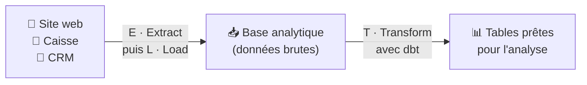
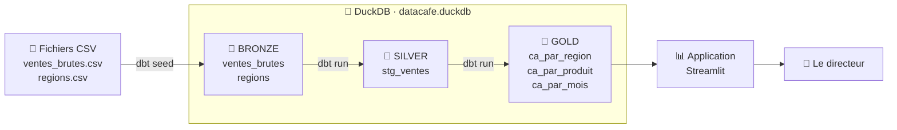
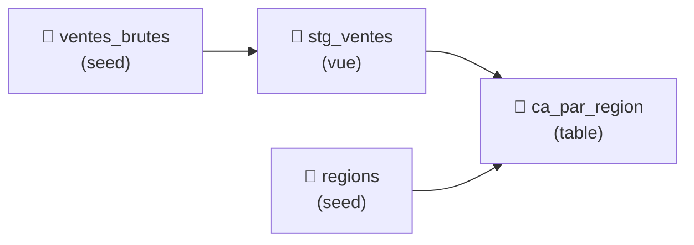
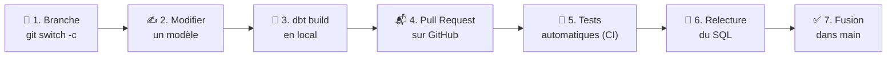

# Chapitre 7 · Industrialiser les transformations avec dbt 🏗️☕

> **🎬 DataCafé, épisode 7 : La torréfaction des données.** Lundi matin, le site web exporte les ventes du week-end : une vente en double, une ville écrite `paris`, une quantité oubliée. Les requêtes du chapitre 6 donnent des chiffres faux, et le directeur les a présentés en réunion. 😱 Léa est formelle : *« On ne sert pas des grains crus pleins de cailloux ! On trie, on torréfie, on goûte, puis on sert. »* Votre mission : **construire le pipeline de données de DataCafé avec dbt, de la donnée brute jusqu'au tableau de bord, avec des contrôles qualité automatiques.**

| | |
|---|---|
| ⏱️ **Durée** | 4h (2 séances de 2h) |
| 🎯 **Prérequis** | Chapitre 6 : le dépôt `datacafe-streamlit`, l'environnement virtuel `stenv`, savoir écrire un `SELECT ... GROUP BY`. Chapitre 4 : branches et Pull Requests. |
| 💻 **À préparer avant la séance** | **Installer dbt** dans `stenv` (voir la section ci-dessous, 10 min) et vérifier que `dbt --version` répond. |
| 🏅 **Titre à décrocher** | **Architecte des données** |

## 🎯 Objectifs de la séance

À la fin de ce chapitre, vous saurez :

- expliquer à quoi sert **dbt** et pourquoi on ne se contente pas de fichiers `.sql` éparpillés ;
- décrire l'architecture **bronze / silver / gold** (dite « médaillon ») ;
- créer un projet dbt connecté à DuckDB (`dbt init`, `profiles.yml`, `dbt debug`) ;
- charger des fichiers CSV avec les **seeds** et écrire des **modèles** reliés par `ref()` ;
- protéger vos chiffres avec des **tests** de qualité (`dbt test`, `dbt build`) ;
- générer une **documentation** interactive (`dbt docs`) ;
- faire vivre tout cela dans Git et GitHub, jusqu'au tableau de bord **Streamlit**.

> [!NOTE]
> **Où en est-on dans la boucle DevOps ?** dbt outille deux étapes de la boucle pour les données : **🧱 Build** (construire les tables dans le bon ordre) et **🧪 Test** (vérifier automatiquement leur qualité). C'est le pilier **A de CALMS** : l'**Automatisation**. Avec les Pull Requests et l'intégration continue, on boucle la boucle jusqu'au **📦 Release**.

---

## 💻 À préparer avant la séance : installer dbt

À faire chez vous, **avant la séance 1** (10 min). En classe, on n'aura pas le temps d'attendre les téléchargements.

**1.** Ouvrez un terminal dans votre dossier `datacafe-streamlit` et activez l'environnement virtuel `stenv` (comme au chapitre 6) :

<details>
<summary>🪟 Sur Windows</summary>

```powershell
cd ~/cours-devops/datacafe-streamlit
stenv\Scripts\activate
```
</details>

<details>
<summary>🍎 Sur macOS / 🐧 Linux</summary>

```bash
cd ~/cours-devops/datacafe-streamlit
source stenv/bin/activate
```
</details>

**2.** Ajoutez deux lignes à votre `requirements.txt`, qui doit maintenant contenir :

```text
streamlit
pandas
duckdb
dbt-core
dbt-duckdb
```

- `dbt-core` est le **moteur** de dbt ;
- `dbt-duckdb` est l'**adaptateur** : la « prise » qui permet à dbt de parler à DuckDB. (Il existe un adaptateur par base de données : `dbt-snowflake`, `dbt-postgres`, `dbt-bigquery`...)

**3.** Installez, puis vérifiez :

```bash
pip install -r requirements.txt
dbt --version
```

Vous devez voir quelque chose comme (les numéros exacts peuvent être différents) :

```text
Core:
  - installed: 1.10.x
  - latest:    1.10.x - Up to date!

Plugins:
  - duckdb: 1.10.x - Up to date!
```

<details>
<summary>🆘 Ça ne marche pas ?</summary>

- **`dbt` : commande introuvable** → l'environnement virtuel n'est pas activé : il doit y avoir `(stenv)` au début de la ligne de commande.
- **L'installation échoue avec de longs messages d'erreur rouges** → dbt a parfois quelques mois de retard sur les toutes dernières versions de Python. Vérifiez votre version avec `python --version` : si elle est très récente, installez **Python 3.12** ou **3.13**, recréez l'environnement virtuel avec cette version, et relancez l'installation.
- **Sur Windows, une erreur mentionnant « Microsoft Visual C++ »** → même cause : passez à Python 3.12.
- Toujours bloqué ? Venez **10 minutes avant** la séance avec votre ordinateur.
</details>

---

## Séance 1 · Du grain brut au premier modèle

### 💬 Tour de table

1. Le café que vous buvez le matin : par quelles étapes est-il passé, de la plantation à la tasse ? Que se passe-t-il si une étape est ratée ?
2. Dans votre dossier `requetes` du chapitre 6, imaginez que la requête `03` utilise le résultat de la requête `01`. Comment un nouveau collègue pourrait-il le deviner ?
3. Comment sauriez-vous, **avant** de présenter un chiffre au directeur, que les données d'origine contenaient un doublon ?

### 🎤 · Pourquoi dbt ?

**Le problème : la jungle des scripts SQL.**

```text
script1.sql
script_final.sql
script_final_v2.sql
script_final_v2_ok.sql
script_final_v2_ok_SOFIA_corrigé.sql
```

C'est le `accueil_final_VRAIMENT_final.html` du chapitre 3 ! Avec ce désordre, il est très difficile de :

- **comprendre les dépendances** : quel script lancer avant lequel ?
- **reproduire** les traitements : qui a lancé quoi, dans quel ordre ?
- **collaborer** : deux personnes modifient le même script dans leur coin ;
- **faire confiance aux chiffres** : rien ne vérifie que les données sont propres ;
- **documenter** : que contient la colonne `ca_v2` ? Personne ne s'en souvient.

**La solution : dbt** (*data build tool*, « l'outil de construction des données »), un outil **gratuit et open source** qui transforme les données **en écrivant uniquement des requêtes `SELECT`**. C'est l'outil de référence des **Analytics Engineers**.

1. Les données brutes sont rangées dans une base de données (pour nous : **DuckDB**).
2. Chaque transformation est un fichier `.sql` contenant un simple `SELECT` : un **modèle**.
3. dbt **exécute** les modèles **dans le bon ordre** et crée les tables et vues correspondantes.
4. dbt **teste** la qualité des résultats et **génère la documentation**.
5. Tout est fait de fichiers texte, donc tout est **versionné dans Git**.

> 💡 **Analogie : le chef et ses fiches recettes.** 👨‍🍳 Chaque préparation a sa **fiche recette** (un modèle dbt). Le **chef** (dbt) lit toutes les fiches, comprend que la sauce doit être prête **avant** le plat qui l'utilise, organise le travail dans le bon ordre, **goûte** chaque préparation avant l'envoi en salle (les tests) et tient à jour **la carte** affichée pour les clients (la documentation).

> [!IMPORTANT]
> **dbt n'est pas une base de données.** Il ne stocke aucune donnée : il **envoie des ordres SQL** à une base (DuckDB, Snowflake, BigQuery, PostgreSQL...) qui fait le travail et garde les tables. dbt est le **chef d'orchestre**, DuckDB est l'**orchestre**. 🎻

| Sans dbt 😰 | Avec dbt 😎 |
|---|---|
| L'ordre d'exécution est dans la tête de quelqu'un | dbt **calcule** l'ordre tout seul grâce à `ref()` |
| On écrit des `CREATE TABLE`, `DROP TABLE`... à la main | On écrit seulement des `SELECT`, dbt s'occupe du reste |
| On découvre les erreurs en réunion avec le directeur | Des **tests** automatiques alertent avant |
| La documentation est un vieux Word jamais à jour | La documentation est **générée** à partir du code |
| Des scripts copiés sur des clés USB | Un projet **versionné dans Git**, relu en **Pull Request** |

<details>
<summary>🔬 Pour les curieux : ETL, ELT et la place de dbt</summary>

Pour alimenter un tableau de bord, il faut trois opérations :

- **E**xtract : **extraire** les données des applications (site web, caisse, CRM...) ;
- **L**oad : les **charger** dans une base analytique ;
- **T**ransform : les **transformer** (nettoyer, croiser, agréger).

Autrefois, on transformait **avant** de charger (**ETL**), avec des outils lourds. Aujourd'hui, les bases analytiques sont si rapides qu'on charge d'abord les données brutes, puis on les transforme **dans la base** (**ELT**). dbt est spécialisé dans le **T** de ELT.



Il existe deux versions : **dbt Core**, gratuit, utilisé dans le terminal (celui qu'on installe), et **dbt Cloud**, la version payante en ligne de dbt Labs. Les projets sont les mêmes.
</details>

### 🎤 · L'architecture médaillon : bronze, silver, gold 🥉🥈🥇

Les équipes data rangent leurs tables en **trois couches**, comme les médailles olympiques : c'est l'**architecture médaillon** (*medallion architecture*).

> 💡 **Analogie : du caféier à la tasse.** ☕
> - 🥉 **Bronze** : les **grains verts**, tels qu'ils arrivent du producteur, avec parfois des cailloux. On les stocke **sans y toucher**.
> - 🥈 **Silver** : les **grains triés et torréfiés** : on a retiré les cailloux, tous les grains ont la même cuisson. Les données sont **propres et standardisées**.
> - 🥇 **Gold** : **la tasse servie au client**. Les données sont **agrégées** en indicateurs que le directeur comprend sans effort.

| Couche | Contenu | Chez DataCafé | Qui l'utilise ? |
|---|---|---|---|
| 🥉 **Bronze** | Les données **brutes**, copiées telles quelles depuis la source | `ventes_brutes` (avec le doublon et le `paris` en minuscules) | Personne directement : c'est la réserve |
| 🥈 **Silver** | Les données **nettoyées** : sans doublons, bons types, valeurs standardisées | `stg_ventes` (une ligne = une vente propre) | Les analystes et data scientists |
| 🥇 **Gold** | Des **indicateurs** prêts à l'emploi, pensés pour un usage métier | `ca_par_region`, `ca_par_produit`, `ca_par_mois` | Les tableaux de bord, le directeur |

Le pipeline que nous allons construire :



> [!NOTE]
> Pourquoi garder la couche bronze, si elle est sale ? Parce que si on découvre un jour une erreur dans le nettoyage, on peut **tout reconstruire** à partir des données d'origine. On ne jette jamais les grains verts. 🔁

### 🛠️ À vous de jouer · 7.1 Bronze, silver ou gold ?

🟢 *5 min, individuel.* Pour chaque table, indiquez sa couche :

1. Le fichier JSON des commandes, tel que reçu du site web ce matin.
2. Le nombre de clients actifs par mois, affiché sur le tableau de bord.
3. La liste des clients, avec les e-mails mis en minuscules et les doublons supprimés.
4. Le taux de satisfaction par café, présenté au comité de direction.
5. L'export brut du logiciel de caisse.
6. Les commandes, avec les dates converties au bon format et les montants en euros.

✅ **Vous avez réussi si** vous savez justifier chaque réponse en une phrase.

### 🧠 Quiz en classe

**Q1.** Que fait dbt ?

- A. Il stocke les données à la place de DuckDB
- B. Il exécute des transformations écrites en SQL, dans le bon ordre, et les teste
- C. Il dessine des graphiques
- D. Il remplace Git

**Q2.** Dans dbt, un **modèle** est...

- A. une maquette de site web
- B. un fichier `.sql` contenant une requête `SELECT`
- C. un modèle d'intelligence artificielle
- D. un fichier Excel

**Q3.** Vrai ou faux : avec dbt, on doit écrire soi-même les `CREATE TABLE` et `DROP TABLE`.

**Q4.** Dans l'analogie du restaurant, que représentent les **tests** dbt ?

**Q5.** Pourquoi garde-t-on la couche bronze, alors qu'elle contient des erreurs ?

### 👀 Démonstration · Créer le projet dbt

Observez les 7 étapes ; vous les refaites juste après.

**Étape 1 · Une branche pour le pipeline.** Une nouvelle fonctionnalité, une nouvelle branche :

```bash
cd ~/cours-devops/datacafe-streamlit
git switch main
git pull
git switch -c pipeline-dbt
```

**Étape 2 · Activer `stenv`** (dbt y est installé, voir « À préparer avant la séance ») et vérifier avec `dbt --version`.

**Étape 3 · Créer le projet.** Depuis le dossier `datacafe-streamlit` :

```bash
dbt init datacafe_dbt --skip-profile-setup
```

Traduction : *« Crée un projet dbt nommé `datacafe_dbt`, sans poser de questions sur la connexion (on la configure nous-mêmes). »* Un nom de projet dbt ne contient que des minuscules, des chiffres et des tirets bas `_`.

```text
datacafe_dbt/
├── analyses/          ← des requêtes d'exploration (on ne s'en sert pas ici)
├── macros/            ← des fonctions réutilisables (pour les experts)
├── models/            ← ⭐ VOS MODÈLES : les fichiers .sql de transformation
│   └── example/       ← deux modèles d'exemple, qu'on va supprimer
├── seeds/             ← ⭐ les petits fichiers CSV à charger dans la base
├── snapshots/         ← l'historique des changements (pour les experts)
├── tests/             ← ⭐ vos tests personnalisés
├── .gitignore         ← les fichiers que Git doit ignorer
├── dbt_project.yml    ← ⭐ la carte d'identité du projet
└── README.md
```

Entrez dans le projet, puis, dans la barre latérale de VS Code, **supprimez le dossier `models/example`** et créez deux dossiers vides dans `models` : **`silver`** et **`gold`**.

```bash
cd datacafe_dbt
```

> [!IMPORTANT]
> **À partir de maintenant, toutes les commandes `dbt` se lancent depuis le dossier `datacafe_dbt`.** Si dbt répond *No dbt_project.yml found*, vous n'êtes pas au bon endroit : vérifiez avec `pwd`.

**Étape 4 · La carte d'identité du projet.** Ouvrez `dbt_project.yml` et **remplacez tout son contenu** par :

```yaml
name: 'datacafe_dbt'
version: '1.0.0'
profile: 'datacafe_dbt'      # le nom de la connexion à utiliser (voir profiles.yml)

model-paths: ["models"]
analysis-paths: ["analyses"]
test-paths: ["tests"]
seed-paths: ["seeds"]
macro-paths: ["macros"]
snapshot-paths: ["snapshots"]

clean-targets:
  - "target"
  - "dbt_packages"

models:
  datacafe_dbt:
    silver:
      +materialized: view    # les modèles du dossier silver deviennent des vues
    gold:
      +materialized: table   # les modèles du dossier gold deviennent des tables
```

C'est un fichier **YAML** (prononcé « yamel »), très utilisé pour écrire des réglages.

> 💡 **Analogie : le YAML, c'est une liste de courses bien rangée.** 📝 Chaque ligne est un réglage `nom: valeur`, et les **espaces en début de ligne** (l'indentation) indiquent ce qui appartient à quoi, comme les sous-rayons d'un supermarché. Ici, `+materialized: table` appartient à `gold`, qui appartient à `datacafe_dbt`, qui appartient à `models`.

> [!WARNING]
> **Le YAML est très pointilleux sur l'indentation.** Toujours **2 espaces** par niveau, **jamais de tabulation**. La plupart des erreurs dbt des débutants viennent d'un espace en trop ou en moins.

<details>
<summary>🔬 Pour les curieux : vue ou table ?</summary>

C'est la **matérialisation** : la forme que prend un modèle dans la base.

| | **Vue** (`view`) | **Table** (`table`) |
|---|---|---|
| **Ce qui est stocké** | seulement la **requête** | le **résultat** de la requête |
| **Quand le calcul a lieu** | à chaque fois qu'on lit la vue | une fois, au moment du `dbt run` |
| 💡 **Au café** | la recette affichée au mur : on la prépare à la commande | le plat préparé à l'avance, prêt à servir |
| **Idéal pour...** | les étapes intermédiaires (silver) | ce qui est lu souvent, comme un tableau de bord (gold) |

Il existe d'autres matérialisations (`incremental` pour n'ajouter que les nouvelles lignes, `ephemeral`...), utiles sur de gros projets.
</details>

**Étape 5 · La connexion à DuckDB.** Créez le fichier `profiles.yml` **dans le dossier `datacafe_dbt`** (à côté de `dbt_project.yml`) :

```yaml
datacafe_dbt:              # le même nom que "profile:" dans dbt_project.yml
  target: dev              # la cible utilisée par défaut
  outputs:
    dev:                   # la cible "dev" (développement)
      type: duckdb         # on utilise l'adaptateur DuckDB
      path: datacafe.duckdb   # le fichier de la base (créé automatiquement)
      threads: 1           # le nombre de tâches en parallèle
```

> [!NOTE]
> Par défaut, dbt cherche ce fichier dans un dossier caché (`~/.dbt/profiles.yml`), mais il regarde **d'abord dans le dossier courant**. On le met dans le projet pour qu'il soit visible et partagé avec l'équipe. C'est possible parce qu'une base DuckDB n'a **pas de mot de passe**.
> ⚠️ Avec une base protégée (Snowflake, PostgreSQL...), on ne met **jamais** un mot de passe dans un fichier versionné : on utilise des **variables d'environnement** (des secrets), comme le jeton GitHub du chapitre 4.

**Étape 6 · Le test de connexion.**

```bash
dbt debug
```

dbt vérifie la version de Python, `dbt_project.yml`, `profiles.yml` et la connexion à DuckDB. Observez la fin :

```text
  Connection test: [OK connection ok]

All checks passed!
```

**Étape 7 · Premier commit.** dbt a créé un `.gitignore` **dans** `datacafe_dbt`, qui ignore ses dossiers de travail : `target/` (le SQL compilé et la documentation générée), `dbt_packages/` et `logs/`. S'il n'existe pas chez vous, créez-le avec ces trois lignes. Le `*.duckdb` ajouté au chapitre 6 dans le `.gitignore` principal s'applique aussi aux sous-dossiers.

```bash
git status
```

Observez que seuls les fichiers du projet apparaissent (pas de `datacafe.duckdb`, pas de `target/`). Puis :

```bash
git add .
git commit -m "Création du projet dbt datacafe_dbt"
```

> `git add .` ajoute tout le dossier courant. On peut se le permettre parce que le `.gitignore` filtre ce qui ne doit pas partir, mais gardez le réflexe de vérifier avec `git status` avant.

### 🛠️ À vous de jouer · 7.2 Le chantier est prêt

🟢 *20 min, individuel.* Refaites les étapes 1 à 7 de la démonstration.

1. Créez la branche `pipeline-dbt`.
2. Activez `stenv` et lancez `dbt init datacafe_dbt --skip-profile-setup`.
3. Supprimez `models/example`, créez `models/silver` et `models/gold`.
4. Remplacez le contenu de `dbt_project.yml`.
5. Créez `profiles.yml`.
6. Lancez `dbt debug`.
7. Vérifiez avec `git status`, puis faites le commit.

🟡 Si vous avez terminé : aidez votre voisin, puis lisez l'encadré « 🔬 Vue ou table ? » et expliquez-le-lui.

✅ **Vous avez réussi si** :

- `dbt debug` affiche **All checks passed!** ;
- `git log --oneline` affiche votre commit « Création du projet dbt » ;
- `git status` n'affiche ni `target/`, ni `datacafe.duckdb`, ni `stenv/`.

<details>
<summary>🆘 Ça ne marche pas ?</summary>

- **`Could not find profile named 'datacafe_dbt'`** → le nom tout en haut de `profiles.yml` doit être **exactement** celui de la ligne `profile:` de `dbt_project.yml`. Vérifiez aussi que `profiles.yml` est bien **dans** le dossier `datacafe_dbt` et que vous lancez dbt **depuis** ce dossier.
- **`Runtime Error ... yaml`** ou **`mapping values are not allowed here`** → erreur d'indentation YAML. Comparez votre fichier avec le modèle, espace par espace. Pas de tabulation !
- **`No dbt_project.yml found`** → vous n'êtes pas dans le bon dossier : `cd datacafe_dbt`.
- **Un avertissement jaune `[WARNING]` parle de `example`** → l'ancienne configuration est restée dans `dbt_project.yml` : remplacez bien **tout** son contenu.
</details>

### 🎤 · La couche bronze : les seeds 🥉

Les **seeds** (« graines ») sont de **petits fichiers CSV** rangés dans le dossier `seeds/`, que dbt charge tels quels dans la base avec `dbt seed`. Parfait pour la couche bronze et pour les petites tables de référence (villes, pays, catégories...).

<details>
<summary>🔬 Pour les curieux : seeds ou sources ?</summary>

Les seeds sont faits pour de **petits** fichiers qui changent rarement et qu'on accepte de versionner dans Git (quelques milliers de lignes au maximum). Pour de vraies données de production (des millions de lignes, mises à jour chaque jour), on ne les met pas dans Git : on les déclare comme **sources** (voir la séance 2). Ici, on utilise les seeds parce que c'est le moyen le plus simple de démarrer.
</details>

### 🛠️ À vous de jouer · 7.3 Les graines de données

🟢 *10 min, individuel.*

**1.** Créez le fichier `seeds/ventes_brutes.csv`. C'est l'historique du chapitre 6... **plus** les 3 lignes exportées par le site web ce week-end (les 3 dernières) :

```csv
date,produit,region,quantite,prix_unitaire
2026-01-05,Espresso,Paris,3,10.00
2026-01-08,Cappuccino,Marseille,2,12.50
2026-01-12,Moka,Lyon,1,15.00
2026-01-15,Espresso,Lille,5,10.00
2026-01-20,Latte,Paris,2,11.00
2026-01-27,Cappuccino,Paris,4,12.50
2026-02-02,Moka,Marseille,2,15.00
2026-02-06,Espresso,Lyon,7,10.00
2026-02-10,Latte,Lille,3,11.00
2026-02-14,Moka,Paris,4,15.00
2026-02-18,Cappuccino,Lille,2,12.50
2026-02-25,Espresso,Marseille,2,10.00
2026-03-03,Latte,Lyon,5,11.00
2026-03-09,Cappuccino,Lyon,3,12.50
2026-03-14,Espresso,Paris,4,10.00
2026-03-19,Moka,Lille,2,15.00
2026-03-24,Latte,Marseille,1,11.00
2026-03-30,Cappuccino,Marseille,6,12.50
2026-03-30,Cappuccino,Marseille,6,12.50
2026-03-31,Espresso,paris,2,10.00
2026-03-31,Moka,Lille,,15.00
```

🕵️ Repérez les **3 problèmes** cachés dans les 3 dernières lignes.

**2.** Créez le fichier `seeds/regions.csv`, la table de référence des villes :

```csv
region,responsable,objectif_ca
Paris,Karim,200
Lyon,Tom,150
Marseille,Sofia,180
Lille,Léa,150
```

**3.** Chargez les deux fichiers dans DuckDB :

```bash
dbt seed
```

```text
1 of 2 START seed file main.regions ........................ [RUN]
1 of 2 OK loaded seed file main.regions .................... [INSERT 4 in 0.08s]
2 of 2 START seed file main.ventes_brutes .................. [RUN]
2 of 2 OK loaded seed file main.ventes_brutes .............. [INSERT 21 in 0.05s]

Completed successfully
```

dbt a créé deux tables dans `datacafe.duckdb`. (`main` est le nom du « rayon » par défaut d'une base DuckDB, qu'on appelle un **schéma**.)

**4.** Vérifiez avec le terminal DuckDB du chapitre 6 :

```bash
duckdb datacafe.duckdb
```

```sql
.tables
SELECT * FROM ventes_brutes WHERE date >= '2026-03-30';
.quit
```

> [!WARNING]
> **N'oubliez pas le `.quit` !** Un fichier DuckDB ne peut être modifié que par **un seul programme à la fois**. Si le terminal DuckDB est encore ouvert sur `datacafe.duckdb`, le prochain `dbt run` échouera avec *Could not set lock on file*. Le réflexe : **on regarde, puis on quitte.**

✅ **Vous avez réussi si** `dbt seed` affiche `INSERT 4` et `INSERT 21`, et si vous savez nommer les 3 problèmes.

### 👀 Démonstration · Le premier modèle silver et `ref()` 🥈

Tapez en même temps que le professeur. Créez le fichier `models/silver/stg_ventes.sql` (`stg` pour *staging*, « préparation », le nom traditionnel des modèles de nettoyage) :

```sql
-- Couche SILVER : les ventes nettoyées
-- Une ligne = une vente, sans doublon, sans quantité manquante, avec des villes bien écrites.

SELECT DISTINCT
    CAST(date AS DATE)                                                AS date_vente,
    TRIM(produit)                                                     AS produit,
    UPPER(LEFT(TRIM(region), 1)) || LOWER(SUBSTRING(TRIM(region), 2)) AS region,
    quantite,
    prix_unitaire,
    quantite * prix_unitaire                                          AS montant
FROM {{ ref('ventes_brutes') }}
WHERE quantite IS NOT NULL
```

| Morceau | Ce qu'il fait | Le problème réglé |
|---|---|---|
| `SELECT DISTINCT` | Ne garde qu'**un exemplaire** des lignes identiques | 🗑️ le doublon du 30 mars |
| `CAST(date AS DATE) AS date_vente` | Garantit que la colonne est bien une **date**, avec un nom plus clair | 📅 un type sûr |
| `TRIM(produit)` | Retire les **espaces** invisibles au début et à la fin | 🧹 `" Moka"` devient `"Moka"` |
| `UPPER(LEFT(...,1)) \|\| LOWER(SUBSTRING(...,2))` | **Première lettre en majuscule** (`UPPER`), le reste en minuscules (`LOWER`), et on colle les deux morceaux (`\|\|`) | 🔠 `paris` devient `Paris` |
| `quantite * prix_unitaire AS montant` | Calcule le montant une bonne fois pour toutes | 🧮 plus besoin de le recalculer partout |
| `FROM {{ ref('ventes_brutes') }}` | Lit la table bronze (voir ci-dessous) | 🔗 la dépendance est déclarée |
| `WHERE quantite IS NOT NULL` | Écarte les lignes **sans quantité** (`IS NOT NULL` = « n'est pas vide ») | ❓ la quantité oubliée |

> [!IMPORTANT]
> **Pas de point-virgule** à la fin d'un modèle dbt. dbt « emballe » votre requête dans sa propre commande `CREATE VIEW ... AS (votre requête)`, et un `;` au milieu la casserait.

**La magie de `ref()`.** Les doubles accolades `{{ ... }}` signalent un **morceau de code dbt** (écrit en *Jinja*), que dbt remplace par le vrai nom de la table avant d'envoyer la requête à DuckDB.

> 💡 **Analogie : le publipostage.** ✉️ Dans un courrier type, on écrit « Bonjour {{ prénom }} », et le logiciel remplace par « Bonjour Karim », « Bonjour Sofia »... Ici, dbt remplace `{{ ref('ventes_brutes') }}` par le nom complet de la table, par exemple `"datacafe"."main"."ventes_brutes"`.

Pourquoi pas `FROM ventes_brutes` ? Parce que `ref()` dit à dbt : **« ce modèle dépend de `ventes_brutes` »**. Grâce à cela, dbt :

- ✅ **calcule l'ordre** d'exécution tout seul (d'abord `ventes_brutes`, puis `stg_ventes`) ;
- ✅ dessine le **graphe des dépendances** (le *lineage*) dans la documentation ;
- ✅ permet de changer de base (développement, production) **sans modifier une ligne** de SQL.

**On torréfie :**

```bash
dbt run
```

```text
1 of 1 START sql view model main.stg_ventes ................ [RUN]
1 of 1 OK created sql view model main.stg_ventes ........... [OK in 0.06s]

Completed successfully

Done. PASS=1 WARN=0 ERROR=0 SKIP=0 NO-OP=0 TOTAL=1
```

Observez que dbt a créé une **vue** (`view model`), comme réglé pour le dossier `silver` dans `dbt_project.yml`.

<details>
<summary>🔬 Pour les curieux : qu'a vraiment envoyé dbt à DuckDB ?</summary>

Ouvrez `target/compiled/datacafe_dbt/models/silver/` : votre requête **compilée**, avec le `{{ ref(...) }}` remplacé. Et dans `target/run/...`, la commande complète exécutée, du genre :

```sql
create view "datacafe"."main"."stg_ventes" as (
    SELECT DISTINCT ...
    FROM "datacafe"."main"."ventes_brutes"
    WHERE quantite IS NOT NULL
);
```

C'est tout le travail que vous n'avez pas eu à écrire. (Et c'est pour cela que `target/` est ignoré par Git : il est régénéré à chaque exécution.)
</details>

### 🛠️ À vous de jouer · 7.4 Le contrôle du torréfacteur

🟢 *10 min, individuel.* Ouvrez DuckDB (`duckdb datacafe.duckdb`) et vérifiez le travail de la couche silver :

1. Combien de lignes contient `ventes_brutes` ? Et `stg_ventes` ? Expliquez la différence.
2. Combien de ventes compte `Paris` dans `stg_ventes` ? Et dans `ventes_brutes` (avec `WHERE region = 'Paris'`) ? Expliquez.
3. Quittez avec `.quit`, puis commitez : `git add .` et `git commit -m "Couche bronze (seeds) et silver (stg_ventes)"`.

🟡 Si vous avez terminé : ouvrez le dossier `target/compiled/` et retrouvez votre requête compilée.

✅ **Vous avez réussi si** vous expliquez chaque écart de nombre de lignes par un des 3 problèmes du fichier brut.

### 👀 Démonstration · La couche gold et le graphe des dépendances 🥇

Créez le fichier `models/gold/ca_par_region.sql`. C'est la jointure 🟡 du chapitre 6, avec `ref()` pour **les deux** tables :

```sql
-- Couche GOLD : chiffre d'affaires par ville, comparé à l'objectif du responsable

SELECT
    r.region,
    r.responsable,
    r.objectif_ca,
    COUNT(*)                         AS nb_ventes,
    SUM(v.montant)                   AS chiffre_affaires,
    SUM(v.montant) >= r.objectif_ca  AS objectif_atteint
FROM {{ ref('stg_ventes') }} AS v
JOIN {{ ref('regions') }}    AS r ON v.region = r.region
GROUP BY r.region, r.responsable, r.objectif_ca
```

```bash
dbt run
```

Observez que dbt exécute maintenant **2 modèles**, dans le bon ordre : d'abord `stg_ventes`, puis `ca_par_region`, parce que ce dernier utilise `ref('stg_ventes')`. On n'a rien eu à préciser. 🪄

Le résultat (vérifié dans DuckDB, puis `.quit`) :

| region | responsable | objectif_ca | nb_ventes | chiffre_affaires | objectif_atteint |
|---|---|---|---|---|---|
| Paris | Karim | 200 | 6 | 222.0 | ✅ true |
| Lyon | Tom | 150 | 4 | 177.5 | ✅ true |
| Marseille | Sofia | 180 | 5 | 161.0 | ❌ false |
| Lille | Léa | 150 | 4 | 138.0 | ❌ false |

**Le graphe des dépendances**, que dbt déduit simplement en lisant les `ref()` :



C'est un **DAG** (*Directed Acyclic Graph*, « graphe orienté sans boucle ») : des flèches qui vont toujours dans le même sens, de la donnée brute vers l'indicateur, sans jamais revenir en arrière. C'est la **chaîne de fabrication** de vos données.

**Choisir ce qu'on exécute : `--select`.** Sur un projet de 300 modèles, on ne relance pas tout à chaque modification :

| Commande | Ce qu'elle exécute |
|---|---|
| `dbt run` | tous les modèles |
| `dbt run --select stg_ventes` | uniquement le modèle `stg_ventes` |
| `dbt run --select gold` | tous les modèles du dossier `gold` |
| `dbt run --select +ca_par_region` | `ca_par_region` **et tout ce dont il dépend** (le `+` devant = « avec ses parents ») |
| `dbt run --select stg_ventes+` | `stg_ventes` **et tout ce qui en dépend** (le `+` derrière = « avec ses enfants ») |

### 🧠 Quiz en classe

**Q1.** Que fait la commande `dbt seed` ?

- A. Elle supprime les fichiers CSV
- B. Elle charge les fichiers CSV du dossier `seeds/` dans la base de données
- C. Elle plante des graines dans le jardin de DataCafé 🌱
- D. Elle envoie le projet sur GitHub

**Q2.** Pourquoi écrit-on `FROM {{ ref('stg_ventes') }}` plutôt que `FROM stg_ventes` ?

**Q3.** Dans quel ordre dbt exécute-t-il ces modèles ? `ca_par_region` (qui utilise `stg_ventes`) · `stg_ventes` (qui utilise `ventes_brutes`)

**Q4.** Quelle commande exécute `ca_par_mois` **et** tous les modèles dont il dépend ?

- A. `dbt run --select ca_par_mois+`
- B. `dbt run --select +ca_par_mois`
- C. `dbt run ca_par_mois --all`
- D. `dbt seed ca_par_mois`

**Q5.** Pourquoi ne met-on pas de `;` à la fin d'un modèle dbt ?

## 📌 À retenir (séance 1)

- **dbt** transforme les données avec de simples `SELECT`, dans le bon ordre. Il ne stocke rien : c'est **DuckDB** qui garde les données.
- **Médaillon** : 🥉 bronze (brut), 🥈 silver (nettoyé), 🥇 gold (indicateurs).
- Un projet dbt : `dbt_project.yml` (la carte d'identité), `profiles.yml` (la connexion), `seeds/`, `models/`, `tests/`.
- `dbt debug` → `dbt seed` → `dbt run`, toujours **depuis le dossier `datacafe_dbt`**.
- `{{ ref('modele') }}` déclare les dépendances : dbt en déduit l'ordre et le graphe (DAG).

## 🏠 Avant la prochaine séance

- Si vous n'avez pas terminé : avoir `stg_ventes` et `ca_par_region` qui passent avec `dbt run`, et les commits correspondants sur la branche `pipeline-dbt`.
- Retrouvez vos requêtes du chapitre 6 (`requetes/02_ca_par_produit.sql` et `requetes/03_ca_par_mois.sql`) : on les transforme en modèles gold en début de séance.

---

## Séance 2 · Tester, documenter, livrer

### 💬 Tour de table

1. Que fait `ref()`, en une phrase ?
2. Où se trouve la vente `paris` du 31 mars après le passage en silver ?
3. Qui a eu une erreur en rentrant chez soi ? Laquelle ?

### 🛠️ À vous de jouer · 7.5 Votre propre carte des cafés

🟢 *15 min, individuel.* Vous avez écrit ces requêtes au chapitre 6, dans le dossier `requetes`. Transformez-les en **modèles gold** qui lisent la couche silver.

1. Créez `models/gold/ca_par_produit.sql` : par produit, le nombre de **paquets** vendus et le **chiffre d'affaires**.
2. Créez `models/gold/ca_par_mois.sql` : par mois (`strftime(date_vente, '%Y-%m')`), le nombre de ventes et le chiffre d'affaires.
3. Lancez uniquement la couche gold : `dbt run --select gold`.
4. Comparez avec les résultats du chapitre 6. **Le classement des cafés a-t-il changé ?** Pourquoi ?
5. Commitez : `git add .` puis `git commit -m "Couche gold : CA par ville, par produit et par mois"`.

> [!TIP]
> Les trois différences avec votre requête du chapitre 6 : on lit `{{ ref('stg_ventes') }}` au lieu de `read_csv('ventes.csv')`, on utilise les colonnes toutes prêtes `montant` et `date_vente`, et on ne met **pas** de `;` à la fin.

🔴 **Défi : le piège silencieux de la jointure.** Imaginez qu'on n'ait **pas** de couche silver, et que `ca_par_region` lise directement `ventes_brutes` (avec `quantite * prix_unitaire` à la place de `montant`). Quel chiffre d'affaires afficherait-on pour Paris ? Pour Marseille ? Y aurait-il un message d'erreur ?

✅ **Vous avez réussi si** `dbt run --select gold` affiche 3 modèles `OK` et que vous savez expliquer pourquoi le classement des cafés a changé.

### 🎤 · Les tests : goûter avant de servir 🧪

Les DEV testent leur code (étape **🧪 Test** de la boucle DevOps). Les équipes data testent leurs **données**, pour détecter :

- des **erreurs d'import** (une colonne vide, un fichier tronqué) ;
- des **données corrompues** (une ville inconnue, un prix négatif) ;
- des **régressions** : une modification du code qui casse un chiffre qui était juste.

> 💡 **Analogie : le *cupping*.** ☕ Chez les torréfacteurs, chaque lot de café est **goûté** selon un protocole précis avant d'être vendu. Si un lot a un défaut, il ne part pas chez le client. Les tests dbt, c'est le *cupping* de vos données.

**Les 4 tests génériques de dbt**, prêts à l'emploi, déclarés dans un fichier YAML :

| Test | Il vérifie que... | Exemple chez DataCafé |
|---|---|---|
| `not_null` | la colonne n'a **aucune valeur vide** | chaque vente a une date |
| `unique` | chaque valeur n'apparaît **qu'une seule fois** | une seule ligne par ville dans `ca_par_region` |
| `accepted_values` | les valeurs font partie d'une **liste autorisée** | le produit est Espresso, Cappuccino, Latte ou Moka |
| `relationships` | chaque valeur **existe dans une autre table** | chaque ville des ventes existe dans `regions` |

**Le test singulier** : pour une règle métier bien à nous, on écrit dans `tests/` une requête qui cherche les **coupables**.

> 💡 Un test dbt, c'est un **avis de recherche** : la requête cherche des lignes coupables. Si elle n'en trouve aucune, tout va bien ✅. Si elle en trouve, le test échoue ❌ et dbt dit combien.

**`dbt build` : tout, dans le bon ordre.** Une seule commande enchaîne `dbt seed`, `dbt run` et `dbt test` **dans l'ordre du graphe**. Son super-pouvoir : si un test échoue sur un modèle, dbt **ne construit pas** les modèles qui en dépendent (ils sont marqués `SKIP`). **Si les grains sont mauvais, on ne sert pas la tasse.** ☕🚫

### 👀 Démonstration · Déclarer et lancer les tests

Tapez en même temps que le professeur. Créez le fichier `models/silver/silver.yml` :

```yaml
version: 2

models:
  - name: stg_ventes
    description: "Ventes nettoyées : une ligne par vente, sans doublon, sans quantité manquante, villes bien écrites."
    columns:
      - name: date_vente
        description: "Jour de la vente."
        data_tests:
          - not_null
      - name: produit
        description: "Café vendu."
        data_tests:
          - not_null
          - accepted_values:
              values: ['Espresso', 'Cappuccino', 'Latte', 'Moka']
      - name: region
        description: "Ville de livraison. Doit exister dans la table de référence regions."
        data_tests:
          - not_null
          - relationships:
              to: ref('regions')
              field: region
      - name: montant
        description: "Montant de la vente en euros (quantite x prix_unitaire)."
        data_tests:
          - not_null
```

Et le fichier `models/gold/gold.yml` :

```yaml
version: 2

models:
  - name: ca_par_region
    description: "Chiffre d'affaires du trimestre par ville, comparé à l'objectif du responsable. Alimente le tableau de bord du directeur."
    columns:
      - name: region
        description: "Ville."
        data_tests:
          - unique
          - not_null
      - name: chiffre_affaires
        description: "Chiffre d'affaires en euros."
      - name: objectif_atteint
        description: "Vrai (true) si le chiffre d'affaires atteint l'objectif."
```

Lisez-les à voix haute, c'est presque du français : *« Le modèle `stg_ventes` a une colonne `region`, qui ne doit jamais être vide, et dont chaque valeur doit exister dans la colonne `region` de `regions`. »*

> [!NOTE]
> **`data_tests:` ou `tests:` ?** Depuis dbt 1.8, le mot officiel est `data_tests:`. L'ancien mot `tests:` **fonctionne toujours** : vous le croiserez dans de nombreux tutoriels. Les deux font exactement la même chose.

<details>
<summary>🔬 Pour les curieux : l'avertissement sur <code>arguments</code></summary>

Dans les toutes dernières versions de dbt, un test qui prend des paramètres (comme `accepted_values` ou `relationships`) peut afficher un **avertissement** (en jaune, pas une erreur) qui suggère de ranger ces paramètres sous un mot `arguments:` :

```yaml
          - accepted_values:
              arguments:
                values: ['Espresso', 'Cappuccino', 'Latte', 'Moka']
```

Les deux écritures fonctionnent dans ces versions récentes. Avec une version de dbt plus ancienne, gardez l'écriture sans `arguments:` (celle du cours), qui marche partout.
</details>

Puis le test singulier, `tests/assert_montant_positif.sql` :

```sql
-- Test singulier : aucune vente ne doit avoir un montant négatif ou nul.
-- Le test RÉUSSIT si cette requête ne renvoie AUCUNE ligne.

SELECT *
FROM {{ ref('stg_ventes') }}
WHERE montant <= 0
```

On lance les tests :

```bash
dbt test
```

```text
1 of 9 START test accepted_values_stg_ventes_produit__Espresso__Cappuccino__Latte__Moka  [RUN]
1 of 9 PASS accepted_values_stg_ventes_produit__Espresso__Cappuccino__Latte__Moka ...... [PASS in 0.05s]
2 of 9 START test assert_montant_positif ............................................... [RUN]
2 of 9 PASS assert_montant_positif ..................................................... [PASS in 0.04s]
...
Completed successfully

Done. PASS=9 WARN=0 ERROR=0 SKIP=0 NO-OP=0 TOTAL=9
```

Observez : **9 tests verts** (8 déclarés dans les fichiers YAML + 1 test singulier). Puis tout en une commande :

```bash
dbt build
```

### 🛠️ À vous de jouer · 7.6 Le saboteur 🕵️

🟢 *15 min, individuel.* On vérifie que les tests protègent vraiment nos chiffres... en sabotant volontairement le nettoyage !

1. Si ce n'est pas déjà fait, créez `silver.yml`, `gold.yml` et `assert_montant_positif.sql` (démonstration ci-dessus), et vérifiez que `dbt build` est tout vert.
2. Dans `models/silver/stg_ventes.sql`, remplacez la longue ligne qui corrige la ville par simplement :

   ```sql
       TRIM(region) AS region,
   ```

3. Lancez `dbt build`. Notez : **quel test échoue ?** Combien de lignes coupables ? **Quels modèles sont marqués `SKIP` ? Pourquoi ?**
4. **Annulez le sabotage** : remettez la ligne d'origine (`Ctrl + Z` dans VS Code, ou `git restore models/silver/stg_ventes.sql`, comme au chapitre 3).
5. Relancez `dbt build` : tout doit repasser au vert.
6. Commitez les tests : `git add .` puis `git commit -m "Tests de qualité des couches silver et gold"`.

🟡 Si vous avez terminé : retrouvez la ligne coupable vous-même dans DuckDB, avec une requête qui cherche les villes de `stg_ventes` absentes de `regions`.

🔴 Défi : inventez un **second sabotage** que les tests actuels ne détectent **pas**, puis écrivez le test qui l'attraperait.

✅ **Vous avez réussi si** vous savez expliquer pourquoi les modèles gold ont été sautés, et si `dbt build` est de nouveau tout vert à la fin.

### 🧠 Quiz en classe

**Q1.** Quel test vérifie qu'une colonne ne contient aucune valeur vide ?

- A. `unique`
- B. `not_null`
- C. `accepted_values`
- D. `relationships`

**Q2.** Vous voulez vérifier que chaque `produit` de vos ventes existe dans une table `catalogue`. Quel test utilisez-vous ?

**Q3.** Un test singulier renvoie 3 lignes. Le test est-il réussi ?

**Q4.** Quelle est la différence entre `dbt run` et `dbt build` ?

**Q5.** Vrai ou faux : depuis dbt 1.8, on doit obligatoirement écrire `data_tests:`, et `tests:` provoque une erreur.

### 👀 Démonstration · La documentation automatique 📚

Les `description:` écrites dans les fichiers YAML servent à fabriquer un **site web de documentation** :

```bash
dbt docs generate     # fabrique la documentation (dans le dossier target/)
dbt docs serve        # l'affiche dans le navigateur
```

Le navigateur s'ouvre (à l'adresse `http://localhost:8080`). Observez :

- 📋 **tous les modèles et seeds**, avec leur description ;
- 🧱 **chaque colonne**, son type, sa description et ses tests ;
- 📝 **le code SQL** de chaque modèle, avant et après compilation ;
- 🕸️ **le graphe des dépendances** (*lineage graph*) : l'icône bleue en bas à droite de l'écran affiche la chaîne bronze → silver → gold.

Pour arrêter le serveur : dans le terminal, **`Ctrl + C`**.

> 💡 **Analogie : la carte du restaurant.** 🍽️ Elle est **imprimée à partir des fiches recettes** : quand le chef change une recette, la carte se met à jour toute seule. Plus jamais de documentation périmée !

### 🛠️ À vous de jouer · 7.7 La visite guidée

🟢 *7 min, individuel.*

1. Générez et ouvrez la documentation.
2. Trouvez la description de la colonne `montant` de `stg_ventes`.
3. Ouvrez le **lineage graph** de `ca_par_region` : combien de « parents » a-t-il en tout (directs et indirects) ?
4. 🟡 Ajoutez un fichier `seeds/seeds.yml` qui documente les deux seeds (une `description:` pour chacun, et les tests `unique` et `not_null` sur la colonne `region` de `regions`), puis régénérez la documentation.

✅ **Vous avez réussi si** vous montrez le lineage graph à votre voisin et nommez tous les parents de `ca_par_region`.

<details>
<summary>🆘 Ça ne marche pas ?</summary>

- **`Address already in use`** (le port 8080 est déjà utilisé) → choisissez un autre port : `dbt docs serve --port 8081`.
- **Le navigateur ne s'ouvre pas tout seul** → ouvrez-le vous-même à l'adresse `http://localhost:8080`.
- **Le terminal semble bloqué** → c'est normal, il fait tourner le serveur de documentation. `Ctrl + C` pour l'arrêter et retrouver la main.
</details>

### 🎤 Cours · dbt, Git, GitHub et Streamlit : la boucle bouclée ♾️

Dans une équipe professionnelle, **toute** modification du pipeline suit le GitHub Flow du chapitre 4, avec en plus des tests de données :



Chaque modification est **relue** (par un coéquipier), **testée** (par dbt) et **tracée** (par Git). C'est le **DataOps** : le DevOps appliqué aux données.

Et la base `datacafe.duckdb` ne part jamais sur GitHub : chaque coéquipier la reconstruit chez lui avec `dbt build`. **On partage la recette, pas le plat.**

### 🛠️ À vous de jouer · 7.8 Le tableau de bord gold

🟢 *10 min, individuel.* Au chapitre 6, les chiffres étaient calculés **dans** Streamlit. Désormais, dbt prépare la tasse : Streamlit n'a plus qu'à la **servir**.

1. **Revenez au dossier principal** du dépôt (`cd ..`) et créez le fichier `dashboard_gold.py` :

```python
import duckdb
import streamlit as st

st.set_page_config(page_title="Tableau de bord DataCafé", page_icon="🥇")
st.title("🥇 Le tableau de bord du directeur")
st.caption("Données préparées et testées par le pipeline dbt (couche gold).")

# On ouvre la base construite par dbt, en lecture seule, le temps de lire les tables gold
con = duckdb.connect("datacafe_dbt/datacafe.duckdb", read_only=True)
par_region = con.sql("SELECT * FROM ca_par_region ORDER BY chiffre_affaires DESC").df()
par_produit = con.sql("SELECT * FROM ca_par_produit ORDER BY chiffre_affaires DESC").df()
par_mois = con.sql("SELECT * FROM ca_par_mois ORDER BY mois").df()
con.close()   # on libère le fichier aussitôt, pour que dbt puisse le mettre à jour

st.subheader("🎯 Objectifs par ville")
st.dataframe(par_region, hide_index=True)

st.subheader("☕ Chiffre d'affaires par café")
st.bar_chart(par_produit, x="produit", y="chiffre_affaires")

st.subheader("📈 Évolution mensuelle")
st.line_chart(par_mois, x="mois", y="chiffre_affaires")
```

2. Lancez-le : `streamlit run dashboard_gold.py`.
3. Observez : **il n'y a plus aucun calcul** dans ce code, seulement des `SELECT *`. Toute l'intelligence est dans le pipeline dbt, testée et documentée.
4. Commitez : `git add dashboard_gold.py` puis `git commit -m "Tableau de bord branché sur la couche gold"`.

✅ **Vous avez réussi si** le tableau affiche Paris en tête avec 222 € et l'objectif atteint, et l'Espresso en tête des cafés.

<details>
<summary>🆘 Ça ne marche pas ?</summary>

- **`Catalog Error: Table with name ca_par_region does not exist`** → la base n'a pas été construite, ou Streamlit est lancé depuis le mauvais dossier. Faites `cd datacafe_dbt`, `dbt build`, `cd ..`, puis relancez Streamlit depuis `datacafe-streamlit`.
- **`Could not set lock on file`** → un autre programme (le terminal DuckDB, ou un `dbt run` en cours) utilise la base. Fermez-le et rafraîchissez la page.
- **Le fichier `datacafe.duckdb` n'est pas sur GitHub, c'est normal ?** → Oui ! Il est ignoré par Git. Chaque coéquipier le reconstruit avec `dbt build`.
</details>

<details>
<summary>🔴 Défi : les tests automatiques sur GitHub (intégration continue)</summary>

Et si GitHub lançait `dbt build` **tout seul**, à chaque Pull Request, pour refuser les modifications qui cassent les tests ? C'est l'**intégration continue** (CI) du chapitre 1, avec **GitHub Actions**.

À la racine du dépôt (dans `datacafe-streamlit`, pas dans `datacafe_dbt`), créez le fichier `.github/workflows/dbt.yml` :

```yaml
name: Pipeline dbt

on:
  pull_request:            # à chaque Pull Request...
  push:
    branches: [main]       # ...et à chaque mise à jour de main

jobs:
  dbt-build:
    runs-on: ubuntu-latest           # un ordinateur Linux prêté par GitHub
    defaults:
      run:
        working-directory: datacafe_dbt
    steps:
      - name: Récupérer le code du dépôt
        uses: actions/checkout@v4
      - name: Installer Python
        uses: actions/setup-python@v5
        with:
          python-version: "3.12"
      - name: Installer les dépendances
        run: pip install -r ../requirements.txt
      - name: Construire et tester le pipeline
        run: dbt build
```

Poussez la branche et ouvrez la Pull Request : dans l'onglet **Checks** (ou en bas de la PR), GitHub affiche une pastille 🟡 pendant l'exécution, puis ✅ ou ❌. Si un test de données échoue, tout le monde le voit **avant** la fusion. 🛡️

Cela marche sans secret ni serveur, parce que DuckDB est embarqué et que les seeds sont dans le dépôt : l'ordinateur de GitHub reconstruit toute la base en quelques secondes.
</details>

<details>
<summary>🔬 Pour les curieux : les sources (utile pour le projet Airbnb)</summary>

Dans la vraie vie, les données brutes ne sont pas dans des seeds : elles arrivent de l'extérieur (une application, un fichier déposé chaque nuit, un stockage cloud). dbt les appelle des **sources**, et on les lit avec `{{ source('nom_de_la_source', 'nom_de_la_table') }}` au lieu de `ref()`.

Avec DuckDB, on peut déclarer comme source **un fichier**, local ou sur Internet, grâce au réglage `external_location` de l'adaptateur `dbt-duckdb`. Par exemple, pour lire le fichier `ventes.csv` du chapitre 6 (un dossier au-dessus du projet dbt), créez `models/sources.yml` :

```yaml
version: 2

sources:
  - name: boutique
    description: "Fichiers bruts déposés par la boutique en ligne."
    tables:
      - name: ventes
        meta:
          external_location: "read_csv('../ventes.csv')"
```

Puis, dans n'importe quel modèle :

```sql
SELECT * FROM {{ source('boutique', 'ventes') }}
```

dbt remplace le `source(...)` par `read_csv('../ventes.csv')`, et la source apparaît dans le lineage graph, avec sa propre couleur. Remplacez le chemin par une adresse `https://...` et vous savez lire les fichiers du [projet Airbnb](data-project.md).

> Selon la version de dbt, un avertissement peut suggérer de ranger `meta:` sous un mot `config:`. Ce n'est qu'un avertissement : le projet fonctionne.
</details>

### 👥 En équipe · 7.9 Mission finale : la v1.0 du pipeline DataCafé 🚀

*20 min, par équipes de 4 (les équipes du projet). Chacun livre son propre pipeline ; l'équipe sert de relecteurs.*

Rôles tournants : chaque membre est **auteur** de sa PR et **relecteur** de la PR de son voisin de droite.

1. Vérifiez que tout est vert : `dbt build` (depuis `datacafe_dbt`).
2. Complétez le `README.md` de votre dépôt avec une section « 🏗️ Pipeline de données » qui explique :
   - l'architecture bronze / silver / gold (vous pouvez copier le diagramme mermaid du cours, GitHub l'affiche) ;
   - comment lancer le pipeline : activer `stenv`, `pip install -r requirements.txt`, `cd datacafe_dbt`, `dbt build` ;
   - comment lancer le tableau de bord : `streamlit run dashboard_gold.py`.
3. Commitez, poussez la branche et ouvrez une Pull Request « Pipeline dbt bronze/silver/gold » :

   ```bash
   git add .
   git commit -m "Documentation du pipeline dans le README"
   git push -u origin pipeline-dbt
   ```

4. **Relecteur** : récupérez la branche de votre coéquipier, lancez `dbt build` chez vous, vérifiez que **tous les tests sont au vert**, puis laissez un commentaire dans la PR.
5. **Auteur** : fusionnez, mettez à jour votre `main` local, puis publiez une **Release** `v1.0` sur GitHub (comme à la fin du chapitre 4), intitulée « Pipeline DataCafé v1.0 ».

🔴 **Défi :** ajoutez un modèle gold `ca_par_ville_et_mois` (chiffre d'affaires par ville **et** par mois), avec un test `not_null` sur chaque colonne, et un graphique de plus dans `dashboard_gold.py`.

✅ **Vous avez réussi si** la Release `v1.0` existe sur GitHub, et que n'importe qui peut reconstruire votre base et votre tableau de bord à partir du dépôt, en suivant votre README.

### 🧠 Quiz en classe

**Q1.** Rangez ces commandes dans l'ordre où on les utilise pour démarrer un projet : `dbt run` · `dbt init` · `dbt debug` · `dbt seed`

**Q2.** Dans quelle couche range-t-on un indicateur « CA par mois » destiné au directeur ?

**Q3.** Quel fichier contient l'adresse de la base de données utilisée par dbt ?

- A. `dbt_project.yml`
- B. `profiles.yml`
- C. `requirements.txt`
- D. `.gitignore`

**Q4.** Citez deux fichiers ou dossiers du projet dbt qu'on ne versionne **pas** dans Git, et expliquez pourquoi.

---

## 📌 À retenir

- **dbt** transforme les données avec de simples `SELECT` : il construit les tables **dans le bon ordre**, les **teste** et les **documente**. Il ne stocke rien : c'est **DuckDB** qui garde les données.
- L'**architecture médaillon** : 🥉 **bronze** (brut), 🥈 **silver** (nettoyé), 🥇 **gold** (indicateurs prêts à servir). Comme le café : grains verts → grains torréfiés → tasse servie.
- Un projet dbt : `dbt_project.yml` (la carte d'identité), `profiles.yml` (la connexion), `seeds/` (les CSV), `models/` (les modèles `.sql`), `tests/` (les tests sur mesure).
- `{{ ref('modele') }}` relie les modèles entre eux : dbt en déduit le **graphe des dépendances** (DAG).
- Les commandes : `dbt init`, `dbt debug`, `dbt seed`, `dbt run`, `dbt test`, **`dbt build`** (tout en un), `dbt docs generate` / `dbt docs serve`.
- Les tests génériques `not_null`, `unique`, `accepted_values`, `relationships` se déclarent en YAML sous `data_tests:` (ou `tests:`) ; un test singulier est une requête qui cherche des lignes coupables.
- Tout le projet vit dans **Git**, chaque modification passe par une **Pull Request**, et peut être testée automatiquement par **GitHub Actions** : c'est le **DataOps**.

## 🏅 Titre décroché : Architecte des données 🏗️

## 🏠 Avant la prochaine séance

C'est l'heure du **projet d'évaluation**, en équipe, sur de vraies données. Le professeur précise en classe le projet de chaque équipe, le jeu de données et la date de rendu.

| Ce que vous avez appris | Chapitres | 🏆 [Projet Streamlit + DuckDB](exercice_evaluation.md) | 🏆 [Projet Airbnb Analytics](data-project.md) |
|---|---|---|---|
| Travailler en équipe avec Git, branches et Pull Requests | 3 · 4 | ✅ | ✅ |
| Construire une application web de données | 5 | ✅ | ✅ |
| Interroger les données en SQL avec DuckDB | 6 | ✅ | ✅ |
| Construire un pipeline bronze / silver / gold avec dbt, tests et documentation | 7 | | ✅ |

- Lisez l'énoncé de votre projet, en entier.
- Créez le dépôt GitHub de l'équipe et invitez tous les membres.
- Répartissez les rôles et notez-les dans le `README.md`.

> [!TIP]
> **Pour bien démarrer :** reprenez la structure de votre dépôt `datacafe-streamlit` comme modèle. Un `README.md` clair, un `requirements.txt`, un `.gitignore` qui ignore `stenv/` et `*.duckdb`, une branche et une Pull Request par fonctionnalité, des requêtes SQL rangées dans des fichiers (ou dans des modèles dbt), et des tests. Vous l'avez déjà fait une fois : cette fois, c'est **votre** projet. 💪

> **🎬 Épilogue : de stagiaire à architecte.** Vendredi soir, autour d'un café, Léa résume : Git, branches, Pull Requests, SQL, pipeline bronze/silver/gold testé, application web. *« Bienvenue dans l'équipe, pour de vrai. »* Mais elle a déjà une dernière mission : **le projet d'évaluation**.
>
> ➡️ [Projet de groupe : application web interactive avec Git, Streamlit et DuckDB](exercice_evaluation.md) · ➡️ [Projet : Airbnb Analytics Platform avec DuckDB, dbt et Streamlit](data-project.md)
