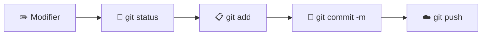

# 📋 L'antisèche Git

> Imprimez-la, collez-la à côté de votre écran, gardez-la ouverte dans un onglet pendant les séances : c'est autorisé, et même recommandé ! 😉
> Les commandes sont présentées dans l'ordre où vous les découvrez dans le cours ([chapitre 3](3.GIT.md) et [chapitre 4](4.GITHUB.md)).

## ⌨️ Le terminal (chapitre 2)

| Commande | Ce qu'elle fait |
|---|---|
| `pwd` | Affiche le dossier où je suis |
| `ls` / `ls -a` | Liste le contenu du dossier (avec `-a` : y compris les fichiers cachés) |
| `cd dossier` / `cd ..` / `cd ~` | Entre dans un dossier / remonte d'un cran / retourne « à la maison » |
| `mkdir dossier` | Crée un dossier |
| `code .` | Ouvre le dossier courant dans VS Code |
| **Tab** ⇥ / **↑** | Complète un nom / rappelle la commande précédente |
| **q** | Quitte un affichage long (`git log`, `git diff`) |

## ⚙️ Configuration (une seule fois par ordinateur)

```bash
git config --global user.name "Prénom Nom"
git config --global user.email "prenom.nom@example.com"
git config --global init.defaultBranch main
git config --global core.editor "code --wait"
git config --global pull.rebase false
git config --list --global          # vérifier
```

## 🏁 Démarrer un projet

| Je veux... | Commande |
|---|---|
| Transformer un dossier en dépôt Git | `git init` |
| Récupérer un dépôt existant depuis GitHub | `git clone <url>` |
| Relier mon dépôt local à un dépôt GitHub vide | `git remote add origin <url>` |
| Voir les dépôts distants configurés | `git remote -v` |

## 🔁 Le cycle quotidien



| Je veux... | Commande |
|---|---|
| **Savoir où j'en suis** (à utiliser sans modération) | `git status` |
| Voir ce qui a changé | `git diff` / `git diff fichier` |
| Préparer un fichier pour le prochain commit | `git add fichier` |
| Préparer **tous** les fichiers modifiés | `git add .` |
| Enregistrer une version | `git commit -m "Message clair"` |
| Envoyer mes commits sur GitHub (1ʳᵉ fois) | `git push -u origin main` |
| Envoyer mes commits sur GitHub (ensuite) | `git push` |
| Récupérer le travail des autres | `git pull` |

> 📌 **Règle d'or :** `git pull` avant de commencer à travailler et avant de `git push`.

## 📜 L'historique

| Je veux... | Commande |
|---|---|
| Voir l'historique | `git log` |
| Voir l'historique en version courte | `git log --oneline` |
| Voir l'historique avec les branches dessinées | `git log --oneline --graph --all` |
| Voir le contenu d'un commit | `git show <id>` |
| Revenir voir une ancienne version | `git checkout <id ou tag>` |
| Revenir au présent | `git switch main` |

## 🏷️ Les versions (tags)

| Je veux... | Commande |
|---|---|
| Étiqueter le commit actuel | `git tag -a v1.0 -m "Description"` |
| Étiqueter un ancien commit | `git tag -a v1.0 <id> -m "Description"` |
| Lister les étiquettes | `git tag` |
| Envoyer les étiquettes sur GitHub | `git push --tags` |

## 🌿 Les branches

| Je veux... | Commande |
|---|---|
| Lister les branches (l'étoile `*` = branche actuelle) | `git branch` |
| Créer une branche et m'y placer | `git switch -c nom-de-branche` |
| Changer de branche | `git switch nom-de-branche` |
| Fusionner une branche dans `main` | `git switch main` puis `git merge nom-de-branche` |
| Supprimer une branche fusionnée | `git branch -d nom-de-branche` |
| Envoyer une nouvelle branche sur GitHub | `git push -u origin nom-de-branche` |

**Le GitHub Flow, en 7 étapes :**
`git switch main` → `git pull` → `git switch -c ma-branche` → *modifier* → `git add` + `git commit` → `git push -u origin ma-branche` → **Pull Request sur GitHub** → relecture → fusion → `git switch main` + `git pull`

## 🚨 Le bouton panique

| Situation | Solution |
|---|---|
| J'ai raté une modification (pas encore indexée) et je veux revenir au dernier commit | `git restore fichier` ⚠️ *modification perdue* |
| J'ai fait un `git add` de trop | `git restore --staged fichier` |
| Faute dans le message de mon **dernier** commit (pas encore poussé) | `git commit --amend -m "Nouveau message"` |
| `git push` refusé : *rejected (fetch first)* | `git pull` puis `git push` |
| `CONFLICT` après un `git pull` ou un `git merge` | Ouvrir le fichier, choisir la bonne version, supprimer les marqueurs `<<<<<<<` `=======` `>>>>>>>`, puis `git add fichier` et `git commit` |
| `fatal: Need to specify how to reconcile divergent branches` | `git config --global pull.rebase false` puis refaire `git pull` |
| Message *detached HEAD* | Pas grave : vous visitez le passé. `git switch main` pour revenir |
| Coincé dans l'éditeur Vim | **Échap**, puis `:q!` et **Entrée** |
| GitHub refuse mon mot de passe | Utiliser un **jeton d'accès personnel** ([chapitre 4](4.GITHUB.md)) ou la connexion via VS Code |

## 🖱️ Équivalents dans VS Code

| Commande | Dans VS Code (panneau Contrôle de code source, `Ctrl + Maj + G`) |
|---|---|
| `git status` | La liste **Modifications** |
| `git add` | Le bouton **+** à côté du fichier |
| `git commit -m` | Le champ **Message** + **✓ Valider** |
| `git pull` + `git push` | **Synchroniser les modifications** 🔄 |
| `git switch` | Le nom de la branche, en bas à gauche |
