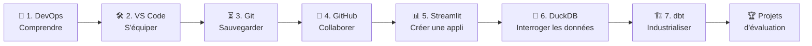
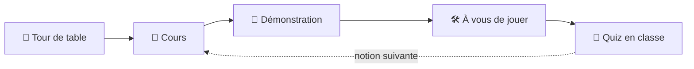

# ☕ Environnement de développement : Agilité, Git & DevOps

> **Bienvenue chez DataCafé !** Pendant ce cours, vous êtes les nouvelles recrues d'une jeune entreprise qui vend du café en ligne et analyse les goûts de ses clients. De séance en séance, vous allez comprendre le DevOps, installer votre poste de développeur, sauvegarder votre travail avec Git, collaborer en équipe sur GitHub... jusqu'à construire une vraie application de données.
>
> **Aucune connaissance en informatique n'est nécessaire pour commencer.** Chaque notion est présentée en cours, démontrée en direct, puis pratiquée en classe.

## 👨‍🏫 Votre professeur

- Architecte solutions Data et Cloud.
- 15 ans d'expérience en big data et cloud computing.
- Professeur en Big Data et cloud computing (ECE, ESME, MBA ESG, ESCP).
- Fondateur de Logbrain (cabinet de conseil en big data et cloud computing).

---

## 🗺️ Le programme

| Chapitre | Au programme | Durée | Titre à décrocher |
|---|---|---|---|
| [**1 · Introduction au DevOps**](1.DEVOPS.md) | Les défis, les enjeux et les origines du DevOps (et de l'Agilité) | 2h | 🧱 Briseur de murs |
| [**2 · EDI et Visual Studio Code**](2.EDI.md) | Définition et composants d'un EDI, les EDI d'aujourd'hui, VS Code, premiers pas dans le terminal et en Markdown | 2h | 🛠️ Artisan de l'éditeur |
| [**3 · Introduction à Git**](3.GIT.md) | Vocabulaire, installation, premier commit, historique d'un dépôt et tags | 3h | ⏳ Maître du temps |
| [**4 · Introduction à GitHub**](4.GITHUB.md) | Dépôt distant, travail en équipe, branches et Pull Requests, interfaces graphiques | 3h30 | 🤝 Joueur d'équipe |
| [**5 · Streamlit**](5.STREAMLIT.md) | Créer une application web de données en Python | 4h | ☕📊 Barista de la data |
| [**6 · DuckDB**](6.DUCKDB.md) | Interroger des données avec SQL | 3h30 | 🕵️🦆 Détective des données |
| [**7 · dbt**](7.DBT.md) | Industrialiser les transformations de données | 4h | 🏗️ Architecte des données |

> [!IMPORTANT]
> **Avant chaque séance**, regardez la rubrique **💻 À préparer avant la séance** en haut du chapitre, et la rubrique **🏠 Avant la prochaine séance** à la fin du chapitre précédent : certaines installations (VS Code, Git, compte GitHub, Python...) doivent être faites **avant** d'arriver en cours.

**Vos outils pendant tout le cours :**

- 📋 [**L'antisèche Git**](MEMO-GIT.md) : toutes les commandes du cours sur une page ;
- 📖 [**Le glossaire**](GLOSSAIRE.md) : tous les mots techniques expliqués simplement.

---

## 🎬 Comment se déroule une séance ?

Chaque chapitre est un **épisode** de l'histoire de DataCafé. En séance, on alterne des moments courts d'explication, des démonstrations en direct et beaucoup de pratique :

Les supports de cours servent de **trace écrite** : vous y retrouvez les points clés, les schémas, toutes les commandes et les consignes des exercices.

### Les pictogrammes

| Pictogramme | En séance |
|---|---|
| 🎬 | L'épisode de l'histoire de DataCafé qui ouvre la séance |
| 💬 | Tour de table ou débat : on réfléchit et on discute ensemble |
| 🎤 | Cours : le professeur présente une notion (points clés, schémas) |
| 💡 | Une analogie de la vie courante pour comprendre une notion |
| 👀 | Démonstration : le professeur montre en direct, vous observez |
| 🛠️ | À vous de jouer : exercice pratique individuel, en classe |
| 👥 | En équipe : exercice par équipes de 4 |
| 🧠 | Quiz en classe : on répond ensemble, la correction se fait en séance |
| 🟢 | **Pour tout le monde** |
| 🟡 | **Si vous avez terminé** : pour aller un peu plus loin |
| 🔴 | **Défi** : pour celles et ceux qui sont déjà à l'aise |
| 🆘 | « Ça ne marche pas ? » : les solutions aux problèmes les plus fréquents |
| 🔬 | « Pour les curieux » : un complément facultatif |
| 📌 | L'essentiel à retenir |
| 🏠 | Ce qu'il faut préparer pour la séance suivante |

### Des niveaux différents dans la même salle

| Si vous... | En séance |
|---|---|
| 🌱 **n'avez jamais programmé** | Concentrez-vous sur les étapes 🟢, appuyez-vous sur les analogies 💡 et les encadrés 🆘, et levez la main sans hésiter. |
| 🌿 **avez déjà un peu codé** | Faites les étapes 🟢 puis 🟡, et aidez vos voisins : expliquer, c'est la meilleure façon d'apprendre. |
| 🌳 **êtes déjà développeur** | Allez vite sur les étapes 🟢, attaquez les défis 🔴 et les encadrés 🔬, et devenez le « référent Git » de votre équipe. |

### Le jeu des équipes 🏆

Dès le chapitre 1, la classe est répartie en **équipes de 4**, les mêmes que pour le projet d'évaluation. Tout au long du cours, les équipes marquent des points lors des quiz et des défis d'équipe. Le tableau des scores est tenu par le professeur... que la meilleure équipe gagne ! ☕

---

## 🧑‍🏫 Espace enseignant

Le dossier [`enseignant/`](enseignant/README.md) contient le guide du professeur : planning des séances, déroulés minutés, scripts de démonstration, réponses aux quiz, corrigés des exercices et règles du jeu des équipes.
