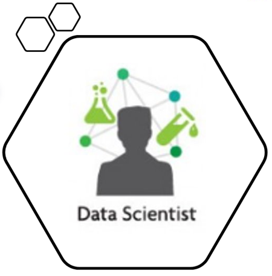
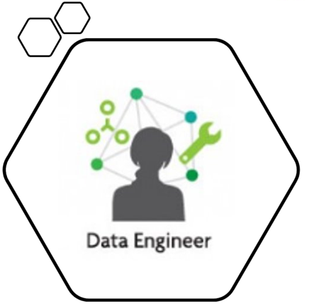
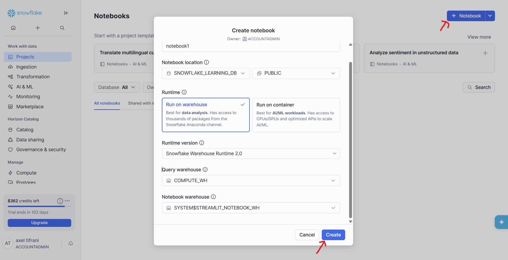
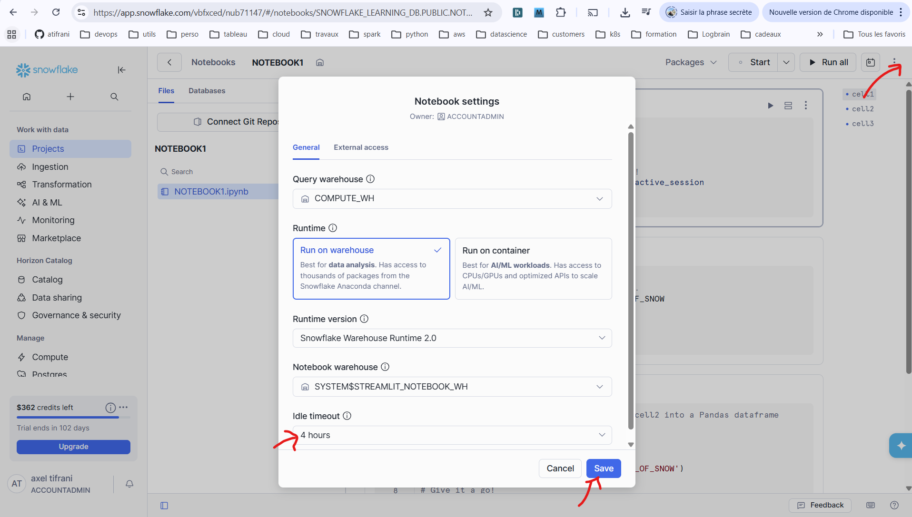

# Introduction au Data Engineering  

## Objectifs pédagogiques

À la fin de cette partie, vous serez capables de :

- Comprendre pourquoi la donnée est stratégique aujourd’hui  
- Identifier les principaux métiers de la data  
- Définir ce qu’est le Data Engineering  
- Comprendre le rôle du Data Engineer dans une organisation  

# 1. Pourquoi la donnée est stratégique aujourd’hui

## 1.1 Une révolution numérique

Nous vivons dans une économie où presque toutes les activités génèrent des données :

- Achats en ligne  
- Utilisation d’applications mobiles  
- Réseaux sociaux  
- Paiements par carte  
- Capteurs industriels  
- Objets connectés  

Chaque interaction numérique produit une trace exploitable.

La quantité de données générée mondialement augmente de manière exponentielle. Cette explosion crée une opportunité majeure : transformer ces données en information utile.

## 1.2 La donnée comme actif stratégique

La donnée est devenue un actif au même titre que :

- Les ressources humaines  
- Les équipements  
- La propriété intellectuelle  

Les entreprises performantes utilisent la donnée pour :

- Comprendre leurs clients  
- Optimiser leurs opérations  
- Réduire leurs coûts  
- Améliorer leurs produits  
- Prendre des décisions plus rapides  

* **Exemple :**  
Une entreprise e-commerce peut analyser :

- Les produits les plus vendus  
- Les heures de forte activité  
- Les taux d’abandon de panier  
- L’efficacité des campagnes marketing  

Ces analyses permettent d’augmenter le chiffre d’affaires et d’améliorer l’expérience client.

## 1.3 Décisions basées sur les données

On parle de **data-driven decision making** :  

> Prendre des décisions basées sur des faits mesurables plutôt que sur l’intuition.

* **Exemples :**

- Ajuster les prix en fonction de la demande  
- Anticiper les ruptures de stock  
- Détecter des fraudes bancaires  
- Personnaliser des recommandations  

La donnée permet de passer d’une logique réactive à une logique proactive.


# 2. Les principaux métiers de la Data

La valorisation des données repose sur plusieurs rôles complémentaires.

## 2.1 Le Data Analyst :   


Mission principale :

- Explorer les données
- Produire des rapports
- Créer des tableaux de bord
- Identifier des tendances

**Outils typiques :**

- SQL  
- Excel  
- Power BI / Tableau  

Le Data Analyst répond à la question :

> Que s’est-il passé ?

Il transforme les données en informations compréhensibles pour le métier.

## 2.2 Le Data Scientist:   

**Mission principale :**

- Construire des modèles prédictifs
- Appliquer des techniques de Machine Learning
- Automatiser des prédictions

**Exemples :**

- Prédire les ventes  
- Détecter la fraude  
- Recommander des produits  

Le Data Scientist répond à la question :

> Que va-t-il se passer ?

Il utilise des modèles mathématiques pour anticiper.

## 2.3 Le Data Engineer:   

Mission principale :

- Construire et maintenir l’infrastructure de données
- Assurer la qualité et la disponibilité des données
- Optimiser les flux de données

Le Data Engineer répond à la question :

> Comment rendre la donnée fiable et exploitable ?

Sans lui :

- Les données sont dispersées  
- Les analyses sont incorrectes  
- Les modèles sont inefficaces  

Il est le socle technique de l’écosystème data.

# 3. Définition du Data Engineering

## 3.1 Définition simple

Le Data Engineering consiste à :

> Concevoir, développer et maintenir les systèmes permettant de collecter, transformer et stocker les données afin qu’elles puissent être utilisées par l’entreprise.

## 3.2 Les grandes missions

### 1. Collecte (Ingestion)

Récupérer les données depuis :

- Bases de données
- Fichiers
- APIs
- Applications
- Systèmes métiers

### 2. Transformation

Préparer les données :

- Nettoyage
- Suppression des doublons
- Standardisation des formats
- Calcul d’indicateurs

### 3. Stockage

Organiser les données dans des systèmes adaptés :

- Data Warehouse
- Data Lake
- Bases analytiques

### 4. Mise à disposition

Permettre aux utilisateurs de :

- Lancer des requêtes
- Créer des dashboards
- Entraîner des modèles

# 4. Rôle du Data Engineer dans une organisation

## 4.1 Positionnement

Le Data Engineer travaille à l’intersection de :

- L’IT  
- Les équipes métier  
- Les Data Analysts  
- Les Data Scientists  

Il assure la circulation fiable de l’information.

## 4.2 Exemple concret : entreprise e-commerce

Sources de données :

- Commandes clients  
- Paiements  
- Données produits  
- Données marketing  
- Logs du site  

Le Data Engineer :

1. Centralise ces données  
2. Les nettoie  
3. Les structure  
4. Les stocke dans un Data Warehouse  
5. Garantit leur qualité  

Ensuite :

- L’équipe marketing analyse les performances  
- Le département finance suit les revenus  
- Les Data Scientists développent des modèles  

## 4.3 Impact stratégique

Un bon Data Engineering permet :

- Des décisions rapides  
- Des indicateurs fiables  
- Une meilleure collaboration entre équipes  
- Une capacité à gérer la croissance  

Un mauvais pipeline data entraîne :

- Des erreurs d’analyse  
- Des pertes financières  
- Une perte de confiance dans les données  

# 5. Synthèse

- La donnée est un actif stratégique majeur.  
- Les entreprises modernes s’appuient sur la donnée pour décider.  
- Plusieurs métiers interviennent dans la chaîne de valeur data.  
- Le Data Engineer construit l’infrastructure qui rend tout cela possible.  
- Il joue un rôle central dans la fiabilité et la performance des systèmes data.  


# 6. Découvrez Snowflake avec les notebooks : 

Snowflake Notebooks est une interface de développement unifiée dans l”Snowsight qui offre un environnement de programmation interactif, basé sur des cellules, pour Python, SQL et Markdown. Dans Notebooks, vous pouvez exploiter vos données Snowflake pour effectuer des analyses de données exploratoires, développer des modèles de machine learning et exécuter d’autres workflows de science et d’ingénierie des données, le tout dans la même interface.

* Explorez et expérimentez les données déjà présentes dans Snowflake, ou chargez de nouvelles données dans Snowflake.

* Écrivez du code SQL ou Python et comparez rapidement les résultats avec le développement et l’exécution cellule par cellule.

* Visualisez vos données de manière interactive à l’aide de visualisations Streamlit intégrées et d’autres bibliothèques comme Altair, Matplotlib ou seaborn.

* Intégrez Git pour collaborer avec un outil de contrôle des versions efficace.

* Contextualisez les résultats et prenez des notes sur les différents résultats à l’aide de cellules et de graphiques Markdown.

* Exécutez votre notebook selon une planification pour automatiser les pipelines


La barre d’outils Snowflake Notebooks présente les commandes utilisées pour gérer le notebook et ajuster les paramètres d’affichage des cellules.

* **Package selector** : sélectionner et installer les paquets à utiliser dans le notebook. Voir Importer des paquets Python à utiliser dans les notebooks.
	
* **Start** : Démarrer la session Notebooks. Au démarrage de la session, l’image devient Active.

* **Active** : survolez le bouton pour voir en temps réel les détails de la session et les mesures de consommation des ressources agrégées (les mesures d’utilisation de la mémoire et des CPU/GPU sont affichées pour les notebooks Container Runtime). Sélectionnez la flèche vers le bas pour accéder aux options permettant de redémarrer ou de terminer la session. Sélectionnez Active pour mettre fin à la session en cours.

* **Run All/Stop** : Exécuter toutes les cellules ou arrêter l’exécution des cellules. Voir Exécuter des cellules dans Snowflake Notebooks.
	
* **Scheduler** : Définir une planification pour exécuter votre notebook en tant que tâche à l’avenir. Voir Planifier des exécutions de notebooks.

* **Vertical ellipsis menu** : Personnaliser les paramètres du notebook, effacer les sorties de cellules, dupliquer, exporter ou supprimer le notebook.

### Exemple: Streamlit dans les notebooks

Streamlit est livré préinstallé avec l’environnement de Snowflake Notebooks. L’exemple de cette section crée une application de données interactive à l’aide de Streamlit.

1. Connectez-vous à Snowsight (WebUI de Snowflake).

2. Dans le menu de navigation, sélectionnez **Projects** » **Notebooks**.



3. Ouvrez le notebook que vous souhaitez mettre à jour.

4. Sélectionnez le menu vertical indiqué par une ellipse (Plus d'actions pour la feuille de calcul) en haut à droite de votre notebook.

5. Sélectionnez **Notebook settings**.



6. Sélectionnez le Runtime.

7. Sélectionnez le paramètre de délai d’inactivité dans la liste déroulante.

8. Redémarrez manuellement la session pour que le nouveau délai d’inactivité prenne effet.

### 1. Importez les bibliothèques nécessaires

```
import streamlit as st
import pandas as pd
```
### 2.Créez d’abord quelques données d’exemple pour l’application.

```
species = ["setosa"] * 3 + ["versicolor"] * 3 + ["virginica"] * 3
measurements = ["sepal_length", "sepal_width", "petal_length"] * 3
values = [5.1, 3.5, 1.4, 6.2, 2.9, 4.3, 7.3, 3.0, 6.3]
df = pd.DataFrame({"species": species,"measurement": measurements,"value": values})
df
```

### 3.Installez votre curseur interactif à partir de la bibliothèque Streamlit.

```
st.markdown("""# Interactive Filtering with Streamlit! :balloon:
            Values will automatically cascade down the notebook cells""")
value = st.slider("Move the slider to change the filter value 👇", df.value.min(), df.value.max(), df.value.mean(), step = 0.3 )
```

### 4.Enfin, affichez une table filtrée en fonction de la valeur du curseur.
```
df[df["value"]>value].sort_values("value")
```
Vous pouvez interagir avec l’application en temps réel à partir du notebook. Voyez la table filtrée changer en fonction de la valeur que vous avez définie sur le curseur.

## Limitations de Notebooks

* Un seul fichier ipynb exécutable est autorisé dans chaque notebook.

* Les composants et widgets Streamlit tels que les valeurs de curseur ne conservent pas leur état si vous actualisez la fenêtre du navigateur, si vous ouvrez le notebook dans un nouvel onglet ou si vous fermez et rouvrez l’onglet actuel.

* Lorsque vous créez un notebook à partir d’un dépôt, seul le notebook sélectionné est exécutable. Tous les autres notebooks du dépôt peuvent être sélectionnés et édités, mais ils ne sont pas exécutables.

Nous allons passer à la partique: [lab01](lab01.md)


-------------------------------------------------------------------

# Introduction au Machine Learning  

# Objectifs du cours

À la fin de ce cours, vous serez capables de :

- Comprendre ce qu’est le Machine Learning
- Diffencier IA, Machine Learning et Data Engineering
- Identifier les principaux types de problèmes en Machine Learning
- Comprendre le cycle de vie d’un projet ML
- Comprendre le lien entre données, Data Engineering et Machine Learning
- Être prêts à réaliser un lab simple dans Snowflake

# Plan du cours

1. Comprendre le Machine Learning  
2. Les grands types de Machine Learning  
3. Le cycle de vie d’un projet ML  
4. Le rôle des données et du Data Engineering  
5. Introduction au ML dans Snowflake  
6. Préparation au lab pratique  

# Partie 1 – Comprendre le Machine Learning

## 1.1 Intelligence Artificielle vs Machine Learning

### Intelligence Artificielle (IA)

L’IA est un domaine large qui vise à créer des systèmes capables d’imiter certaines capacités humaines :


- Comprendre du texte
- Reconnaître des images
- Prendre des décisions
- Résoudre des problèmes

### Machine Learning (ML)

Le Machine Learning est une sous-catégorie de l’IA.

Définition simple :

> Le Machine Learning permet à un système d’apprendre automatiquement à partir de données, sans être programmé avec des règles fixes.

Au lieu d’écrire des règles manuelles, on donne des exemples au système.

## 1.2 Exemple simple

Problème : prédire si un email est un spam.

Approche classique (sans ML) :

- Si le mot "gratuit" apparaît → spam
- Si le mot "promotion" apparaît → spam

Problème : trop rigide.

Approche Machine Learning :

- On fournit des milliers d’emails déjà classés.
- Le modèle apprend les patterns automatiquement.
- Il peut généraliser à de nouveaux emails.

## 1.3 Pourquoi le Machine Learning est devenu important

Trois raisons principales :

1. Explosion des données
2. Puissance de calcul disponible dans le cloud
3. Outils accessibles (Python, Snowflake, etc.)

Les entreprises utilisent le ML pour :

- Recommandations (Netflix, Amazon)
- Détection de fraude
- Prévision des ventes
- Segmentation clients

# Partie 2 – Les grands types de Machine Learning

## 2.1 Supervised Learning (Apprentissage supervisé)

Dans ce cas, on possède des données avec une réponse connue.

Exemple :

| Surface | Prix |
|---------|------|
| 50 m²   | 150 000 € |
| 70 m²   | 210 000 € |

On connaît la variable cible (le prix). 
Le probléme se modélise sous forme d'une équation F(X)= Y. X sont les variable et Y le resultat en sortie.  

Le modèle apprend la relation entre les variables d’entrée et la sortie.

### Deux types principaux

#### 1. Régression

- Sortie numérique
- Exemple : prédire un prix

#### 2. Classification

- Sortie catégorielle
- Exemple : spam / non spam
- Client qui va partir / rester

## 2.2 Unsupervised Learning (Apprentissage non supervisé)

Ici, il n’y a pas de réponse connue.

Le modèle cherche à identifier des structures cachées.

Exemple :

- Segmenter des clients en groupes similaires
- Identifier des comportements inhabituels

## 2.3 Exemple concret – E-commerce

Données disponibles :

- Nombre d’achats
- Montant total dépensé
- Nombre de visites
- Ancienneté du client

Objectif possible :

- Prédire si le client va arrêter d’acheter (classification)
- Segmenter les clients (clustering)
- Prédire le montant futur (régression)

# Partie 3 – Le cycle de vie d’un projet Machine Learning

## 3.1 Étapes principales

Un projet ML suit généralement ces étapes :

1. Définition du problème
2. Collecte des données
3. Nettoyage des données
4. Préparation des variables (feature engineering)
5. Entraînement du modèle
6. Évaluation
7. Déploiement

## 3.2 Point clé

Dans la pratique :

> 70 à 80 % du travail concerne les données (Data engineering).

Nettoyer, transformer et structurer les données est souvent plus long que l’entraînement du modèle lui-même.

C’est ici que le **Data Engineering** joue un rôle essentiel.

# Partie 4 – Lien entre Data Engineering et Machine Learning

## 4.1 Pourquoi les données sont critiques

Un modèle ML dépend de :

- La qualité des données
- La cohérence des formats
- L’absence d’erreurs majeures

Si les données sont mauvaises :

- Les prédictions seront mauvaises.

## 4.2 Rôle du Data Engineer dans un projet ML

Le Data Engineer :

- Centralise les données
- Les nettoie
- Les structure
- Les rend accessibles
- Garantit leur qualité

Sans Data Engineering solide :

- Les Data Scientists ne peuvent pas travailler efficacement.
- Les modèles ne peuvent pas être mis en production.

# Partie 5 – Machine Learning dans Snowflake

## 5.1 Pourquoi utiliser Snowflake ?

Snowflake est un Data Warehouse cloud.

Il permet :

- Stocker de grandes quantités de données
- Exécuter des requêtes SQL
- Effectuer des transformations
- Intégrer du Machine Learning

## 5.2 Où s’exécute le Machine Learning ?

Deux approches possibles :

1. Extraire les données vers Python (ex : pandas, scikit-learn)
2. Utiliser Snowpark pour exécuter du code Python directement dans Snowflake

Dans ce cours, nous allons utiliser une approche simple compatible débutant.

## 5.3 Exemple simplifié de pipeline ML

1. Charger un dataset dans Snowflake
2. Explorer les données avec SQL et Python
3. Créer une table préparée
4. Utiliser Python pour entraîner un modèle simple
5. Géner des prédictions

# Partie 6 – Métriques simples d’évaluation

## 6.1 Accuracy

Pourcentage de bonnes prédictions.

Exemple : Si le modèle prédit correctement 90 cas sur 100 → accuracy = 90 %.

## 6.2 Cas particulier : fraude

Si 95 % des transactions ne sont pas frauduleuses :

Un modèle qui prédit toujours "non fraude" aura 95 % d’accuracy.

Mais il est inutile.

C’est pourquoi d’autres métriques existent (précision, rappel).

## Précision (Precision)

La précision mesure :

> Parmi toutes les prédictions positives faites par le modèle, combien sont réellement correctes ?

Autrement dit :

Si le modèle dit "positif", à quel point peut-on lui faire confiance ?

### Exemple – Détection de fraude

Imaginons :

- Le modèle détecte 20 transactions comme frauduleuses.
- En réalité, seulement 15 sont vraiment frauduleuses.

Précision = 15 / 20 = 75 %

Cela signifie que 25 % des alertes sont fausses.

Une précision élevée est importante lorsque les faux positifs sont coûteux  
(ex : bloquer un client légitime).

## Rappel (Recall)

Le rappel mesure :

> Parmi tous les cas réellement positifs, combien le modèle a-t-il réussi à détecter ?

Autrement dit :

Le modèle rate-t-il beaucoup de cas importants ?

### Exemple – Détection de fraude

Imaginons :

- Il y a en réalité 30 transactions frauduleuses.
- Le modèle en détecte 15.

Rappel = 15 / 30 = 50 %

Cela signifie que le modèle laisse passer 50 % des fraudes.

Un rappel élevé est important lorsque rater un cas est critique  
(ex : maladie grave, fraude, défaut de paiement).

## Résumé

- **Accuracy** → Globalement, combien de prédictions sont correctes ?
- **Précision** → Quand le modèle prédit "positif", a-t-il raison ?
- **Rappel** → Parmi les vrais cas positifs, combien ont été détectés ?

Selon le problème métier, on privilégiera parfois la précision, parfois le rappel.

# Partie 7 – Préparation au Lab

## 7.1 Ce que vous allez faire

Dans le lab Snowflake, vous allez :

- Explorer un dataset client
- Comprendre les colonnes
- Créer une table préparée
- Effectuer des transformations simples en SQL
- Entraîner un modèle simple en Python
- Générer des prédictions

## 7.2 Compétences mobilisées

- SQL basique (SELECT, WHERE, GROUP BY)
- Python basique
- Compréhension des concepts ML

# Conclusion

Dans ce cours, vous avez appris :

- Ce qu’est le Machine Learning
- Les principaux types de problèmes
- Le cycle de vie d’un projet ML
- Le rôle central des données
- Le lien entre Data Engineering et ML
- Comment Snowflake peut servir de plateforme ML

Vous êtes maintenant prêts à passer à la pratique [lab06](lab06.md).


