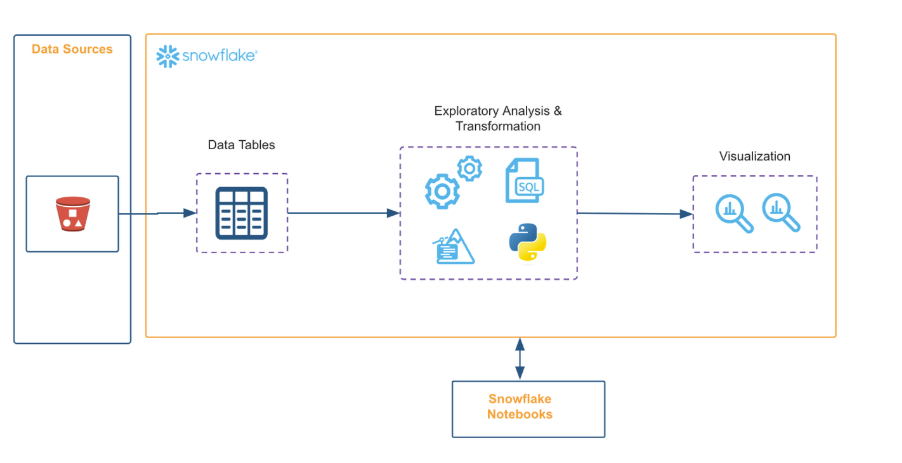

# Lab 1 — Introduction Data engineering (Pas-à-pas)

## 0) Prérequis

- Compte Snowflake d’essai (**étudiants : 120 jours**) – inscrivez-vous avec l’adresse **de l’école**, société **MBAESG**, rôle **Étudiant**, **Edition : Enterprise**, **Cloud : AWS**, **Région : us-west-2**.
- lien pour créer votre compte:  https://signup.snowflake.com/?trial=student&cloud=aws&region=us-west-2&utm_source=handsonessentials&utm_campaign=uni-dww# 
- Bases de SQL (DDL/DML) et objets (database, schema, table…).  

## 1) Objectif:
Ce lab vous aide à comprendre comment utiliser les Snowflake Notebooks en tant que nouvel utilisateur.

* Utiliser les bibliothèques préinstallées dans les Notebooks et ajouter des packages supplémentaires via le sélecteur de packages

* Basculer entre des cellules SQL et Python dans un même notebook

* Utiliser Altair et Matplotlib pour visualiser vos données

* Utiliser la syntaxe Jinja pour faire référence à des variables Python dans des requêtes SQL, réutiliser les résultats de cellules précédentes dans vos requêtes SQL, et plus encore




Dans ce cas d’usage, nous utilisons Snowflake Notebooks pour écrire et exécuter du code, visualiser les résultats et raconter l’histoire de votre analyse, le tout au même endroit.

* Contextualiser les résultats et ajouter des notes sur différents résultats à l’aide de cellules Markdown.
* Tirer parti du contrôle d’accès basé sur les rôles (RBAC) et des autres fonctionnalités de gouvernance des données disponibles dans Snowflake afin de permettre à d’autres utilisateurs disposant du même rôle de consulter et de collaborer sur le notebook.

Voici le notebook entièrement réécrit en **Markdown**, avec les énoncés traduits en français et **le code strictement inchangé**.

# Bienvenue dans Snowflake Notebooks

Faites passer votre analyse de données au niveau supérieur en travaillant de manière fluide avec Python et SQL dans Snowflake Notebooks.

Voici un notebook rapide pour vous aider à démarrer votre premier projet.

## Ajouter des packages Python

Les Notebooks sont préinstallés avec des bibliothèques Python courantes pour la data science et le machine learning, telles que `numpy`, `pandas`, `matplotlib`, etc.

Si vous souhaitez utiliser d’autres packages, cliquez sur le menu déroulant **Packages** en haut à droite pour les ajouter à votre notebook.

Dans cette démonstration, les packages `matplotlib` et `scipy` ont été ajoutés via `environment.yml` lors de la création du notebook.

```python
# Import Python packages used in this notebook
import streamlit as st
import altair as alt

# Pre-installed libraries that comes with the notebook
import pandas as pd
import numpy as np

# Package that we just added
import matplotlib.pyplot as plt
```

## Interroger des données en SQL

Nous pouvons facilement basculer entre Python et SQL dans le même notebook.

Écrivons une requête SQL pour générer un jeu de données d’exemple.

```sql
-- Generating a synthetic dataset of Snowboard products, along with their price and rating
SELECT CONCAT('SNOW-',UNIFORM(1000,9999, RANDOM())) AS PRODUCT_ID, 
       ABS(NORMAL(5, 3, RANDOM())) AS RATING, 
       ABS(NORMAL(750, 200::FLOAT, RANDOM())) AS PRICE
FROM TABLE(GENERATOR(ROWCOUNT => 100));
```

## Retour au travail en Python

Vous pouvez nommer les cellules et faire référence à leurs résultats dans les cellules suivantes.

Nous pouvons accéder directement aux résultats SQL en Python et les convertir en DataFrame pandas.

```python
# Access the SQL cell output as a Snowpark dataframe
my_snowpark_df = sql_querying.to_df()
```

```python
# Convert a SQL cell output into a pandas dataframe
my_df = sql_querying.to_pandas()
```

```python
df = sql_querying.to_pandas()
df
```

## Visualiser vos données

Nous pouvons utiliser Altair pour visualiser la distribution des données sous forme d’histogramme.

```python
# Let's plot the results with Altair
chart = alt.Chart(df,title="Rating Distribution").mark_bar().encode(
    alt.X("RATING", bin=alt.Bin(step=2)),
    y='count()',
)

st.altair_chart(chart)
```

## Personnaliser les visualisations avec Matplotlib

Nous pouvons tracer un histogramme, une estimation de densité (KDE) et la médiane pour la distribution des prix.

```python
fig, ax = plt.subplots(figsize = (6,3))
plt.tick_params(left = False, right = False , labelleft = False) 

price = df["PRICE"]
price.plot(kind = "hist", density = True, bins = 15)
price.plot(kind="kde", color='#c44e52')


# Calculate percentiles
median = price.median()
ax.axvline(median,0, color='#dd8452', ls='--')
ax.text(median,0.8, f'Median: {median:.2f}  ',
        ha='right', va='center', color='#dd8452', transform=ax.get_xaxis_transform())

# Make our chart pretty
plt.style.use("bmh")
plt.title("Price Distribution")
plt.xlabel("PRICE (binned)")
left, right = plt.xlim()   
plt.xlim((0, right))  
# Remove ticks and spines
ax.tick_params(left = False, bottom = False)
for ax, spine in ax.spines.items():
    spine.set_visible(False)

plt.show()
```

## Travailler avec Snowpark

En plus d’utiliser vos bibliothèques Python favorites, vous pouvez utiliser l’API Snowpark pour interroger et traiter les données à grande échelle.

### Récupérer la session active

```python
from snowflake.snowpark.context import get_active_session
session = get_active_session()
# Add a query tag to the session. This helps with debugging and performance monitoring.
session.query_tag = {"origin":"sf_sit-is", "name":"notebook_demo_pack", "version":{"major":1, "minor":0}, "attributes":{"is_quickstart":0, "source":"notebook"}}
```

## Enregistrer un DataFrame pandas dans Snowflake

```python
session.write_pandas(df,"SNOW_CATALOG",auto_create_table=True, table_type="temp")
```

## Charger une table

```python
df = session.table("SNOW_CATALOG")
```

Si votre session est déjà positionnée sur la bonne base de données et le bon schéma, vous pouvez référencer uniquement le nom de la table.

## Statistiques descriptives

```python
df.describe()
```

## Utiliser des variables Python dans des cellules SQL

Vous pouvez utiliser la syntaxe Jinja `{{ }}` pour faire référence à des variables Python dans vos requêtes SQL.

```python
threshold = 5
```

```sql
-- Reference Python variable in SQL
SELECT * FROM SNOW_CATALOG where RATING > {{threshold}}
```

## Exemple avec moyenne et écart-type dynamiques

```python
mean = 5 
stdev = 3
```

```sql
-- Note how we use the Python variables `mean` and `stdev` to populate the SQL query
-- Note how the Python variables dynamically populate the SQL query
CREATE OR REPLACE TABLE SNOW_CATALOG AS 
SELECT CONCAT('SNOW-',UNIFORM(1000,9999, RANDOM())) AS PRODUCT_ID, 
       ABS(NORMAL({{mean}}, {{stdev}}, RANDOM())) AS RATING, 
       ABS(NORMAL(750, 200::FLOAT, RANDOM())) AS PRICE
FROM TABLE(GENERATOR(ROWCOUNT => 100));
```

```sql
SELECT * FROM SNOW_CATALOG;
```

## Simplifier les sous-requêtes

### Approche classique avec CTE

```sql
WITH RatingsAboveFive AS (
    SELECT RATING
    FROM SNOW_CATALOG
    WHERE RATING > 5
)
SELECT AVG(RATING) AS AVG_RATING_ABOVE_FIVE
FROM RatingsAboveFive;
```

### Approche simplifiée dans un Notebook

```sql
SELECT AVG(RATING) FROM {{variables3}}
WHERE RATING > 5
```

## Créer une application interactive avec Streamlit

Construisons une application interactive pour explorer l’impact des paramètres sur la distribution des données.

```python
import streamlit as st
st.markdown("# Move the slider to adjust and watch the results update! 👇")
col1, col2 = st.columns(2)
with col1:
    mean = st.slider('Mean of on RATING Distribution',0,10,3) 
with col2:
    stdev = st.slider('Standard Deviation of RATING Distribution', 0, 10, 5)

query =f'''CREATE OR REPLACE TABLE SNOW_CATALOG AS 
SELECT CONCAT('SNOW-',UNIFORM(1000,9999, RANDOM())) AS PRODUCT_ID, 
       ABS(NORMAL({mean}, {stdev}, RANDOM())) AS RATING, 
       ABS(NORMAL(750, 200::FLOAT, RANDOM())) AS PRICE
FROM TABLE(GENERATOR(ROWCOUNT => 100));'''
session.sql(query).collect()


# Read table from Snowpark and plot the results
df = session.table("SNOW_CATALOG").to_pandas()
# Let's plot the results with Altair
alt.Chart(df).mark_bar().encode(
    alt.X("RATING", bin=alt.Bin(step=2)),
    y='count()',
)
```

## Raccourcis clavier

| Commande                                    | Raccourci           |
| ------------------------------------------- | ------------------- |
| Exécuter la cellule et passer à la suivante | SHIFT + ENTER       |
| Exécuter uniquement cette cellule           | CMD + ENTER         |
| Exécuter toutes les cellules                | CMD + SHIFT + ENTER |
| Ajouter une cellule en dessous              | b                   |
| Ajouter une cellule au-dessus               | a                   |
| Supprimer cette cellule                     | d+d                 |

Vous pouvez consulter la liste complète des raccourcis en cliquant sur le bouton `?` en bas à droite.

## Nettoyage

```sql
-- Teardown code to cleanup environment after tutorial
DROP TABLE SNOW_CATALOG;
```
