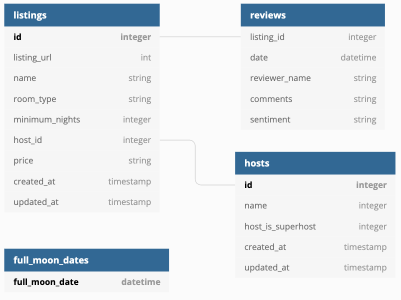

# Projet d'évaluation : Airbnb Analytics Platform

## Contexte

Airbnb souhaite mettre en place une plateforme analytique permettant :
Vous pouvez vous référez au [lab02](https://github.com/atifrani/MyStepUp/blob/main/architecture_data/lab02.md)

* d'analyser les logements ;
* d'analyser les hôtes ;
* d'analyser les avis clients ;
* d'étudier l'impact des nuits de pleine lune sur les avis ;
* de mettre à disposition des indicateurs via une application Streamlit.

L'entreprise a décidé d'utiliser :

* DuckDB comme moteur analytique ;
* dbt pour les transformations ;
* GitHub pour le versioning ;
* Streamlit pour la restitution.

## Architecture cible:

                     GitHub

                        │

                        ▼

                dbt Project

                        │

      ┌─────────────────┼─────────────────┐

      ▼                 ▼                 ▼

   Bronze            Silver             Gold

      ▼                 ▼                 ▼

   DuckDB         Data Quality      Data Products

                        │

                        ▼

                  Streamlit

                        │

                        ▼

                Business Users

Le jeux de données est disponible ici:

├── [hosts.csv](https://logbrain-datasets.s3.eu-west-1.amazonaws.com/airbnb/hosts.csv)
├── [reviews.csv](https://logbrain-datasets.s3.eu-west-1.amazonaws.com/airbnb/reviews.csv)
├── [listings.json](https://logbrain-datasets.s3.eu-west-1.amazonaws.com/airbnb/listings.csv)
└── [seed_full_moon_dates.csv](https://logbrain-datasets.s3.eu-west-1.amazonaws.com/airbnb/seed_full_moon_dates.csv)

## Étapes à Suivre

* 1 : Création du projet
* 2 : Ingestion couche Bronze
* 3 : Ingestion/transformation couche Silver
* 4 : Vérification qualité des données
* 5 : Ingestion/transformation couche Gold
* 6 : Dashboard Streamlit

Le projet doit être réalisé en binôme, avec une répartition équitable des tâches. Les livrables identiques entre groupes seront considérés comme du plagiat et sanctionnés en conséquence.

# 📦 Livrables attendus

&. Dépôt Git collaboratif

  * Initialisez un dépôt Git pour votre projet.
  * Utilisez des branches pour le développement et des pull requests pour les intégrations.
  * Maintenez un historique de commits clair et descriptif.

2. Pipelines DBT
    * Modules SQL
    * Modules Test
    * Documentation

3. Application Streamlit

  * Visualisations interactives basées sur les requêtes DuckDB.
  * Filtres dynamiques pour affiner les résultats.

4. Intégration de DuckDB

  * Stockage des données téléversées dans une base DuckDB.
  
5. Documentation
   * Fichier README.md incluant :
       * Présentation du projet.
       * Instructions d'installation et d'exécution.
       * Description des fonctionnalités.
       * Répartition des tâches entre les membres de l'équipe.

# ✅ Critères d'évaluation
* Fonctionnalité : L'application répond-elle aux exigences spécifiées ?
* Qualité du code : Le code est-il propre, bien structuré et documenté ?
* Utilisation de Git : Collaboration efficace, historique de commits clair.
* Visualisations : Les indicateurs sont-ils représentés de manière claire et pertinente ?
* Gestion des données : Les requêtes DuckDB sont-elles efficaces et les visualisations pertinentes ?

# ⏱️ Planification
1. Planification
  * Répartition des rôles au sein de l'équipe.
  * Conception de l'architecture de l'application.

2. Développement
   * Mise en place du dépôt Git.
   * Intégration de DuckDB et écriture des Modules DBT.
   * Création des quatre visualisations des indicateurs.

3. Documentation et soumission
  * Finalisation du fichier README.md.

## 📬 Soumission
Envoyez votre livrable avec intitulé **MBAESG_EVALUATION_MANAGEMENT_OPERATIONNEL_2026** à l'adresse suivante : **axel@logbrain.fr**