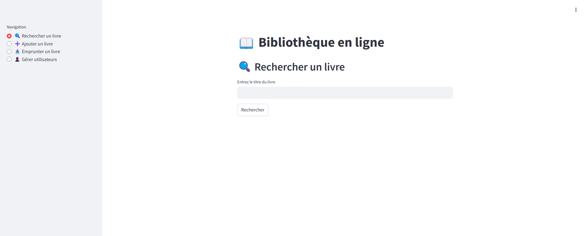

# Atelier :

Cette application est construite avec les frameworks Python **FastAPI** et **Streamlit** ainsi qu’une intégration **POSTGRESQL** pour effectuer des opérations CRUD (Créer, Lire, Mettre à jour, Supprimer) sur les livres et les utilisateurs.

* FastAPI est un framework web puissant pour créer des API,
* Streamlit est un framework web UI permettant de créer des applications de données dynamiques avec seulement quelques lignes de code,
* POSTGRESQL est une base de données SQL offrant flexibilité et évolutivité.

## Backend :

FastAPI pour la gestion des livres et des utilisateurs.
Ce backend expose des endpoints REST pour ajouter, rechercher, emprunter des livres et gérer les utilisateurs.

## Frontend :

Streamlit permet de fournir une interface web afin d’interagir avec le backend.

# Création de l’infrastructure AWS :

Nous allons créer plusieurs services AWS pour héberger l’application.

1. Créer un groupe de sécurité AWS pour EC2

2. Autoriser le trafic HTTP entrant:

Cela permet à toute personne sur Internet d’accéder au serveur via HTTP.

3. Connectez vous en SSH sur la machine EC2

Allez dans la console AWS :

    1. Sélectionnez le service EC2 puis cliquez sur « Instances ».
    2. Sélectionnez votre instance EC2.
    3. Cliquez sur le bouton « Connect ».
    4. Connectez-vous en utilisant « EC2 Instance Connect ».


4. Cloner ou télécharger le projet

Depuis votre instance EC2

4.1. Installer Git sur l’instance EC2

```bash
sudo yum install git -y
```

4.2. Cloner le dépôt

```bash
git clone https://github.com/atifrani/final-workshop.git
```

4.3 Créer un environnement virtuel Python

```bash
cd final-workshop

python3 -m venv venv

ou 

python -m venv venv
```

4.4 Activer l’environnement virtuel

```bash
source venv/bin/activate
```

4.5 Installer les dépendances

```bash
pip3 install -r requierements.txt
```

4.6 Lancer le Frontend

Sur le terminal EC2, exécutez cette commande :

```bash
streamlit run frontend.py
```

Visitez cette URL :
**http://ec2-public-ip:8501/**
(remplacez `ec2-public-ip` par l’adresse IP publique de votre instance EC2).



### Conseils :

Si votre page web ne s’affiche pas, vérifiez que le trafic est autorisé entre votre ordinateur et votre instance EC2.

Nous disposons déjà du frontend Streamlit, il faut maintenant connecter le frontend au backend.

Si vous essayez une action sur le frontend, vous obtiendrez une erreur car le backend n’est pas disponible.

Arrêtez le frontend en appuyant sur **CTRL + C**.

5. Lancer le Backend

Avant de démarrer votre application backend, vous devez effectuer quelques mises à jour.

Ouvrez le fichier backend :

```bash
nano backend.py
```

Mettez à jour les informations liées à votre base de données RDS.
Vous devez d’abord redémarrer votre base de données RDS.

Pour sauvegarder le fichier, appuyez sur **CTRL + X** puis sur **ENTRÉE**.

5.1. Installer Nginx

```bash
sudo yum install nginx -y
```

5.2. Démarrer Nginx

```bash
sudo systemctl start nginx
sudo systemctl enable nginx
```

5.3. Configurer le service FastAPI

```bash
sudo nano /etc/systemd/system/fastapi.service
```

Copiez et collez le contenu suivant :

```ini
[Unit]
Description=Application FastAPI
After=network.target

[Service]
User=ec2-user
WorkingDirectory=/home/ec2-user/aws-training/aws-library-project
ExecStart=/home/ec2-user/aws-training/aws-library-project/venv/bin/uvicorn backend:app --host 0.0.0.0 --port 8000
Restart=always

[Install]
WantedBy=multi-user.target
```

Pour sauvegarder le fichier, appuyez sur **CTRL + X** puis sur **ENTRÉE**.

5.4. Démarrer le service FastAPI

```bash
sudo systemctl daemon-reload
sudo systemctl enable fastapi
sudo systemctl start fastapi
sudo systemctl status fastapi
```

Visitez cette URL :
**http://ec2-public-ip:8000/docs**
(remplacez `ec2-public-ip` par l’adresse IP publique de votre instance EC2).

### Conseils :

Si votre page web ne s’affiche pas, vérifiez que le trafic est autorisé entre votre ordinateur et votre instance EC2.

5.5. Lancer le Frontend

Ouvrez un terminal et exécutez cette commande :

```bash
streamlit run frontend.py
```

Visitez cette URL :
**http://ec2-public-ip:8501/**
(remplacez `ec2-public-ip` par l’adresse IP publique de votre instance EC2).

### Conseils :

Si votre page web ne s’affiche pas, vérifiez que le trafic est autorisé entre votre ordinateur et votre instance EC2.

5.6. Tester votre application

Accédez à l’interface frontend :
**http://ec2-public-ip:8501/**

Essayez les différentes options disponibles dans le panneau de navigation :

* Ajouter un livre
* Rechercher un livre
* Emprunter un livre
* Gérer les utilisateurs

7. Créez la base de données Postgresql
7.1. Réferez vous au cours sur les base de données [RDS](https://github.com/atifrani/MyStepUp/blob/main/services_cloud/section_5/lab07.md)
7.2. Connectez-vous à votre base de données RDS avec DBeaver et accédez au schéma public.
7.3. Essayez les différentes options disponibles dans le panneau de navigation :

* Ajouter un livre
* Rechercher un livre
* Emprunter un livre
* Gérer les utilisateurs*

7.4. Vérifiez que les tables `books` et `users` sont créées et contiennent des données.
