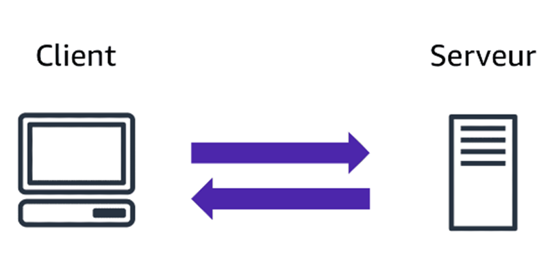
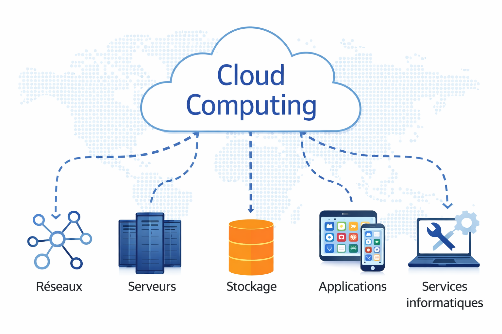
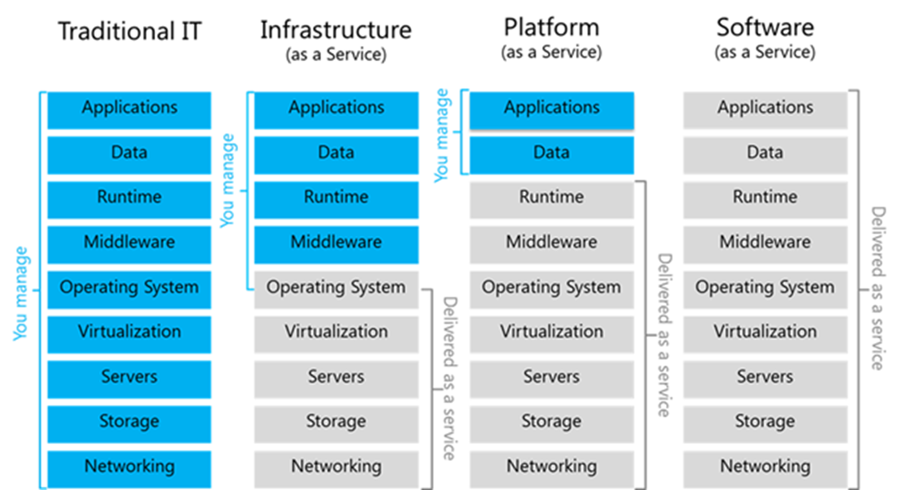
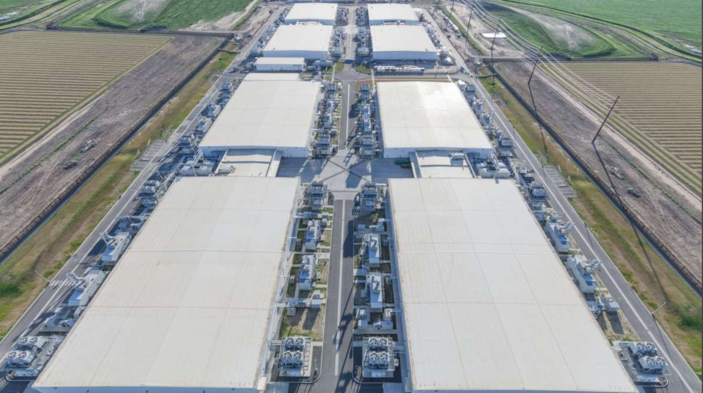

# Section 1 : Introduction au cloud AWS

## 1.1 Fondamentaux du Cloud Computing

* Définition du cloud computing

* Modèles de services :
    * IaaS (Infrastructure as a Service)
    * PaaS (Platform as a Service)
    * SaaS (Software as a Service)

* Modèles de déploiement :
    * Cloud public
    * Cloud privé
    * Cloud hybride

## 1.2 Infrastructure globale AWS

* Regions
* Availability Zones

## 1.3 Concepts clés du Cloud AWS

* Pay-as-you-go (paiement à l’usage)
* Elasticité
* Scalabilité
* Haute disponibilité

## 1.4 Moyens d'accès à AWS

* Console AWS
* AWS CLI
* SDK AWS

## 1.5 lab1: Création d’un compte AWS et découverte de la console

* Création d’un compte AWS Free Tier 
* Exploration de la console AWS
* Activation des alertes Free Tier 
* Création d'un budget

## 1.6 Mise en place des bonnes pratiques de sécurité avec AWS IAM

* sécuriser l’utilisateur root
* activer l’authentification multi-facteurs (MFA)
* créer un utilisateur IAM (admin_user)
* utiliser des groupes IAM pour gérer les permissions
* appliquer une politique de mot de passe IAM

---

## 1.1 Fondamentaux du Cloud Computing

### Introduction : Le modèle client–serveur dans l’informatique moderne

La grande majorité des systèmes informatiques modernes repose sur un modèle d’architecture appelé **client–serveur**. Dans ce modèle, deux rôles principaux interagissent :

* **Le client** : l’utilisateur ou l’application qui fait une demande.

* **Le serveur** : le système qui traite la demande et fournit une réponse ou un service.

Pour comprendre ce principe, on peut prendre l’exemple simple illustré dans l’image.

Dans cette scène, un **client se présente au comptoir d’un café et commande une boisson**. Le client exprime une demande (par exemple un milkshake). La personne au comptoir reçoit la commande, la traite, puis prépare et fournit la boisson demandée.

Cette interaction illustre parfaitement le fonctionnement du modèle client–serveur :

* Le **client** correspond à la personne qui passe la commande.

* Le **serveur** correspond au système derrière le comptoir qui reçoit et traite la demande.

* La **commande** représente la requête envoyée.

* La **boisson préparée** représente la réponse retournée au client.

Dans le domaine informatique, ce fonctionnement est similaire. Par exemple :

* Un **navigateur web** agit comme un client.

* Un **serveur web** héberge un site ou une application.

* Le **navigateur** envoie une **requête HTTP** au **serveur**.

* Le **serveur** renvoie une **page web** ou **des données**.

Le **cloud computing**, et notamment les plateformes comme **AWS, GCP et Azure**, s’appuie largement sur ce modèle. La différence principale est que les serveurs ne sont plus hébergés dans l’infrastructure locale d’une entreprise, mais dans de ***grands centres de données accessibles via Internet**.

### Définition : Qu’est-ce que le Cloud Computing ?

Le terme **Cloud Computing** provient de deux mots anglais :

* **Cloud**, qui signifie *nuage*
* **Computing**, qui signifie *informatique*

Littéralement, le **Cloud Computing** peut donc être traduit par **« informatique en nuage »**.

Le **Cloud Computing** désigne un modèle informatique qui permet d’accéder, via Internet, à des **ressources informatiques partagées et configurables**, disponibles **à la demande et en libre-service**.

Ces ressources peuvent inclure :

* des **réseaux**
* des **serveurs**
* du **stockage**
* des **applications**
* différents **services informatiques**

Dans ce modèle, les ressources sont **fournies rapidement aux utilisateurs**, sans nécessiter d’investissement préalable dans une infrastructure matérielle. Les utilisateurs peuvent **provisionner ou libérer ces ressources selon leurs besoins**, et leur utilisation est généralement **facturée à l’usage**.

Ainsi, le Cloud Computing permet aux entreprises et aux développeurs de **consommer des ressources informatiques comme un service**, de manière flexible, scalable et accessible depuis n’importe où via Internet.

### Les modèles de services du Cloud Computing

Le **cloud computing** offre de nombreuses possibilités d’utilisation selon les besoins des entreprises et des développeurs. Pour structurer ces usages, on distingue généralement **trois grands modèles de services cloud**.

Ces modèles se différencient principalement par **le niveau de gestion pris en charge par le fournisseur cloud** et par **le niveau de contrôle laissé à l’utilisateur**.

Les trois modèles principaux sont :

* **IaaS (Infrastructure as a Service)**
* **PaaS (Platform as a Service)**
* **SaaS (Software as a Service)**

Chaque modèle correspond à un **niveau d’abstraction différent**.

#### 1. IaaS – Infrastructure as a Service

Le modèle **IaaS** fournit aux utilisateurs une **infrastructure informatique virtuelle** accessible via Internet.

Le fournisseur cloud met à disposition :

* des **machines virtuelles**
* du **stockage**
* du **réseau**
* des **ressources de calcul**

L’utilisateur garde le contrôle sur :

* le **système d’exploitation**
* les **applications**
* la **configuration du serveur**

Dans ce modèle, l’entreprise gère donc encore une partie importante de l’infrastructure logicielle.

**Exemple:**  

Une entreprise souhaite héberger son application web.

Elle utilise **Amazon EC2 (service de serveur virtuel)** pour créer un serveur virtuel :

1. Elle lance une **machine virtuelle EC2**
2. Elle installe **Linux**
3. Elle installe un **serveur web (Apache ou Nginx)**
4. Elle déploie son application

Dans ce cas :

* **AWS fournit l’infrastructure**
* **l’entreprise gère le serveur et l’application**

#### 2. PaaS – Platform as a Service

Le modèle **PaaS** fournit une **plateforme complète de développement et de déploiement d’applications**.

Le fournisseur cloud gère :

* l’infrastructure
* le système d’exploitation
* les serveurs
* les mises à jour
* la scalabilité

L’utilisateur se concentre uniquement sur :

* le **code de l’application**
* la **logique métier**

Ce modèle simplifie fortement le développement et le déploiement d'applications.

**Exemple:**

Un développeur souhaite déployer une application web sans gérer les serveurs.

Il utilise **AWS Amplify** :

1. Il développe son application web
2. Il téléverse son code sur amplify
3. AWS déploie automatiquement l'application

Dans ce cas :

* **AWS gère l’infrastructure et la plateforme**
* **le développeur gère uniquement son application**

#### 3. SaaS – Software as a Service

Le modèle **SaaS** correspond à un logiciel complet accessible directement via Internet.

L’utilisateur n’a rien à installer ni à gérer. Le fournisseur cloud s’occupe de :

* l’infrastructure
* la plateforme
* l’application
* les mises à jour
* la maintenance

L’utilisateur utilise simplement le service via :

* un **navigateur web**
* une **application**

**Exemple:**  

Un utilisateur utilise **Microsoft 365**.

Il peut :

* créer des documents
* les modifier
* les partager en ligne

Sans installer de logiciel ni gérer de serveur.

Dans ce cas :

* **tout est géré par le fournisseur**
* **l’utilisateur consomme uniquement le service**

# Résumé des trois modèles

| Modèle | Ce que gère l’utilisateur       | Ce que gère le fournisseur  |
| ------ | ------------------------------- | --------------------------- |
| IaaS   | OS, applications, configuration | infrastructure              |
| PaaS   | application                     | plateforme + infrastructure |
| SaaS   | utilisation du logiciel         | tout le reste               |

Ces trois modèles représentent différents **niveaux d’abstraction du cloud** :

* **IaaS** → contrôle maximal
* **PaaS** → simplification du développement
* **SaaS** → utilisation directe d’un service logiciel.

---

### Les modèles de déploiement du Cloud Computing

Avec l’adoption croissante du **cloud computing**, plusieurs **modèles de déploiement** ont été développés afin de répondre aux besoins variés des organisations en matière de **coût, de sécurité, de confidentialité et de disponibilité**.

Le choix du modèle de déploiement dépend principalement :

* du **niveau de contrôle souhaité sur l’infrastructure**
* des **contraintes de sécurité et de confidentialité des données**
* du **budget disponible**
* des **besoins de scalabilité et de disponibilité**

Il existe trois principaux modèles de déploiement du cloud :

* **Cloud Public**
* **Cloud Privé**
* **Cloud Hybride**

#### 1. Le Cloud Public

Le **cloud public** est un modèle dans lequel les ressources informatiques (serveurs, stockage, réseaux, applications) sont **hébergées et gérées par un fournisseur de cloud** et mises à disposition des utilisateurs via Internet.

Les infrastructures sont **partagées entre plusieurs clients**, mais les données et les applications de chaque client restent isolées et sécurisées.

Les utilisateurs paient généralement **uniquement pour les ressources qu’ils consomment**.

**Exemple:**  

Une startup souhaite déployer une application web sans investir dans des serveurs physiques.

Elle utilise **AWS** pour :

* lancer des **instances EC2**
* stocker ses données dans **Amazon S3**
* utiliser une base de données **Amazon RDS**

Toute l’infrastructure est hébergée dans les **centres de données AWS** et accessible via Internet.

#### 2. Le Cloud Privé

Le **cloud privé** est une infrastructure cloud **dédiée à une seule organisation**.

L’infrastructure peut être :

* hébergée **dans les locaux de l’entreprise**
* ou hébergée **dans un centre de données externe**, mais réservée uniquement à cette organisation.

Ce modèle offre :

* un **contrôle total sur les ressources**
* un **niveau de sécurité plus élevé**
* une **personnalisation plus importante de l’infrastructure**

Il est souvent utilisé par les organisations ayant des **contraintes fortes de sécurité ou de conformité**, comme les banques ou les administrations.

**Exemple:**  

Une banque décide de créer une infrastructure cloud interne dans son propre **data center**.

Elle utilise une plateforme de virtualisation pour créer :

* des **machines virtuelles**
* du **stockage interne**
* un **réseau privé**

Seuls les employés de la banque peuvent accéder à cette infrastructure.

#### 3. Le Cloud Hybride

Le **cloud hybride** combine **cloud public et cloud privé** dans une même architecture.

Certaines applications ou données sont hébergées dans le **cloud privé**, tandis que d’autres sont déployées dans le **cloud public**.

Ce modèle permet de :

* conserver les **données sensibles dans un environnement privé**
* profiter de la **scalabilité du cloud public**

Les deux environnements communiquent généralement via des **connexions réseau sécurisées**.

**Exemple:**  

Une entreprise possède :

* une **base de données contenant des informations sensibles** stockée dans son cloud privé
* une **application web publique** hébergée sur **AWS**

Lorsque la charge augmente, l’entreprise peut utiliser les ressources du **cloud public AWS** pour gérer le trafic supplémentaire.

#### Résumé des modèles de déploiement

| Modèle        | Description                                     |
| ------------- | ----------------------------------------------- |
| Cloud Public  | Infrastructure partagée accessible via Internet |
| Cloud Privé   | Infrastructure dédiée à une seule organisation  |
| Cloud Hybride | Combinaison du cloud public et du cloud privé   |

Ces modèles permettent aux organisations de **choisir l’architecture la plus adaptée à leurs besoins techniques, financiers et réglementaires**.

---

### Le marché des fournisseurs de Cloud

Le **cloud computing** est aujourd’hui un secteur majeur de l’industrie informatique mondiale. Il est souvent associé à plusieurs caractéristiques importantes telles que :

* la **flexibilité**
* la **portabilité**
* la **modularité**
* l’**élasticité**

Ces caractéristiques permettent aux entreprises d’adapter rapidement leurs ressources informatiques en fonction de leurs besoins, sans devoir investir dans des infrastructures physiques coûteuses.

Cependant, malgré ces avantages, l’adoption du cloud soulève également certaines **préoccupations liées à la sécurité et à la souveraineté des données**.

### Les préoccupations liées au Cloud Act

Selon plusieurs études, environ **75 % des entreprises interrogées estiment que certaines lois américaines représentent un risque potentiel pour la sécurité des données**.

Parmi ces lois figure le **Cloud Act (Clarifying Lawful Overseas Use of Data Act)**, une loi fédérale américaine promulguée en **mars 2018**.

Cette loi autorise les **autorités judiciaires ou administratives américaines (fédérales ou locales)** à demander aux fournisseurs de services cloud ou aux opérateurs de télécommunications américains de fournir des données stockées sur leurs serveurs.

Cette demande peut concerner des données :

* stockées **aux États-Unis**
* mais aussi **hébergées dans des centres de données situés dans d’autres pays**

Cette situation alimente les débats sur la **souveraineté numérique**, notamment en Europe.

### La domination des grands fournisseurs de cloud

Malgré ces préoccupations, le marché mondial du cloud est largement dominé par quelques grands acteurs technologiques internationaux.

Les principaux fournisseurs de cloud sont :

* **Amazon Web Services (AWS)**
* **Microsoft Azure**
* **Google Cloud Platform (GCP)**
* **Alibaba Cloud**
* **IBM Cloud**

À eux seuls, ces cinq fournisseurs représentaient environ **80 % du marché mondial du cloud computing**.

### Les fournisseurs de cloud européens

Il existe également plusieurs fournisseurs de cloud européens, parmi lesquels :

* **OVHcloud**
* **Orange Cloud**
* **Scaleway (groupe Iliad)**
* **Atos**
* **Docaposte**
* **Outscale**

Cependant, malgré leur présence sur le marché, **les solutions de cloud européennes restent encore moins utilisées par les entreprises que celles proposées par les grands fournisseurs internationaux**.

Cela s’explique notamment par :

* la **maturité technologique des grands acteurs**
* l’**étendue des services proposés**
* leur **présence mondiale**
* leur **capacité d’innovation et d’investissement**

Ainsi, le marché du cloud computing est aujourd’hui **fortement concentré autour de quelques grands fournisseurs**, dont **AWS est le leader mondial**.

---

### Introduction à Amazon Web Services (AWS)

**Amazon Web Services (AWS)** est la plateforme de cloud computing développée par **Amazon**, une entreprise américaine initialement spécialisée dans le commerce électronique.

Au début des années 2000, Amazon a commencé à développer une infrastructure informatique interne très performante pour supporter la croissance rapide de son activité. L’entreprise a ensuite décidé de **mettre cette infrastructure à disposition d’autres entreprises sous forme de services cloud**. C’est ainsi qu’est née la filiale **Amazon Web Services**.

### Évolution des services AWS

AWS a progressivement enrichi son offre de services à travers plusieurs étapes importantes :

* **2006** : lancement de deux services fondamentaux du cloud AWS

  * **Amazon S3 (Simple Storage Service)** : service de stockage d’objets dans le cloud
  * **Amazon EC2 (Elastic Compute Cloud)** : service de machines virtuelles permettant d’exécuter des applications dans le cloud

* **2009** : lancement de **Amazon EMR (Elastic MapReduce)**, un service destiné au **traitement de grandes quantités de données (Big Data)**.

* **2012** : lancement de **Amazon Redshift**, un service de **data warehouse** permettant d’analyser de très grands volumes de données.

Grâce à ces services et à l’innovation continue, AWS est rapidement devenu **une référence mondiale dans le domaine des services d’infrastructure cloud**.

### Une plateforme cloud mondiale

Aujourd’hui, **Amazon Web Services** est une plateforme d’infrastructure cloud :

* **hautement fiable**
* **évolutive (scalable)**
* **économique**

Elle permet aux entreprises de déployer rapidement des applications et des infrastructures informatiques sans investir dans des centres de données physiques.

AWS alimente aujourd’hui **des centaines de milliers d’entreprises dans plus de 245 pays et territoires** à travers le monde.

Pour assurer cette présence mondiale, AWS dispose de **centres de données répartis dans plusieurs régions du monde**, notamment :

* aux **États-Unis**
* en **Europe**
* au **Brésil**
* à **Singapour**
* au **Japon**
* en **Australie**

Ainsi, AWS est devenu **un acteur majeur du cloud computing mondial** et représente aujourd’hui **un moteur de croissance important pour Amazon**.

### [L’infrastructure globale d’AWS](https://aws.amazon.com/about-aws/global-infrastructure/)

Pour fournir des services cloud performants et hautement disponibles dans le monde entier, **Amazon Web Services s’appuie sur une infrastructure globale distribuée**.
Cette infrastructure est organisée selon plusieurs niveaux, notamment :

* **les régions (Regions)**
* **les zones de disponibilité (Availability Zones)**

Cette organisation permet à AWS de garantir :

* une **haute disponibilité**
* une **tolérance aux pannes**
* une **faible latence**
* une **grande scalabilité des applications**

### Les régions AWS

Une **région AWS** correspond à un **emplacement géographique spécifique dans le monde** où AWS regroupe plusieurs centres de données.

Chaque région est complètement **indépendante des autres régions**, ce qui permet aux entreprises de déployer leurs applications dans différentes parties du monde afin de :

* réduire la **latence pour les utilisateurs**
* améliorer la **résilience des applications**
* respecter certaines **contraintes réglementaires sur la localisation des données**

Par exemple, AWS possède des régions dans plusieurs zones du monde, notamment :

* **Europe (Paris, Francfort, Irlande)**
* **États-Unis**
* **Asie**
* **Australie**
* **Amérique du Sud**

Dans chaque région, les centres de données sont organisés en **groupes logiques appelés zones de disponibilité**.

### Les zones de disponibilité (Availability Zones)

Une **zone de disponibilité (Availability Zone – AZ)** est un **ensemble d’un ou plusieurs centres de données** situés dans une même région AWS.

Ces centres de données sont conçus pour être :

* **physiquement séparés**
* **indépendants**
* **hautement sécurisés**

Chaque zone de disponibilité possède :

* une **alimentation électrique redondante**
* une **connectivité réseau indépendante**
* des systèmes de **refroidissement et de sécurité propres**

Les zones de disponibilité sont également **connectées entre elles par des réseaux à très haute vitesse**, ce qui permet de construire des architectures distribuées.

### Pourquoi plusieurs zones de disponibilité ?

L’existence de plusieurs zones de disponibilité dans une même région permet aux entreprises de concevoir des applications :

* **plus disponibles**
* **plus tolérantes aux pannes**
* **plus évolutives**

Par exemple, une application peut être déployée sur **plusieurs zones de disponibilité**. Si une zone rencontre un problème (panne électrique, incident réseau, etc.), l’application peut continuer de fonctionner grâce aux ressources présentes dans les autres zones.

Ainsi, l’architecture multi-zones permet d’éviter qu’un **incident dans un seul centre de données ne provoque l’arrêt complet d’une application**.

### Résumé

| Élément               | Description                                                      |
| --------------------- | ---------------------------------------------------------------- |
| Région AWS            | Zone géographique regroupant plusieurs centres de données        |
| Zone de disponibilité | Groupe de centres de données isolés dans une région              |
| Objectif              | Assurer haute disponibilité, tolérance aux pannes et performance |

---

### Concepts clés du Cloud AWS

AWS s’appuie sur un ensemble de concepts qui permettent aux organisations de **déployer des applications rapidement, d’adapter leurs ressources aux besoins réels et d’assurer une forte disponibilité des services**.

Parmi les concepts les plus importants du cloud AWS, on retrouve :

* **Pay-as-you-go** : un modèle de facturation basé sur l’utilisation réelle des ressources.
* **L’élasticité** : la capacité d’ajuster automatiquement les ressources en fonction de la demande.
* **La scalabilité** : la possibilité d’augmenter ou de réduire la capacité d’un système pour gérer la croissance.
* **La haute disponibilité** : la capacité d’un système à rester opérationnel même en cas de panne ou de défaillance.

Ces concepts constituent la **base du fonctionnement des architectures cloud modernes** et permettent aux entreprises de concevoir des applications **plus flexibles, plus résilientes et plus performantes**.

---

## Moyens d’accès à AWS

Pour utiliser les services proposés par **Amazon Web Services (AWS)**, les utilisateurs disposent de plusieurs méthodes d’accès. Ces méthodes permettent d’interagir avec les ressources cloud pour **créer, configurer, gérer et automatiser l’infrastructure**.

Les trois principaux moyens d’accès à AWS sont :

* **La console de gestion AWS**
* **AWS CLI (Command Line Interface)**
* **Les SDK AWS**

Chaque méthode est adaptée à des besoins différents : utilisation graphique, administration via terminal ou intégration dans des applications.

### 1. La console AWS (AWS Management Console)

La **console AWS** est une **interface web graphique** qui permet d’accéder à tous les services AWS via un navigateur.

Elle est généralement utilisée pour :

* découvrir les services AWS
* créer et configurer des ressources
* surveiller l’infrastructure
* administrer les comptes et les utilisateurs

La console est particulièrement adaptée :

* aux **débutants**
* aux **administrateurs système**
* aux **démonstrations et aux phases d’apprentissage**

### 2. AWS CLI (Command Line Interface)

**AWS CLI** est un outil qui permet d’interagir avec AWS **à partir d’un terminal ou d’une ligne de commande**.

Avec AWS CLI, les utilisateurs peuvent :

* créer et gérer des ressources AWS
* automatiser des tâches
* exécuter des commandes scripts

AWS CLI est souvent utilisé par :

* les **administrateurs système**
* les **ingénieurs DevOps**
* les **développeurs**

Il est particulièrement utile pour **automatiser la gestion de l’infrastructure**.

### 3. Les SDK AWS (Software Development Kits)

Les **SDK AWS** permettent aux développeurs d’intégrer directement les services AWS dans leurs **applications**.

AWS fournit des SDK pour plusieurs langages de programmation, notamment :

* **Python**
* **Java**
* **JavaScript**
* **C#**
* **Go**
* **PHP**

Grâce aux SDK, une application peut par exemple :

* envoyer des fichiers vers **Amazon S3**
* créer dynamiquement des **instances EC2**
* interagir avec une **base de données DynamoDB**

Dans ce cas, l’application communique directement avec les services AWS via des **API programmatiques**.

### Résumé

| Moyen d’accès | Description                                   | Utilisation principale            |
| ------------- | --------------------------------------------- | --------------------------------- |
| Console AWS   | Interface graphique accessible via navigateur | Administration et apprentissage   |
| AWS CLI       | Outil en ligne de commande                    | Automatisation et gestion rapide  |
| SDK AWS       | Bibliothèques pour différents langages        | Intégration dans les applications |

Ces trois méthodes permettent aux utilisateurs d’interagir avec AWS selon leurs besoins, que ce soit **manuellement, via des scripts ou directement dans des applications logicielles**.

