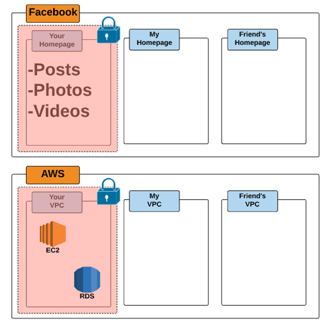
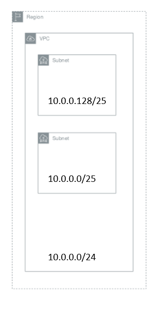
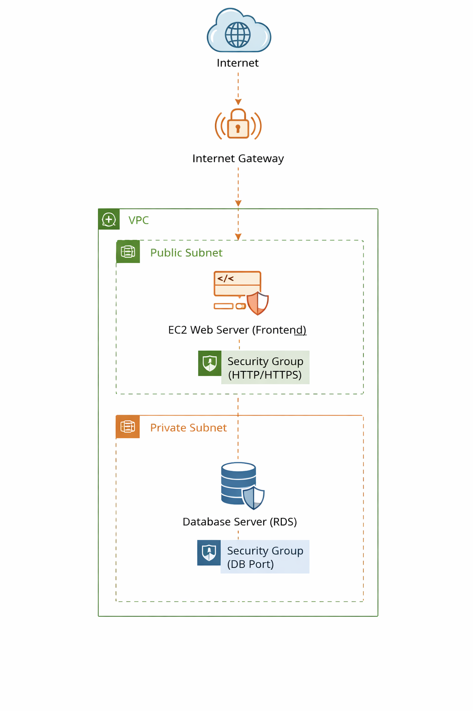

# Section 2 : Réseau AWS

## Concepts réseau dans le cloud

* **VPC (Virtual Private Cloud)**
* **Subnets**
* **Internet Gateway**
* **Route Tables**
* **Security Groups**

### Architecture réseau AWS

Architecture simple :

```
Internet
   |
Internet Gateway
   |
Public Subnet ---- Bastion Host
   |
Private Subnet --- Application Servers
```

### Lab 3 : Structure réseau aws

explorer la structure réseau AWS de votre compte.
* **VPC**
* **subnets**
* **internet gateway**
* **security group**

---

## Introduction : Qu’est-ce qu’un VPC ?

Dans AWS, le **VPC (Virtual Private Cloud)** est l’un des éléments fondamentaux de l’architecture réseau. Il permet aux utilisateurs de créer un **réseau virtuel privé dans le cloud AWS** dans lequel ils peuvent déployer leurs ressources.

Un **Virtual Private Cloud (VPC)** est donc un **réseau virtuel dédié à votre compte AWS**, qui est **logiquement isolé des autres réseaux présents dans l’infrastructure AWS**. Cette isolation garantit que les ressources déployées dans votre VPC sont séparées de celles des autres clients AWS.

À l’intérieur d’un VPC, vous pouvez lancer différents types de ressources AWS, par exemple :

* des **instances Amazon EC2**
* des **bases de données**
* des **services applicatifs**
* des **systèmes de stockage**



Lors de la création d’un compte AWS, un **VPC par défaut (Default VPC)** est automatiquement créé dans chaque région. Ce VPC par défaut est préconfiguré pour permettre de **lancer rapidement des ressources AWS sans configuration réseau complexe**.


## Les Subnets (Sous-réseaux) dans AWS

Après avoir créé un **VPC (Virtual Private Cloud)**, il est possible d’y ajouter un ou plusieurs **subnets (sous-réseaux)**. Les subnets permettent de **diviser le réseau du VPC en plusieurs segments plus petits** afin d’organiser les ressources et de mieux contrôler le trafic réseau.

Un **subnet** est une **plage d’adresses IP appartenant à votre VPC**. Les ressources AWS, telles que les **instances Amazon EC2**, doivent être déployées dans un subnet spécifique.

### Règles importantes concernant les subnets

Dans AWS, plusieurs règles doivent être respectées lors de la création des subnets :

* Chaque **subnet doit appartenir à une seule zone de disponibilité (Availability Zone)**.
* Un subnet **ne peut pas s’étendre sur plusieurs zones de disponibilité**.
* Les blocs CIDR des subnets **doivent être inclus dans le bloc CIDR du VPC**.
* Si plusieurs subnets existent dans un VPC, leurs **plages d’adresses IP ne doivent pas se chevaucher**.

Cette organisation permet de créer des architectures réseau structurées, par exemple :

* **subnets publics** pour les ressources accessibles depuis Internet
* **subnets privés** pour les bases de données ou les serveurs internes.

### Exemple

Supposons que vous créez un VPC avec le bloc CIDR suivant :

```
10.0.0.0/24
```

Ce bloc couvre les adresses IP :

```
10.0.0.0 → 10.0.0.255
```

Il permet donc de disposer de **256 adresses IP**.

Ce bloc peut ensuite être divisé en plusieurs subnets. Par exemple :

* **Subnet 1 : 10.0.0.0/25** → pour les adresses 10.0.0.0 - 10.0.0.127:  128 adresses IP 
* **Subnet 2 : 10.0.0.128/25** → pour les adresses 10.0.0.128 - 10.0.0.255: 128 adresses IP

Chaque subnet pourra ensuite être associé à une **zone de disponibilité différente** afin d’améliorer la **disponibilité et la tolérance aux pannes des applications**.



---

### Internet Gateway (IGW) – Passerelle Internet

Une **Internet Gateway (IGW)** est un composant réseau fourni par AWS qui permet d’établir une **connexion entre un VPC (Virtual Private Cloud) et Internet**. Elle est attachée directement au VPC et permet aux ressources situées dans ce VPC de communiquer avec le réseau Internet.

L’Internet Gateway joue un rôle essentiel dans l’architecture réseau AWS, car elle constitue le **point de passage du trafic entre le VPC et Internet**.

### Caractéristiques de l’Internet Gateway

* Elle prend en charge **le trafic IPv4 et IPv6**.
* Elle est **hautement disponible et entièrement gérée par AWS**.
* Elle ne crée **aucun point de défaillance unique ni limitation de bande passante**.
* **Aucun coût supplémentaire** n’est appliqué pour l’utilisation d’une Internet Gateway dans un compte AWS (seul le trafic réseau peut être facturé).

Ainsi, l’Internet Gateway est un **élément fondamental de la connectivité Internet dans un VPC**, permettant aux ressources situées dans les **subnets publics** d’accéder à Internet ou d’être accessibles depuis celui-ci.

--- 

## AWS Security Groups (SG)

Dans AWS, la sécurité du réseau est assurée par plusieurs mécanismes. L’un des plus importants est le **Security Group (SG)**. Un **Security Group** agit comme un **pare-feu virtuel** qui contrôle le trafic réseau entrant et sortant des ressources AWS, comme les **instances Amazon EC2**.

Les **règles d’un Security Group** permettent de définir **quel type de trafic est autorisé à atteindre une ressource** et **quel trafic est autorisé à quitter cette ressource**. Ces règles permettent ainsi de protéger les instances contre les accès non autorisés tout en autorisant les communications nécessaires au fonctionnement des applications.

Chaque Security Group contient deux types de règles :

* **Règles entrantes (Inbound rules)** : elles contrôlent le trafic autorisé à atteindre les ressources associées au Security Group.
* **Règles sortantes (Outbound rules)** : elles contrôlent le trafic que les ressources sont autorisées à envoyer vers d’autres destinations.

### Comportement par défaut

Lorsque vous créez un **Security Group**, AWS applique automatiquement des règles par défaut :

* **Tout le trafic entrant est bloqué**.
* **Tout le trafic sortant est autorisé**.

Cela signifie que, par défaut, aucune connexion externe ne peut accéder à une instance tant qu’une **règle entrante explicite n’est pas définie**.

**Exemple:**  

Supposons que vous lancez une instance EC2 qui héberge un **serveur web**. Pour permettre aux utilisateurs d’accéder au site web, vous devez ajouter une règle entrante autorisant le trafic **HTTP (port 80)** ou **HTTPS (port 443)**.

Par exemple :

* Autoriser **HTTP (port 80)** depuis **0.0.0.0/0** pour permettre l’accès depuis Internet.

Ainsi, les **Security Groups constituent un mécanisme fondamental de contrôle d’accès réseau dans AWS**, permettant de sécuriser les ressources tout en contrôlant précisément les communications autorisées.

---

## Exemple d’architecture AWS pour une application web simple

Pour illustrer le fonctionnement d’un réseau AWS, considérons une **architecture simple d’une application web**. L’objectif est de séparer les différents composants de l’application afin d’améliorer la **sécurité et l’organisation du réseau**.

L’architecture peut être représentée de la manière suivante :



### 1. Accès des utilisateurs depuis Internet

Les utilisateurs accèdent à l’application web via **Internet**, par exemple en utilisant un navigateur web.

La requête de l’utilisateur est envoyée vers l’infrastructure AWS via l’**Internet Gateway**, qui permet au VPC de communiquer avec Internet.

### 2. Serveur Web dans le Public Subnet

Le **serveur web (Frontend)** est hébergé sur une **instance Amazon EC2 située dans un Public Subnet**.

Ce serveur est responsable de :

* recevoir les requêtes des utilisateurs
* afficher les pages web
* traiter les demandes des utilisateurs

L’instance EC2 possède :

* une **adresse IP publique**
* un **Security Group** qui agit comme un pare-feu.

Le **Security Group du serveur web** autorise uniquement certains types de trafic, par exemple :

* **HTTP (port 80)** depuis Internet
* **HTTPS (port 443)** depuis Internet
* éventuellement **SSH (port 22)** depuis l’adresse IP de l’administrateur.

Cela permet de **limiter l’accès au serveur aux ports nécessaires uniquement**.

### 3. Base de données dans le Private Subnet

La **base de données** est placée dans un **Private Subnet**, ce qui signifie qu’elle **n’est pas accessible directement depuis Internet**.

Dans AWS, cette base de données peut être déployée avec un service comme :

* **Amazon RDS**
* ou une **instance EC2 hébergeant une base de données**

La base de données possède également son **Security Group**, qui autorise uniquement le trafic provenant du serveur web.

Par exemple :

* **MySQL (port 3306)** autorisé uniquement depuis le Security Group du serveur web.

Ainsi :

* les utilisateurs **ne peuvent pas accéder directement à la base de données**
* seul le **serveur applicatif peut communiquer avec elle**

### 4. Communication entre les composants

Le fonctionnement de l’application se déroule comme suit :

1. L’utilisateur accède au site web via **Internet**.
2. La requête arrive sur l’**instance EC2 du frontend** située dans le **Public Subnet**.
3. Le serveur web traite la requête et interroge la **base de données située dans le Private Subnet**.
4. La base de données renvoie les informations au serveur web.
5. Le serveur web renvoie la réponse au navigateur de l’utilisateur.

### Avantages de cette architecture

Cette architecture respecte plusieurs **bonnes pratiques AWS** :

* **séparation des couches applicatives**
* **isolation des ressources sensibles**
* **contrôle du trafic via Security Groups**
* **protection de la base de données dans un subnet privé**

Ce modèle constitue une **architecture de base pour de nombreuses applications web déployées sur AWS** et peut ensuite être étendu avec d’autres composants aws pour améliorer l'elasticité, la scalabilité, la performence et le monitoring de l'application.
