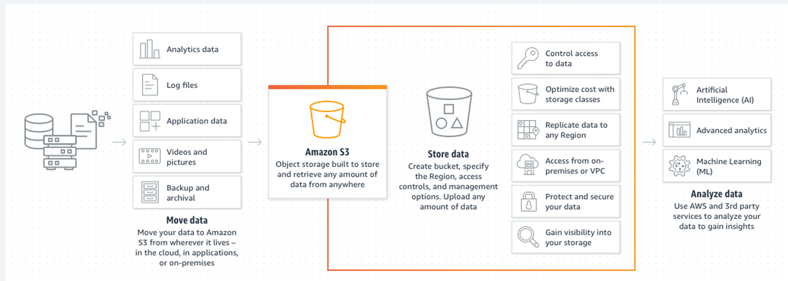

# Section 4 : Amazon Simple Storage Service (Amazon S3)

Dans cette section, nous allons découvrir **Amazon S3 (Simple Storage Service)**, l’un des services les plus utilisés d’AWS. S3 est un service de **stockage d’objets dans le cloud**. Il permet de stocker et de récupérer des fichiers de toute nature, à grande échelle, de manière fiable, durable et sécurisée.

Les points qui seront étudiés sont les suivants :

* Introduction à S3
* Gestion des Buckets, répertoires et objets
* Chargement et téléchargement des objets
* Les classes de stockage S3
* La gestion du cycle de vie d’un objet
* Gestion des permissions
* Versionning des objets
* Tarification du service S3
* Lab5:Héberger une page web sur EC2 et afficher une image stockée dans un bucket S3 public
* lab6:  Déployer un site web statique sur Amazon S3

---

## Introduction à Amazon S3

**Amazon S3 (Simple Storage Service)** est un service de stockage d’objets proposé par AWS. Il permet de **stocker et de récupérer n’importe quelle quantité de données, à tout moment, depuis n’importe quel endroit via Internet**.

Ce service fournit aux développeurs et aux entreprises un accès à une **infrastructure de stockage hautement évolutive, fiable, rapide et économique**, similaire à celle utilisée par Amazon pour faire fonctionner son propre réseau mondial de services et de plateformes.

L’un des principaux objectifs d’Amazon S3 est de **tirer parti des économies d’échelle du cloud** afin d’offrir aux utilisateurs une solution de stockage capable de gérer **de très grands volumes de données** tout en maintenant un haut niveau de performance et de durabilité.

### Caractéristiques principales d’Amazon S3

Amazon S3 présente plusieurs caractéristiques importantes :

* **Haute durabilité des données** : AWS garantit une durabilité de **99,999999999 % (11 neuf)** pour les objets stockés.
* **Scalabilité quasi illimitée** : il est possible de stocker **un nombre pratiquement illimité de fichiers**.
* **Disponibilité élevée** : les données sont répliquées sur plusieurs infrastructures afin de réduire les risques de perte.
* **Accessibilité via Internet** : les données peuvent être accessibles à partir d’applications, de navigateurs ou d’API.
* **Coût optimisé** : le stockage est facturé en fonction de l’utilisation réelle.

### Structure de stockage dans S3

Les données dans Amazon S3 sont organisées selon une structure simple composée de trois éléments principaux :

* **Bucket** : conteneur logique dans lequel les données sont stockées.
* **Objet** : fichier ou donnée stockée dans un bucket.
* **Clé (Key)** : identifiant unique permettant d’accéder à un objet dans un bucket.

Par exemple :

```
Bucket : my-company-data
Objet : image.png
Clé : images/image.png
```
Chaque objet peut contenir :

* les **données du fichier**
* des **métadonnées**
* un **identifiant unique**

### Cas d’utilisation d’Amazon S3

Amazon S3 est utilisé dans de nombreux scénarios :

* **Stockage de fichiers et de documents**
* **Sauvegarde et archivage de données**
* **Hébergement de sites web statiques**
* **Stockage de données pour les applications**
* **Data lakes pour l’analyse de données**
* **Stockage de contenus multimédias**

Grâce à sa flexibilité et à sa fiabilité, Amazon S3 est devenu **l’un des services les plus utilisés dans l’écosystème AWS**.



## Gestion des Buckets, Répertoires et Objets dans Amazon S3

Amazon S3 organise les données selon une structure hiérarchique simple composée de **buckets, objets et préfixes (répertoires logiques)**. Comprendre cette organisation est essentiel pour utiliser efficacement le service S3.

### 1. Les Buckets

Chaque bucket possède certaines caractéristiques importantes :

* Il doit avoir un **nom unique à l’échelle mondiale** (tous les comptes AWS confondus).
* Il est créé dans une **région AWS spécifique**.
* Il peut contenir **un nombre illimité d’objets**.
* Il permet de configurer des paramètres globaux comme :

  * les **permissions**
  * le **versioning**
  * le **chiffrement**
  * les **règles de cycle de vie**

Une fois le bucket créé, il devient le **point d’entrée pour stocker et gérer les données**.

### 2. Les Objets

Dans S3, les fichiers stockés sont appelés **objets**.

Un objet peut être :

* un document
* une image
* une vidéo
* un fichier de données
* une sauvegarde

Chaque objet est composé de plusieurs éléments :

* **La clé (Key)** : identifiant unique de l’objet dans le bucket
* **Les données** : le contenu du fichier
* **Les métadonnées** : informations supplémentaires sur l’objet (type, taille, date, etc.)

Amazon S3 peut stocker des objets dont la taille varie :

* de **quelques octets**
* jusqu’à **5 téraoctets par objet**

### 3. Les Répertoires (Folders)

Contrairement aux systèmes de fichiers traditionnels, **Amazon S3 n’utilise pas réellement de dossiers physiques**.

Les répertoires dans S3 sont en réalité des **préfixes dans le nom de la clé des objets**.

Cependant, la console AWS affiche ces préfixes sous forme de **dossiers** pour faciliter l’organisation des fichiers.

#### Exemple de structure logique

```
Bucket : student-lab-bucket

images/
   photo1.jpg
   photo2.jpg

documents/
   report.pdf
   notes.txt
```

Dans cet exemple :

* **images/** et **documents/** sont des dossiers logiques
* ils permettent d’organiser les objets à l’intérieur du bucket

La clé réelle des objets serait par exemple :

```
images/photo1.jpg
documents/report.pdf
```

### 4. Organisation des données dans S3

La structure globale de stockage dans Amazon S3 peut être représentée comme suit :

```
Bucket
   |
   |---- Folder (Prefix)
   |        |
   |        |---- Object (file)
   |
   |---- Folder
            |
            |---- Object
```

Cette organisation permet :

* de **structurer les données**
* de **faciliter la navigation**
* de **gérer plus efficacement les permissions et les politiques de stockage**

## Chargement et téléchargement des objets

Amazon S3 permet de **déposer (upload)** et de **récupérer (download)** des fichiers appelés **objets**.

### Chargement d’un objet

Pour charger un fichier dans S3 :

1. Ouvrir le service **Amazon S3**
2. Créer **un bucket**
3. Sélectionner un **bucket**
4. Cliquer sur **Upload**
5. Choisir le fichier à envoyer
6. Valider avec **Upload**

Une fois chargé, le fichier devient un **objet S3**.

### Téléchargement d’un objet

Pour télécharger un fichier depuis S3 :

1. Ouvrir le **bucket**
2. Sélectionner l’objet
3. Cliquer sur **Download**

Cela permet de récupérer le fichier sur la machine locale.

## Les classes de stockage S3

Amazon S3 propose plusieurs **classes de stockage** selon la fréquence d’accès aux données, le niveau de disponibilité attendu et le coût.

### Principales classes de stockage

* **S3 Standard** : pour les données fréquemment utilisées
* **S3 Standard-IA** : pour les données rarement accédées mais qui doivent rester disponibles rapidement
* **S3 One Zone-IA** : stockage moins coûteux, dans une seule zone de disponibilité
* **S3 Glacier Instant Retrieval** : archivage avec accès rapide
* **S3 Glacier Flexible Retrieval** : archivage à faible coût, récupération plus lente
* **S3 Glacier Deep Archive** : archivage long terme au coût minimal

### Principe

Plus les données sont **rarement consultées**, plus le coût de stockage peut être réduit.

## La gestion du cycle de vie d’un objet

Le **cycle de vie** permet d’automatiser la gestion des objets au fil du temps.

Une **règle de cycle de vie** peut être utilisée pour :

* déplacer un objet vers une classe de stockage moins coûteuse
* supprimer automatiquement un objet après une certaine durée

### Exemple

Une entreprise peut définir la règle suivante :

* après **30 jours** → passage en **Standard-IA**
* après **90 jours** → passage en **Glacier**
* après **365 jours** → suppression

Cela permet d’optimiser les coûts de stockage.

## Gestion des permissions

Amazon S3 permet de contrôler précisément **qui peut accéder aux buckets et aux objets**.

Les permissions peuvent être gérées avec :

* **IAM Policies**
* **Bucket Policies**
* **ACLs (Access Control Lists)**

### Principe de base

Par défaut, les buckets et les objets sont **privés**.

Cela signifie que seuls les utilisateurs autorisés peuvent y accéder.

### Exemple

On peut autoriser :

* un utilisateur IAM à téléverser des fichiers
* une application à lire des objets
* un bucket à héberger un site web public

## Versionning des objets

Le **versioning** permet de conserver **plusieurs versions d’un même objet** dans un bucket.

Si un fichier est modifié ou supprimé, S3 peut conserver les anciennes versions.

### Avantages

* protection contre les suppressions accidentelles
* restauration d’une version précédente
* suivi des modifications

### Exemple

Un fichier `rapport.pdf` est chargé une première fois, puis modifié et rechargé.
Avec le versioning activé, S3 conserve :

* version 1
* version 2

L’utilisateur peut revenir à une ancienne version si nécessaire.

## Tarification du service S3

Amazon S3 utilise une **facturation à l’usage**. Le coût dépend principalement de plusieurs éléments :

* la **quantité de données stockées**
* la **classe de stockage choisie**
* le **nombre de requêtes**
* le **volume de données transférées**

### Éléments facturés

* stockage mensuel des objets
* requêtes **PUT, GET, LIST**
* transfert de données sortant
* récupération des données archivées selon la classe choisie

### Principe

Le service S3 est économique, mais le coût varie selon :

* le volume stocké
* la fréquence d’accès
* la stratégie de cycle de vie mise en place

Il est donc important de choisir la **bonne classe de stockage** et de configurer des **règles adaptées**.

