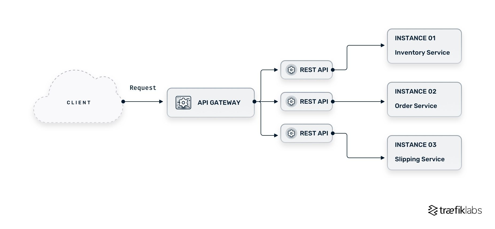
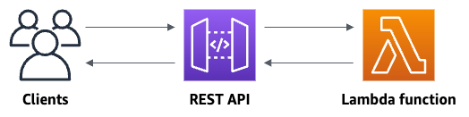
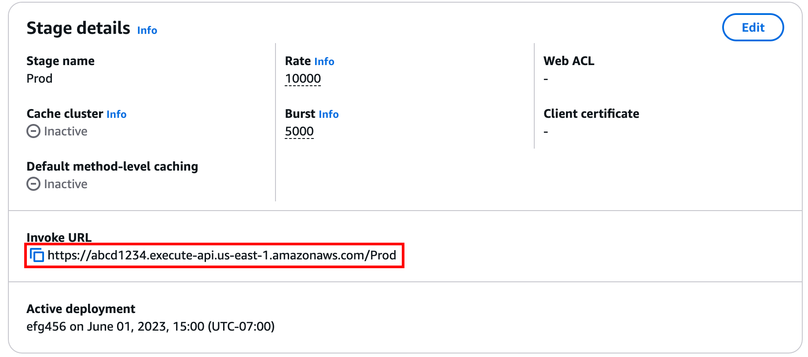

## Introduction à Amazon DynamoDB

**Amazon DynamoDB** est un service de base de données **NoSQL entièrement managé** proposé par AWS. Contrairement aux bases de données relationnelles, DynamoDB permet de stocker et de gérer des données de manière **flexible, scalable et très performante**, sans avoir à gérer l’infrastructure.

DynamoDB est conçu pour offrir :

* une **latence très faible (millisecondes)**
* une **scalabilité automatique**
* une **haute disponibilité**
* une gestion entièrement **serverless**

### Fonctionnement de DynamoDB

DynamoDB stocke les données sous forme de :

* **tables**
* **items (éléments)** → équivalent d’une ligne
* **attributes (attributs)** → équivalent des colonnes

Cependant, contrairement aux bases relationnelles, les données ne sont pas strictement structurées. Chaque item peut avoir des attributs différents.

### Exemple de structure

```text
Table : Users

Item 1 :
{
  user_id: 1,
  name: "Alice",
  age: 25
}

Item 2 :
{
  user_id: 2,
  name: "Bob",
  email: "bob@example.com"
}
```

👉 Les deux items n’ont pas exactement les mêmes champs.

---

## Cas d’utilisation de DynamoDB

DynamoDB est particulièrement adapté pour :

* applications web à forte charge
* applications mobiles
* jeux en ligne
* IoT (objets connectés)
* systèmes nécessitant des performances élevées

---

## Différence entre DynamoDB et RDS PostgreSQL

Il est essentiel de bien comprendre la différence entre une base **NoSQL (DynamoDB)** et une base **relationnelle SQL (RDS PostgreSQL)**.

### 1. Modèle de données

| DynamoDB                         | RDS PostgreSQL                      |
| -------------------------------- | ----------------------------------- |
| NoSQL                            | Relationnel (SQL)                   |
| Données flexibles (schéma libre) | Schéma structuré (tables, colonnes) |
| Pas de relations complexes       | Relations entre tables (JOIN)       |

👉 DynamoDB est plus flexible, PostgreSQL est plus structuré.

---

### 2. Scalabilité

| DynamoDB                        | RDS PostgreSQL                          |
| ------------------------------- | --------------------------------------- |
| Scalabilité automatique         | Scalabilité manuelle (verticale)        |
| Conçu pour des charges massives | Limité par les ressources de l’instance |

👉 DynamoDB est idéal pour les applications à très grande échelle.

---

### 3. Performance

| DynamoDB                   | RDS PostgreSQL                                    |
| -------------------------- | ------------------------------------------------- |
| Latence très faible (ms)   | Bonne performance mais dépend de l’infrastructure |
| Optimisé pour accès rapide | Optimisé pour requêtes complexes                  |

👉 DynamoDB est optimisé pour la vitesse, PostgreSQL pour la complexité des requêtes.

---

### 4. Requêtes

| DynamoDB                      | RDS PostgreSQL                  |
| ----------------------------- | ------------------------------- |
| Pas de SQL (requêtes simples) | Utilise SQL (requêtes avancées) |
| Pas de JOIN                   | Support des JOIN                |

👉 PostgreSQL est plus adapté pour les analyses complexes.

---

### 5. Gestion

| DynamoDB                    | RDS PostgreSQL                   |
| --------------------------- | -------------------------------- |
| Serverless (aucune gestion) | Gestion partielle (instance RDS) |
| Pas de maintenance          | Maintenance gérée mais présente  |

---

### 6. Cas d’usage

| DynamoDB                | RDS PostgreSQL                |
| ----------------------- | ----------------------------- |
| Applications temps réel | Applications métier           |
| Données non structurées | Données relationnelles        |
| IoT, gaming, mobile     | ERP, CRM, systèmes financiers |

---

## Résumé

* **DynamoDB** :

  * base NoSQL
  * très scalable
  * rapide
  * flexible
  * idéale pour applications modernes à grande échelle

* **RDS PostgreSQL** :

  * base relationnelle SQL
  * adaptée aux données structurées
  * support des relations complexes
  * idéale pour applications métier

👉 Le choix entre DynamoDB et RDS dépend principalement :

* du **type de données**
* du **niveau de scalabilité**
* de la **complexité des requêtes**
* des **besoins applicatifs**


# Qu’est-ce qu’un API Gateway ?

Un API Gateway agit comme un intermédiaire entre les applications clientes et les services backend dans une architecture microservices. Il s’agit d’une couche logicielle qui sert de point d’entrée unique pour plusieurs APIs, en réalisant des tâches telles que la composition des requêtes, le routage et la traduction de protocoles.



# Premiers pas avec la console REST API

Dans cet exercice d’introduction, vous allez créer une API REST serverless à l’aide de la console REST API d’API Gateway.

Les APIs serverless vous permettent de vous concentrer sur vos applications sans avoir à gérer ou provisionner des serveurs.

Tout d’abord, vous créez une fonction Lambda à l’aide de la console Lambda. Ensuite, vous créez une API REST avec la console API Gateway REST API. Puis, vous créez une méthode API et vous l’intégrez avec une fonction Lambda via une intégration proxy Lambda. Enfin, vous déployez et invoquez votre API.

Lorsque vous invoquez votre API REST, API Gateway transmet la requête à votre fonction Lambda. Lambda exécute la fonction puis renvoie une réponse à API Gateway, qui vous retourne ensuite cette réponse.



## Étape 1 : Créer une fonction Lambda

Vous utilisez une fonction Lambda comme backend de votre API. Lambda exécute votre code uniquement lorsque cela est nécessaire et s’adapte automatiquement, de quelques requêtes par jour à plusieurs milliers par seconde.

Pour cet exercice, vous utiliserez une fonction Node.js par défaut depuis la console Lambda.

### Pour créer une fonction Lambda

1. Connectez-vous à la console Lambda : https://console.aws.amazon.com/lambda

2. Cliquez sur **Create function**.

3. Dans **Basic information**, pour **Function name**, saisissez :
   `my-function`

4. Pour toutes les autres options, conservez les paramètres par défaut.

5. Cliquez sur **Create function**.

Le code par défaut de la fonction Lambda devrait ressembler à ceci :

```python
import json

def lambda_handler(event, context):
    response = {
        'statusCode': 200,
        'body': json.dumps('The API Gateway REST API console is great!')
    }
    return response
```

---

## Étape 2 : Créer une API REST

Ensuite, vous allez créer une API REST avec une ressource racine (`/`).

### Pour créer une API REST

1. Connectez-vous à la console API Gateway :
   https://console.aws.amazon.com/apigateway

2. Effectuez l’une des actions suivantes :

   * Si c’est votre première API, pour **REST API**, cliquez sur **Build**.
   * Si vous avez déjà créé une API auparavant, cliquez sur **Create API**, puis sur **Build** pour REST API.

3. Pour **API name**, saisissez :
   `my-rest-api`

4. (Optionnel) Dans **Description**, ajoutez une description.

5. Conservez le type d’endpoint sur **Regional**.

6. Cliquez sur **Create API**.

---

## Étape 3 : Créer une intégration proxy Lambda

Vous allez maintenant créer une méthode API sur la ressource racine (`/`) et l’intégrer à votre fonction Lambda à l’aide d’une intégration proxy.

Dans une intégration proxy Lambda, API Gateway transmet directement la requête du client à la fonction Lambda.

### Pour créer une intégration proxy Lambda

1. Sélectionnez la ressource `/`, puis cliquez sur **Create method**.

2. Pour **Method type**, sélectionnez **ANY**.

3. Pour **Integration type**, sélectionnez **Lambda**.

4. Activez **Lambda proxy integration**.

5. Pour **Lambda function**, saisissez :
   `my-function`
   puis sélectionnez votre fonction Lambda.

6. Cliquez sur **Create method**.

---

## Étape 4 : Déployer votre API

Ensuite, vous allez créer un déploiement API et l’associer à un stage.

### Pour déployer votre API

1. Cliquez sur **Deploy API**.

2. Pour **Stage**, sélectionnez **New stage**.

3. Pour **Stage name**, saisissez :
   `Prod`

4. (Optionnel) Ajoutez une description.

5. Cliquez sur **Deploy**.

Les clients peuvent maintenant appeler votre API.

Pour tester votre API avant le déploiement, vous pouvez sélectionner la méthode **ANY**, aller dans l’onglet **Test**, puis cliquer sur **Test**.

---

## Étape 5 : Invoquer votre API

### Pour invoquer votre API

1. Dans le panneau de navigation principal, cliquez sur **Stage**.

2. Dans **Stage details**, cliquez sur l’icône de copie pour copier l’URL d’invocation de votre API.



3. Collez l’URL dans un navigateur web.

L’URL complète doit ressembler à :

```text
https://abcd123.execute-api.us-east-2.amazonaws.com/Prod
```

Votre navigateur envoie alors une requête GET vers l’API.

4. Vérifiez la réponse de l’API.

Vous devriez voir le texte suivant dans votre navigateur :

```text
The API Gateway REST API console is great!
```

---

## (Optionnel) Étape 6 : Nettoyage des ressources

Afin d’éviter des coûts inutiles sur votre compte AWS, supprimez les ressources créées pendant cet exercice.

Cela inclut :

* votre API REST,
* votre fonction Lambda,
* et les ressources associées.

---

## Supprimer votre API REST

1. Dans le panneau **Resources**, cliquez sur **API actions** → **Delete API**.

2. Dans la boîte de dialogue, saisissez :
   `confirm`

3. Cliquez sur **Delete**.

---

## Supprimer votre fonction Lambda

1. Connectez-vous à la console Lambda :
   https://console.aws.amazon.com/lambda

2. Sur la page **Functions**, sélectionnez votre fonction.

3. Cliquez sur **Actions** → **Delete**.

4. Dans la boîte de dialogue, saisissez :
   `delete`

5. Cliquez sur **Delete**.

---

## Supprimer le groupe de logs CloudWatch

1. Ouvrez la page **Log groups** dans la console Amazon CloudWatch.

2. Sélectionnez le groupe de logs de votre fonction :

```text
/aws/lambda/my-function
```

3. Cliquez sur **Actions** → **Delete log group(s)**.

4. Dans la boîte de dialogue, cliquez sur **Delete**.

---

## Supprimer le rôle IAM de la fonction Lambda

1. Ouvrez la page **Roles** dans la console IAM.

2. (Optionnel) Recherchez :
   `my-function`

3. Sélectionnez le rôle de votre fonction (par exemple : `my-function-31exxmpl`), puis cliquez sur **Delete**.

4. Dans la boîte de dialogue, saisissez le nom du rôle.

5. Cliquez sur **Delete**.
